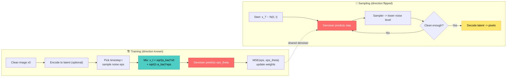

> This post is my game-developer reading of Mayank Pratap Singh's excellent visual breakdown, [*Diffusion Model Visual Breakdown*](https://vizuara.substack.com/p/diffusion-model-visual-breakdown) (Vizuara, Jun 2026). All figures are from that article; the framing, code, and production angle are mine.
{: .prompt-info }

## 🤔 Curiosity: Why Does Generating One Image Feel So Hard?

After 8 years shipping AI-powered games at NC SOFT and COM2US, I have a scar from every "let's just generate the asset" meeting. A single texture, splash art, or concept frame is **not one decision**. The subject can distort, the texture can go mushy, the pose can collapse, the background can look fake, or the image can be razor-sharp but boringly repetitive. An image is a *large set of decisions that all have to agree at once.*

That's exactly why one-shot generators were so painful to train. You ask a network to paint the whole canvas in a single forward pass, and when it's wrong, the loss has to somehow explain *which* of the thousand simultaneous mistakes mattered.

Diffusion models change the **shape** of the problem. Instead of "paint the whole image now," they ask a much smaller question, many times:

> **Curiosity:** Given a slightly noisy image, can you predict how to remove *a little* of the noise? Then do it again. And again.
{: .prompt-tip }

That reframing is the whole game. Generation stops being a leap and becomes a **guided recovery process**. Let me walk through the breakdown the way I'd explain it to a graphics engineer who has to ship a feature on top of it.

{: .shadow .rounded-10 }
_The core loop: start from random noise, apply many small learned corrections, and structure emerges. Generation is a path, not a lookup._

---

## 📚 Retrieve: The Stack, One Layer at a Time

### Why GANs and VAEs left room for a different approach

Diffusion didn't land in empty space. It solved pain points that two earlier families made painfully obvious.

**GANs** could produce crisp images by pitting a generator against a discriminator. The realism signal was *learned*, which is far richer than a hand-written pixel loss — but the two-network game is fragile. If the discriminator gets too strong too fast, the generator starves on weak gradients. If the generator finds a few outputs that fool the critic, it repeats them and you get **mode collapse**: sharp images, zero diversity.

{: .shadow .rounded-10 }
_Figure 8.1 — A GAN is a two-network game: the generator maps noise to fakes, the discriminator judges real vs. fake, and the training signal comes from a moving critic rather than a fixed target._

**VAEs** took the other road: encode an image into a latent distribution, sample, and decode back. That gave the field a reusable idea — a **compressed latent space** — but samples often came out too smooth.

{: .shadow .rounded-10 }
_Figure 8.2 — The VAE's surviving contribution is compression: keep the meaningful structure of an image in far fewer values. Latent diffusion later borrows exactly this._

Here's the contrast that matters for the rest of the post:

| Family | Training target | Failure mode | What diffusion borrowed |
|:--|:--|:--|:--|
| **GAN** | Another network's *current opinion* (moving) | Mode collapse, unstable training | The lesson that realism must be a strong learned signal |
| **VAE** | Reconstruction + latent regularization | Over-smooth samples | The compressed **latent space** idea |
| **Diffusion** | The *exact noise that was added* (known) | Slow sampling (many steps) | — |

The punchline: a diffusion model can **manufacture its own training pairs**. Input = a noisy version of a real image; target = the exact noise the training code added. No adversary, no moving target.

### The diffusion idea: define corruption, learn the reversal

The central trick is almost cheeky: take real data, **slowly destroy it into noise on purpose**, and train a model to undo that destruction. The forward (noising) process is *defined*, not learned. The reverse (denoising) process is what the network learns.

{: .shadow .rounded-10 }
_Figure 8.3 — We only know the true image distribution through examples. Diffusion learns a sampler that starts from a simple base distribution and walks toward data-like regions._

{: .shadow .rounded-10 }
_Figure 8.4 — A 2-D spiral diffuses into an isotropic Gaussian. The reverse model learns to move samples from the easy noisy endpoint back toward the structured data — the same picture holds for images._

> **Misconception to kill early:** the initial noise does **not** secretly contain the final image. The noise is random. The trained denoiser plus the condition (e.g., a text prompt) is what steers a random sample into something image-like.
{: .prompt-warning }

### Why the endpoint is Gaussian noise

Every generator needs a starting point, and a complicated start makes sampling hard before you even begin. Diffusion starts from a standard Gaussian:

$$ x_T \sim \mathcal{N}(0, I) $$

It's trivial to sample, easy to reason about, and a neutral "blank canvas" — it doesn't prefer faces, dogs, or product shots. All structure comes from the learned reverse process.

{: .shadow .rounded-10 }
_Figure 8.5 — Structured data is hard to sample directly; a maximum-entropy Gaussian endpoint is easy. The forward process maps data → Gaussian, the reverse process learns to undo it._

{: .shadow .rounded-10 }
_Figure 8.6 — Gaussian noise is especially convenient: add independent Gaussian noise repeatedly and the result stays Gaussian, giving a tractable endpoint. It's a practical choice, not a mystical one._

### The forward process: the equation you actually need

At each step the clean image keeps some signal and gains some fresh Gaussian noise. The notation:

- `β_t` — the amount of **new noise** injected at step `t`.
- `α_t = 1 − β_t` — the **signal kept** at that step.
- `ᾱ_t = ∏ α_s` — the **cumulative** signal still present after `t` steps (≈1 early, ≈0 late).

{: .shadow .rounded-10 }
_Figure 8.7 — A clean horse is corrupted step by step. The coefficient view below shows signal shrinking and noise growing — the model trains on the whole curriculum, not just clean vs. pure noise._

The single most useful line in the entire topic is that you can jump to any timestep in **one step**:

$$ x_t = \sqrt{\bar{\alpha}_t}\, x_0 + \sqrt{1 - \bar{\alpha}_t}\,\epsilon, \quad \epsilon \sim \mathcal{N}(0, I) $$

A noisy image is just a **variance-balanced mixture** of the clean image `x_0` and pure noise `ε`. The square roots are there to balance variance, not brightness. Read it as: `√ᾱ_t` scales the clean part, `√(1−ᾱ_t)` scales the noise. Small `t` → mostly clean; large `t` → mostly noise.

{: .shadow .rounded-10 }
_Figure 8.8 — The β schedule sets how aggressively noise is added; α tracks per-step retention; ᾱ tracks cumulative retention. A good schedule keeps the denoising tasks neither trivial nor destructive._

This is why you never simulate every intermediate step during training. You sample a random timestep, sample a noise tensor, mix, and you have a fresh supervised example — from *every* image, at *every* noise level.

### What the denoiser actually learns

The denoiser receives a noisy sample `x_t`, the timestep `t`, and (often) a condition `c` — a class label, text prompt, mask, edge/depth map, or low-res image. In the basic **noise-prediction** view, it outputs `ε_θ(x_t, t, c)`, its estimate of the noise that made `x_t`. Because the training code *chose* that noise, the target is known, and the loss is a plain regression:

$$ L_{\text{simple}} = \mathbb{E}_{x_0, t, \epsilon}\left[\; \lVert \epsilon - \epsilon_\theta(x_t, t, c) \rVert_2^2 \;\right] $$

{: .shadow .rounded-10 }
_Figure 8.9 — The noisy image and timestep enter the denoiser; it predicts the noise; the sampler uses that to produce a slightly cleaner `x_{t−1}`. Repeat many times._

The loss is simple but the *task* is rich. At low noise, predicting the noise means cleaning up edges and texture. At high noise, it means inferring **plausible global structure** from weak evidence and the condition. Same loss, two very different jobs — selected by which timestep you sampled. That's also why diffusion training is easier to reason about than GAN training: a direct regression target tells you, unambiguously, when you're wrong.

Here's the entire training loop, stripped to the workhorse equation. If you've ever written a PyTorch training step, this will feel suspiciously short:

```python
import torch
import torch.nn.functional as F

def ddpm_training_step(model, x0, alpha_bar, cond=None):
    """One DDPM training step (noise-prediction / epsilon objective).

    Curiosity:  Can a network learn to undo corruption it never simulated step-by-step?
    Retrieve:   x_t = sqrt(a_bar_t) * x0 + sqrt(1 - a_bar_t) * eps   (closed-form forward)
    Innovation: predict eps directly -> a stable, known regression target.

    Args:
        model:     denoiser eps_theta(x_t, t, cond) -> predicted noise
        x0:        clean batch, shape (B, C, H, W) in [-1, 1]
        alpha_bar: precomputed cumulative product a_bar, shape (T,)
        cond:      optional conditioning (text/class/mask embeddings)
    """
    B = x0.size(0)
    T = alpha_bar.size(0)

    # 1) Sample a random timestep per image -> a curriculum across noise levels.
    t = torch.randint(0, T, (B,), device=x0.device)

    # 2) Sample the *known* target noise.
    eps = torch.randn_like(x0)

    # 3) Jump straight to x_t in one shot (no step-by-step simulation needed).
    a_bar_t = alpha_bar[t].view(B, 1, 1, 1)
    x_t = a_bar_t.sqrt() * x0 + (1.0 - a_bar_t).sqrt() * eps

    # 4) Ask the network to recover the noise it can't see was added.
    eps_pred = model(x_t, t, cond)

    # 5) Plain MSE between true and predicted noise. That's the whole signal.
    return F.mse_loss(eps_pred, eps)
```

> **Retrieve → Innovation:** Modern systems sometimes predict the clean sample, a velocity target, or a flow direction instead of `ε`. The plumbing changes; the teaching idea — *learn a direction that moves a noisy sample toward the data* — does not.
{: .prompt-tip }

One more separation worth internalizing: the **denoiser** predicts a target from the current state; the **sampler** decides how to use that prediction to step forward. The same trained denoiser can run under a slow, careful sampler (many steps) or a fast one (few, larger steps). The model learns the *direction*; the sampler chooses the *route*.

### Giving the network a sense of time

A timestep like `t = 427` is just a scalar, and networks treat raw scalars poorly. Diffusion models expand it into **sinusoidal timestep embeddings** — sine/cosine features at multiple frequencies — so nearby timesteps map to related vectors and distant ones don't.

{: .shadow .rounded-10 }
_Figure 8.10 — A scalar timestep becomes a vector via sinusoids at many frequencies, so one network can change its behavior across noise levels. Same spirit as positional embeddings in transformers._

Without this, the denoiser wouldn't know whether to make a tiny edge correction or a bold structural guess. In a U-Net it's usually injected into residual blocks; in a diffusion transformer it often modulates normalization layers.

### Why U-Nets became the classic denoiser

Denoising needs **global context** (what could this image contain?) *and* **local precision** (edges, textures, alignment). The U-Net is a natural fit: an encoder downsamples and widens features, a decoder upsamples back, and **skip connections** carry high-resolution detail across so it isn't lost.

{: .shadow .rounded-10 }
_Figure 8.11 — Down blocks shrink space and grow channels, middle blocks process a compact representation, up blocks reconstruct, and skip connections preserve fine spatial detail. Attention is often added at selected resolutions._

This matches diffusion's changing nature: high noise wants broad semantic guesses, low noise wants small sharpening corrections. The U-Net supports both. Written compactly, `ε_θ(x_t, t, c)` — drop `c` and it's unconditional; make `c` a class label and it's class-conditional; make `c` a text embedding and it's text-to-image.

### Latent diffusion: stop paying for every pixel

Pixel-space diffusion is clean but expensive. A 512×512×3 image is **786,432** values, and you run the denoiser on it *many times* per sample.

{: .shadow .rounded-10 }
_Figure 8.12 — An autoencoder maps a 256×256×3 image (~196k values) to a 32×32×4 latent (~4k values). Denoising in that compressed space is dramatically cheaper — this is why high-res text-to-image became practical on consumer GPUs._

The tradeoff is real: compress too hard and small text, fine geometry, faces, and repeated patterns suffer; compress too little and you're back to paying pixel prices. Latent diffusion is the working compromise.

### Conditioning: making the model listen

Unconditional diffusion generates *something* from the distribution. Conditional diffusion generates something that **matches an input** — a prompt, mask, edge map, depth map, pose skeleton, or low-res image. Text-to-image systems encode the prompt and feed it in, typically via **cross-attention**, so image features can "ask" which prompt tokens matter for their region.

To make the condition bite harder at sampling time, **classifier-free guidance (CFG)** compares the conditional and unconditional predictions:

$$ \hat{\epsilon} = \epsilon_\theta(x_t, t, \varnothing) + s\,\big(\epsilon_\theta(x_t, t, c) - \epsilon_\theta(x_t, t, \varnothing)\big) $$

The guidance scale `s` is a **steering knob, not a quality knob**. Low `s` leaves freedom but may ignore the prompt; high `s` follows the prompt harder but can flatten diversity and exaggerate textures. Negative prompts slot into the same idea — they tell the model what to move *away* from.

### Diffusion transformers: from feature maps to tokens

Recent systems increasingly swap the U-Net for a **transformer** backbone. The latent is patchified into tokens, timestep and conditioning modulate the blocks, and attention lets distant tokens interact directly.

{: .shadow .rounded-10 }
_Figure 8.13 — The noisy latent is split into patches → tokens; timestep and class info modulate transformer blocks; output tokens are reshaped back into a latent prediction. The objective is unchanged; the backbone is not._

The token count for a latent of size `H_z × W_z` with patch size `p` is roughly:

$$ N = \frac{H_z\, W_z}{p^2} $$

Smaller patches preserve detail but cost more attention; larger patches are cheaper but coarser. Latent space is what makes this tractable — patchifying raw pixels would explode the token count.

{: .shadow .rounded-10 }
_Figure 8.14 — PixArt-α style: text embeddings condition the denoising transformer that operates on latent tokens, emphasizing efficient conditioning over a U-Net backbone._

{: .shadow .rounded-10 }
_Figure 8.15 — MM-DiT: text and image streams get their own transformations, while **joint attention** lets information flow between modalities. Used in the Stable Diffusion 3 family._

{: .shadow .rounded-10 }
_Figure 8.16 — Multiple text encoders produce conditioning, image latents are patchified, timestep info is embedded, a stack of MM-DiT blocks denoises, and the output is unpatchified and decoded. SD3-style systems also use rectified-flow ideas — another way to learn a path from noise to data._

The exact architecture keeps shifting, but the direction is stable: **latent-space generation + strong text encoders + transformer backbones + guidance + carefully designed sampling paths.**

---

## 💡 Innovation: Reading This as a Game Builder

Strip the pipeline to two stories and it stops being intimidating:




Six knobs decide how *any* diffusion system behaves — and these are exactly the levers I'd reach for when fitting one into a studio pipeline:

| Knob | What it controls | Studio decision it maps to |
|:--|:--|:--|
| **Noise schedule** (β) | Which denoising tasks the model sees | How much "from-scratch" vs. "refine" capacity you want |
| **Prediction target** (ε / x0 / v / flow) | What the network outputs | Stability vs. few-step sampling tradeoffs |
| **Backbone** (U-Net / DiT) | How spatial + semantic info mix | VRAM budget and max resolution |
| **Conditioning** (text / mask / depth / pose) | What the output must obey | Art-direction control: ControlNet-style guidance |
| **Sampler** (DDPM / DDIM / consistency) | Speed, quality, randomness | Batch asset gen vs. interactive previews |
| **Autoencoder** | Information available in latent space | Whether tiny UI text and faces survive |

### What I'd try first in a content pipeline

- **Texture and material variation** — heavy conditioning (depth/normal maps), aggressive sampler, low guidance. You want variety on a known surface, not prompt obedience.
- **Concept and splash art** — strong text encoders, higher guidance, slow sampler. Here prompt adherence is the product.
- **Interactive previews for designers** — distilled / consistency-style few-step models so the loop feels live, accepting some quality loss.
- **Sprite/UI assets** — be honest about the autoencoder. If tiny text and 1-px alignment matter, latent compression is your enemy; budget for pixel-space refinement or upscaling.

### Honest limitations (the part that survives the demo)

| Limitation | Why it happens | What it costs a studio |
|:--|:--|:--|
| **Sampling cost** | Many network calls per image | Slow batch gen; weak interactivity without distillation |
| **Fine detail loss** | Autoencoder compression | Broken tiny text, hands, repeated patterns |
| **Weak compositional reasoning** | Statistical text↔image learning, not logic | "Three cubes behind two spheres" fails; "a cube on a table" works |
| **Data bias** | Learned from the training distribution | Outputs inherit over/under-represented aesthetics |
| **Control vs. freedom** | Every condition narrows the output space | More masks/poses → more predictable, less surprising |

> **Innovation, distilled:** diffusion is powerful because it breaks one impossible decision into thousands of small, *known-target* corrections. The cost is many forward passes — and almost all current research (faster samplers, distillation, consistency models, flow matching) is a fight to keep that quality while paying less for it.
{: .prompt-tip }

### New questions this raises for me

- Can I co-train a **game-specific autoencoder** so latent space preserves the things my art team actually cares about (pixel-perfect UI, readable in-game text)?
- For live-ops, what's the real Pareto frontier between **consistency-model few-step sampling** and quality, on *my* art style rather than a benchmark?
- If conditioning is the real product surface, is a **ControlNet-style pose/depth rig** a better investment than yet another prompt-engineering sprint?

---

## References

**Source article**
- [Diffusion Model Visual Breakdown — Mayank Pratap Singh (Vizuara)](https://vizuara.substack.com/p/diffusion-model-visual-breakdown) — the visual breakdown and all figures this post builds on.
- Author: [LinkedIn](https://www.linkedin.com/in/mayankpratapsingh022/) · [Twitter/X](https://x.com/Mayank_022)

**Research papers**
- [Denoising Diffusion Probabilistic Models (DDPM)](https://arxiv.org/abs/2006.11239) — the forward noising equation, noise-prediction loss, and iterative sampler.
- [High-Resolution Image Synthesis with Latent Diffusion Models](https://arxiv.org/abs/2112.10752) — latent diffusion, autoencoder compression, cross-attention conditioning.
- [Scalable Diffusion Models with Transformers (DiT)](https://arxiv.org/abs/2212.09748) — replacing U-Nets with transformer blocks over latent patches.
- [PixArt-α: Fast Training of Diffusion Transformer for Photorealistic Text-to-Image](https://arxiv.org/abs/2310.00426) — the PixArt-α architecture.
- [Flow Matching for Generative Modeling](https://arxiv.org/abs/2210.02747) — the flow-matching view of the broader diffusion family.
- [Scaling Rectified Flow Transformers for High-Resolution Image Synthesis](https://arxiv.org/abs/2403.03206) — the Stable Diffusion 3 / MM-DiT architecture and rectified-flow design.

**Learning resources**
- [The Principles of Diffusion Models (YouTube playlist) — Dr. Rajat](https://youtube.com/playlist?list=PLPTV0NXA_ZShSUHKLhdHAdAw5oM9vM1Yf) — a thorough video walkthrough of the math.

**Related production tooling**
- [Hugging Face Diffusers](https://github.com/huggingface/diffusers) — reference implementations of schedulers, U-Net/DiT backbones, and samplers.
- [ControlNet](https://github.com/lllyasviel/ControlNet) — spatial conditioning (pose, depth, edges) for art-directed control.
