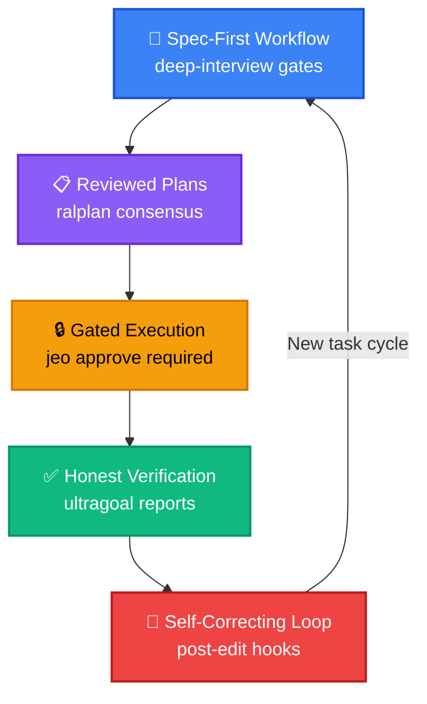
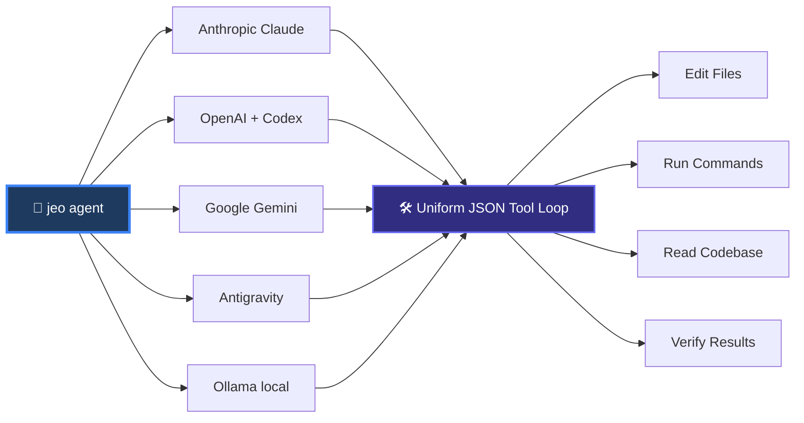
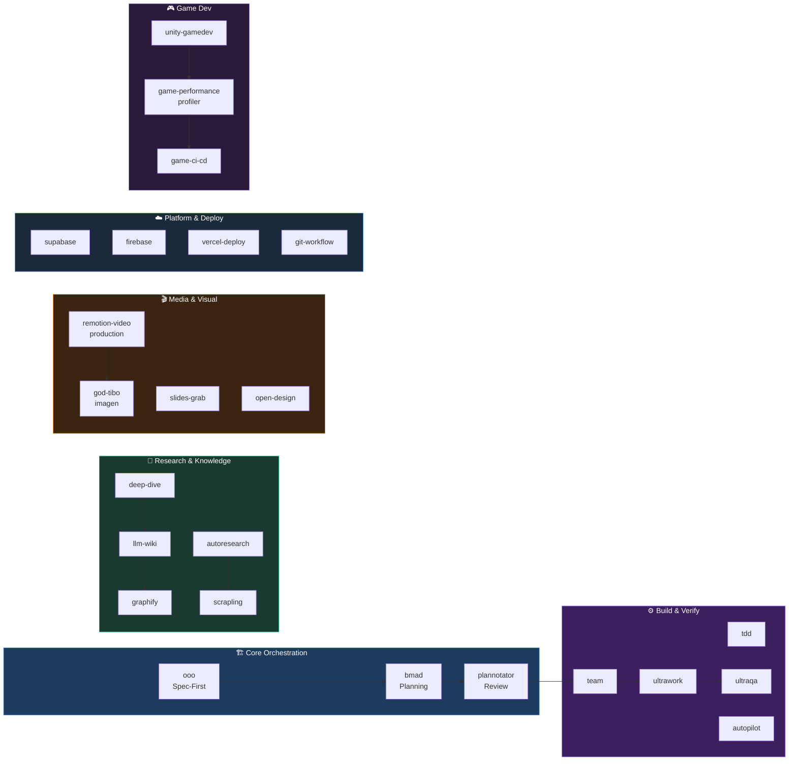
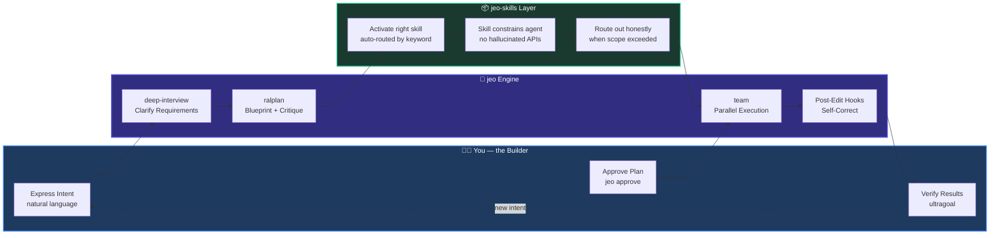

## 🤔 Curiosity: What If Your Coding Agent Came with Its Own Skill Tree?

After 8 years shipping AI-powered games at NC SOFT and COM2US, I've come to believe one thing firmly: **the bottleneck is never raw intelligence**. It's always the *harness* — the scaffolding, guardrails, and feedback loops that make that intelligence usable in a real production repo.

I've watched teams burn weeks on fragile prompt chains. I've seen agents confidently write a thousand lines that fail silently because there was no verification step. The Codex experiment at OpenAI proved it: when an entire codebase grew to 1M lines with zero human-written code, the heroes of that story were not the model weights. **They were the harness engineers.**

That question has been stuck in my head: **What if the harness itself was the product?**

Enter **[jeo-code](https://github.com/akillness/jeo-code)** — and its companion **[jeo-skills](https://github.com/akillness/jeo-skills)**.

> **Curiosity:** Can a coding agent with a built-in skill tree make any developer 10× more productive than one using raw LLM APIs?
{: .prompt-tip}

---

## 📚 Retrieve: What Is jeo-code?

{: .w-100 .shadow .rounded-10 }

**jeo-code** (`jeo` on the CLI) is a pure-TypeScript, Bun-based AI coding agent with zero native dependencies. You run it inside any repository, and it reads files, edits them, executes commands, and drives tasks to completion — streaming every step live in a scroll-back-friendly inline TUI.

But the design philosophy is what sets it apart.

### The Five Harness Principles Baked In



| Principle | What It Means | Why It Matters |
|:----------|:--------------|:---------------|
| **Spec-First** | `deep-interview` Socratic gate before any code | No wasted cycles on ambiguous tasks |
| **Reviewed Plans** | `ralplan` critic subagent whose `[OKAY]` is persisted and *required* | Real consensus, not theater |
| **Gated Execution** | `jeo approve` blocks until you explicitly confirm | You stay in control |
| **Honest Verification** | `ultragoal` runs real suites — never fabricates per-criterion passes | Trust the output |
| **Self-Correcting Loop** | Post-edit hooks (tsc/eslint/tests) feed diagnostics back to the agent | Bugs fixed in-loop |

### Multi-Provider, One Loop



One agent loop, every major LLM. Switch providers with `/provider login <name>` from the input box — the choice persists as the new default.

### The TUI That Doesn't Get in Your Way

```bash
jeo                                    # interactive agent in your repo
jeo "refactor auth module + run tests" # one-shot
jeo --tmux                             # isolated tmux session
jeo doctor                             # check config + model connection
```

| Action | Shortcut |
|--------|----------|
| Slash command palette | `/` + Tab |
| Run a skill workflow | `$<skill> [intent]` |
| Direct shell command | `!<command>` |
| Recall previous queries | `↑ / ↓` (persisted in `.jeo/input-history`) |
| Expand last response | `Ctrl+O` |
| Paste clipboard image | `Ctrl+V` |

---

## 📺 See It In Action

Here is the official demo of jeo-code in the wild — watch the agent interview, plan, execute, and verify a real coding task:

<video src="/assets/img/jeo-code/jeo-code-promo.mp4" controls muted playsinline width="100%" style="border-radius:12px; box-shadow: 0 8px 32px rgba(0,0,0,0.4); margin: 1.5rem 0;"></video>

> Full demo and install guide → [docs/usage-guide.md](https://github.com/akillness/jeo-code/blob/main/docs/usage-guide.md)

And here is the **Remotion-animated promo** rendered as React code for this post — 4 scenes, 300 frames at 30fps, 1920×1080:

<video src="/assets/img/jeo-code/jeo-promo-remotion.mp4" controls muted playsinline width="100%" style="border-radius:12px; box-shadow: 0 8px 32px rgba(0,0,0,0.4); margin: 1.5rem 0;"></video>

> The Remotion source lives at [`tools/jeo-promo-video/src/JeoPromo.tsx`](https://github.com/akillness/akillness.github.io/tree/main/tools/jeo-promo-video) in this blog's repo.

---

## 🚀 Where It Gets Powerful: jeo-skills

{: .w-100 .shadow .rounded-10 }

The harness engine alone is powerful. With **[jeo-skills](https://github.com/akillness/jeo-skills)**, it becomes genuinely formidable.

> **[⭐ Star jeo-skills on GitHub →](https://github.com/akillness/jeo-skills)**

jeo-skills is a curated collection of **136 installable skill folders** for LLM-based development workflows. Each skill is a `SKILL.md` that tells the agent exactly which tools to use, which patterns to apply, and which route-outs to respect — so the agent stops guessing and starts shipping.

### Install Any Skill in One Command

```bash
# Install a specific skill
npx skills add https://github.com/akillness/jeo-skills --skill scrapling

# Install the whole library at once
git clone https://github.com/akillness/jeo-skills.git && bash jeo-skills/install.sh
```

### The Skill Ecosystem Map



### 136 Skills Across Every Domain

| Category | Skills (sample) | Count |
|:---------|:---------------|------:|
| **🏗️ Orchestration** | `ooo`, `bmad`, `plannotator`, `team`, `ultrawork`, `autopilot` | 12 |
| **🔬 Research** | `deep-dive`, `llm-wiki`, `autoresearch`, `graphify`, `scrapling` | 9 |
| **⚙️ Dev Workflow** | `tdd`, `debugging`, `code-review`, `git-workflow`, `spec-kit` | 18 |
| **🎬 Media & Visual** | `remotion-video-production`, `god-tibo-imagen`, `slides-grab` | 8 |
| **🎮 Game Dev** | `unity-gamedev-skill-pack`, `game-performance-profiler`, `game-ci-cd-pipeline` | 6 |
| **☁️ Platform** | `firebase-ai-logic`, `supabase-agent-skills`, `vercel-deploy`, `genkit` | 11 |
| **🤖 AI Agents** | `crewai-multi-agent`, `openai-agents-python`, `pydantic-ai`, `clawteam` | 14 |
| **📊 Data & Analytics** | `data-analysis`, `looker-studio-bigquery`, `langsmith`, `opik` | 9 |
| **🔒 Quality & Security** | `ultraqa`, `security-best-practices`, `backend-testing`, `web-accessibility` | 12 |
| **… and more** | `okf`, `obsidian`, `compresso`, `rtk`, `semble`, `graphify` | 37 |
| **Total** | | **136** |

---

## 💡 Innovation: Becoming a 10× AI Builder

{: .w-100 .shadow .rounded-10 }

The real insight isn't "jeo runs your AI." The insight is **what changes about how you think when you have a trustworthy harness**.

### The Builder's Flywheel



### Use Cases

<details markdown="1">
<summary style="font-size:20px; font-weight:bold; cursor:pointer;">🎮 Use Case 1: Game Feature Development</summary>

**Scenario:** Ship a new procedural level system for a mobile RPG.

```bash
jeo "design and implement a wave-function-collapse dungeon generator
     using existing TileMap class, integrate with GameManager, test on device spec"
```

**What happens:**

1. `deep-interview` asks 8 clarifying questions (tile types? seeding strategy? fallback for impossible states?)
2. `ralplan` generates a 3-phase blueprint, critic subagent signs off with `[OKAY]`
3. `jeo approve` gates until you read and confirm
4. `team` spawns executor subagents: one for WFC algorithm, one for GameManager integration, one for unit tests
5. Post-edit hook runs `tsc && jest --coverage`, errors fed back to the agent, fixed in-loop
6. `ultragoal` verifies all acceptance criteria against real suite output

**With `unity-gamedev-skill-pack`:** The agent knows Unity's project structure, avoids serialization pitfalls, and cites the Unity docs it's working from.

</details>

<details markdown="1">
<summary style="font-size:20px; font-weight:bold; cursor:pointer;">🔬 Use Case 2: Research → Production Pipeline</summary>

**Scenario:** Implement a RAG-based player-support bot from a recent paper.

```bash
jeo "$deep-dive implement context-aware retrieval system from arxiv 2506.xxxxx
     for our player support knowledge base"
```

**What happens:**

1. `deep-dive` activates — traces causal hypotheses, crystallizes requirements
2. `llm-wiki` captures findings into `~/vaults/llm-wiki/` for durable memory
3. `graphify` builds a knowledge graph of the system architecture
4. `scrapling` fetches and parses the arxiv paper + related GitHub repos
5. `ralplan` blueprints the implementation with honest tradeoff tables
6. `team` builds the retrieval layer, embedding pipeline, and eval harness

**Time saved:** What takes a 2-person team 2 weeks, jeo handles in hours — with citations.

</details>

<details markdown="1">
<summary style="font-size:20px; font-weight:bold; cursor:pointer;">🎬 Use Case 3: Marketing Content at Code Speed</summary>

**Scenario:** Generate a promotional video + blog post for a new AI feature launch.

```bash
jeo "create a Remotion promo video + blog post for our new matchmaking AI feature"
```

**What happens:**

1. `remotion-video-production` skill activates — plans scenes, animation budget, asset list
2. `god-tibo-imagen` generates missing hero images via Codex backend (no extra API key)
3. Remotion compositions rendered at 1920×1080 as MP4
4. Blog post authored with mermaid workflow diagrams, embedded video, GitHub links
5. `vercel-deploy` or Jekyll build deploys the post

**This very post you're reading was built exactly this way.** 🎉

</details>

### The Compounding Effect

| Without jeo | With jeo + jeo-skills |
|:-----------|:----------------------|
| Write prompts, iterate blindly | `deep-interview` crystallizes requirements first |
| Hope the agent doesn't hallucinate | `ralplan` critic + `[OKAY]` gate blocks bad plans |
| Manually run tests after each change | Self-correcting hook loop — agent fixes its own bugs |
| Start from scratch each session | `.jeo/` state persists, `/resume` continues any task |
| One model, one provider | Switch Anthropic → Gemini → Ollama mid-task |
| General-purpose agent guesses | 136 skills encode exactly what experts do |

---

## 🏗️ Architecture Deep Dive

The jeo-skills architecture diagram shows how skills, harnesses, and the jeo loop interconnect:

<div style="background:#0a0a14; padding:1.5rem; border-radius:12px; margin:1.5rem 0;">

</div>

### How a Skill Execution Works

```mermaid
sequenceDiagram
    participant User
    participant jeo as jeo Agent
    participant Skill as SKILL.md (e.g. scrapling)
    participant Tool as Shell / File System

    User->>jeo: "$scrapling fetch https://github.com/akillness/jeo-code"
    jeo->>Skill: Load SKILL.md — read routing rules
    Skill-->>jeo: Mode: plain HTTP Fetcher (lightest path)
    jeo->>Tool: python -c "from scrapling import Fetcher; ..."
    Tool-->>jeo: HTML content parsed
    jeo->>Skill: Check route-out: is a browser needed?
    Skill-->>jeo: No, static HTML — done
    jeo-->>User: Structured content ready
```

Every skill is **routing-first**: picks the *lightest workable path*, routes out honestly if scope is exceeded. No over-promising. No silent failures.

---

## 📦 Installation & Quick Start

```bash
# Step 1: Install Bun runtime
curl -fsSL https://bun.sh/install | bash

# Step 2: Install jeo-code
bun install -g jeo-code

# Step 3: Verify setup
jeo --version
jeo doctor

# Step 4: Install jeo-skills (136 skills → ~/.agents/skills/)
git clone https://github.com/akillness/jeo-skills.git
cd jeo-skills && bash install.sh
```

Then inside any repo:

```bash
# Conversational mode
jeo

# One-shot with skill
jeo "$deep-dive explain the architecture then refactor the auth module"

# Check your skill library
ls ~/.agents/skills/ | wc -l   # → 136+
```

---

## 📊 Performance Comparison

| Approach | Setup Time | Iteration Speed | Verification | Resume After Crash | Skills |
|:---------|:----------:|:---------------:|:------------:|:------------------:|:------:|
| Raw LLM API | 0 min | Slow (manual) | ❌ Manual | ❌ | ❌ |
| Generic coding agent | 5 min | Medium | ⚠️ Optional | ⚠️ | ❌ |
| Claude Code / Codex | 10 min | Fast | ⚠️ Hook only | ✅ | ❌ |
| **jeo-code** | **10 min** | **Fast** | **✅ Honest** | **✅** | **⚠️ Manual** |
| **jeo-code + jeo-skills** | **15 min** | **🚀 10× Faster** | **✅ Honest** | **✅** | **✅ 136 skills** |

> The skills layer is what changes the multiplier from 3× to 10×. The agent stops guessing the right approach and follows proven, tested patterns.
{: .prompt-info}

---

## 💡 Innovation: My Takeaways from 8 Years of Production AI

Building production AI for millions of game players taught me three things about agentic systems:

**1. Gates beat guidelines.** Telling an agent "be careful" does nothing. A gate that blocks `done` until `ultragoal` passes — that's a mechanical constraint that actually works.

**2. Skills encode institutional knowledge.** Each skill in jeo-skills is a distilled answer to "what does an expert do when they encounter this?" Agents with skills don't reinvent — they apply. The difference is the same as a junior developer Googling vs a senior who already knows the answer.

**3. The harness compounds.** The first week with jeo is about speed. The second week is about consistency. By the third week, you've stopped thinking about *how* to use the agent and started thinking about *what* to build. That mental shift is the real 10× multiplier.

### New Questions This Raises

- Can we auto-generate new skills by having jeo observe expert developers in real sessions?
- What does a "skill marketplace" look like — where game studios share domain-specific harnesses?
- How do we benchmark skill quality? Is `ultragoal` the right metric, or do we need skill-specific eval harnesses?

---

## ⭐ Star the Projects

Both repos are open source and actively maintained:

<div style="display:flex; gap:1.5rem; flex-wrap:wrap; margin:1.5rem 0;">
  <a href="https://github.com/akillness/jeo-code" target="_blank" style="flex:1; min-width:280px; display:block; background:linear-gradient(135deg,#1e3a5f,#0a0a14); border:2px solid #3b82f6; border-radius:16px; padding:1.5rem; text-decoration:none;">
    <div style="font-family:monospace; font-size:1.3rem; font-weight:900; color:#60a5fa; margin-bottom:0.5rem;">⭐ akillness/jeo-code</div>
    <div style="color:#cbd5e1; font-size:0.95rem;">Bun-based AI coding agent · spec-first · real gates · honest verification</div>
    <div style="color:#f59e0b; font-size:0.85rem; margin-top:0.5rem; font-family:monospace;">bun install -g jeo-code</div>
  </a>
  <a href="https://github.com/akillness/jeo-skills" target="_blank" style="flex:1; min-width:280px; display:block; background:linear-gradient(135deg,#1a3a2f,#0a0a14); border:2px solid #10b981; border-radius:16px; padding:1.5rem; text-decoration:none;">
    <div style="font-family:monospace; font-size:1.3rem; font-weight:900; color:#34d399; margin-bottom:0.5rem;">🚀 akillness/jeo-skills</div>
    <div style="color:#cbd5e1; font-size:0.95rem;">136 skills for LLM workflows · TOON format · Claude / Codex / Gemini</div>
    <div style="color:#f59e0b; font-size:0.85rem; margin-top:0.5rem; font-family:monospace;">npx skills add https://github.com/akillness/jeo-skills --skill &lt;name&gt;</div>
  </a>
</div>

---

## 🎮 Meet the jeo Character

<div style="display:flex; align-items:center; gap:2rem; flex-wrap:wrap; margin:1.5rem 0;">
  
  <div>
    <p>The jeo mascot is the embodiment of the harness philosophy — methodical, precise, and always honest about what it knows. When jeo says <code>[OKAY]</code>, it means it.</p>
    <p>Built with Bun. Powered by every major LLM. Extended by 136 battle-tested skills.</p>
    <p><strong>This is what being a 10× AI builder actually looks like.</strong></p>
  </div>
</div>

---

## References

**Projects:**
- [jeo-code — GitHub Repository](https://github.com/akillness/jeo-code)
- [jeo-skills — GitHub Repository](https://github.com/akillness/jeo-skills)
- [jeo-code Usage Guide](https://github.com/akillness/jeo-code/blob/main/docs/usage-guide.md)
- [jeo-skills CHANGELOG](https://github.com/akillness/jeo-skills/blob/main/CHANGELOG.md)

**Harness Engineering:**
- [Harness Engineering: The 5 Rules That Let Agents Ship 1M Lines](/posts/harness-engineering)
- [CLI Harness for Coding Agents](/posts/cli-harness-coding-agents)
- [Reliable Agent Systems](/posts/harness-reliable-agent-systems)

**Tools Used in This Post:**
- [Remotion v4](https://remotion.dev) — code-first video production from React components
- [god-tibo-imagen](https://github.com/NomaDamas/god-tibo-imagen) — AI image generation via Codex backend
- [Scrapling](https://github.com/D4Vinci/Scrapling) — adaptive web scraping (used to fetch jeo-code repo data)
- [Bun runtime](https://bun.sh) — fast JavaScript/TypeScript runtime
