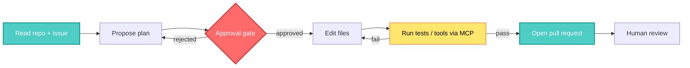
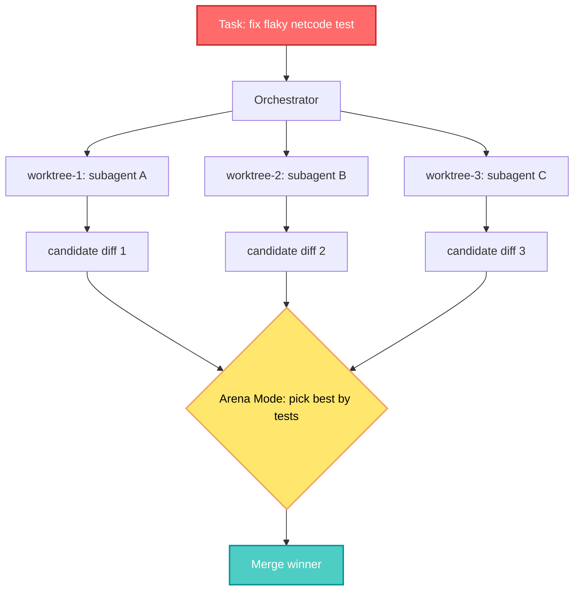

> Source breakdown of [*"Claude Code vs. Cursor vs. Codex vs. Antigravity — six months in"* (The New Stack, June 2026)](https://thenewstack.io/claude-code-vs-cursor-vs-codex-vs-antigravity-2026/). Cover photo by Logan Voss on Unsplash. Everything below is my read as someone who has shipped AI systems into production games for eight years.
{: .prompt-info}

## 🤔 Curiosity: When Four Rivals Build the *Same* Thing, What Are They All Discovering?

Six months ago, the agentic coding tool was still an argument about *form*. Terminal or editor? Autocomplete or autonomous? One model or many? By the start of June 2026, that argument is mostly over — and not because one product won. It's over because **four labs with wildly different cultures quietly converged on the same shape.**

I've seen this pattern before. In game AI, every studio eventually rediscovers behavior trees, then utility AI, then GOAP — not because they copied each other, but because the *problem* keeps pushing everyone toward the same skeleton. When competitors independently arrive at one design, that's usually a signal: the design was less a choice than a **discovery.**

So here's the question that hooked me reading The New Stack's six-month retrospective:

> **Curiosity:** If Claude Code, Cursor, Codex, and Antigravity now all *look the same in a demo*, where did the actual differences go — and how should a team choose?
{: .prompt-tip}

Spoiler from a harness engineer: the model got demoted. The contest moved to the **harness, the price, and the habits a team builds.** Let me show you the evidence.

---

## 📚 Retrieve: Where Each Tool Actually Landed in 2026

The clock starts in November 2025. Google shipped **Antigravity** in public preview on Nov 18, the same day Gemini 3 arrived, pushing the agent-first coding *surface* into the mainstream. Anthropic's **Claude Code**, OpenAI's **Codex**, and Anysphere's **Cursor** were already in the field. Watching all four grow up over the same half-year tells you more than any single launch — the interesting part came *after* the announcements.

Think of it as the smartphone settling into a glass slab: once everyone accepted the shape, the contest moved to the platform around it.

### The four trajectories

- **Claude Code** stayed close to where it started — *terminal-native, approval-heavy*. It leans on long-context reasoning and compaction, which makes it strong on large-codebase work where the agent must hold a lot in its head before touching a line. The friction is deliberate: on a serious codebase, the riskiest moment is the instant *just before* a command runs or a file changes, and Claude Code puts a human at exactly that point.
- **Cursor** went the other way and stayed *model-agnostic*. It lives inside a familiar VS Code surface and lets you point it at whichever frontier model you already pay for — no vendor lock-in to one release calendar, and no workflow migration. Its Composer agent now handles multi-file work without pulling you out of the editor.
- **Codex** took the *distribution* route. Bundled into ChatGPT plans rather than carrying its own price tag, it reached scale faster than anything else: OpenAI reported **3M+ weekly developers** in mid-April 2026 and **4M+** by late May, with the real money coming from enterprise rollouts.
- **Antigravity** traveled furthest from where it began. It launched as an AI-native IDE (a VS Code fork), then relaunched at Google I/O on May 19, 2026 as **Antigravity 2.0** — a *five-surface platform*: a desktop app, a CLI, an SDK, a Managed Agents API inside the Gemini API, and an enterprise layer for Google Cloud. The rebuild wasn't gentle — it removed the original IDE as default and broke setups overnight — but the real bet is a route from a local coding agent to a **managed agent runtime on Google Cloud.**

> And where's **GitHub Copilot**? Deliberately just off-stage. Copilot shaped the whole category, and its coding agent now plans work, edits a branch, and opens a PR with enterprise controls. It earns watching because GitHub already owns the place where issues, PRs, reviews, and Actions live — a home-field edge as agent-written work flows to where it gets merged.
{: .prompt-warning}

### The blueprint they all landed on

Line the four up today and the resemblances are hard to miss. They converge on the same pattern:




A terminal/command-line surface, **explicit planning before execution**, **approval gates**, access to external tools through the **Model Context Protocol (MCP)**, and some form of **delegated or parallel agent work.** Ask any of them to fix a failing integration test across three files and the flow looks nearly identical: the agent reads the repo, proposes a plan, waits for approval, edits, runs the test, and reports back while you watch the diffs stream past.

That sameness quietly changed *what one of these tools is*. A coding agent now reads issues, edits branches, runs tests, calls tools, and opens PRs — **behaving like a junior teammate with commit access rather than an autocomplete.**

---

## 🔌 The Two Standards Doing the Quiet Work

Everyone points at MCP as the connector. But the *quieter* standard forming inside the repository may matter more: **`AGENTS.md`**. It turns the repo itself into the agent's onboarding guide — how to run tests, what style to follow, where not to touch. OpenAI started it; Google, Cursor, and Sourcegraph joined; and since December 2025 it sits under the **Agentic AI Foundation at the Linux Foundation**, alongside MCP. Codex, Cursor, Copilot, and Windsurf all read it natively. (Claude Code still reads its own `CLAUDE.md` — convergence stops just short of total.)

Here's a minimal, portable `AGENTS.md` you can drop in today. This is the single highest-leverage file for getting consistent agent behavior across tools:

```markdown
# AGENTS.md — onboarding guide for any coding agent


## Project
Unity 6 + Python ML service. Game client in C#, training/eval in Python.

## How to run things
- Python tests:   `pytest -q tests/`
- C# build:       `dotnet build GameAI.sln -c Release`
- Lint:           `ruff check . && dotnet format --verify-no-changes`
- Never run the full GPU training job; use `--smoke` for a 30s sanity pass.

## Conventions
- Python: type-hint everything, no bare `except`, snake_case.
- C#: PascalCase methods, one class per file, no `#region`.
- Commit style: Conventional Commits (`feat:`, `fix:`, `refactor:`).

## Boundaries — DO NOT TOUCH
- `Assets/ThirdParty/**`  (vendored, regenerated by CI)
- `secrets/**`, `.env*`   (credentials)
- Anything under `migrations/` without an explicit task.

## Definition of done
A change is done only when: tests pass, lint is clean,
and the diff is reviewable in under ~200 lines.
```


And the MCP side — wiring an agent to *external* tools (a database, a Jira board, your engine's asset API). Most tools read a JSON config like this:


```json
{
  "mcpServers": {
    "filesystem": {
      "command": "npx",
      "args": ["-y", "@modelcontextprotocol/server-filesystem", "./Assets"]
    },
    "postgres": {
      "command": "npx",
      "args": ["-y", "@modelcontextprotocol/server-postgres"],
      "env": { "DATABASE_URL": "postgres://localhost/telemetry" }
    }
  }
}
```


> **Why this matters for games:** the same `AGENTS.md` that tells an agent "never run the full GPU job, use `--smoke`" is exactly the guardrail that stops it from torching a 12-hour training run. Boundaries-as-code is the production discipline; the agent is just the new consumer of it.
{: .prompt-tip}

---

## 📉 The Model Got Demoted

For most of 2025, the pitch was about *whose model wrote better code*. By mid-May 2026, leading scores on **SWE-bench Verified** sit within a narrow band of each other — and Cursor will happily run any of them. When the engine stops separating products, the difference moves to everything *around* it: the harness, the workflow, the approval model, the distribution channel.

That's the most important shift of the last six months. Benchmarks still measure whether an agent can solve an *isolated* task, but in a real repo the hard part is landing a change that **survives local conventions, CI, and a human reviewer.** So teams are routing work *by type* rather than swearing loyalty to one tool — and lock-in builds in that same layer. Wire your review habits, skills, hooks, and subagent patterns around one tool and you don't switch lightly. Antigravity's painful CLI migration showed how much friction lives in an established workflow.

---

## 💰 The Money Question Splits Them Apart

Pricing is where the four stop rhyming. The first thing to grasp: **an agent bills less like a seat than like a compute job.** It reads large repos, spins up sandboxes, runs tests, and loops through retries before it lands a mergeable change. So the number worth comparing isn't the monthly sticker — it's the **cost per accepted change.** Cheap-at-the-door rarely stays cheap-at-scale once a team runs agents all day.

Here's the back-of-envelope calculation I actually use when a lead asks "which one's cheaper?":

```python
def cost_per_accepted_change(
    monthly_seat: float,
    usage_per_change: float,   # metered compute/credits per attempt
    attempts_per_merge: float, # retries before a diff is mergeable
    merges_per_month: int,
) -> float:
    """The only pricing number that survives contact with a real repo."""
    variable = usage_per_change * attempts_per_merge * merges_per_month
    total = monthly_seat + variable
    return total / max(merges_per_month, 1)


# Illustrative: a $20 seat looks cheap until retries pile up.
cheap_seat   = cost_per_accepted_change(20, 0.15, 4.0, 120)  # noisy agent
careful_seat = cost_per_accepted_change(40, 0.15, 1.6, 120)  # plans first
print(f"cheap seat:   ${cheap_seat:.2f} / accepted change")   # -> $0.77
print(f"careful seat: ${careful_seat:.2f} / accepted change") # -> $0.57
```


The lesson mirrors GPU budgeting in ML: the headline rate is a trap; **retries and rework dominate.** A pricier tool that plans well and lands changes in fewer attempts can be *cheaper per merge* than a $20 seat that thrashes.

Where each lands as of June 2026:

| Tool | Center of gravity | Where it pulls ahead | Pricing shape |
|------|-------------------|----------------------|---------------|
| **Claude Code** | Terminal-native, approval-first | Deep reasoning + large-codebase work, for teams that read every diff | ~$20 entry tier + usage; Max plans run well above for power users |
| **Cursor** | Model-agnostic IDE | Editor-bound teams choosing their own model, avoiding vendor lock-in | Pro ~$20 + usage-based costs layered on |
| **Codex** | Bundled into ChatGPT | Fast reach + enterprise rollout, helped by no separate price tag | No line item of its own; heavy work metered via Codex credits |
| **Antigravity** | Multi-surface platform | Google Cloud / Android shops wanting managed agents | Preview-style access + new $100/mo AI Ultra tier; quotas tightening |

> No team should read that table as a verdict. Most shops I talk to **run two of these side by side** — one in the terminal for serious refactors, one in the editor for everyday edits. The trap is that all four look almost identical in a demo; the differences that *bite* show up later — in where the code runs, what the agent may touch, and what it costs over a week of real work.
{: .prompt-warning}

---

## 🚀 Innovation: The Next Entrant Is Already Here — and the Bet Is the Harness

The framing that **Grok Build** is "something to watch for" needs a correction: xAI already moved. It hit early beta in mid-May 2026 for the top SuperGrok tier, and the May 25 announcement opened access to all SuperGrok and X Premium Plus subscribers. It's a **terminal-native CLI** backed by the `grok-build-0.1A` model — trained specifically for agentic coding, with a reported **~70.8% on SWE-bench** in early third-party writeups.

Two design choices stand out, and both are *harness* bets, not model bets:

- **Eight subagents in parallel**, each isolated in its own **Git worktree** — the boldest architecture bet anyone in the category has made. (If you've ever run parallel evaluation rollouts in RL, this is the same instinct: isolate state, fan out, merge the winner.)
- **Local-first** — source code and credentials stay on the machine during a session. Appealing for regulated teams, though the compliance paperwork is still thinner than the marketing. And remember: *local execution is not local inference* — what matters is which repository context still reaches the model.

The piece still missing is **Arena Mode** — generate several candidate outputs, pick the best. It's shown up in code traces but isn't live in the beta yet. That's the feature I'd watch, because "fan out, then choose" is exactly how I'd structure a PCG pipeline that has to ship one good level out of many candidates.




---

## 🎮 What This Means If You Ship AI Systems

Pulling it back to production — here's how I'd advise a game-AI team choosing today:

1. **Pick the harness, not the model.** The SWE-bench gap is noise now. Choose by approval model, sandbox behavior, and how the tool handles *your* repo's conventions. Pilot on a real refactor, not a demo.
2. **Write `AGENTS.md` first, before adopting any tool.** It's the portable layer. If you switch tools next quarter, this file comes with you — that's your hedge against lock-in.
3. **Measure cost per accepted change, not the sticker price.** Instrument retries. A planner that lands in 1.6 attempts beats a thrasher at 4.0, even at double the seat price.
4. **Expect to run two.** Terminal agent for deep refactors and risky surgery; editor agent for everyday flow. That's not indecision — it's routing work by type.
5. **Watch the parallel-subagent + Arena pattern.** Fan-out-then-select is coming for code the way it already shapes PCG and RL. Design your CI so "best of N diffs" is cheap to evaluate.

Six months of convergence settled the *shape* of the agentic coding tool and turned the next phase into a contest over the harness, the price, and the habits a team builds. A fifth terminal agent (Grok Build) just entered with a large captive base and an owner willing to spend — reason enough to watch how the incumbents answer.

> **Innovation → new Curiosity:** If the model is now table stakes and the harness is the product, then the most valuable engineer on a 2027 team isn't the one with the best prompt — it's the one who designs the *guardrails, gates, and feedback loops* the agents run inside. Are we training for that role yet? That's the question I'm taking into next quarter.
{: .prompt-tip}

---

### 📚 References

- **Source article:** [Claude Code vs. Cursor vs. Codex vs. Antigravity — six months in](https://thenewstack.io/claude-code-vs-cursor-vs-codex-vs-antigravity-2026/) — The New Stack, June 2026.
- **AGENTS.md** — open convention under the Agentic AI Foundation (Linux Foundation), read natively by Codex, Cursor, Copilot, Windsurf.
- **Model Context Protocol (MCP)** — the tool-connector standard the whole category aligned on.
- **SWE-bench Verified** — the leaderboard that stopped separating products by mid-May 2026.
- **Grok Build** — xAI's terminal-native CLI (`grok-build-0.1A`), announced May 25, 2026; parallel subagents + Git worktrees.
- *Cover photo by Logan Voss on Unsplash.*
