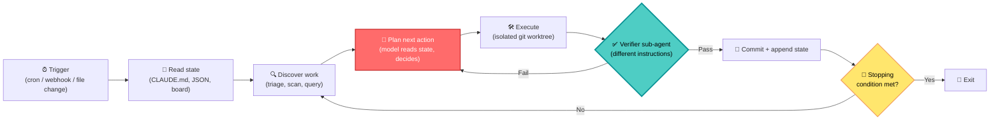
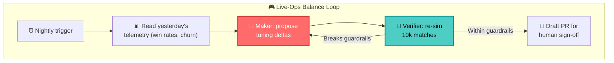

> Source breakdown of [*"Loops: What Every AI Engineer Needs to Know in 2026"* by Rahul (@sairahul1)](https://x.com/sairahul1/article/2064277888216555684), which amplifies [Peter Steinberger's "design the loops that prompt your agents"](https://x.com/steipete/status/2063697162748260627) and [Addy Osmani's *Loop Engineering* post](https://addyo.substack.com/p/loop-engineering). Cover image is the article's own card, pulled from the X preview. The inline diagrams in this write-up are the original figures from Osmani's public post — the canonical source the X article summarizes — because the X article body itself sits behind a login wall and can't be archived directly. Cross-checked against [The New Stack's reporting](https://thenewstack.io/loop-engineering/) and [Firecrawl's loop-engineering guide](https://www.firecrawl.dev/blog/loop-engineering). Everything below is my read as someone who has shipped AI systems into production games for eight years.

{: .prompt-info}

## 🤔 Curiosity: If You're Still Typing Prompts, What Are You Actually Doing?

A single sentence from Rahul's article stopped me mid-scroll. He quotes Boris Cherny — the person who *built* Claude Code at Anthropic — saying:

> "I don't prompt Claude anymore. I write loops, and the loops do the work. My job is to write loops."

{: .light .w-75 .shadow .rounded-10 }
_The opening figure from Addy Osmani's "Loop Engineering" — the same image Rahul's article leans on. The job moves from typing the prompt to designing the system that types it. (Source: [addyo.substack.com/p/loop-engineering](https://addyo.substack.com/p/loop-engineering))_

Peter Steinberger (creator of OpenClaw, now at OpenAI) put the same idea more bluntly the day before: *"You shouldn't be prompting coding agents anymore. You should be designing loops that prompt your agents."* By that weekend, Google's Addy Osmani had given the pattern a name — **loop engineering** — and the whole AI-dev timeline lit up.

Here's why this hit a nerve for me. In game production, I've watched the exact same migration happen with NPC AI. We started by **scripting** every behavior by hand (`if player_near: attack`). Then we moved to **behavior trees** — we stopped writing the actions and started designing the *structure that selects* actions. The designer's job changed from "write what the guard does" to "write the loop the guard runs every tick." Loop engineering is that same promotion, applied to coding agents.

> **Curiosity:** Everyone clipped Cherny's quote. Almost nobody built what he described. So what is a "loop," concretely, and what does it actually take to make one that's safe to leave running while you sleep?
{: .prompt-tip}

Let me retrieve the actual machinery.

---

## 📚 Retrieve: What a "Loop" Actually Is

For two years, working with a coding agent meant typing one prompt, reading the result, typing the next prompt. **You were the scheduler and you were the quality gate.** A loop inverts that arrangement. Osmani's framing is the cleanest: loop engineering is *"replacing yourself as the person who prompts the agent."*

The closest analogy is moving from **operating a lathe** to **designing the production line** the lathe sits on. A loop:

1. **Discovers work** on a schedule (instead of you noticing it),
2. **Executes** in an isolated workspace,
3. **Verifies** the result with a *second* agent,
4. **Persists state** to a file so tomorrow's run resumes where today's stopped.



### The 18-month escalator

The thing that makes this *feel* inevitable is the trajectory. We went up a full abstraction ladder in under a year and a half:

| Era | The unit of work | What you tune | Who pulls the trigger |
|:----|:-----------------|:--------------|:----------------------|
| **Prompt engineering** | A single message | Wording, examples | You, every turn |
| **Context engineering** | The window | What's in scope (RAG, files) | You, every turn |
| **Harness engineering** | The tool/permission surface | MCP, hooks, allow-lists | You, per session |
| **Loop engineering** | The whole run | Schedule, verifier, memory | **The loop** |

> **Retrieve:** A cron job runs a *fixed script*. A loop runs a *model that reads the current state and chooses its next action*. That decision logic in the middle is the entire difference — and the reason a loop can't just be replaced by a shell script.
{: .prompt-info}

### Osmani's six primitives (and why both vendors already shipped them)

The reason the conversation exploded in June 2026 is that the building blocks were *already finished*. Osmani maps six primitives onto both OpenAI Codex and Claude Code, and the mappings are nearly identical — the assembly was complete, someone just had to point it out.

| Primitive | Job in the loop | Codex | Claude Code |
|:----------|:----------------|:------|:------------|
| **Automations** | Scheduled discovery + triage | Automations tab / triage inbox | Scheduled tasks, `/loop`, hooks, GitHub Actions |
| **Worktrees** | Isolate parallel agents | Built-in worktree per thread | `git worktree`, subagent isolation |
| **Skills** | Codify project knowledge | `SKILL.md` agent skills | `SKILL.md` agent skills |
| **Connectors** | Reach external tools | MCP connectors + plugins | MCP servers + plugins |
| **Sub-agents** | Separate the maker from the checker | `.codex/agents/` | `.claude/agents/`, agent teams |
| **Memory** | Persist state between runs | `AGENTS.md`, Memories, Linear | `CLAUDE.md`, auto memory, Linear |

{: .light .w-75 .shadow .rounded-10 }
_Osmani's own figure: the same building blocks (automations, worktrees, skills, connectors/plugins, sub-agents) now ship in both Codex and Claude Code — "both products have all five now." This is the assembly that was already finished; someone just had to name it. (Source: [addyo.substack.com/p/loop-engineering](https://addyo.substack.com/p/loop-engineering))_

Both products even expose a `/goal` command that keeps an agent working until a *verifiable stopping condition* holds — with Claude Code using a separate model to grade the result.

### Open loop vs. closed loop — pick on purpose

This is the distinction Rahul's article underweights and the one that will save your token budget:

| | Open loop | Closed loop |
|:--|:----------|:------------|
| **Constraints** | Loose — a goal, wide latitude | Bounded — defined path + eval per step |
| **Best for** | Discovery, research, "find everything" | Production work, recurring maintenance |
| **Cost** | Brutal on tokens | Cheaper, predictable |
| **Stopping** | Rubric satisfied (fuzzy) | Hard check passes (crisp) |
| **Default?** | Only when you mean it | ✅ Yes |

### The verifier is the part that earns trust

If you remember one thing: **a model grading its own output is too generous.** The single most consequential design choice in a loop is splitting the agent that *writes* the code from the agent that *checks* it. A second agent with different instructions catches the failures the first one reasoned itself into.

Osmani's canonical example: a morning automation triages yesterday's CI failures, dispatches one sub-agent to draft each fix in an isolated worktree, and a *second* sub-agent reviews each fix against the project's tests. Ramp's `Inspect` built exactly this shape as bespoke infrastructure six months earlier — now it's a first-party feature in both ecosystems.

### A minimal loop you can actually read

Here's the skeleton stripped of vendor magic. The model is a **subroutine inside your loop**, not a chat partner. Note the four non-negotiables: a stopping condition, a no-progress guard, a budget cap, and a separate verifier.

```python
# Curiosity: what's the smallest honest loop? Discover -> Act -> Verify -> Persist.
import json, subprocess, pathlib
from dataclasses import dataclass

STATE = pathlib.Path("loop_state.json")
MAX_ITERS = 8          # stopping condition: hard cap
TOKEN_BUDGET = 200_000 # stopping condition: dollars/tokens
NO_PROGRESS_LIMIT = 2  # stopping condition: bail if stuck

@dataclass
class LoopState:
    iteration: int = 0
    tokens_used: int = 0
    stale_rounds: int = 0
    done: bool = False
    last_signature: str = ""

def load() -> LoopState:
    # Memory: survive a crash, a context reset, a 3 a.m. process kill.
    if STATE.exists():
        return LoopState(**json.loads(STATE.read_text()))
    return LoopState()

def save(s: LoopState) -> None:
    STATE.write_text(json.dumps(s.__dict__, indent=2))

def maker(state: LoopState) -> dict:
    """Agent #1: read repo state, pick ONE unit of work, produce a patch."""
    # In practice: claude -p "..."  /  codex exec "..."  inside a git worktree.
    return run_agent(role="maker", instructions="Fix the top failing test. Output a diff.")

def verifier(patch: dict) -> bool:
    """Agent #2: DIFFERENT instructions. Never let the maker grade itself."""
    review = run_agent(role="verifier",
                       instructions="Run the suite against this diff. Pass only if all green.")
    return review["all_tests_pass"] and not review["touches_unrelated_files"]

def loop():
    s = load()
    while not s.done and s.iteration < MAX_ITERS and s.tokens_used < TOKEN_BUDGET:
        s.iteration += 1
        patch = maker(s)
        s.tokens_used += patch["tokens"]

        if verifier(patch):                 # the trust gate
            subprocess.run(["git", "apply", patch["diff_path"]], check=True)
            sig = patch["signature"]
            s.stale_rounds = 0 if sig != s.last_signature else s.stale_rounds + 1
            s.last_signature = sig
        else:
            s.stale_rounds += 1             # no-progress guard

        if s.stale_rounds >= NO_PROGRESS_LIMIT:
            print("No progress — exiting before we burn the budget.")
            break
        if patch["goal_satisfied"]:
            s.done = True
        save(s)                             # persist EVERY round

    print(f"Loop stopped at iter={s.iteration}, tokens={s.tokens_used}, done={s.done}")

if __name__ == "__main__":
    loop()
```

And the trigger is gloriously boring — a 2026 loop's scheduling layer is just `cron`:

```bash
# Every weekday at 7am: triage overnight CI, let the loop draft + verify fixes.
0 7 * * 1-5  cd /repo && /usr/bin/python3 loop.py >> logs/loop.log 2>&1
```

---

## 💡 Innovation: What This Means If You Ship Games (or Anything Live)

Coding agents got the headlines, but the loop pattern is really about **any system with recurring, verifiable work** — which describes a live game almost perfectly. Here's where I'd point it first.

### Game-production loops worth building



| Loop | Trigger | Maker does | Verifier checks | Stops when |
|:-----|:--------|:-----------|:----------------|:-----------|
| **Balance triage** | Nightly telemetry | Propose tuning deltas | Re-simulate matches vs. guardrails | Win-rate band restored |
| **Content QA** | New asset committed | Generate edge-case test scenes | Render + diff against golden frames | Zero visual regressions |
| **Crash-fix** | Sentry spike webhook | Draft fix in a worktree | Repro test passes, no new crashes | Crash rate normalizes |
| **Localization** | String table change | Translate + lore-check | Back-translation + length-fit check | All locales pass |

The balance-tuning loop is the one I'd ship first, because it has a *crisp* verifier: re-running the match simulator is a closed, automatable eval. That's the whole game — **if you can't write the check, you don't have a loop, you have a runaway agent.**

> **Innovation:** In game AI we already trust *self-running* loops — that's what a behavior tree tick *is*. Loop engineering just swaps the hand-authored selector for a model that reads state and chooses. The discipline that keeps NPCs from glitching — bounded ticks, clear transitions, a watchdog — is the *same* discipline that keeps an agent loop from burning your token budget at 3 a.m.
{: .prompt-warning}

### The honest tradeoffs

Osmani is more cautious than the hype he triggered, and so am I:

- **Runaway cost.** Without an iteration cap, a no-progress check, *and* a dollar budget, an open loop can burn a billing cycle over a weekend. All three guards are in the skeleton above for a reason.
- **Comprehension debt.** This is the sharp one. A loop ships code you never read. *"Two engineers can run an identical loop and get opposite outcomes — one moving faster on work they understand, the other avoiding understanding altogether."* The verifier protects correctness; nothing protects comprehension except you reading the diffs.
- **It might just be cron in a hat.** The skeptics aren't wrong about *trivial* loops. The value only appears when the middle step needs *judgment* — when a fixed script genuinely can't decide what to do next.

{: .light .w-75 .shadow .rounded-10 }
_Osmani's closing image says it best: "Build the loop. But build it like someone who intends to stay the engineer, not just the person who presses go." The leverage point moved; the responsibility didn't. (Source: [addyo.substack.com/p/loop-engineering](https://addyo.substack.com/p/loop-engineering))_

### Key takeaways

| Insight | Implication | Next step |
|:--------|:------------|:----------|
| The model got demoted to a subroutine | Stop optimizing prompts; optimize the loop | Pick one recurring task with a crisp check |
| The verifier earns the trust | Never let the maker grade itself | Write the eval *before* the loop |
| Memory is boring on purpose | A markdown checklist or JSON file is enough | Have every run read at start, append at end |
| Closed loops are the default | Open loops are for funded exploration only | Add caps: iterations, no-progress, budget |
| Portability is the open question | Loop definitions aren't standardized yet | Keep your loop logic vendor-agnostic |

### New questions this raises

- The New Stack notes the vendor that makes **loop definitions portable** takes pole position. Will we get an `AGENTS.md`-style standard for *loops*, or will each of us keep hand-rolling `loop.py`?
- For games specifically: what's the right **human-in-the-loop checkpoint** for a balance loop — sign off every PR, or only when deltas exceed a threshold? Where does autonomy stop being a feature and start being a liability to your players' trust?
- If the verifier is what earns trust, **who verifies the verifier?** When the checker is also a model, the comprehension-debt problem just moves up one level.

---

## References

**Primary sources:**
- [Rahul (@sairahul1), *"Loops: What Every AI Engineer Needs to Know in 2026"* (X Article)](https://x.com/sairahul1/article/2064277888216555684)
- [Peter Steinberger — "design the loops that prompt your agents"](https://x.com/steipete/status/2063697162748260627)
- [Peter Steinberger's blog (steipete.me)](https://steipete.me/posts/just-talk-to-it)

**Reporting & analysis:**
- [The New Stack — *Loop Engineering* (Janakiram MSV)](https://thenewstack.io/loop-engineering/)
- [Firecrawl — *Loop Engineering: Should You Stop Prompting Agents?*](https://www.firecrawl.dev/blog/loop-engineering)

**Tooling & docs:**
- [Claude Code documentation](https://docs.anthropic.com/en/docs/claude-code)
- [OpenAI Codex](https://openai.com/codex/)
- [Agent skills (`SKILL.md`) reference](https://docs.anthropic.com/en/docs/claude-code/skills)
- [Anthropic — building effective agents / harnesses for long-running work](https://www.anthropic.com/research/building-effective-agents)

**Cross-domain (game AI loops):**
- [Game AI Pro book series](https://www.gameaipro.com/)
- [Behavior trees in robotics and AI (Colledanchise & Ögren)](https://arxiv.org/abs/1709.00084)
