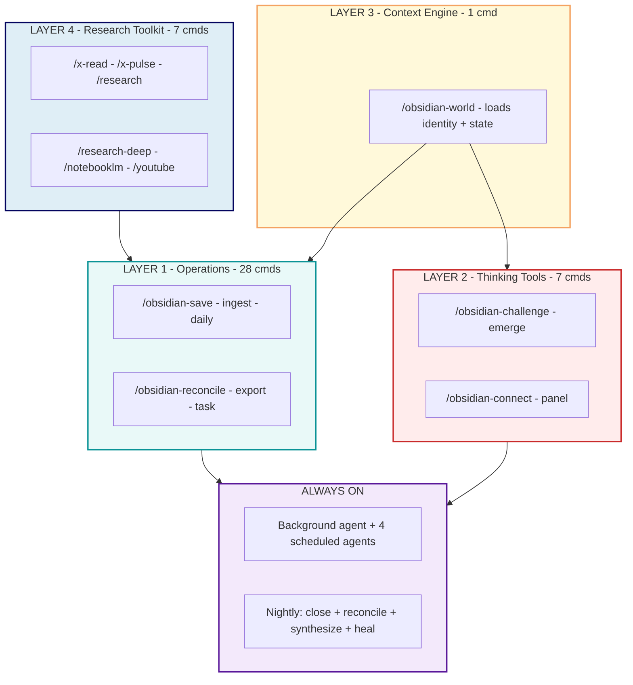
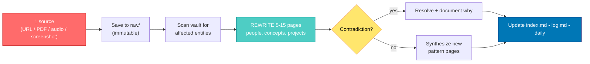

> Source breakdown of [**obsidian-second-brain**](https://github.com/akillness/obsidian-second-brain) — a cross-CLI Obsidian skill (built upstream by [Eugeniu Ghelbur](https://github.com/eugeniughelbur/obsidian-second-brain)) that turns your note vault into a self-maintaining, AI-first second brain across Claude Code, Codex CLI, Gemini CLI, and OpenCode. The banner and every quoted command/schema below are pulled directly from the repository's `README.md`, `references/ai-first-rules.md`, and `architecture.md`. The project itself extends [Andrej Karpathy's LLM-Wiki](https://gist.github.com/karpathy/442a6bf555914893e9891c11519de94f). Everything else is my read as someone who has shipped AI systems into production games for eight years.
{: .prompt-info}

{: .light .w-75 .shadow .rounded-10 }
_The project's own banner. The pitch is deceptively simple — "one brain, four CLIs" — but the interesting word is **brain**, not vault. A vault is storage. A brain rewrites itself. (Source: [github.com/akillness/obsidian-second-brain](https://github.com/akillness/obsidian-second-brain))_

## 🤔 Curiosity: Why Does Every Studio Forget What It Already Learned?

Here's a scene I've lived through at every studio I've worked at across eight years at NC SOFT and COM2US.

A live-ops meeting. Someone proposes nerfing a unit's cooldown. A senior designer frowns: *"Didn't we try that already?"* Nobody's sure. We dig through Slack, Confluence, three abandoned Notion workspaces, and a `balance_v7_FINAL_real.xlsx`. Forty minutes later we find the post-mortem from 14 months ago: **we did try it, it tanked retention, we reverted it.** We almost shipped the same mistake twice.

The repo I'm dissecting today names this exact pain in its first paragraph:

> "You take notes... Hundreds of files. They just sit there. You make the same decision twice because you forgot you made it six months ago. Ideas rot in daily notes. Nobody connects the dots."

That's not a note-taking problem. It's an **institutional amnesia** problem, and games studios have it worse than anyone because our knowledge is *temporal* — a balance fact true in patch 7.2 is a lie by 7.5.

> **The question:** What if your knowledge base didn't just *store* what the team learned, but actively *rewrote itself* — resolving contradictions, tracking when a fact stopped being true, and arguing back when you're about to repeat a buried mistake?
{: .prompt-tip}

That's the bet `obsidian-second-brain` makes. And the architecture behind it is more interesting than "yet another RAG wrapper."

---

## 📚 Retrieve: How a Self-Rewriting Vault Actually Works

### The core inversion: notes for the machine, not for you

Most "AI + notes" tools bolt a chatbot onto a human-readable wiki. This skill inverts the relationship. Notes are written for **future-Claude to retrieve and reason over**, not for human reading — the owner rarely opens a note directly, they ask the agent to synthesize across years of them.

That single design choice — the **AI-first vault rule** — is the spine of the whole system. It's specified as 7 rules in `references/ai-first-rules.md`:

| # | Rule | Why it matters for retrieval |
|:--|:-----|:-----------------------------|
| 1 | **Self-contained context** | Each note explains its own *what / why / when* — a single note pulled cold still makes sense |
| 2 | **"For future Claude" preamble** | A 2-3 sentence plain-English summary lets the agent judge relevance in ~10 seconds before parsing the body |
| 3 | **Rich, consistent frontmatter** | Machine-filterable metadata; `ai-first: true` flags conforming notes |
| 4 | **Recency markers per claim** | `(as of 2026-04, source.com)` inline — the agent knows what to re-verify before trusting it |
| 5 | **Sources preserved verbatim** | The actual URL stays inline so a claim can be refreshed years later |
| 6 | **Cross-links are mandatory** | Every person/project/idea is a `[[wikilink]]` — the graph *is* the index |
| 7 | **Confidence levels** | `stated / high / medium / speculation` so inferences aren't mistaken for facts |

A conforming note looks like this — and notice how much of it is metadata the agent reads *before* the prose:

```markdown
---
date: 2026-06-25
type: decision
tags: [decision, balance, live-ops]
status: reverted
confidence: high
related-projects: ["[[Projects/Arena Rework]]"]
ai-first: true
---

## For future Claude
This is a balance decision about the Vanguard cooldown nerf, saved 2026-06-25.
It was SHIPPED in 7.2 and REVERTED in 7.5 after a retention drop.
Caveat: numbers below are from the 7.5 post-mortem — re-verify against the live dashboard before reusing.

## Decision
Reduced Vanguard ult cooldown 90s → 75s to lift mid-ladder pick rate.

## Outcome
- D7 retention fell 3.1pts in the affected cohort (as of 2026-03, internal/retention-dashboard)
- Pick rate rose but win rate spiked to 56% (as of 2026-03, internal/match-telemetry)
- Reverted in 7.5. See [[Decisions/2026-03 Vanguard revert]].
```


The payoff is concrete: when someone proposes that nerf again, the agent pulls *this* note, reads the preamble in one breath, and pushes back with your own history. No 40-minute Slack archaeology.

### The 4-layer architecture

The 45 commands are organized into four layers plus an always-on tier. This is the mental model worth keeping:




- **Layer 1 (Operations)** — Claude *remembers*: saves, ingests, reconciles, exports, maintains.
- **Layer 2 (Thinking)** — Claude *thinks with you*: challenges ideas, surfaces unnamed patterns, bridges domains.
- **Layer 3 (Context)** — Claude *knows who you are*: `/obsidian-world` loads identity + state with progressive token budgets (L0-L3) so every session resumes instead of restarting.
- **Layer 4 (Research)** — Claude *pulls knowledge in*: live X, web (key-less by default), YouTube, podcasts, all written back as AI-first notes.
- **Always On** — a background agent fires after every context compaction, and four scheduled agents (morning, nightly, weekly, health) keep the vault alive while you sleep.

### How "self-rewriting" is more than a slogan

The headline feature — and the real departure from Karpathy's append-only LLM-Wiki — is that ingesting one source **rewrites existing pages** instead of appending a new one:




The comparison the repo draws with Karpathy's pattern is the clearest way to see what's new:

| | Karpathy's LLM-Wiki | obsidian-second-brain |
|:--|:--|:--|
| **New sources** | Append pages, cross-reference | **Rewrite** existing pages — facts revised, stale claims replaced |
| **Contradictions** | Flagged, you resolve manually | `/obsidian-reconcile` resolves them automatically |
| **Patterns** | Surface when you ask | `/obsidian-synthesize` finds unnamed patterns on its own |
| **When it runs** | On demand | 4 scheduled agents (nightly close, weekly review, contradiction sweep, health check) |
| **Note format** | Human-readable wiki | AI-first: `## For future Claude` + frontmatter for retrieval |

> The line that sums it up: *"If Karpathy's wiki is a knowledge base you maintain with an LLM, this is a knowledge base that maintains itself."*
{: .prompt-info}

### Bi-temporal facts: the feature I'd kill for in live-ops

Game knowledge isn't just "true or false" — it's "true *when*, and known *when*." The skill tracks **bi-temporal facts**: when something was true *and* when the vault learned it.

> *"You believed X on Tuesday. After ingesting Y on Wednesday, you shifted to Z."* — full audit trail.

For a balance team this is gold. "We thought the support meta was healthy (believed 2026-02), then the tournament data landed (learned 2026-03) and flipped our read." That's a sentence I've *needed* in a hundred retros and never had structured.

### The thinking tools in action

These are the commands that move the system from "search" to "second brain." The repo's own examples (paraphrased from the README):

```text
/obsidian-challenge
You: "I want to rewrite the matchmaking service in Rust."
Claude: finds your 2025 post-mortem where a Rust rewrite stalled, plus a
        decision log committing to the current stack for 2 years.
        -> "Your own notes say this failed. Still want to proceed?"

/obsidian-emerge
Claude scans 30 daily notes: "onboarding friction" appears in 4 unrelated
projects you never connected.
        -> "Onboarding is your bottleneck across projects. You never named it."

/obsidian-connect "distributed systems" "cooking"
Traces both clusters in the link graph, finds shared concepts
(preparation, load distribution), returns 3 actionable ideas at the seam.
```


`/obsidian-challenge` is `/reconcile` pointed at *you*. That's the part that earns the word "brain."

### Cross-CLI and model-agnostic

One source compiles to four platform builds — Claude Code (`CLAUDE.md` + slash commands), Codex CLI and OpenCode (`AGENTS.md`), and Gemini CLI (`GEMINI.md`) — with an auto-generated routing table mapping natural-language triggers to command files:

```bash
git clone https://github.com/akillness/obsidian-second-brain
cd obsidian-second-brain
bash scripts/build.sh --platform codex-cli   # or gemini-cli, or opencode
cp -R dist/codex-cli/. /path/to/your/vault/
```


Because the non-Claude builds are plain instruction files, they run on whatever model the host CLI points at — including open models like Nous Research Hermes via OpenRouter, or a fully local Hermes through Ollama for a no-data-leaves-the-machine privacy story. The README is refreshingly honest here: open models follow instructions less reliably, so the core save/daily/capture/find commands hold up, but the deep-synthesis commands want a stronger instruction-follower.

---

## 💡 Innovation: Turning This Into a "Studio Brain"

Here's where my games lens kicks in. Strip away the personal-productivity framing and this is a **production knowledge engine**. Map the primitives onto a studio and it clicks:

| Repo primitive | Game-production translation |
|:--|:--|
| Person notes | Designers, the data team, your community lead — with relationship + last-interaction |
| Project notes | Each feature/season with status + related-people graph |
| Decision records (ADRs) | Every balance change and live-ops call, with outcome tracked |
| `/obsidian-challenge` | "Did we try this nerf already?" answered from your own history |
| `/obsidian-reconcile` | Patch 7.5 telemetry overwrites the 7.2 assumptions automatically |
| Bi-temporal facts | "Believed in 7.2, relearned in 7.5" — the meta's audit trail |
| Scheduled nightly agent | Closes the day's playtest notes, synthesizes cross-build patterns |

### A concrete loop: the balance-decision guardrail

Imagine wiring `/obsidian-ingest` to your telemetry export and `/obsidian-challenge` into the balance-review checklist. The flow a designer would actually run:

```python
# Curiosity: can the vault stop us from re-shipping a reverted nerf?
# Retrieve: every balance decision is an AI-first `type: decision` note
#           with status + recency-marked outcomes.
# Innovation: the review step queries the vault BEFORE the change ships.

def pre_change_guardrail(proposal: str) -> dict:
    """
    Mirrors what /obsidian-challenge does: scan decision history for the
    same lever, surface prior outcomes, and block silent repeats.
    """
    # 1. Pull every decision note touching this game system (exhaustive scan --
    #    the AI-first rules forbid sampling, because a partial scan that reports
    #    'complete' produces confident wrong answers).
    prior = vault.find(type="decision", system=extract_system(proposal))

    # 2. Look for a prior attempt at the same lever that was reverted.
    repeats = [d for d in prior
               if d.lever == extract_lever(proposal) and d.status == "reverted"]

    if repeats:
        last = max(repeats, key=lambda d: d.date)
        return {
            "verdict": "challenge",
            "evidence": last.outcome,          # recency-marked, sourced
            "message": (f"You tried this in {last.patch}. "
                        f"Outcome: {last.summary}. Reverted. Proceed anyway?")
        }
    return {"verdict": "proceed", "evidence": None}

# Usage in a live-ops review
result = pre_change_guardrail("Reduce Vanguard ult cooldown 90s -> 75s")
print(result["message"])
# -> "You tried this in 7.2. Outcome: D7 retention -3.1pts, win rate 56%. Reverted. Proceed anyway?"
```


The point isn't the toy code — it's the *shape*: the knowledge base becomes an active participant in the decision, not a passive archive you forget to check. That's the difference between a wiki and a brain.

### Honest tradeoffs

I'd be a bad storyteller if I only sold the upside. The sharp edges, several called out in the repo itself:

- **Comprehension debt, relocated.** A self-rewriting vault means notes change under you. If the team stops reading the diffs, you trade "notes nobody updates" for "notes nobody understands." The audit trail helps; discipline still doesn't come free.
- **Cost is real and uncapped.** The research toolkit is pay-per-call (`/research-deep` ~\$0.40-0.80, `/x-pulse` ~\$0.13) with *no hard caps* — "you're trusted to monitor your own spend." For a team, wire a budget before you wire the schedule.
- **Open-model parity is a promise the repo refuses to make.** Deep-synthesis on Hermes is weaker than on Claude. Fine for save/find; risky for `/reconcile` rewriting your truth.
- **AI-first notes are hostile to humans by design.** That's the trade. A new hire skimming the vault will hate it; the agent querying it will love it. Pick deliberately.
- **It rewrites your files.** The mitigation is good (immutable `raw/`, sentinel `<!-- @generated -->` blocks, explicit confirmation before destructive edits), but you are handing an agent write access to your knowledge. Trust is earned by reading the early diffs.

### Key takeaways

| Insight | Implication | Next step |
|:--------|:------------|:----------|
| Notes-for-machines beats notes-for-humans | Stop hand-curating wikis; write for retrieval | Adopt the `## For future Claude` preamble in one note type |
| Self-rewriting > append-only | Stale facts are the real enemy, not missing ones | Pilot `/obsidian-ingest` on a low-stakes source, read every diff |
| Bi-temporal facts capture *belief change* | "Believed when / learned when" is a missing primitive in most KBs | Log one decision with a recency-marked outcome |
| The vault should argue back | A KB that only stores is half a brain | Add a `/challenge`-style guardrail to one review checklist |
| Knowledge is the moat, not the model | Model-agnostic builds keep you portable | Keep notes vendor-neutral (plain markdown, no lock-in) |

### New questions this raises

- **For game studios:** what's the right *team* boundary for a self-rewriting vault — one shared studio brain, or per-discipline vaults (design / data / narrative) that reconcile at the seams? A single vault risks one team's rewrite clobbering another's truth; the repo admits it has no intra-vault `--scope` isolation yet.
- **For temporal knowledge:** bi-temporal facts model "believed when / learned when." Games need a *third* axis — "true in which patch." Can the schema carry a `valid-in-build` dimension without collapsing into spreadsheet hell?
- **The Karpathy question, inverted:** if a vault maintains itself, what's the human's irreducible job? My answer, same as with loop engineering: reading the diffs. The leverage moved up a level; the responsibility didn't move at all.

---

## References

**Source Repository:**
- [obsidian-second-brain (this fork)](https://github.com/akillness/obsidian-second-brain) — the page dissected here
- [Upstream by Eugeniu Ghelbur](https://github.com/eugeniughelbur/obsidian-second-brain) — original project and releases
- [`references/ai-first-rules.md`](https://github.com/akillness/obsidian-second-brain/blob/main/references/ai-first-rules.md) — the canonical 7-rule spec + type schemas
- [`architecture.md`](https://github.com/akillness/obsidian-second-brain/blob/main/architecture.md) — full system architecture
- [Discussions](https://github.com/eugeniughelbur/obsidian-second-brain/discussions) — community Q&A

**Foundational Work:**
- [Andrej Karpathy's LLM-Wiki gist](https://gist.github.com/karpathy/442a6bf555914893e9891c11519de94f) — the append-only pattern this project extends
- [The AI Operator — "I rebuilt Karpathy's LLM Wiki"](https://theaioperator.io/p/i-rebuilt-karpathys-llm-wiki-heres) — why append-only breaks at scale

**Tools & Platforms:**
- [Obsidian](https://obsidian.md) — the markdown vault this skill operates on
- [Claude Code](https://www.anthropic.com/claude-code) · [Codex CLI](https://github.com/openai/codex) · [Gemini CLI](https://github.com/google-gemini/gemini-cli) · [OpenCode](https://opencode.ai)
- [Nous Research Hermes](https://github.com/NousResearch/hermes-agent) · [OpenRouter](https://openrouter.ai/models?q=hermes) — model-agnostic / open-model path

**Related Projects:**
- [scholarbrain](https://github.com/SHzzzAyys/scholarbrain) — first domain-specific fork (academic research)
- [`ECOSYSTEM.md`](https://github.com/akillness/obsidian-second-brain/blob/main/ECOSYSTEM.md) — fork/primitive split for domain builds
