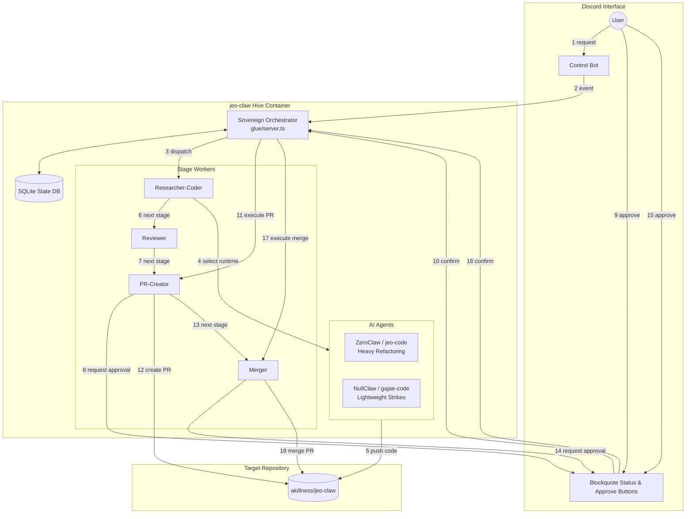

## 🤔 Curiosity: Why Does More Context Sometimes Make an Agent *Worse*?

Eight years shipping AI systems into production games taught me to distrust a very seductive idea: that if an agent just had a **longer memory**, it would perform better. Give it the whole chat log, the whole diff history, every tool call it ever made — surely more signal is more help?

It isn't. What actually predicts whether an agent finishes a task well is not *how much* history it's carrying, but whether it still knows **the state of the work right now**, and whether the lesson from its last failure survived into its next action. A 40,000-token transcript full of dead ends is worse than a 400-token note that says: *"tried X, it failed because Y, don't retry X, next candidate is Z."*

> **Curiosity:** What if the actual unit of agent competence isn't "context window" or "model size," but a small, disciplined *state object* — search conditions, evidence kept, failed attempts, unconfirmed candidates — that survives across turns and tool calls?
{: .prompt-tip }

That question sent me back into five repositories I keep coming back to, all under one author, all solving a different slice of the same problem: **[oh-my-jeo](https://github.com/akillness/oh-my-jeo)**, **[jeo-code](https://github.com/akillness/jeo-code)**, **[jeopi](https://github.com/akillness/jeopi)**, **[jeo-claw](https://github.com/akillness/jeo-claw)**, and **[jeo-skills](https://github.com/akillness/jeo-skills)**. I fetched all five with `scrapling` (plain HTTP was enough — no JS rendering needed for GitHub's static README rendering path), pulled their diagrams down locally, and read every README end to end. What follows is what I found, mapped against the state-over-history thesis.


---

## 📚 Retrieve: Five Repos, One Underlying Bet

Before the tour, here's the bet these five projects share, stated as plainly as I can:

| Belief | What it rules out |
|---|---|
| An agent's next action should come from *current task state*, not a full replay of history | Cramming the whole transcript back into every prompt |
| A failure is only useful if it changes the *next* attempt | Retrying the same dead end because nothing recorded it failed |
| "Done" must be backed by evidence a verifier actually produced | An agent narrating success it never demonstrated |
| Harness quality (state, rules, evidence trail) matters more than swapping in a bigger model | Assuming a bigger LLM alone fixes a broken workflow |
| When judgment is genuinely ambiguous, the *reasons* for a decision must survive, not just the final vote | Collapsing disagreement into a single silent majority answer |

Each repo below picks up a different piece of this.

### 1. oh-my-jeo — the harness you add *without* replacing your agent


**[oh-my-jeo](https://github.com/akillness/oh-my-jeo)** starts from an uncomfortable but realistic premise: most of the time you *cannot* swap out the underlying model. What you *can* change is the layer around it. oh-my-jeo wraps a [Hermes-style chat agent](https://github.com/nousresearch/hermes-agent) with a thin, deterministic contract layer:

```text

user says a plain request in chat
  -> oh-my-jeo routes it to the right skill / playbook / profile
  -> the agent explains the next action and the evidence boundary
  -> coding is handed off to the selected runtime only when accepted
```


The `omj` command is not "more CLI surface" for its own sake — it's setup, repair, `doctor`, and a verifier that turns a plain chat message into a **reviewable contract** before any code changes happen. Workflows like `web-research`, `idea-to-deploy`, `ultragoal`, `loop`, and `ultraprocess` ship as ready-to-use playbooks, each declaring an explicit **evidence boundary**: what the agent is allowed to claim it verified, versus what it's only asserting.


This is the direct answer to a common finding in harness research: making the *harness-authoring* model bigger barely moves the needle, but a task-solving agent that can't find the right skill, or can't hold onto an instruction across a long session, never converts good tooling into a good score. oh-my-jeo's bet is that the fix lives in the layer between the user and the model — not in the model.

```bash

# Bootstrap Hermes + oh-my-jeo in one shot (plan-only by default)
omj hermes install --apply
omj doctor
```

### 2. jeo-code — the harness engine that treats edits as evidence, not text


**[jeo-code](https://github.com/akillness/jeo-code)** (`jeo` on the CLI) is the harness I use to write this very post. Its core insight is structural: a file `read` doesn't just return text, it returns text with content anchors (`42ab|`). An `edit` against those anchors is *rejected with fresh content* if the file changed underneath it — the agent is never allowed to silently corrupt a file because its mental model of "current state" drifted from reality.

| Principle | What it means | Why it matters for state-over-history |
|:----------|:--------------|:---------------------------------------|
| **Spec-First** | `deep-interview` Socratic gate before any code | Ambiguity gets resolved once, not re-litigated every turn |
| **Reviewed Plans** | `ralplan` critic subagent's `[OKAY]` is persisted and *required* | The plan's reasoning survives as a durable artifact, not a chat message that scrolls away |
| **Gated Execution** | `jeo approve` blocks until you explicitly confirm | Human judgment enters at the one point it changes the outcome |
| **Honest Verification** | `ultragoal` runs real suites — never fabricates per-criterion passes | "Done" means evidence exists, not that the agent said so |
| **Self-Correcting Loop** | Post-edit hooks (tsc/eslint/tests) feed diagnostics back to the agent | The lesson from a failed lint/test run becomes the very next action |

```bash

jeo                                    # interactive agent in your repo
jeo "refactor auth module + run tests" # one-shot
jeo --tmux                             # isolated tmux session
jeo doctor                             # check config + model connection
```

All of this state — the frozen spec, the plan, the approval gate, the hook diagnostics — lives under `.jeo/` with atomic writes and crash-durable, cross-process run locks. If a task crashes mid-edit, the *next* session doesn't start from zero: it resumes from a failed-task marker with a partial-edit warning, which is exactly "carry the lesson from the failure into the next action" implemented as a file on disk instead of a slogan.

### 3. jeopi — the same discipline, forked into a different engine


**[jeopi](https://github.com/akillness/jeopi)** is proof the discipline isn't tied to one runtime — and it's a sharper proof than the repo it replaces here. It's a fork of [can1357/oh-my-pi](https://github.com/can1357/oh-my-pi) (itself a fork of [badlogic/pi-mono](https://github.com/badlogic/pi-mono) by Mario Zechner), so jeopi inherits the whole capable engine — **40+** providers, **32** built-in tools, **14** LSP ops, **28** DAP ops, **~55k** lines of Rust — and welds jeo-code's spec-first philosophy onto it rather than rewriting the engine from scratch. One command, `/jeo <what you want built>`, drives the whole spine:

```
interview        Socratic ambiguity gate — goal, constraints, out-of-scope,
    │            checkable acceptance criteria. Vague criteria are refused.
    ▼
frozen seed      local://jeo-seed.md — immutable; scope changes reopen the
    │            interview, never drift silently.
    ▼
plan             read-only `plan` agent; concrete files, sequencing,
    │            per-criterion verification.
    ▼
critic gate      read-only `critic` agent; schema-enforced verdict
    │            okay / iterate / reject. No okay → no execution. Ever.
    ▼
execute          bounded `task` subagents; a failed task feeds the lesson
    │            into the next attempt instead of retrying unchanged.
    ▼
verify           suite runs once as a global signal; each criterion cites
                 its command + observed result, or is reported unresolved.
```

| Stage | Standing agent | What it refuses to do |
|---|---|---|
| Plan → gate | `critic` | Soften a real, blocking gap into `iterate` just to avoid blocking — *"that softening is the signal the gap is real"* |
| Review | `architect` | Return a verdict without the list of files it actually inspected — a clean verdict is not the absence of inspection |
| Execute | `task` | Call a subgoal done without verification evidence, or leave debug leftovers behind |

Two mechanisms here map almost exactly onto themes this post already covers. First, `critic`'s refusal to soften a blocking gap into `iterate` is the same discipline as jeo-code's failed-task marker: a signal that something is wrong doesn't get smoothed over on the way to "done," it gets carried forward as state. Second, jeopi's **Hashline** edit format — the model points at content-hash anchors instead of retyping lines, and a stale anchor gets the patch rejected before it can corrupt the file — is the same content-anchor discipline jeo-code's own `read`/`edit` tools use, described above; Grok 4 Fast spends 61% fewer output tokens once the retry loop on bad diffs disappears. Two independent forks of two different agent engines converged on "verify the model's claimed state against the file's actual state before accepting an edit" — which is exactly the state-over-history thesis this whole post is built around.

`/review` spawns dedicated `reviewer` subagents that sweep branches, single commits, or uncommitted work in parallel, then rank every issue P0 through P3 with a confidence score, so nothing important hides in a wall of prose. And completion here is a hard gate too, not a suggestion: a criterion with no command and no observed result isn't marked done — it's reported `unresolved`, never implied met.

### 4. jeo-claw — turning "learn from failure" into an actual state machine


**[jeo-claw](https://github.com/akillness/jeo-claw)** is where the "state over history" thesis gets load-bearing. It runs two agentic-PR runtimes side by side — **ZeroClaw** (`jeo-code`, for heavy refactors) and **NullClaw** (`gajae-code`, for lightweight strikes) — against the same LLM configuration, so every real task becomes a live **A/B comparison** rather than a single, unverifiable anecdote.



Notice where the human sits in that diagram: **PR creation and merge are action-scoped, single-use approvals**, enforced in the `glue` orchestrator, not merely "a Discord message someone read." That's judgment kept where it belongs — at the one irreversible step — instead of sprinkled everywhere or removed entirely.

But the piece that most directly answers my opening question is the `ops/` **self-evolution doctrine**: every task is forced through one loop, *plan → verify → capture knowledge → evolve*, integrating six tools (`spec-kit`, `rtk`, `graphify`, `obsidian`, `llm-wiki`, `deepinit`) into a single state machine:

0 INTAKE → 1 CONSTITUTION → 2 SPECIFY → 3 CLARIFY? → 4 PLAN → 5 TASKS
        → 6 ANALYZE? → 7 IMPLEMENT (high-risk needs Discord approval) → 8 VERIFY (4 gates)
        → 9 CAPTURE (knowledge) → 10 EVOLVE (feedback)

Step 9, `CAPTURE`, is the literal implementation of "don't lose what a failure taught you":

```bash

bun run ops/scripts/capture-knowledge.ts \
  --title "<task title>" \
  --slug "<slug>" \
  --summary "<what, why, result>" \
  --tags "domain,security,glue" \
  --runtime both \
  --evidence "artifacts/verify-transcript.txt"
```

The rule attached to this command is worth quoting directly because it's exactly the discipline I was gesturing at earlier: **`raw/` is immutable — it is never rewritten** (so evidence can't be quietly revised after the fact), **`wiki/` is LLM-owned** (so corrections happen in the summary layer, not by editing history), and every capture is write-if-absent, so re-running it never clobbers an existing asset. The very next task then reads `ops/vault/index.md` **before** doing anything else — literally "search the accumulated state before you re-derive it from scratch."

And verification is never theater. jeo-claw's own green bar is stated in numbers, not adjectives: `tsc` 0 errors · `bun test` pass/0 fail · `check:compose` 176/176 · `config/validate.ts` 24/24 · `smoke:glue` pass. The `smoke:glue` suite is especially telling — it boots the real orchestrator locally with injected fake secrets and GitHub calls and walks the **entire lifecycle**, including negative cases:

| Check | Expected |
|---|---|
| `GET /health` | `200 {ok:true}` |
| `POST /control-event` (missing/bad secret) | `401` |
| `POST /webhook/github` (forged HMAC) | `401` |
| `POST /webhook/github` (valid HMAC, no matching workflow) | `202` no-op |
| `POST /dispatch` (missing secret, or forbidden `token` field) | `401` / `400` |
| `approve <wf> pr.merge` before CI/review completes | merge is **not** called; stays `awaiting-approval` |

That last row is a small but important detail: the verifier is deliberately tested against the case where a human tries to approve *too early*. A verifier that can't hold that line isn't verifying anything — it's rubber-stamping.

### 5. jeo-skills — the shared vocabulary of "which tool, which condition"


**[jeo-skills](https://github.com/akillness/jeo-skills)** is the substrate the other four repos draw from: **146 installable skills**, cross-platform (Claude Code, Codex, Gemini CLI, Cursor, OpenCode), each shipped as a `SKILL.md` (plus a `SKILL.toon` compact form) that spells out exactly *when* to route to it and *what conditions to hold to the end* — which is the missing piece when a task-solving agent has a good tool available but can't find its name, or forgets the constraint halfway through a long session.


```bash

# Fetch the delegation guide and hand it to your agent — it detects OS,
# installs the CLI, and wires every skill into the right per-agent paths.
curl -s https://raw.githubusercontent.com/akillness/jeo-skills/main/setup-all-skills-prompt.md

# Project-scoped install of two specific skills
npx skills add https://github.com/akillness/jeo-skills --skill deepinit --skill deep-dive

# Global install, targeted at specific agents
npx skills add -g https://github.com/akillness/jeo-skills --skill deepinit --skill deep-dive -a claude-code -a codex -y
```

This is literally the repo I used to write this post — the `scrapling` skill entry here documents the exact "route to the lightest workable mode" logic (plain HTTP → JS render → stealth) I followed a few minutes before writing this sentence:

```bash

claude mcp add semble -s user -- uvx --from "semble[mcp]" semble   # token-efficient code search
npx skills add https://github.com/akillness/jeo-skills --skill ooo    # spec-first control loop
```

The `ooo` (Ouroboros) entry crystallizes the whole ecosystem's philosophy in one line: *"Socratic interview → immutable seed/spec → execute against the contract → verify before done → keep looping until completion is actually verified."* Every one of the other four repos is a different runtime's implementation of that exact sentence.

---

## 💡 Innovation: Walking the Full Loop, End to End

Put the five repos together and you get one coherent lifecycle, not five separate products:

```mermaid

flowchart LR
    subgraph Interview["🤔 Interview"]
        A1["oh-my-jeo: chat request\narrives with no code changes yet"]
        A2["jeo-code / jeopi:\ndeep-interview / interview\nfreezes ambiguity ≤ 0.2"]

    end
    subgraph Plan["📋 Plan"]
        B1["ralplan / jeopi plan+critic:\nPlanner→Architect→Critic\nokay / iterate / reject gate"]

    end
    subgraph Execute["⚙️ Execute"]
        C1["team / jeopi execute:\nbounded executor turns\n+ parallel reviewer subagents"]

        C2["jeo-claw: A/B dispatch\nZeroClaw vs NullClaw"]
    end
    subgraph Verify["✅ Verify"]
        D1["ultragoal / jeopi verify:\nreal suite run, evidence attached\nnever fabricates a PASS"]

        D2["jeo-claw smoke:glue:\nnegative cases included"]
    end
    subgraph Evolve["♻️ Evolve"]
        E1["capture-knowledge:\nraw/ immutable, wiki/ owned by LLM"]
        E2["next task reads index.md\nBEFORE re-deriving anything"]
    end

    A1 --> A2 --> B1 --> C1 --> C2 --> D1 --> D2 --> E1 --> E2
    E2 -.new ambiguity.-> A2

    style A2 fill:#ff6b6b20,stroke:#c92a2a,stroke-width:2px
    style B1 fill:#4ecdc420,stroke:#0a9396,stroke-width:2px
    style C1 fill:#ffe66d40,stroke:#f4a261,stroke-width:2px
    style D1 fill:#4ecdc420,stroke:#0a9396,stroke-width:2px
    style E1 fill:#ff6b6b20,stroke:#c92a2a,stroke-width:2px
```



A worked example, using the actual commands each repo exposes:

```bash

# 1. Interview — freeze the ambiguity before anything is written
jeo   # inside your repo, or: pi + /clarify "add rate-limiting to the API"

# 2. Plan — critic subagent must return [OKAY] before execution is allowed
#    (jeo-code: ralplan · jeopi: plan + critic gate)

#    contested calls (e.g. "token bucket vs. sliding window") are kept, not voted away

# 3. Execute — bounded executor turns, or an A/B pair in jeo-claw
jeo "implement the rate limiter per the approved plan"
#    jeo-claw: dispatches the same task to ZeroClaw AND NullClaw for comparison

# 4. Verify — evidence-backed, not narrated
#    jeo-code/jeopi: ultragoal / verify runs the real suite

#    jeo-claw: bun test && bun run check:compose && bun run smoke:glue

# 5. Evolve — the lesson survives the session
bun run ops/scripts/capture-knowledge.ts \
  --title "Rate limiter: token bucket chosen over sliding window" \
  --slug "rate-limiter-token-bucket" \
  --summary "Sliding window rejected: memory cost at our request volume. Evidence: bench-results.txt" \
  --tags "api,performance" --runtime both \
  --evidence "artifacts/bench-results.txt"
# next session: search ops/vault/index.md BEFORE re-investigating the same tradeoff
```

### Why this matters for reasoning data, not just agent ops

The same discipline that makes an *agent* reliable is the discipline that makes **reasoning training data** trustworthy, and the parallel is worth spelling out because it's easy to miss:

- A problem-answer pair with no record of *how* the answer was reached is exactly like a task marked "done" with no evidence attached — you can't tell whether the signal is real or fabricated after the fact.
- `ultragoal`/jeopi's `verify` stage refusing to synthesize a passing result when the suite didn't actually pass is the operational form of "a verifier that's weak to superficial rewording or trigger words teaches the model to game the verifier, not to reason."

- jeopi's `critic` refusing to soften a real, blocking gap into `iterate` just to avoid blocking is the same principle as: a verifier that smooths over an inconvenient failure to keep a pipeline green stops being a verifier and starts being a rubber stamp.

- jeo-claw's `raw/` (immutable) vs. `wiki/` (correctable) split is a data-provenance pattern: you always know which parts of your knowledge base are the untouched original signal and which are a later synthesis — the same separation good reasoning-trace datasets need between the teacher's raw trajectory and any downstream re-summarization.

None of these five repos are training-data pipelines. But they were all built by someone solving the same underlying problem — *how do you keep a learning process honest when it's tempting to shortcut the evidence* — from the harness-engineering side. That's a stronger validation of the idea than a paper alone would be, because it shows the same principle surviving contact with five different, unrelated codebases.

### Key Takeaways

| Insight | Where it lives | Concrete mechanism |
|---|---|---|
| State beats history | jeo-code | Content-anchored reads/edits; `.jeo/` atomic state; resume from failed-task markers |
| Failures must change the next action | jeo-claw `ops/` | `CAPTURE` step writes evidence + summary; next task reads `index.md` first |
| Tool-call count ≠ success; correction quality does | jeo-code hooks | Post-edit tsc/eslint/test diagnostics fed back in-loop, blocking `done` until green |
| Harness quality matters more than model size alone | oh-my-jeo | Deterministic contract layer wrapped around an unmodified chat agent |
| Skill discoverability + held constraints matter | jeo-skills | 146 `SKILL.md` files with explicit routing conditions and route-outs |
| A softened verdict is a signal, not a courtesy | jeopi `critic` gate | Schema-enforced `okay`/`iterate`/`reject`; softening a real gap into `iterate` is itself evidence the gap is real |

| Verifiers must resist premature or fabricated "pass" | jeo-claw `smoke:glue` | Explicit test case: approving a merge before CI/review completes must be a no-op |
| Evidence provenance must be separable from synthesis | jeo-claw `ops/vault` | `raw/` immutable, `wiki/` LLM-owned and correctable |

### New Questions This Raises

- If `raw/` vs `wiki/` separation is the right pattern for an agent's own operational memory, should reasoning-training corpora adopt the same split by default — raw teacher trajectory vs. corrected summary — rather than shipping only the final answer?
- jeopi's `architect` verdict is invalid without the list of files it actually inspected; could a similar "show your inspected[] evidence" requirement discipline reward models that hand out a confident PASS/FAIL without citing what they checked?

- jeo-claw runs two runtimes in permanent A/B. What would it take to extend that same live-comparison discipline to reasoning-data generation itself — treating "which teacher model produced this trace" as a first-class, always-on comparison instead of a one-time choice?

---

## References

**Repositories covered:**
- [akillness/oh-my-jeo](https://github.com/akillness/oh-my-jeo) — spec-first workflow pack for chat agents (Hermes runtime)
- [akillness/jeo-code](https://github.com/akillness/jeo-code) — Bun-based AI coding-agent CLI, the harness engine
- [akillness/jeopi](https://github.com/akillness/jeopi) — spec-first fork of oh-my-pi with a critic-gated plan/execute/verify spine

- [akillness/jeo-claw](https://github.com/akillness/jeo-claw) — dual-runtime agentic PR orchestration with a self-evolving `ops/` doctrine
- [akillness/jeo-skills](https://github.com/akillness/jeo-skills) — 146-skill library shared across all of the above

**Related reading on this blog:**
- [jeo-code: The Harness Engine That Makes You a 10× AI Builder](/posts/jeo-code-ai-builder-harness/)
- [The Vault That Rewrites Itself: An AI-First Second Brain for Game Teams](/posts/obsidian-second-brain-self-rewriting-vault/)
- [Claude Code vs. Cursor vs. Codex vs. Antigravity — Why the Harness Won](/posts/agentic-coding-convergence/)

**Upstream projects referenced by the ecosystem:**
- [Hermes Agent](https://github.com/nousresearch/hermes-agent) (Nous Research)
- [Pi](https://github.com/badlogic/pi-mono) (Mario Zechner)
- [can1357/oh-my-pi](https://github.com/can1357/oh-my-pi) — jeopi's direct upstream fork base

- [Ouroboros](https://github.com/Q00/ouroboros) — spec-first control loop (`ooo`)
- [semble](https://github.com/MinishLab/semble) — token-efficient code search
