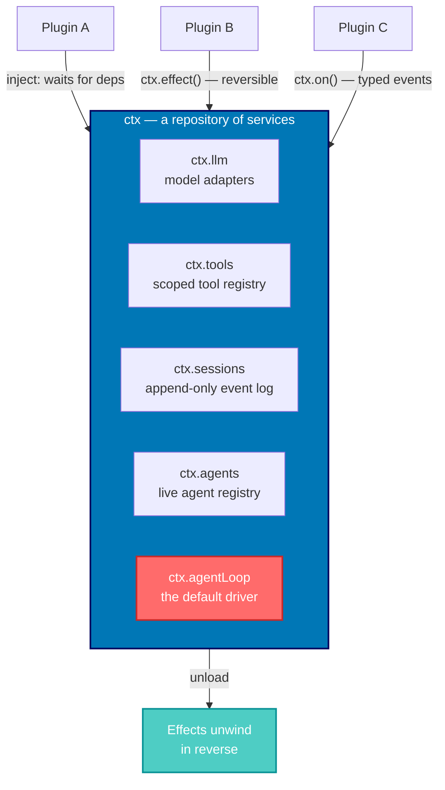
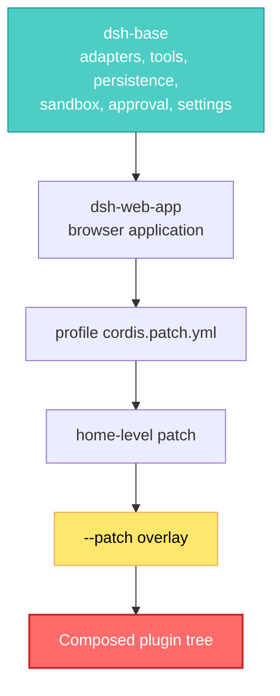

## 🤔 Curiosity: Why Does Every Agent Framework Rot the Same Way?

I've now built or inherited enough agent scaffolding to recognize the decay pattern, and it's always architectural rather than technical.

You start with a clean loop: build a prompt, call a model, run the tools it asks for, repeat. Then production happens. You need a different model for the cheap path. You need one team's tools hidden from another team's agent. You need approval gates on anything that writes to disk. You need the loop to survive a reload without losing the transcript. And every one of those requirements lands as an `if` statement inside the same function, because the loop is the one thing nobody made replaceable.

Six months later, the loop is a 2,000-line load-bearing wall. Nobody touches it without a war room.

So when DeepSeek pushed [**deepseek-harness**](https://github.com/deepseek-ai/deepseek-harness) with a one-line description — *"DeepSeek Harness: Everything is a Plugin."* — the claim was specific enough to be falsifiable, and specific enough to interest me:

**If the agent loop itself is a plugin, does the architecture actually stay open, or does the privileged core just move somewhere less visible?**

That question isn't academic for a game studio. A harness that survives contact with production is one where I can swap the sandbox backend for a build machine, hide the deploy tools from a content-generation agent, and delegate a level-balancing pass to a child agent — all without forking the thing that drives the model.

> **Curiosity:** Not "does it work?" but "what happens on the day I need to replace the part the authors didn't expect me to replace?"
{: .prompt-tip}

---

## 📚 Retrieve: What "Everything Is a Plugin" Actually Means Here

`dsh` is MIT-licensed TypeScript, it went public on **2026-08-13**, and it is explicitly labeled **developer preview** — the README's own words are *"THERE WILL BE COMPATIBILITY-BREAKING CHANGES."* Read the rest of this post with that stamped on it.

Getting it running is one command:

```sh
npx @deepseek-ai/dsh web
```

That serves a Web UI at `http://127.0.0.1:3080`. You add a DeepSeek API key under **Settings → Models**, pick a workspace directory, and start a session.

{: .light .w-75 .shadow .rounded-10 }

The interesting part isn't the first-party provider card, it's the one next to it. A custom OpenAI-compatible endpoint is a first-class citizen, not a workaround — provider ID, base URL, API protocol, key:

{: .light .w-75 .shadow .rounded-10 }

For a studio, that form is the difference between "we can point this at our own inference cluster" and "we can't."

### The claim, restated precisely

From the architecture doc:

> Every part of the product is a plugin, including the model adapter, the tool registry, the session log, and the agent loop itself, so every part is replaceable from configuration. There is no privileged core to patch.

The mechanism underneath is [**Cordis**](https://github.com/cordiverse/cordis), a plugin meta-framework vendored into the repo. It has an accompanying preprint — *[A Programming Paradigm for Spatiotemporal Composability](https://github.com/cordiverse/paper)*, draft dated 2026-08-13 — which is worth reading because it names the two properties the harness is built to preserve:

| Dimension | The property | Runtime mechanism |
|:--|:--|:--|
| **Temporal composability** | Removing a component completely reverts its side effects | *Revertible effects* — every context transformation carries a tracked inverse |
| **Spatial composability** | Components declare and reactively manage their dependencies | *Reactive coeffects* — context changes notify components against a spec |

That's the whole trick, and it's why the plugin claim holds up better than usual. A registration isn't a mutation you hope somebody remembers to undo — it's an **effect with an inverse the runtime owns**. Tool schemas, prompt sections, adapters, listeners all go through `ctx.effect()` or `ctx.on()`, so unloading a plugin unwinds them predictably. That's what makes hot module replacement of an agent's capabilities a normal operation instead of a restart.

### Cordis in the five ideas you actually need



Note where `ctx.agentLoop` sits in that diagram: **inside the same registry as everything else.** `core/agent` owns the `Agent` interface; `core/agent-loop` is merely *the default driver implementing that interface*. Replacing the driver is a config row, not a fork.

Communication is typed events with an explicitly declared dispatch mode, which is part of each event's public contract:

| Mode | Awaited? | Return value? | Use it for |
|:--|:-:|:-:|:--|
| `emit` | No | No | Fire-and-forget observation |
| `waterfall` | No | Yes | Around-middleware: wrap, transform, or short-circuit |
| `parallel` | Yes | No | Fan out to every listener at once |
| `serial` | Yes | Yes | Ordered decisions |

The `waterfall` mode is the one that does the heavy lifting. A listener receives `(...args, next)`: call `next()` to delegate down the chain, or **return without calling `next()` to short-circuit and own the decision outright**. That single convention is how permission policy, sandboxing, retries, and metrics all attach to tool execution without any of them knowing about each other.

### Profiles, bundles, and a config tree you can actually inspect

A running `dsh` is a plugin tree composed at boot from ordered layers. A **bundle** ships config rows plus the code they mount; a **profile** lists which bundles stack in what order, and holds the user's own patch file.



Later layers target a row by id and replace its whole config, or insert new rows. And critically, you can see the result:

```sh
dsh --profile web --dump-config
```

Every row that prints can be replaced by a patch of your own. That command is the honesty check on the entire "no privileged core" claim — if a component didn't show up as a replaceable row, the claim would be marketing. It shows up.

### Capability seams: the pattern worth stealing even if you never run `dsh`

This is the part I'd take to any codebase. A **seam** is a swappable capability with exactly three roles:

| Role | What it is | Example |
|:--|:--|:--|
| **Service Definition** | The Cordis `Service` owning a `ctx.<key>` and its vocabulary types | `dsh-shell` |
| **Service Provider** | An implementation | `dsh-bash-local`, `dsh-bash-sandbox` |
| **Consumer** | Something that injects and uses it — usually a model-facing tool | `dsh-tool-bash` |

The glossary is blunt about the discipline: *"The seam is the complete capability, never one role."* You don't get credit for adding an interface. If you add a capability, you design all three roles.

The payoff is leverage. Filesystem and subprocess providers share one execution world, so **pointing them at a remote sandbox moves Bash, PTY, and LSP along with them — no provider forks.** One swap, and the whole product's execution model relocates.

<details markdown="1">
<summary style="font-size:20px; font-weight:bold; cursor:pointer;">🔍 Deep Dive: The turn/step lifecycle and where you can intervene</summary>

The vocabulary matters because the extension points hang off it. A **step** is one model request plus the tools it calls. A **turn** is zero or more steps: it opens before its first input is claimed and closes once nothing is owed.

```text
turn/start
  claim next-step input plus one queued message
  assemble prompt sections + tool schemas
  -> agent/pre-step                   reject | enter(messages)
     step/start
     append entered messages as user/message
     derive model history from the log
     agent/request -> llm/stream -> assistant/chunk* -> assistant/message
     tool/call* -> tools/pre-execute -> tools/execute -> tools/post-execute -> tool/result*
     step/end
  -> agent/turn-stopping
turn/end
```

Three event domains, and picking the right one is the first real decision in most changes:

- **Session events** are durable facts appended to the log (`turn/*`, `step/*`, `user/message`, `assistant/*`, `tool/*`). Use one when the fact must survive a reload.
- **Agent events** (`agent/*`) carry a live agent — inbox, step, status, request, validation, continuation. Use one to observe or intercept work in flight.
- **Capability events** (`fs/*`, `tools/*`, `telemetry/*`) attach policy and adapters to a seam without importing the loop.

`agent/pre-step`, `agent/request`, `llm/stream`, and the three `tools/*` events are waterfalls — listeners must call `next()` to delegate. `agent/turn-stopping` is serial with no `next()`.

There's one invariant I find genuinely disciplined: **model-visible means logged.** Anything that reaches a model request must be reconstructable from the session log, and a *runtime invariant asserts it*. So adding a new model-visible input isn't a quick hack — it requires a new session event type. That's an architectural rule enforced by code rather than by code review, which is the only kind that survives a deadline.

The tool pipeline is where this composes into something powerful. Policy, sandboxing, filesystem guards, result rewriting, and UI rendering all attach around the tool body without touching the loop:

```mermaid
flowchart TD
    call["tool/call logged<br/>before execution"]
    pre["tools/pre-execute waterfall<br/>hooks, permission, sandbox"]
    ask["ctx.approval<br/>one-shot human prompt"]
    guards["monotonic guards<br/>deny or abstain"]
    around["tools/execute waterfall<br/>timeout, retry, metrics"]
    body["tool execute() body"]
    post["tools/post-execute waterfall<br/>accept, block, replace"]
    result["tool/result<br/>frozen authoritative outcome"]

    call --> pre
    pre -->|ask| ask
    ask -->|allowed-once| guards
    pre -->|allow| guards
    guards --> around --> body --> around --> post --> result

    style pre fill:#4ecdc4,stroke:#0a9396,color:#fff
    style ask fill:#ffe66d,stroke:#f4a261,color:#000
    style result fill:#ff6b6b,stroke:#c92a2a,color:#fff
```

Note that `tool/call` is logged *before* execution, and `tool/result` is a frozen, lossless-JSON outcome observed after `finalizeContent` runs. Denial isn't an exception path that skips the pipeline — a denied call still flows through `tools/post-execute`, so a single audit listener sees allowed and refused calls identically.

</details>

### The scale of the thing, measured

I pulled the repository tree via the GitHub API rather than trusting the marketing, and the shape is consistent with the architecture claims:

| Measure | Count |
|:--|--:|
| Workspace packages (`packages/*/*/package.json`) | 219 |
| Capability groups under `packages/` | 50 |
| TypeScript source files (excl. `.d.ts`) | 2,291 |
| TypeScript source volume | ~21.5 MB |
| Tool packages (`packages/*/tool-*`) | 24 |
| Model-visible tool names | 52 |
| Documented subsystem pages | 47 |
| Files under `.agents/` (agent notes) | 2,105 |

That last row is the one that made me stop. There are more files of **agent notes** — architecture decisions, postmortems, process records written for and by agents working on this codebase — than there are packages by a factor of ten. The repo ships `AGENTS.md`, `CLAUDE.md`, per-subsystem notes, and four numbered postmortems (my favorite title: *"js-expression disabled filesystem tools"*).

> **Retrieve:** The tool catalog is *generated by booting each tool plugin on a real context* and reading `ctx.tools.schemas()` — because a tool schema isn't statically knowable when you have runtime-spread enums and config-driven names. A completeness guard globs `packages/*/tool-*` and fails the build if a package is missing from the manifest. You cannot silently add an undocumented tool.
{: .prompt-info}

---

## 💡 Innovation: The Three Things I Didn't Expect

Reading a 219-package harness, most of it is competent-and-expected. Three things weren't.

### 1. The agent can write and mount its own plugins at runtime

`dsh-tool-cordis` exposes seven model-facing tools, and they are not what I expected an agent to be handed:

| Tool | What the model can do |
|:--|:--|
| `cordis_inspect_list` | List every Inspect Provider, with methods and I/O schemas |
| `cordis_inspect_query` | Run a declared read-only query — real service methods, event modes, live UI slot trees |
| `cordis_define` | **Author a new Cordis plugin** as a JS function body (host and/or browser client half) |
| `cordis_run` / `cordis_stop` | Mount it / unmount it |
| `cordis_undefine` | Retire a definition |
| `cordis_inspect_self` | Introspect its own extension state |

Read that again: the agent introspects the live plugin graph, writes a plugin against what it found, and mounts it into the running system. The framework's revertible-effects property is what makes this *not* insane — a plugin the agent mounts can be unwound completely.

The guardrails are visible in the schema text too, and they read like they were written after something went wrong: definitions are **immutable** (modifying a plugin appends a new package, never overwrites older versions), `cordis_define` **only validates and records source** — it does not request approval, run `apply`, or change the current package. And the description explicitly instructs: *"Query Inspect before depending on a Service, Event, Builtin, Slot, or token."* Don't guess names. Look them up.

This is the "self-evolving agent harness" from the Cordis paper's abstract, implemented rather than aspired to.

### 2. Rival agents are subagent providers

The subagent seam is the one place where **multiple providers coexist by name** in one context. The shipped list:

`dsh-subagent-spawn-in-process`, `-fork`, `-acp`, **`-codex`**, **`-claude-code`**, `-dsh-sdk`

DeepSeek shipped first-class providers for delegating work to Codex and Claude Code. Behind one interface, a subagent can be a fresh in-process child, a forked process, or a delegated turn inside a competitor's product. The glossary's framing: providers *"vary just as widely behind one interface, from a fresh child agent to a delegated turn in another product."*

I've argued for exactly this in studio tooling and lost, because "just use one vendor" always sounds cheaper right up until the vendor's rate limit lands mid-milestone.

### 3. `ralph` is a shipped, bounded primitive

The loop-until-done pattern — fresh agent each round, immutable objective, workspace as memory — has been circulating as a community technique for a while. Here it's a tool with a defined contract and a vocabulary in the glossary:

- **Ralph loop** — one foreground fresh-agent workflow run toward an immutable objective
- **Ralph round** — one fresh child session; *"receives no parent or prior-child conversation seed"*
- **Ralph handoff** — the normalized, bounded structured report crossing rounds: status, summary, evidence, next steps, blocker

The tool takes exactly two parameters, `objective` and an optional `maxRounds` bounded by a deployment ceiling. And the description sets a usage boundary I appreciate: *"Use only when the direct human explicitly asks for Ralph or fresh-agent iteration. Ordinary long-running same-session work belongs to goal tools."*

That's the difference between a pattern and a primitive: the primitive tells you when **not** to reach for it.

### Where a game studio would actually use this

Mapping it to the pipelines I've shipped:

| Seam | The swap | What it buys a studio |
|:--|:--|:--|
| `ctx.sandbox` | Landlock / Seatbelt / Windows ACL, or a container | An asset-processing agent confined to `workspace-write`, so a bad automation run can't reach outside the project |
| `ctx.shell` + `ctx.subprocess` | Point both at a remote build machine | Bash, PTY, and LSP relocate together — the agent drives the farm, not your laptop |
| `ctx.tools` + scopes | Per-agent restriction and shadowing | The content-gen agent literally cannot see the deploy tools; a filtered-away tool is absent from the prompt *and* refuses execution |
| `ctx.subagents` | Named providers | Balance-simulation child agents fanned out per level, each reporting through one bounded channel |
| `ctx.sessions` | Append-only log + JSONL/SQLite persistence | A replayable transcript of every model request and tool call, which is what a postmortem needs |

The sandbox vocabulary deserves a note because it's honest in a way this category usually isn't. `SandboxMode` is `read-only` / `workspace-write` / `danger-full-access`, and it **governs filesystem effects only** — the docs state plainly that *"network and process visibility are outside this vocabulary."* Enforcement is a *reported fact*, `full` or `partial`, where partial covers older Landlock ABIs and Windows ACL hard-link boundaries. Consumers requiring an absolute boundary must reject `partial` rather than assume.

A security surface that tells you the precise shape of what it does *not* cover is more trustworthy than one claiming to sandbox everything.

### The honest cost column

I have not run this in a shipping pipeline — it's five days old and self-labeled developer preview. Here's what I'd weigh before anyone points it at a real project:

| Cost | Detail |
|:--|:--|
| **Breaking changes, promised** | The README says so in capitals. Pinning versions is mandatory, not optional. |
| **Conceptual load** | Profiles, bundles, patch layers, seams, scopes, waterfalls, turns/steps/rounds. The vocabulary is precise, and precise means learnable-but-not-skippable. |
| **The docs assume Cordis** | `architecture.md` opens by telling you to read the primer first. It means it. |
| **Python SDK example runs `danger-full-access`** | The minimal composition disables compaction, uses a bare local filesystem, and the docs say run it *"only inside a disposable checkout or container."* Read that warning as load-bearing. |
| **Preview-grade platform support** | The persistent PTY backend needs a POSIX terminal substrate; that minimal composition doesn't support Windows agents. |

If you want to poke at it without the Web UI, the SDK path is short:

```sh
python -m pip install deepseek-harness-sdk
export DEEPSEEK_API_KEY=sk-your-key-here
```

```python
from pathlib import Path
from deepseek_harness import DeepSeekHarness

# The composition file is checked into the repo: examples/jsonrpc-agent/minimal.cordis.yml
# It ships bash + str_replace_editor ONLY, with compaction disabled.
with DeepSeekHarness(
    provider="deepseek-official",
    model="deepseek-v4-flash",
    max_tokens=49_152,
    cwd=str(Path("/absolute/path/to/disposable/workspace").resolve()),
    session_root=str(Path("/absolute/path/to/sessions").resolve()),
    cordis=str(Path("examples/jsonrpc-agent/minimal.cordis.yml").resolve()),
) as harness:
    result = harness.run(
        "Inspect the repository and fix the failing tests.",
        session_id="example-001",   # reuse this id to continue the same durable session
    )

print(result.final_response)
```

Two details worth internalizing from that snippet. The bundled runtime needs **no system Node.js**. And reusing a session id preserves the *session-owned Bash process* — working directory, exported variables, shell functions and all. Fresh id for independent work; same id only when you genuinely mean "continue that conversation."

---

## 🎯 Key Takeaways

| Insight | Implication | What I'd do |
|:--|:--|:--|
| **Revertible effects make plugins real** | "Everything is a plugin" fails without tracked inverses; teardown leaks are what force restarts | Make every registration in your own tooling return a disposer — no exceptions |
| **A seam is three roles, not an interface** | Half-built seams are why "pluggable" systems still need forks | Never merge a capability that lacks a definition, a second provider, and a consumer |
| **Model-visible means logged, enforced at runtime** | Unlogged context is the root cause of unreproducible agent behavior | Assert the invariant in code; code review will not catch it forever |
| **Dispatch mode is a public contract** | Ambiguity about awaiting and return values is where interception bugs live | Document `emit`/`waterfall`/`parallel`/`serial` per event and check it in CI |
| **Bound the loop primitives** | Unbounded fresh-agent loops burn budget silently | Ship round caps and a deployment ceiling with any loop tool you expose |
| **Partial enforcement, stated** | A sandbox claiming total coverage is lying somewhere | Surface `full` vs `partial` to callers and let them refuse |

---

## 🤔 New Questions This Raises

1. **What's the real blast radius of `cordis_define`?** An agent authoring and mounting host-half plugins is the most powerful and most alarming thing in the repo. Immutable versions and no-auto-apply are good fences — but what does a production approval policy around runtime self-extension actually look like, and who reviews the plugin the agent wrote at 3 AM?
2. **Does the plugin claim hold under a hostile swap?** Replacing `ctx.agentLoop` with a genuinely different driver — say, one that batches steps for offline level generation — is the test that separates architecture from documentation. Nothing I read says it can't. Nothing I ran says it can.
3. **Is 2,105 agent notes a moat or a warning?** Agent-authored architecture notes at ten times the package count could mean institutional memory that compounds. It could also mean the system is too complex for anyone to hold in their head. Both stories fit the data.
4. **Where does the Ralph handoff's bounded report lose critical state?** "Shared workspace is long-term memory, one bounded report crosses rounds" is elegant. But a level-balancing pass accumulates intuition that fits in neither a workspace file nor a status summary.

**Next experiment:** compose a profile that keeps `dsh-base` but restricts a scoped agent to `read`, `glob`, `grep`, and one custom Unity build tool — then check `--dump-config` and confirm the deploy tools are absent from the prompt *and* refuse execution. If per-agent tool restriction survives that test, the scope model is production-grade, and this becomes the harness I'd point at a build farm.

---

## References

**Project & Source:**
- [deepseek-ai/deepseek-harness](https://github.com/deepseek-ai/deepseek-harness) — MIT, TypeScript, developer preview
- [Product homepage](https://deepseek.com/harness)
- [GitHub Discussions](https://github.com/deepseek-ai/deepseek-harness/discussions) — feedback and bug reports (issues are disabled)
- [`dsh-plugin` topic](https://github.com/topics/dsh-plugin) — plugin discoverability convention

**Framework & Theory:**
- [Cordis](https://github.com/cordiverse/cordis) — the plugin meta-framework underneath `dsh`
- [*A Programming Paradigm for Spatiotemporal Composability*](https://github.com/cordiverse/paper) — preprint, draft of 2026-08-13, formalizing revertible effects and reactive coeffects
- [Cordis primer](https://github.com/deepseek-ai/deepseek-harness/blob/master/docs/cordis-primer.md) and [hands-on tutorial](https://github.com/deepseek-ai/deepseek-harness/blob/master/docs/cordis-tutorial/index.md)

**Architecture Documentation:**
- [architecture.md](https://github.com/deepseek-ai/deepseek-harness/blob/master/docs/architecture.md) — profiles/bundles, core services, turn flow, seams
- [capability-seams.md](https://github.com/deepseek-ai/deepseek-harness/blob/master/docs/capability-seams.md) — the capability graph
- [agent-lifecycle.md](https://github.com/deepseek-ai/deepseek-harness/blob/master/docs/agent-lifecycle.md) — turn/step sequence diagram
- [tool-execution-pipeline.md](https://github.com/deepseek-ai/deepseek-harness/blob/master/docs/tool-execution-pipeline.md) — where policy attaches
- [glossary.md](https://github.com/deepseek-ai/deepseek-harness/blob/master/docs/glossary.md) — canonical vocabulary, including Ralph loop/round/handoff
- [subsystems/](https://github.com/deepseek-ai/deepseek-harness/blob/master/docs/subsystems/README.md) — 47 subsystem reference pages
- [tool-catalog.md](https://github.com/deepseek-ai/deepseek-harness/blob/master/docs/tool-catalog.md) — every model-facing tool schema, generated by booting each plugin

**Guides:**
- [Web UI guide](https://github.com/deepseek-ai/deepseek-harness/blob/master/docs/user/guide/index.md) and [model providers](https://github.com/deepseek-ai/deepseek-harness/blob/master/docs/user/guide/providers.md)
- [Python SDK quickstart](https://github.com/deepseek-ai/deepseek-harness/blob/master/docs/user/guide/python-sdk.md)
- [Plugin development](https://github.com/deepseek-ai/deepseek-harness/blob/master/docs/user/develop/basic/index.md) and [packaging/installing a plugin](https://github.com/deepseek-ai/deepseek-harness/blob/master/docs/user/develop/basic/publish.md)
- [Adding a tool (cookbook)](https://github.com/deepseek-ai/deepseek-harness/blob/master/docs/cookbook/adding-a-tool.md)

**Subsystems Referenced Directly:**
- [sandbox.md](https://github.com/deepseek-ai/deepseek-harness/blob/master/docs/subsystems/sandbox.md) — modes, enforcement reporting, platform backends
- [subagent.md](https://github.com/deepseek-ai/deepseek-harness/blob/master/docs/subsystems/subagent.md) — the named-provider registry, including Codex and Claude Code providers
- [skills.md](https://github.com/deepseek-ai/deepseek-harness/blob/master/docs/subsystems/skills.md) — layered skill discovery
- [postmortems](https://github.com/deepseek-ai/deepseek-harness/blob/master/docs/postmortem/README.md) — four written-up failures worth reading before you trust any harness

**Related Reading on This Blog:**
- [Atomic Agent + Unity CLI](/posts/unity-cli-atomic-agent) — the local-first automation angle on the same problem
- [Harness Engineering](/posts/harness-engineering) — why the scaffolding around the model is the actual product
