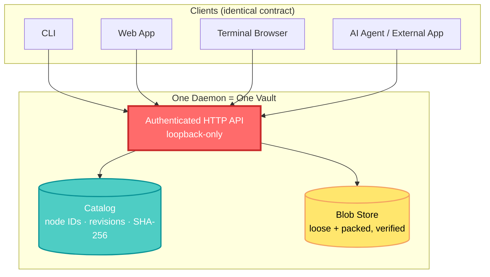

## 🤔 Curiosity: What Happens When an Agent Writes to Your Files?

I keep running the same experiment across every AI-agent project I ship: give an agent write access to a folder, let it run for a few hours, then ask it — *"which version of that report is current, and can you prove it?"*

It almost never can. Paths get renamed mid-task. Two agents in the same worktree stomp on the same file. A "backup" is really just another copy nobody verified. In eight years of shipping games with AI systems attached to them (NC SOFT, COM2US), the failure mode is always the same one: **we built pipelines that trust the filesystem, and the filesystem was never designed to be trusted by something other than a human with `Cmd+Z`.**

So when I found [**Docbank**](https://github.com/kenn-io/docbank) — a self-sovereign document system explicitly built for "the records you and your agents need to keep, find, change, and prove" — the question became specific:

**Can a document system be designed from the ground up so an AI agent's read-modify-write loop is provably safe, without asking the agent to be careful?**

That's not a rhetorical question for a game studio. Build artifacts, save files, design docs, localization bundles, and agent-generated content all need the same thing: an identity that survives a rename, and a version history that survives a bad automation run.

---

## 📚 Retrieve: How Docbank Separates Identity From Location

Docbank (Go, Apache-2.0, [go.kenn.io/docbank](https://github.com/kenn-io/docbank)) starts from a simple observation in its README:

> A path is a useful place to find a file, but a poor long-term identity.

Everything else in the design follows from taking that sentence seriously. A **stable node ID** identifies a document forever — through moves, renames, trash, and restore. Every content edit is a new **immutable version**, named by a verifiable SHA-256 digest. The catalog (the daemon + its database) is the sole authority; nothing — not the CLI, not an agent, not the web app — is allowed to touch the blob store or `docbank.db` directly.



There is no privileged shortcut. A shell agent, the TUI, and the web browser all resolve the same stable nodes through the same authenticated daemon — which is the part I found most relevant to production AI work: **the safety model isn't a convention agents are asked to follow, it's the only door in.**

### The concurrency primitive that actually matters: `If-Match`

Every mutation that changes an existing node — move, trash, restore, content replace, revert — requires the revision the caller last observed, sent as an HTTP `If-Match` header. If another actor (human or agent) changed the node first, Docbank doesn't silently overwrite; it returns `412 stale_revision`.

```bash
# A prior GET returned id=42 and revision=7.
curl --fail-with-body -X PATCH \
  -H "X-Api-Key: $DOCBANK_API_KEY" \
  -H 'If-Match: "7"' \
  -H 'Content-Type: application/json' \
  --data '{"new_parent_id": 18, "new_name": "filed.pdf"}' \
  "$DOCBANK_URL/api/v1/nodes/42"
```

This is the same optimistic-concurrency pattern you'd want in any multi-agent pipeline, but the [integration guide](https://github.com/kenn-io/docbank/blob/main/docs/agents/integration.md) turns it into an explicit protocol an agent can follow mechanically:

1. Re-read the node by ID.
2. Re-evaluate the intended change against its *new* state.
3. Retry only if the intent still applies.
4. Bound retries — repeated conflicts are a signal to escalate, not to loop harder.

### Byte identity is proven, not assumed

The part that stood out most versus a typical S3/blob-store integration: uploads declare a SHA-256 hash and size *before* the write, and downloads are streamed with an [RFC 9530](https://www.rfc-editor.org/rfc/rfc9530.html) `Content-Digest` trailer computed from the bytes actually sent — not the bytes on disk. A client is expected to hash what it staged, compare it against the trailer *and* the catalog's `blob_hash`, and only then publish the file where a human or downstream process will see it.

```bash
FILE=receipt.pdf
HASH=$(shasum -a 256 "$FILE" | awk '{print $1}')
SIZE=$(wc -c < "$FILE" | tr -d ' ')

curl --fail-with-body -X POST \
  -H "X-Api-Key: $DOCBANK_API_KEY" \
  -H "X-Docbank-Blob-Hash: $HASH" \
  -H "X-Docbank-Blob-Size: $SIZE" \
  -F 'file=@receipt.pdf;filename=receipt.pdf;type=application/pdf' \
  "$DOCBANK_URL/api/v1/uploads?parent_id=18&name=receipt.pdf"
```

"A readable prefix is not verified content" is the exact phrase from the docs, and it's the right instinct — a truncated stream that never emits its terminal event should never be treated as a successful write, no matter what HTTP status code showed up first.

### What the surface actually looks like

| Need | Docbank capability | Why it matters for agent pipelines |
|:--|:--|:--|
| **Find & retrieve** | Virtual tree, FTS5 name search, verified extracted-text search, bounded listings | Agents get pagination and `truncated` flags instead of scraping unbounded output |
| **Change safely** | Immutable versions, `If-Match` revisions, explicit revert (not silent overwrite) | A stale automation gets `412`, not a corrupted file |
| **Recover** | Recoverable trash, explicit GC/repack, whole-vault re-verification | Destructive steps are separated from each other on purpose |
| **Prove content** | SHA-256 everywhere, `Content-Digest` trailers, `/verify` endpoints | Byte identity is checked, not assumed |
| **Retain evidence** | Optional permanent audited scopes, replayable evidence chains | For records that must survive even a compromised catalog |
| **Automate** | OpenAPI contract, structured RFC 7807 problem codes, NDJSON progress | Agents branch on `code`, never on human-readable `detail` |

The web application ([visual tour](https://github.com/kenn-io/docbank/blob/main/docs/tour.md)) surfaces the same primitives to a human: current path, stable ID, revision, SHA-256 identity, tags, provenance, and audit status for the selected node, all served over scoped, daemon-lifetime credentials rather than the daemon's master API key.

{: .light .w-75 .shadow .rounded-10 }
_Tags carry stable UUIDs independent of folder placement — the same catalog an agent mutates through the HTTP API._

Permanent audited history is the sharpest edge of the design: once a scope is enrolled, its protected versions, topology, and provenance are retained forever, and independent verification re-hashes every protected blob and replays the evidence chain rather than trusting a status flag.

{: .light .w-75 .shadow .rounded-10 }
_A successful audit response still requires empty `problems` and `verified_blobs == protected_blobs` before it counts as proof._

Everything a human does in the web app has a terminal-native sibling: the daemon-backed TUI exposes the same analytical tree, search, trash/restore, job status, and — notably — storage and backup views that load independently, so one unreachable backup repository never hides the live vault's status.

{: .light .w-75 .shadow .rounded-10 }
_Storage and backup panels degrade independently — a stale backup repo doesn't take down the rest of the operational view._

<details markdown="1">
<summary style="font-size:20px; font-weight:bold; cursor:pointer;">🔍 Deep Dive: The "safe filing loop" pattern from the Agent Integration Guide</summary>

Docbank's own docs distill agent-safe filing into seven steps, and it's worth reading as a general pattern for *any* agent that mutates shared state, not just document filing:

```python
"""
1. Resolve /inbox and page through its children.
2. Read metadata or content for candidate files by ID.
3. Decide a destination; create missing directories deliberately.
4. Re-read the candidate if the decision took long enough for
   concurrent work to be plausible.
5. Move by ID with the revision the decision was based on.
6. On 412, re-read and reconsider rather than replaying.
7. Record the returned ID, path, and revision as the outcome.
"""
```

Step 4 is the one most agent frameworks skip: an LLM call between "read" and "write" can take seconds, and in that window another actor may have moved the ground truth. Re-reading before a slow write isn't paranoia, it's matching your staleness window to your actual latency.

</details>

---

## 💡 Innovation: What This Pattern Is Worth Stealing for Game Pipelines

I'm not going to pretend I've run Docbank in a shipping studio pipeline yet — this is a fresh look at a young (alpha-labeled) project, and the maintainers say so explicitly: *"keep independent copies of irreplaceable material and verify backups before relying on them."* That caveat is doing real work; take it seriously before you point it at anything you can't afford to lose.

What I *do* think is worth adopting immediately, independent of whether you run Docbank itself, is the shape of the contract:

| Insight | Implication for a game/AI pipeline | Next step |
|:--|:--|:--|
| **IDs outlive paths** | Agent-generated asset references break silently when someone renames a folder | Reference build artifacts, save data, and localization bundles by stable ID, not path, in any tool your agents own |
| **Revisions turn races into errors** | Two agents (or a human and an agent) editing the same design doc lose work silently today | Add `If-Match`-style preconditions to any internal API an agent writes through |
| **Verified byte identity, not trust** | "The upload succeeded" and "the bytes are correct" are different claims | Hash locally, compare against a server-computed digest, before treating a write as done |
| **Dry-run before destructive maintenance** | Agents love to "clean up" — until they clean up the wrong thing | Separate preview from execution for anything an agent can trigger that deletes data |
| **Structured problem codes over prose** | Parsing human error strings in an agent pipeline is a standing bug | Branch on typed codes (`stale_revision`, `exists`, `maintenance_busy`), never on message text |

The single line that reframed how I think about "AI-safe" infrastructure was this, from the [agents doc](https://github.com/kenn-io/docbank/blob/main/docs/agents.md):

> Docbank is a document system of record with an agent-ready interface, not a database that an automation should open directly.

That's the actual design decision worth copying — not any specific technology choice, but the refusal to let an agent (or a human, for that matter) bypass the contract "just this once" because it's faster. Every shortcut an agent takes around a safety contract is a shortcut it will eventually take at the worst possible time, unsupervised, at 3 AM.

### Where I'd try this first

- **Build artifact provenance**: stable IDs + SHA-256 for every platform build, so a rollback references an immutable version instead of hoping the right `.apk` is still sitting in a folder.
- **Agent-authored design docs**: `If-Match` semantics mean two design-assist agents (or a human editor and an agent) can't silently clobber each other's pass on the same doc.
- **Localization pipelines**: content-addressed versions make "did this string actually change" a hash comparison instead of a diff-and-hope.

---

## 🤔 New Questions This Raises

- Can a similar stable-ID + `If-Match` contract be layered over an existing game asset pipeline (Perforce, Git LFS) without a full migration, or does it need to own the catalog outright to give real guarantees?
- What does permanent audited history look like for content an agent generated *and* later needs to legally prove wasn't tampered with — patch notes, compliance docs, moderation logs?
- At what team size does "one daemon owns the vault" stop being simple and start being a bottleneck multiple agents contend on?

**Next experiment:** point a small filing agent at a synthetic vault, deliberately race it against a second writer, and see how quickly `412 stale_revision` surfaces the conflict versus how long the same race would run silently on a plain filesystem.

---

## References

**Project & Source:**
- [Docbank GitHub Repository](https://github.com/kenn-io/docbank)
- [go.kenn.io/docbank](https://github.com/kenn-io/docbank) — embeddable Go module
- [Documentation Homepage](https://docbank.ai)

**Documentation Referenced:**
- [Capabilities](https://github.com/kenn-io/docbank/blob/main/docs/capabilities.md) — full product map
- [Visual Tour](https://github.com/kenn-io/docbank/blob/main/docs/tour.md) — real web/TUI screenshots against synthetic vaults
- [Docbank for Agents](https://github.com/kenn-io/docbank/blob/main/docs/agents.md) — the agent safety model
- [Agent Integration Guide](https://github.com/kenn-io/docbank/blob/main/docs/agents/integration.md) — endpoint-by-endpoint contract, including the safe filing loop
- [CLI Reference](https://github.com/kenn-io/docbank/blob/main/docs/cli-reference.md) and [Architecture Overview](https://github.com/kenn-io/docbank/blob/main/docs/architecture/overview.md)

**Standards:**
- [RFC 9530: Digest Fields](https://www.rfc-editor.org/rfc/rfc9530.html) — the `Content-Digest` trailer mechanism Docbank uses for stream verification
- [RFC 7807: Problem Details for HTTP APIs](https://www.rfc-editor.org/rfc/rfc7807) — the structured error format its API uses

**Related:**
- [msgvault](https://msgvault.io) — companion project for immutable message archives, from the same maintainer family
