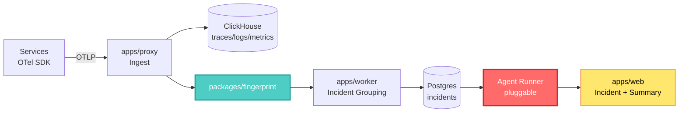

## 🤔 Curiosity: Why Do We Still Read Logs By Hand?

I have shipped AI into games for eight years. We let neural networks pick matchmaking brackets, tune difficulty curves, and drive digital humans — and then, when the live service falls over at 2 AM, a human being opens a dashboard and scrolls.

That asymmetry never sat right with me. During a live-ops incident on a mobile title, the actual bottleneck was never the fix. It was the twenty minutes spent asking: *which of these 40,000 error lines are the same error?*

So the question I kept circling: **what if grouping and first-pass investigation were part of the telemetry system itself, not a human ritual bolted on top?**

That is exactly the bet [Superlog](https://superlog.sh) is making.

---

## 📚 Retrieve: What Superlog Actually Is

[Superlog](https://github.com/superloglabs/superlog) describes itself as an **open-source agentic telemetry system**. Per the repository: it ingests traces, logs, and metrics, groups noisy signals into incidents, and watches your infrastructure while you sleep. It is an open-core observability workspace for OpenTelemetry data, licensed [Apache 2.0](https://github.com/superloglabs/superlog/blob/main/LICENSE.md), currently in the Y Combinator P26 batch.

The free community edition in the public repo ships:

| Component | Role |
|---|---|
| Web app and API | The product surface for debugging production systems |
| OTLP ingest proxy | Standard OpenTelemetry intake — no proprietary agent |
| Worker processes | Incident grouping and background jobs |
| Postgres + ClickHouse | Relational schema plus columnar telemetry queries |
| Agent runner interface | **Pluggable** investigation runtimes |
| `community` agent runner | Default runner that records a local incident summary |

A hosted **Superlog Cloud** edition exists with a free tier, pay-as-you-go, and monthly credit packs — the classic open-core split.

### The Repository Layout Tells the Story

The [layout](https://github.com/superloglabs/superlog) is refreshingly legible:

```text
apps/web              # Vite/React frontend
apps/api              # HTTP API
apps/proxy            # OTLP intake proxy
apps/worker           # background workers + agent orchestration
packages/db           # Drizzle schema and migrations
packages/fingerprint  # telemetry fingerprinting helpers
```

`packages/fingerprint` is the part I care about most. **Fingerprinting is the deduplication primitive** — the thing that decides two stack traces from two regions at two timestamps are one incident. Everything agentic downstream is only as good as that grouping, because an agent handed 40,000 ungrouped lines burns tokens rediscovering what a hash could have told it.

### The Pipeline



The critical design decision is the boundary at `G`. Superlog does not hardcode "an LLM investigates." It defines an **agent runner interface** and ships a default `community` runner that writes a local incident summary. That means the investigation brain is swappable — your own model, your own policy, your own on-prem inference. For a game studio with data-residency constraints, this is the difference between adoptable and unadoptable.

### Standing Up the Local Stack

Prerequisites are Node.js 20+, pnpm 9+, and Docker.

```bash
pnpm install

docker compose up -d
pnpm --filter @superlog/db db:migrate
pnpm dev
```

Default local services:

- Web — `http://localhost:5173`
- API — `http://localhost:4100`
- **OTLP intake — `http://localhost:4101`**

That third port is the whole integration story. Because intake is OTLP, any OpenTelemetry-instrumented service points at it with one environment variable:

```bash
# Your existing OTel-instrumented game backend, unchanged
export OTEL_EXPORTER_OTLP_ENDPOINT=http://localhost:4101
export OTEL_SERVICE_NAME=match-service
```

There is no vendor SDK to adopt and no rewrite of instrumentation. If you already emit OTel — and by 2026 most backends do — the switching cost is a URL.

### The Agent-Native Install Path

The install instruction in the README is itself a signal about where tooling is heading:

```text
Run npx skills add superloglabs/skills --all and use the skills to install Superlog in this project
```

The primary documented onboarding is **a coding agent reading a skill definition**, published as a separate [superloglabs/skills](https://github.com/superloglabs/skills) repository. There is also [superloglabs/otel-helpers](https://github.com/superloglabs/otel-helpers) for instrumentation glue, and a [Discord](https://discord.gg/wJ56aRh8hx) for the community.

Read that carefully: the docs are written for the machine that will do the integration. That is the same shift I wrote about with [Unity CLI automation](/posts/unity-cli-atomic-agent/) — the human is moving from operator to reviewer.

---

## 💡 Innovation: What This Changes for Game Backends

### The Signal-to-Incident Ratio Is the Real Metric

Game live-ops telemetry has a pathological shape. A single bad patch does not produce one error — it produces one error per player session, which at scale means millions of near-identical events in minutes. Traditional dashboards degrade exactly when you need them most.

Fingerprint-first architecture inverts the priority: **collapse first, then look.** The agent never sees the flood; it sees the incident.

### Where I'd Actually Deploy It

| Use case | Why Superlog fits | Caveat |
|---|---|---|
| Matchmaking service incidents | Trace-level grouping across regions | Needs disciplined span naming |
| Build/CI pipeline failures | OTLP intake from CI runners | CI traces are bursty, not steady |
| Live-ops overnight watch | Agent runner drafts the summary before standup | Community runner is a summary, not a diagnosis |
| Self-hosted / data-residency | Apache 2.0, fully local stack | Open-core: advanced features live in Cloud |

### Honest Tradeoffs

I want to be precise about what the community edition promises. The default `community` agent runner **records a local incident summary** — that is documented scope. It is not a root-cause oracle. The value proposition of the OSS edition is the *architecture*: OTLP intake, fingerprinting, incident grouping, and a clean seam where an investigation runtime plugs in.

Also worth naming: ClickHouse plus Postgres plus a worker fleet plus a proxy is genuinely more moving parts than shipping logs to a managed vendor. You are trading operational surface for control and cost. For a small indie team that trade is probably bad. For a studio already running its own backend fleet under residency rules, it is obviously good.

### Key Takeaways

| Insight | Implication | Next Step |
|---|---|---|
| Grouping belongs *below* the agent | Deduplicate before inference, not after | Audit your fingerprint keys before adding AI |
| OTLP intake means zero lock-in | Migration cost is one env var | Point a staging service at `:4101` |
| Agent runner is an interface | Investigation logic is swappable and self-hostable | Prototype a runner against your own model |
| Docs target coding agents | Onboarding is becoming machine-first | Treat skill files as first-class documentation |

### New Questions This Raises

1. **What is the right fingerprint for a game session?** Web services fingerprint on stack trace and endpoint. A game incident might need player cohort, region, build number, and device tier in the key. Does over-keying re-fragment the incident you were trying to merge?
2. **Can an agent runner be evaluated?** If investigation output is a summary, we need ground truth. Could we replay historical postmortems as a benchmark set?
3. **Does agentic telemetry create its own telemetry problem?** The runner is a production system. Who watches the watcher, and does it emit OTel too?

I am going to answer the first one with real data. That is the next post.

---

## References

**Code & Implementation:**
- [Superlog — Official GitHub Repository](https://github.com/superloglabs/superlog)
- [superloglabs/skills — Agent skills for installation](https://github.com/superloglabs/skills)
- [superloglabs/otel-helpers — Instrumentation helpers](https://github.com/superloglabs/otel-helpers)
- [Apache 2.0 License](https://github.com/superloglabs/superlog/blob/main/LICENSE.md)

**Documentation & Community:**
- [Superlog Website](https://superlog.sh)
- [Superlog Discord](https://discord.gg/wJ56aRh8hx)
- [MCP Toplist listing](https://mcptoplist.com/server/sh.superlog%2Fsuperlog)
- [@superlogYC on X](https://twitter.com/intent/follow?screen_name=superlogYC)

**Related Standards:**
- [OpenTelemetry Documentation](https://opentelemetry.io/docs/)
- [OTLP Specification](https://opentelemetry.io/docs/specs/otlp/)
- [ClickHouse for Observability](https://clickhouse.com/docs/en/use-cases/observability)

**Related Posts:**
- [Atomic Agent + Unity CLI: Automating Game Builds Without Touching the Editor](/posts/unity-cli-atomic-agent/)
