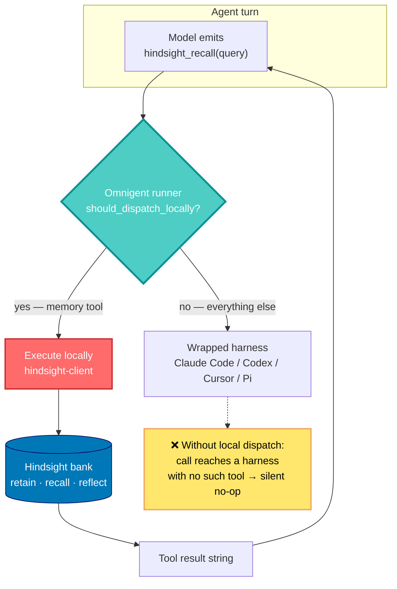

## 🤔 Curiosity: If Every Tool Needs Memory, Who Should Own It?

I now run four coding agents on any given week. Claude Code for the long refactors, Codex when I want a second opinion, Cursor when I am reading more than writing, and a small in-house harness that drives Unity builds. Each one is brilliant. Each one is an amnesiac.

The obvious fix is to give each tool a memory integration. That is what most of the ecosystem has done, and it works — until you count. Four harnesses times one memory system is four setups, four config files, four places to rotate an API key, four chances for the conventions I taught agent #1 to be invisible to agent #3.

This is the **N×M integration problem**, and I have watched game studios lose entire quarters to it. Every renderer times every platform. Every analytics SDK times every title. The industry's answer was never "integrate harder" — it was to find a **seam** and put one adapter there.

So when [Vectorize announced](https://www.linkedin.com/pulse/give-every-agent-you-run-omnigent-persistent-memory-vectorizeio-zjnsc) that they had wired [Hindsight](https://github.com/vectorize-io/hindsight) memory into [Omnigent](https://github.com/omnigent-ai/omnigent), the claim that caught me was not "agents can remember." It was **where** they put the bridge:

> One Hindsight setup, any harness.

That is a seam argument, not a feature announcement. And seam arguments are worth verifying in the source, because the whole value depends on the bridge sitting one layer above the thing it serves.

**The question:** does the memory actually live at the seam — and what does an agent lose when memory becomes a tool the agent must remember to call?

---

## 📚 Retrieve: What the Source Says

### The two pieces

[Omnigent](https://github.com/omnigent-ai/omnigent) is a **meta-harness**: an orchestration layer that wraps other agent harnesses instead of being one. Apache-2.0, Python, ~9.1k stars at the time of writing. It runs Claude Code, Codex, Cursor, Pi and custom agents behind one spec, and it is the same "swap the harness without rewriting the agent" idea I dug into with [DeepSeek's plugin-shaped harness](/posts/deepseek-harness-everything-is-a-plugin/).

[Hindsight](https://github.com/vectorize-io/hindsight) is Vectorize's open-source agent-memory system — MIT, ~20.7k stars — exposing three primitives: **retain**, **recall**, and **reflect**.

The integration exposes exactly those three as Omnigent builtins. The repo's own test asserts the set is closed:

```python
def test_hindsight_tool_set_is_exactly_the_three() -> None:
    assert set(_HINDSIGHT_TOOLS) == {"hindsight_retain", "hindsight_recall", "hindsight_reflect"}
```

### The seam is `should_dispatch_locally`

Here is the part that justifies the announcement. In [`omnigent/runner/tool_dispatch.py`](https://github.com/omnigent-ai/omnigent/blob/main/omnigent/runner/tool_dispatch.py), the memory tools are registered as **runner-local**, and the comment explains the failure mode they exist to prevent:

```python
# Hindsight long-term memory builtins. Runner-local (like web_search) so that a
# wrapped harness's (claude-sdk / codex / cursor / pi) tool call resolves to the
# spec-configured Hindsight tool via its ``invoke``. Without this entry the call
# falls through to the harness, which has no such tool, and silently no-ops.
_HINDSIGHT_TOOLS = frozenset({"hindsight_retain", "hindsight_recall", "hindsight_reflect"})
```

Read that last sentence again, because it is the whole design in one line. The wrapped harness never learns what memory is. It emits a tool call; the **runner** intercepts it before it reaches the harness, executes it locally against `hindsight-client`, and hands back a result. The same file also unions the memory tools into the native relay surface, with a second telling comment:

```python
# Memory builtins are relayed to native harnesses too — unlike web_search,
# native harnesses have no built-in long-term memory of their own.
| _HINDSIGHT_TOOLS
```

That is an honest architectural admission: web search is table stakes that harnesses already ship, memory is not.



### Bank scoping is three lines of fallback

Memory is isolated per **bank**. The announcement describes a resolution order; [`omnigent/tools/builtins/hindsight.py`](https://github.com/omnigent-ai/omnigent/blob/main/omnigent/tools/builtins/hindsight.py) implements it literally:

```python
def _bank(self, ctx: ToolContext) -> str:
    """Resolve the memory bank: config override → agent id → conversation id."""
    bank = self._config.get("bank_id") or ctx.agent_id or ctx.conversation_id
    if not bank:
        raise ValueError(
            "No Hindsight bank could be resolved (no bank_id, agent_id, or conversation_id)."
        )
    return bank
```

Three tiers, decreasing lifetime, and the choice is a **retention policy expressed as a config key**:

| Bank source | Scope | Lifetime | Use it when |
|:---|:---|:---|:---|
| `bank_id` in YAML | Whatever you name | Permanent, human-readable | Production. Multiple agents share one project memory. |
| `ctx.agent_id` (default) | One bank per agent | Survives all of that agent's runs | Single-agent assistants — handy, but opaque to find later |
| `ctx.conversation_id` | One bank per conversation | Dies with the conversation | Scratch memory, throwaway sessions |

The bank is also created on demand — `_ensure_bank` calls `create_bank` once per process and swallows the "already exists" error — so pointing two agents at the same `bank_id` is genuinely all it takes to give them a shared brain.

### The full config surface

The announcement covers the basics; the module docstring is the complete list. Everything except `api_key` is optional:

| Key | Default | What it does |
|:---|:---|:---|
| `api_key` | — (required) | Hindsight key; raises immediately if missing |
| `api_url` | `https://api.hindsight.vectorize.io` | Point it at a self-hosted server instead |
| `bank_id` | `ctx.agent_id` | The retention policy above |
| `budget` | `mid` | `low` / `mid` / `high` — recall and reflect breadth |
| `max_tokens` | `4096` | Token ceiling on recall results |
| `tags` | none | Comma-separated labels written by `retain` |
| `recall_tags` | none | Filter which memories `recall` considers |
| `recall_tags_match` | `any` | `any` / `all` / `any_strict` / `all_strict` |

> **Tags are set in config, not by the agent.** The `hindsight_retain` schema accepts exactly one parameter — `content`. So every memory an agent writes carries the same static tag set from its YAML. If you want per-fact labels, you need one tool declaration per tag bundle, or you tag at the bank level.
{: .prompt-info}

### Which harnesses benefit

{: .shadow .rounded-10 }
_Source: Vectorize's announcement. The interesting row is the last one._

Four harnesses have official native integrations, Pi has a community one, and every row is "Yes" through Omnigent. Which means for the first five rows Omnigent's value is **consolidation**, not capability — you were never blocked, you were just configuring the same thing five times.

The row that is actually new is **custom harness: usually none**. That is my Unity build agent. That is every in-house tool a studio wrote because no vendor was going to ship it. Those harnesses get memory here without writing an integration at all, and that is the row I would build a decision on.

---

## 💡 Innovation: What I Would Ship, and What I Would Not Trust Yet

### The one thing to fix before you copy the announcement

The TL;DR says the install is:

```bash
pip install "omnigent[memory]"   # ⚠️ not a defined extra
```

The repo disagrees. `pyproject.toml` defines the extra as `hindsight`:

```toml
# Hindsight long-term memory built-in tools (hindsight_retain / _recall /
# _reflect) ... need this extra.
hindsight = ["hindsight-client>=0.4.0"]
```

and the shipped `examples/remy/config.yaml` header says `pip install 'omnigent[hindsight]'`, as does the module docstring. I verified this against `omnigent-ai/omnigent@4b6779f`.

This matters more than a typo normally would, because of **how the failure surfaces**. `pip` treats an unknown extra as a warning, not an error — so `omnigent[memory]` installs Omnigent successfully and silently omits `hindsight-client`. The import is lazy, deliberately:

```python
def _client(self) -> Hindsight:
    """Build (and cache) a Hindsight client from the spec config.

    Imports ``hindsight_client`` lazily so merely importing this module
    (e.g. for ``description()`` during tool discovery) never requires the
    optional dependency.
    """
```

So nothing breaks at startup. The tools appear in the agent's tool list. The first `hindsight_retain` call then fails — and every `invoke` in that file ends the same way:

```python
except Exception as e:
    _logger.error("Hindsight retain failed: %s", e)
    return f"Hindsight retain failed: {e}"
```

The error is **returned to the model as tool output**, not raised. A well-instructed agent reports it. A poorly-instructed one reads "failed" and moves on conversationally, and you get an agent that appears to remember for the length of a session and has persisted nothing. Use `omnigent[hindsight]`, then verify with a real cross-session recall before you trust it.

> **Curiosity → Retrieve, in one command:** `pip install "omnigent[hindsight]"` then `HINDSIGHT_API_KEY=hsk_... omnigent run examples/remy`. Ask Remy to remember something, quit, restart, ask again. If the second session answers, the seam is wired. If it apologizes, read your logs.
{: .prompt-tip}

### The wiring, as I would write it for a team

The pattern I care about is not one assistant with a diary. It is **several specialized agents sharing one project memory** — the arrangement I have been circling since I wrote about [ontology and agent memory as a context layer](/posts/ontology-graphrag-agent-memory/).

```yaml
# balance-agent/config.yaml — one of several agents on the same bank
spec_version: 1
name: balance-agent

executor:
  type: omnigent
  config:
    harness: claude-sdk        # swap to codex/cursor freely; the bank does not move

prompt: |
  You tune combat balance for a live mobile RPG.

  - Call `hindsight_recall` BEFORE proposing any change: past tuning
    decisions and their measured outcomes live there.
  - When a change ships and we measure it, call `hindsight_retain` with
    the decision AND the number. A decision without its outcome is noise.
  - Use `hindsight_reflect` for "what have we learned about tank builds?"

tools:
  builtins:
    - name: hindsight_recall
      api_key: ${HINDSIGHT_API_KEY}
      bank_id: project-nightfall     # shared across every agent on this title
      budget: high                   # tuning history is worth the tokens
      max_tokens: 8192
      recall_tags: balance,liveops
      recall_tags_match: any
    - name: hindsight_retain
      api_key: ${HINDSIGHT_API_KEY}
      bank_id: project-nightfall
      tags: balance,liveops
    - name: hindsight_reflect
      api_key: ${HINDSIGHT_API_KEY}
      bank_id: project-nightfall
```

Point the QA agent and the telemetry agent at `bank_id: project-nightfall` with their own `tags`, and a fact one retains is recallable by the others. That is the piece per-tool integrations structurally cannot give you: the memory is not in the tool, so it does not leave when the tool does.

Because bank resolution is just a three-way fallback, you can express the whole policy as a small helper and keep it in one place instead of hand-copying `bank_id` into a dozen YAML files:

```python
from typing import Literal

Scope = Literal["project", "agent", "session"]

def resolve_bank(scope: Scope, *, project: str, agent_id: str, conversation_id: str) -> str:
    """Mirror Omnigent's bank fallback as an explicit, reviewable policy.

    Omnigent resolves ``bank_id or agent_id or conversation_id`` at call time
    (omnigent/tools/builtins/hindsight.py). Deciding it up front means the
    scope is a code review artifact, not an accident of which key you omitted.
    """
    if scope == "project":
        return project                       # shared brain — cross-agent recall
    if scope == "agent":
        return f"{project}--{agent_id}"      # private notes, still greppable
    if scope == "session":
        return f"{project}--tmp--{conversation_id}"  # dies with the conversation
    raise ValueError(f"unknown memory scope: {scope!r}")


def render_builtin(tool: str, scope: Scope, **ids: str) -> dict:
    """Emit one `tools.builtins` entry with the bank pinned explicitly."""
    if tool not in {"hindsight_recall", "hindsight_retain", "hindsight_reflect"}:
        raise ValueError(f"not a Hindsight builtin: {tool!r}")
    return {
        "name": tool,
        "api_key": "${HINDSIGHT_API_KEY}",
        "bank_id": resolve_bank(scope, **ids),
    }


# Never leave the bank implicit in production: an agent renamed six months
# from now silently starts a brand-new, empty memory.
print(render_builtin("hindsight_recall", "project",
                     project="nightfall", agent_id="balance", conversation_id="c1"))
# {'name': 'hindsight_recall', 'api_key': '${HINDSIGHT_API_KEY}', 'bank_id': 'nightfall'}
```

### Native integration or Omnigent's tools? Pick one per bank

Vectorize is refreshingly direct about the hazard: do not enable a harness's native Hindsight integration **and** point Omnigent's tools at the same bank, or two retain paths write the same conversation twice. Deduplicated memory is the entire product; double-writing it is worse than not having it.

| | Native per-tool integration | Omnigent builtins |
|:---|:---|:---|
| Trigger | Automatic — hooks the tool's own lifecycle | **Agent-driven** — the model must call the tool |
| Setup cost | Once per tool | Once, centrally |
| Coverage | That one harness | Every harness you orchestrate, custom ones included |
| Failure mode | Integration breaks loudly | Tool returns an error **string** to the model |
| Best for | Running one tool standalone | Orchestrating several, or a custom harness |

That "agent-driven" row is the real tradeoff, and it is why `examples/remy` spends more prompt on memory than on anything else, including the blunt line: *"Acknowledging a fact in chat does NOT save it."* Capability is wired; **discipline is prompted**. If you have ever watched an agent confidently claim it will remember something, you know exactly how much load that sentence is carrying.

### Where I think the seam still has a hole

The runner intercepts memory calls at the boundary between orchestrator and harness — the same boundary where policy and sandboxing live. That placement is what makes one setup cover every tool.

But it also bounds what can ever be captured there. The seam sees **what** the agent decided to store, never **why** it decided to. Intent forms inside the harness, and the meta-harness treats the harness as a black box. Memory keeps the agent's notes-to-self; governance at that same seam keeps a policy verdict. Neither holds the reasoning that produced the action, because the reasoning never crossed the seam to be kept.

For memory, that is a fine trade — notes-to-self are exactly what you want to persist. It is worth naming out loud only because the same architecture is increasingly sold as the place to enforce alignment, and execution-layer enforcement sits strictly downstream of the only place intent exists.

### Key Takeaways

| Insight | Implication | What I would do next |
|:---|:---|:---|
| The bridge is runner-local dispatch, not a harness plugin | Memory survives swapping Claude Code → Codex mid-project | Pin `bank_id`, then swap harnesses and confirm recall |
| Custom harnesses are the row that matters | In-house tools get memory with zero integration work | Wrap the Unity build agent, share the project bank |
| Unknown pip extras fail silently | `omnigent[memory]` yields an agent that "remembers" nothing | Install `omnigent[hindsight]`, verify cross-session |
| Tool errors return as strings to the model | Broken memory looks like a working agent | Assert on logs, not on the agent's self-report |
| Recall is prompted, not automatic | Memory quality is a prompt-engineering problem | Treat the memory instructions as production code |

### New Questions This Raises

- If recall is agent-driven, what is the actual **recall rate** in a long session — and does it collapse right when context pressure makes memory most valuable?
- A shared bank across agents is a shared failure domain. What happens when the balance agent retains a wrong conclusion and three other agents recall it as fact? Memory needs a retraction primitive, and `retain` has no inverse in this tool surface.
- `budget: high` and `max_tokens: 8192` are token costs paid on every turn that recalls. At what team size does a shared project bank stop paying for itself?
- Could the same runner-local seam carry a **write-through to a repo-local wiki**, so memory is reviewable in a pull request instead of living only in a hosted bank?

---

## References

**Primary source (this post's subject):**

- [Give Every Agent You Run in Omnigent a Persistent Memory](https://www.linkedin.com/pulse/give-every-agent-you-run-omnigent-persistent-memory-vectorizeio-zjnsc) — Vectorize AI, Inc.

**Code (verified against `omnigent-ai/omnigent@4b6779f`):**

- [Omnigent (GitHub)](https://github.com/omnigent-ai/omnigent) — Apache-2.0 meta-harness
- [`omnigent/tools/builtins/hindsight.py`](https://github.com/omnigent-ai/omnigent/blob/main/omnigent/tools/builtins/hindsight.py) — the three builtins, bank resolution, config surface
- [`omnigent/runner/tool_dispatch.py`](https://github.com/omnigent-ai/omnigent/blob/main/omnigent/runner/tool_dispatch.py) — runner-local dispatch and the native relay
- [`tests/runner/test_hindsight_local_dispatch.py`](https://github.com/omnigent-ai/omnigent/blob/main/tests/runner/test_hindsight_local_dispatch.py) — the seam, locked in by tests
- [`examples/remy/config.yaml`](https://github.com/omnigent-ai/omnigent/blob/main/examples/remy/config.yaml) — complete working memory agent
- [Hindsight (GitHub)](https://github.com/vectorize-io/hindsight) — MIT agent-memory system

**Packages & docs:**

- [`omnigent` on PyPI](https://pypi.org/project/omnigent/)
- [`hindsight-client` on PyPI](https://pypi.org/project/hindsight-client/)
- [Hindsight documentation](https://docs.hindsight.vectorize.io)
- [Vectorize](https://vectorize.io)

**Related posts:**

- [DeepSeek Harness: What If the Agent Loop Itself Were Just Another Plugin?](/posts/deepseek-harness-everything-is-a-plugin/) — the same seam argument, one layer down
- [From RAG to Context Layer](/posts/ontology-graphrag-agent-memory/) — why agent memory is a context-layer problem
- [The JEO Ecosystem: Context Engineering](/posts/jeo-ecosystem-context-engineering/) — my own take on persistent context across sessions
- [Atomic Agent + Unity CLI](/posts/unity-cli-atomic-agent/) — the custom harness I would wire this into first
