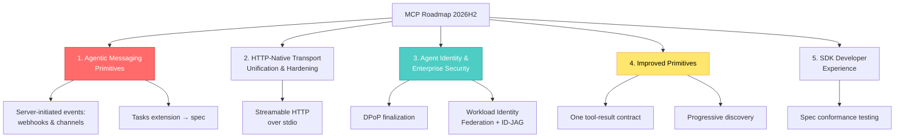

## 🤔 Curiosity: What Does a Protocol Prioritize When Agents Stop Being Chatbots?

Every game studio I've worked at eventually learns the same lesson about infrastructure: **the protocol you standardize on decides what you can build two years later**. Pick a netcode model that assumes short sessions, and long-running co-op raids become a rewrite. Pick an asset pipeline that assumes humans click buttons, and automation becomes a hack.

That's why I read protocol roadmaps the way other people read patch notes. The Model Context Protocol (MCP) team — David Soria Parra and Den Delimarsky, the lead maintainers — just published [an updated roadmap](https://blog.modelcontextprotocol.io/posts/mcp-roadmap/) covering the next specification release and beyond, developed together with the Core Maintainers and community Working Groups.

MCP has quietly become the seam layer for agent tooling — including the Unity CLI agents and telemetry pipelines I've been experimenting with on this blog. So the question I brought to this roadmap:

**Which assumptions about "agents" is the protocol betting on — and do those bets match what production agentic workloads actually look like?**

{: .w-75 .shadow .rounded-10 }
_The five priority areas of the new MCP roadmap. Source: [blog.modelcontextprotocol.io](https://blog.modelcontextprotocol.io/posts/mcp-roadmap/)_

---

## 📚 Retrieve: What Shipped, and What's Next

### Looking back: the 2026-07-28 release did surgery, not patches

The [previous roadmap](https://blog.modelcontextprotocol.io/posts/2026-mcp-roadmap/) (March) named four priorities: transport evolution and scalability, agent communication, governance maturation, and enterprise readiness. Five months later, the bulk of the work landed in the [2026-07-28 specification release](https://blog.modelcontextprotocol.io/posts/2026-07-28/), and some of it is genuinely structural:

| Change | SEP | Why It Matters |
|:-------|:----|:---------------|
| **Protocol-level sessions and init handshake removed** | [SEP-2575](https://modelcontextprotocol.io/seps/2575-stateless-mcp), [SEP-2567](https://modelcontextprotocol.io/seps/2567-sessionless-mcp) | Servers scale horizontally without holding state — MCP servers become boring, load-balanceable HTTP workloads |
| **`server/discover` endpoint** | — | Clients learn supported versions/capabilities *before* connecting |
| **Cacheable list results (TTL)** | [SEP-2549](https://modelcontextprotocol.io/seps/2549-TTL-for-list-results) | Stop re-fetching tool catalogs on every connection |
| **Tasks moved to an official extension** | [SEP-2663](https://modelcontextprotocol.io/seps/2663-tasks-extension) | Long-running work reworked from early-adopter feedback |
| **Multi Round-Trip Requests (MRTR)** | [SEP-2322](https://modelcontextprotocol.io/seps/2322-MRTR) | Replaces server-initiated requests, so elicitation works on *stateless* servers |
| **Enterprise-Managed Authorization now stable** | [extension](https://modelcontextprotocol.io/extensions/auth/enterprise-managed-authorization) | Issuer validation, issuer-bound client credentials, CIMD as preferred client registration |

Governance matured too: a formal [Contributor Ladder](https://modelcontextprotocol.io/community/contributor-ladder), Working Groups triaging SEPs in their own areas, and a proper [feature lifecycle and deprecation policy](https://modelcontextprotocol.io/community/feature-lifecycle). The [Server Card Working Group](https://modelcontextprotocol.io/community/working-groups/server-card) is defining `.well-known` metadata so servers can be discovered and reasoned about *without connecting to them*.

> **Retrieve:** Killing protocol sessions is the same architectural move game backends made a decade ago — push state out of the connection layer so any node can serve any request. MCP just crossed that line.
{: .prompt-info}

### The five new priority areas

The new roadmap organizes work into five areas, each owned by named Core Maintainers and one or more Working Groups:

**1. Agentic messaging primitives.** Modern agentic workloads have outgrown the standard [request-and-response pattern](https://modelcontextprotocol.io/specification/2026-07-28/basic/patterns): loops run longer, servers stream results, and work needs steering mid-flight. MCP already grew [Tasks](https://modelcontextprotocol.io/extensions/tasks/overview), [subscriptions/listen](https://modelcontextprotocol.io/specification/2026-07-28/basic/patterns/subscriptions), and [progress notifications](https://modelcontextprotocol.io/specification/2026-07-28/basic/patterns/progress) — this area makes sure they compose. The concrete work: server-initiated events (webhooks and channels, so clients stop polling), a composition review across the [Agents](https://modelcontextprotocol.io/community/working-groups/agents) and [Triggers & Events](https://modelcontextprotocol.io/community/working-groups/triggers-events) Working Groups, and maturing Tasks into the core spec.

**2. HTTP-native transport unification and hardening.** Since 2026-07-28, a remote MCP server is "no different from any other HTTP workload." The plan now stretches that to *local* servers too — speaking Streamable HTTP over stdio — so there's one transport story instead of two.

**3. Agent identity and enterprise-ready security.** This is the area I'd watch most closely. Today [MCP authorization](https://modelcontextprotocol.io/specification/2026-07-28/basic/authorization) assumes a person approving access in a browser. But callers increasingly are agents running as cloud workloads with their own identity, acting for an absent user, or delegating narrower authority to sub-agents. The roadmap commits to: finalizing [DPoP (RFC 9449)](https://www.rfc-editor.org/rfc/rfc9449) adoption, an opinionated path through Workload Identity Federation and the ID-JAG grant behind [Enterprise-Managed Authorization](https://modelcontextprotocol.io/extensions/auth/enterprise-managed-authorization), and deeper engagement with the IETF OAuth and [WIMSE](https://datatracker.ietf.org/wg/wimse/about/) working groups — explicitly "built on existing standards rather than pasted API keys and long-lived tokens."

**4. Improved primitives.** Two honest admissions here. First, a [`tools/call` response](https://modelcontextprotocol.io/specification/2026-07-28/server/tools#tool-result) can carry the same output in multiple forms, and servers can't know which form a client will show the model — so they're standardizing one clear contract. Second, **scale**: connecting to a server with a hundred tools means the model pays for that whole surface before the user asks anything, and tool selection degrades as the list grows. The answer is *progressive discovery* — a small entry point that reveals more of the catalog as the conversation narrows.

**5. Improved SDK developer experience.** Ergonomics, [conformance testing](https://modelcontextprotocol.io/community/sdk-tiers#conformance-testing), and documentation quality — with a telling justification: many developers now build MCP clients and servers *by pointing an agent at the libraries*, so clear APIs and accurate docs decide whether generated code works.

### How proposals get prioritized

[SEPs](https://modelcontextprotocol.io/community/sep-guidelines) inside these five areas get expedited review. Proposals outside them aren't auto-rejected, but scarce maintainer time goes to priority areas first. The recommended path: identify your area, raise it with the relevant [Working Group](https://modelcontextprotocol.io/community/working-interest-groups), and reach the responsible maintainers on [Discord](https://modelcontextprotocol.io/community/communication#discord). [SEP-2133](https://modelcontextprotocol.io/seps/2133-extensions) even lets any WG/IG prototype in an `experimental-ext-` repository *before* filing a formal SEP.

---

## 💡 Innovation: What These Bets Mean If You Ship Agent Tooling

### The pattern: MCP is converging on boring infrastructure

Read the five areas together and one theme emerges: **every bet moves MCP toward existing, proven infrastructure** — stateless HTTP, OAuth-family identity standards, webhooks. That's the opposite of protocol NIH syndrome, and it's exactly what made HTTP itself win.

| Roadmap Bet | Game/Production Analogy | What I'd Do About It |
|:------------|:------------------------|:---------------------|
| Stateless servers + HTTP everywhere | Dedicated game servers → autoscaling stateless services | Stop designing MCP servers around session state *now* |
| Server-initiated events | Push notifications vs. client polling in live ops | Design tool APIs assuming a webhook/channel path is coming |
| Agent identity (DPoP, WIF) | Per-service credentials replacing shared server keys | Audit any "one API key for the whole agent fleet" setup |
| Progressive tool discovery | Streaming open worlds vs. loading everything upfront | Restructure large tool catalogs into narrow entry points |
| Agent-readable SDK docs | — this one is genuinely new | Treat your own tool docs as *model-facing* UX |

### Progressive discovery is the sleeper

For my own experiments — a Unity build agent exposing dozens of editor operations — the hundred-tools problem is real: context cost grows linearly with catalog size while selection accuracy *drops*. Progressive discovery is the protocol admitting that **tool catalogs need level-of-detail**, the same way open-world games never load the whole map. If you maintain a large MCP server, restructuring around a small entry surface is the highest-leverage prep work you can do today.

### The identity gap is where enterprises actually stall

In my experience, agent pilots don't die on capability — they die in security review. "The agent uses a long-lived API key that can do everything" is an instant red flag. A standardized agent-identity story (workload identity, delegation with *narrower* authority for sub-agents, proof-of-possession tokens) is what turns demos into deployments. MCP putting this on the roadmap with named standards bodies attached is the strongest signal in the whole document.

### New Questions This Raises

- When Tasks graduate into the core spec, what does *cancellation semantics* look like for a half-finished agent job with side effects?
- Can progressive discovery be driven by the model's own uncertainty — retrieve tools the way RAG retrieves documents?
- If sub-agents get delegated, narrower authority, who audits the *delegation chain* when something goes wrong?
- Does Streamable-HTTP-over-stdio finally make local and remote MCP servers behaviorally identical enough to test with one harness?

---

## References

**Primary Source:**
- [The New MCP Roadmap (blog post)](https://blog.modelcontextprotocol.io/posts/mcp-roadmap/) — David Soria Parra & Den Delimarsky
- [Live Roadmap Page](https://modelcontextprotocol.io/development/roadmap)
- [Previous Roadmap (March 2026)](https://blog.modelcontextprotocol.io/posts/2026-mcp-roadmap/)
- [2026-07-28 Specification Release Notes](https://blog.modelcontextprotocol.io/posts/2026-07-28/)

**Specification Enhancement Proposals (SEPs):**
- [SEP-2575 — Stateless MCP](https://modelcontextprotocol.io/seps/2575-stateless-mcp)
- [SEP-2567 — Sessionless MCP](https://modelcontextprotocol.io/seps/2567-sessionless-mcp)
- [SEP-2549 — TTL for List Results](https://modelcontextprotocol.io/seps/2549-TTL-for-list-results)
- [SEP-2663 — Tasks Extension](https://modelcontextprotocol.io/seps/2663-tasks-extension)
- [SEP-2322 — Multi Round-Trip Requests](https://modelcontextprotocol.io/seps/2322-MRTR)
- [SEP-2133 — Extensions Mechanism](https://modelcontextprotocol.io/seps/2133-extensions)

**Specification & Extensions:**
- [Request/Response Patterns](https://modelcontextprotocol.io/specification/2026-07-28/basic/patterns) · [Subscriptions](https://modelcontextprotocol.io/specification/2026-07-28/basic/patterns/subscriptions) · [Progress Notifications](https://modelcontextprotocol.io/specification/2026-07-28/basic/patterns/progress)
- [Tasks Extension Overview](https://modelcontextprotocol.io/extensions/tasks/overview)
- [Authorization Spec](https://modelcontextprotocol.io/specification/2026-07-28/basic/authorization) · [Enterprise-Managed Authorization](https://modelcontextprotocol.io/extensions/auth/enterprise-managed-authorization) ([stability announcement](https://blog.modelcontextprotocol.io/posts/enterprise-managed-auth/))
- [Tool Result Contract](https://modelcontextprotocol.io/specification/2026-07-28/server/tools#tool-result)

**Standards Bodies:**
- [RFC 9449 — OAuth 2.0 Demonstrating Proof of Possession (DPoP)](https://www.rfc-editor.org/rfc/rfc9449)
- [IETF WIMSE Working Group](https://datatracker.ietf.org/wg/wimse/about/)

**Community & Governance:**
- [Working & Interest Groups](https://modelcontextprotocol.io/community/working-interest-groups) — incl. [Agents](https://modelcontextprotocol.io/community/working-groups/agents), [Triggers & Events](https://modelcontextprotocol.io/community/working-groups/triggers-events), [Server Card](https://modelcontextprotocol.io/community/working-groups/server-card)
- [SEP Guidelines](https://modelcontextprotocol.io/community/sep-guidelines) · [Contributor Ladder](https://modelcontextprotocol.io/community/contributor-ladder) · [Feature Lifecycle](https://modelcontextprotocol.io/community/feature-lifecycle)
- [Contributing Guide](https://modelcontextprotocol.io/community/contributing) · [Communication Channels](https://modelcontextprotocol.io/community/communication) · [SDK Conformance Tiers](https://modelcontextprotocol.io/community/sdk-tiers#conformance-testing)
- [MCP on GitHub](https://github.com/modelcontextprotocol)
