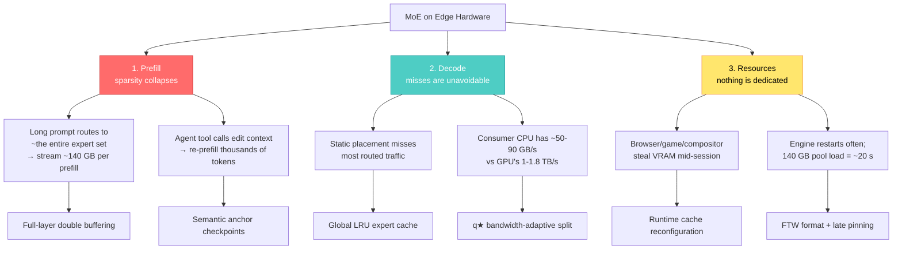

## 🤔 Curiosity: Why Is My Gaming PC Idle While I Pay Per Token?

Every shipped game I worked on had the same brutal constraint written on a whiteboard somewhere: **the working set does not fit in VRAM**. Not the textures, not the meshes, not the streaming audio. And nobody ever solved that by buying a bigger GPU. We solved it by getting good at *residency* — what lives on the card right now, what streams in next frame, what stays in system RAM, and who decides.

So when I look at the current state of local LLM inference, something feels off. Open weights are everywhere. Kimi-K3, GLM-5.2, DeepSeek-V4-Flash are closing the gap with the strongest proprietary models. And yet the standard advice is still "you need a datacenter" or "just pay the API."

Meanwhile there are **more than a hundred million consumer machines with discrete GPUs sitting idle** — Steam alone reports over 200 million monthly active users with discrete NVIDIA GPUs in roughly 72% of surveyed systems. That is not a hardware shortage. That is a *software* shortage.

FreeToken — Shuo Yang, Xiaoze Fan, Melissa Pan, Haocheng Xi, Zhe Wang, Shanlin Sun, Kurt Keutzer, Song Han, Matei Zaharia, Chenfeng Xu, and Ion Stoica, with correspondence going to Berkeley and UT Austin — makes exactly that argument and then backs it with a serving engine. The claim in one line:

> **Releasing model parameters determines only who can obtain a model, not who can afford to run it.**
{: .prompt-info}

{: .w-100 .shadow .rounded-10 }
_Figure 1 from the paper. (a) Blue squares are models FreeToken serves locally, tagged with the consumer GPU class that serves them — the frontier segment from DeepSeek-V4-Flash to GLM-5.2 is exactly that set. (b) Mean decode throughput on real agentic workloads; the dashed line is Codex's median production decode speed of 33 tok/s. Source: [arXiv:2608.16157](https://arxiv.org/abs/2608.16157)_

The question I brought to this paper is not "does it go fast." It is:

**When the expert pool is 10× your VRAM, what is the *correct* thing to do with a cache miss — and can that decision be made cheaply enough to run inside a CUDA Graph?**

---

## 📚 Retrieve: Three Problems, Not One

### Why MoE is both the opportunity and the trap

A Mixture-of-Experts layer stores $E$ experts but routes each token through only $k \ll E$ of them. DeepSeek-V4-Flash activates **6 of 256 routed experts in each of its 43 layers**, so only 13B of its 284B parameters participate in any single token. At deployed precision, that active footprint fits in an RTX 5090's 32 GB.

Here is the trap: sparsity reduces *computation* per token, not *memory* for the pool. The full FP4 expert pool of DSV4-Flash is roughly **140 GB**. It has to live somewhere, and that somewhere is host RAM or NVMe, which means it has to cross PCIe to get used.

The paper decomposes the shortfall into three problems that existing engines each solve only partially.



**Problem 1 — prefill destroys sparsity.** Each token picks 6 experts, but a 8k-token prompt collectively picks *almost all of them*, in every layer. So a prefill pass streams essentially the complete expert pool over PCIe. For FP4 DSV4-Flash that is ~140 GB, which adds roughly **2 s on an RTX 5090** (PCIe 5.0 ×16, ~60 GB/s), **5 s on 4090/3090-class desktops** (PCIe 4.0 ×16, ~25 GB/s), and **ten-plus seconds on the ×8 links common in laptops**. An engine that fetches on demand exposes that entire window as GPU idle time.

**Problem 2 — decode misses have no principled policy.** llama.cpp assigns MoE tensors to devices at *load* time. KTransformers pins a "hot" subset in VRAM and runs the rest on CPU. But routing shifts every token, so a placement frozen at prefill time captures only a small fraction of routed traffic. And you cannot just run everything on CPU: consumer platforms have two DRAM channels, giving ~50 GB/s (DDR4) to 80–90 GB/s (DDR5) against the 1–1.8 TB/s a 4090/5090 pulls from its own memory.

**Problem 3 — nothing on the edge is dedicated.** This is the one that game developers will recognize instantly. The GPU is shared with the desktop compositor, browsers, and games. The VRAM budget changes *during* the session. And the optimal split between KV cache and expert cache moves too: agentic sessions accumulate context, so KV demand grows while the expert working set stays roughly fixed.

> **Retrieve:** Every one of these three is a residency problem, not a compute problem. Streaming budget, cache policy, and dynamic memory reallocation are exactly the vocabulary of a texture streamer. FreeToken's contribution is applying that vocabulary to MoE experts — and then adding one thing texture streamers never had: *a missing asset can also be computed where it lives.*
{: .prompt-tip}

### The architecture

{: .w-100 .shadow .rounded-10 }
_Figure 2. Top: prefill streams layer $l{+}1$ while the GPU computes layer $l$, with recurrent-state checkpoints anchored at special-token boundaries. Bottom: decode routes 12 experts, 8 hit the shared LRU cache, and the 4 misses split into 1 PCIe fill + 3 in-place CPU executions by the $q^\star$ ratio._

The whole system rests on a **two-level expert-memory hierarchy**. The CPU-resident expert pool holds the complete routed-expert weights and is always the source of truth. Non-expert weights stay resident on the GPU. Everything left over on the GPU becomes **one elastic expert cache shared by all MoE layers**, where each slot holds every tensor needed to evaluate one `(layer, expert)` pair.

That last detail matters more than it sounds. Because residency, lookup, and execution all key on a logical `(layer, expert)` identifier instead of tensor shards, GPU memory affects only *performance*, never *correctness*. The cache can be resized, rebuilt, or emptied at any time and the model still produces the same output.

### Prefill: double buffering, and checkpoints where agents actually cut

**Full-layer double buffering.** Since prefill activates nearly every expert anyway, FreeToken stops pretending otherwise. It allocates two full-layer buffers from the global slot pool. While the GPU computes layer $l$ from one buffer, a dedicated transfer stream loads the *complete* expert set of layer $l+1$ into the other. Loading the whole layer means the transfer can start **before that layer's routing is even known**. The buffers then swap. This is textbook double-buffered streaming, and the payoff is that prefill becomes transfer-bound instead of stall-bound.

**Semantic anchors.** This is the part I did not expect, and it is the most *agent-native* idea in the paper.

Modern frontier models interleave full attention with sliding-window attention or recurrent layers — gated DeltaNet in Qwen3.6-35B-A3B, Kimi Delta Attention in Kimi-K3. A recurrent layer compresses its entire prefix into one evolving state that **cannot be partially reused**. So prefix reuse for those layers depends entirely on *checkpoints*. And because each checkpoint costs as much memory as hundreds of tokens of KV, you can only keep a handful. Placement is everything.

Where do you put them? FreeToken's answer: at the exact places agent harnesses cut.

| Harness | What it edits every turn |
|:--------|:-------------------------|
| **OpenClaw** | Strips thinking blocks from every assistant turn but the latest |
| **OpenCode** | Replaces tool outputs beyond a recent window with a fixed placeholder |
| **SWE-agent** | Elides all but the last *n* observations |

In every case the edit removes **whole blocks marked by special tokens** — `<think>`, `</think>`, `</tool_call>`, `</tool_output>`, turn boundaries. So a checkpoint anchored at one of those boundaries is far more likely to survive truncation than one placed at an arbitrary token offset. After an edit, full-attention layers reuse KV up to the edit point, recurrent layers resume from the anchor, and only the genuinely new suffix gets re-prefilled.

This is the difference between an inference engine that *supports* agents and one that was *designed around* them.

### Decode: the q★ policy

Here is the core of the paper, and it is refreshingly small.

At each MoE layer, the router and cache lookup run on the GPU and identify the hits $\mathcal{H}$, which execute on the GPU directly. The remaining $m$ unique missing experts $\mathcal{M}$ get split into a cache-fill set $\mathcal{F}$ (transferred over PCIe, executed on GPU, left resident for reuse) and a CPU-execution set $\mathcal{C}$ (executed in place, residency unchanged):

$$\mathcal{M} = \mathcal{F} \cup \mathcal{C} \quad (\mathcal{F} \cap \mathcal{C} = \emptyset), \qquad q = |\mathcal{F}|$$

The key observation: **both branches read from the same host-memory subsystem**. A saturated PCIe transfer leaves residual host bandwidth of

$$B_R = \max(B_H - B_P, 0)$$

where $B_P$ is measured pinned expert-transfer bandwidth over PCIe and $B_H$ is measured host-side expert-kernel bandwidth. With $S$ bytes per expert, the two concurrent branch times are

$$T_{\text{fill}}(q) \approx \frac{qS}{B_P}, \qquad T_{\text{cpu}}(m-q) \approx \frac{(m-q)S}{B_H - B_P}$$

Balance them and the whole policy collapses to one ratio:

$$\boxed{q^\star \approx m \cdot \frac{B_P}{B_H}}$$

That is it. No predictor, no learned scheduler, no per-step simulation. Two numbers you profile once on the machine, and a multiply.

What I like about this is how gracefully it degenerates. As $B_H \to B_P$, $q^\star \to m$ and the system becomes pure on-demand cache fill — no separate branches, no special-casing. And on a laptop where PCIe ×8 gives 11.8 GB/s against 47.5 GB/s of LPDDR5, $q^\star$ automatically pushes ~75% of misses onto the CPU. Same formula, opposite behavior.

The CPU and GPU compute partial sums and merge them **exactly** — no approximation, no expert skipping, no reduced-precision replicas. FreeToken keeps the routed computation bit-exact and the model unmodified. It changes *how residual misses are served*, not *how well they are predicted*. That framing is the paper's sharpest line against the whole prefetching literature:

> Every miss is ultimately a PCIe transfer, so decode latency remains bounded by the link no matter how accurate prediction becomes, while host compute capacity sits idle.
{: .prompt-warning}

### Making it survive CUDA Graph capture

A dynamic cache inside a statically captured graph sounds impossible, and this is where most of the engineering went. FreeToken keeps **all routing-dependent control strictly on the GPU**, represented as data inside a fixed-shape graph.

One kernel per MoE layer does everything: deduplicate routed experts, classify against the residency table, derive $q$, select eviction victims, and rewrite logical expert IDs into physical slot IDs (or a CPU-assignment flag). Victim selection dodges the classic LRU trap of one full-cache scan per eviction — a single-pass kernel finds the $K$ least-recently-used candidates in one go, and the miss path consumes the first $q \le K$.

The CPU branch is captured too: stable pinned I/O buffers, persistent task descriptors, a host-function submit node, the concurrent GPU path, a sync node, and the result copy back — all in one graph, per supported decode batch size. Workers are a persistent C++ pool pinned to physical cores using architecture-specific SIMD with in-kernel dequantization.

### Elastic memory: the part that only matters on real machines

Two mechanisms, both leaning on "the host pool is the source of truth":

- **Runtime cache reconfiguration** — at any scheduler safe point, rebuild the GPU expert cache for a revised VRAM budget without restarting the engine or reloading the host pool.
- **Fast bootstrap** — read expert weights from disk *directly into their final host layout*, then pin the memory. Pinning empty buffers first would fault in and zero gigabytes of pages just to overwrite them. And there is no GPU warmup at all: the first request runs on a cold cache through the ordinary decode path, and the cache heats up through normal serving.

---

## 📊 The Numbers

### Test systems

{: .w-100 .shadow .rounded-10 }
_Table 1. Every bandwidth is **measured on deployed tensor shapes**, not read off a spec sheet. Note the spread: $B_P$ ranges 11.8→52.7 GB/s and $B_H$ ranges 47.5→178 GB/s across the six machines._

That table is the whole argument for $q^\star$ in one image. The 4060 laptop has $B_P{:}B_H \approx 1{:}4$; the RTX PRO 6000 has $\approx 1{:}3.5$; the 5090 desktop has $\approx 1{:}1.1$. No single static split can be right for all of them.

Four real agentic workloads, not synthetic prompts:

| ID | Workload | Harness | Character |
|:---|:---------|:--------|:----------|
| **W1** | AIME math reasoning | none | Single-turn, decode-dominated, long CoT |
| **W2** | SWE-bench issue | OpenCode | 3 scripted turns, real tool execution |
| **W3** | Same SWE issue | Claude Code | Concurrent subagents, 56–65k token sessions |
| **W4** | Email/calendar agent | OpenClaw | 13 turns, ~24.5k-token system-context floor |

Coding runs had to produce the reference gold patch; W4 runs had to complete all thirteen turns. Weight formats were aligned bit-exactly across engines.

### End-to-end

{: .w-100 .shadow .rounded-10 }
_Figure 3. RTX 5090. Top: decode tok/s. Bottom: mean TTFT (log scale). × marks configurations an engine cannot serve at all._

| Metric (RTX 5090) | FreeToken | Best baseline |
|:------------------|:----------|:--------------|
| Qwen3.6-35B-A3B BF16 decode | **77–83 tok/s** | 36.5–42.6 (llama.cpp) → **1.8–2.3×** |
| DSV4-Flash MXFP4 decode | **22–25 tok/s** | 13.0–14.5 (llama.cpp) → **1.5–1.9×** |
| Degradation W1 → agentic | **within 12%** | KTransformers loses 31% by W2 |
| Worst-case TTFT | **< 44 s everywhere** | llama.cpp 232 s / Ollama 179 s / KTransformers 946 s |

Two things stand out to me more than the headline multiplier.

**One: stability under agentic load.** FreeToken's decode rate stays within 12% of its single-turn value across all three agent workloads. The most context-sensitive baseline has already lost 31% by W2. The paper's conclusion is blunt and correct: **single-stream benchmarks overstate baseline agentic performance.** If you have ever benchmarked a local model with a one-shot prompt and then been disappointed by it inside a coding agent, this is why.

**Two: tail TTFT is an availability boundary, not a latency statistic.** OpenClaw ships a 120-second idle watchdog. Claude Code's default request timeout is roughly ten minutes. A 946-second worst-case turn is not "slow" — it is *a failed session*. That reframing is worth more than the throughput chart.

### Where the gains come from

{: .w-100 .shadow .rounded-10 }
_Figure 4. (a) Full-layer double buffering pushes prefill to 6.7k tok/s at 16k tokens. (b) Miss rate vs cache size for three placement policies replayed on identical routing traces._

**Pipelined prefill.** With overlap on, each 8,192-token chunk completes in **1.19–1.22 s** — which is exactly the time to stream the 64.4 GB Qwen3.6 expert pool once at 52.7 GB/s. Expert computation is *fully hidden* behind transfer; the PCIe 5.0 ×16 link is the ceiling. Disabling the second buffer costs 19% at 4k tokens, 25% at 8k, 26% at 16k, and the penalty grows with prompt length.

**Expert locality.** This is the chart I would put in a slide deck. At real RTX 5090 serving capacity — **37% of Qwen3.6's expert pool, 11% of DSV4-Flash's** — replayed on identical routing traces:

| Placement policy | Qwen3.6 miss rate | DSV4-Flash miss rate |
|:-----------------|:------------------|:---------------------|
| **FreeToken global LRU** | **16%** | **39%** |
| KTransformers (prefill-updated) | 41% | 59% |
| llama.cpp (routing-blind static) | 62% | 89% |

A plain per-miss LRU beats placement chosen at prefill time by 2.5× on Qwen3.6. No prediction, no prefetch heuristics — just letting residency follow what the router actually asked for. Temporal locality in MoE routing is real and largely unexploited.

### Across the whole hardware range

{: .w-100 .shadow .rounded-10 }
_Figure 5. W2 (OpenCode + SWE) repeated across five consumer systems, Qwen3.6-35B-A3B. The RTX PRO 6000 column is a separate demonstration: GLM-5.2 753B-A40B in NVFP4._

| Machine | FreeToken | vs best baseline |
|:--------|:----------|:-----------------|
| RTX 4060 laptop (8 GB, PCIe ×8, NVFP4) | **39.3 tok/s** | 1.8× |
| RTX 3090 (24 GB) | 36.2 | 1.3× |
| RTX 4090 (24 GB) | 42.9 | 1.3× |
| RTX 5090 server (32 GB) | 76.7 | 1.9× |
| RTX 5090 desktop (32 GB) | 73.8 | 2.1× |
| RTX PRO 6000 (96 GB, **GLM-5.2 753B**) | **14.9** | 2.0× vs llama.cpp's 7.3 |

Three details I keep coming back to:

1. **The 8 GB laptop hits 39.3 tok/s** on a 35B MoE — that is 92% of the RTX 4090 rate, and above Codex's 33 tok/s production median. An 8 GB laptop GPU on a PCIe ×8 link.
2. **The two 5090 columns share identical GPU silicon** and differ only in the host. Moving from a many-channel server to a dual-channel consumer desktop costs FreeToken 4% of its decode rate. llama.cpp keeps only 80% — its CPU-resident experts starve on two DDR5 channels. That gap *is* the value of $q^\star$.
3. **KTransformers has no servable path for GLM-5.2 on that box at all.** Its methods require 753 GB–1.5 TB of host-resident experts against 512 GiB of host memory, and its CPU kernels do not read GLM-5.2's NVFP4 layout.

---

## 💡 Innovation: What This Actually Means

### The pattern is texture streaming, and that should make us optimistic

Let me make the cross-domain connection explicit, because I think it predicts where this goes next.

| Game engine problem | Game engine solution | FreeToken equivalent |
|:--------------------|:---------------------|:---------------------|
| Texture set > VRAM | Streaming virtual texture, residency table | Host expert pool + logical `(layer, expert)` slots |
| Hitching on level load | Double-buffered async streaming | Full-layer prefill double buffering |
| What stays resident? | LRU / distance-based eviction | Global LRU expert cache across all layers |
| Compositor steals VRAM | Dynamic memory budgets, pool resize | Runtime cache reconfiguration at safe points |
| Cold start after alt-tab | Preloaded packed archives | FTW format + late pinning |
| Decompress on CPU or GPU? | DirectStorage-style path selection | **$q^\star$ = the same decision, closed form** |

Every row but the last is a solved problem with 20 years of production hardening behind it. The last row is the genuinely new idea — and it exists only because *an expert is code, not just data*. A missing texture can only be fetched. A missing expert can be **computed where it lives**.

That is the sentence I would tattoo on this paper. It is also why I think the ceiling here is higher than the current numbers suggest: the entire prefetching literature has been optimizing the wrong lever.

### What actually runs today

The [repo](https://github.com/FlashML-org/FreeToken) is Apache-2.0, Python-first, and went public in late July 2026 — currently around 4.4k stars and ~400 forks. Getting a server up:

```bash
# Requirements: Linux x86_64, NVIDIA GPU, driver r580+ (CUDA 13), Python >= 3.10
uv venv && source .venv/bin/activate
uv pip install "freetoken[accel]"

# --model is the only required flag; dtype, attention backend, MoE backend,
# cache sizes, tool-call and reasoning parsers all resolve from checkpoint + GPU
ft serve --model ~/models/Qwen3.6-35B-A3B
# → "API server is ready to serve on 127.0.0.1:1919"
```

The single most important command is the one that most people will skip:

```bash
# Measures host-RAM vs PCIe bandwidth with the REAL cpu/offload MoE kernels
# and writes ~/.cache/freetoken/benchbw.json
ft bench bw                      # once per machine
ft bench bw --dtype nvfp4,bf16   # or only the formats you serve
```

This is the $q^\star$ profiler — it produces the $B_P$ and $B_H$ that the whole policy depends on. Without it, `--moe-backend auto` resolves MoE models to plain `offload`; with a profile that recommends it (default rule: CPU bandwidth > 2× PCIe), auto upgrades to `hybrid`. Profiles are keyed on expert format + GPU name, so a profile from a different machine is *ignored* rather than misapplied. Good engineering hygiene.

The backend menu maps cleanly onto the paper:

| `--moe-backend` | Behavior |
|:----------------|:---------|
| `fused` | Experts resident on GPU (needs the VRAM); never auto-selected |
| `offload` | Host RAM pool + LRU GPU slots; misses stream over PCIe |
| `cpu` | Misses computed on CPU instead of fetched |
| `hybrid` | **The $q^\star$ path** — some misses fetched, rest computed on CPU, overlapped |
| `auto` | Dense → `fused`; MoE → `offload`, upgraded to `hybrid` with a bench profile |

And the agent story is a first-class feature, not an afterthought:

```bash
ft launch claude   # claude / codex / dsh / hermes / openclaw / opencode
```

It discovers the served model via `/v1/models`, writes that agent's provider config, installs the CLI if missing, and launches it — and **clears `ANTHROPIC_API_KEY` / `OPENAI_API_KEY` from the child environment** so the agent cannot silently fall back to a paid endpoint. That is a small detail that tells you the authors have actually been burned before. `--dry-run` previews everything.

Live tuning without a restart, straight from the elastic-memory section of the paper:

```bash
ft ctl stats                     # throughput, latency, VRAM, pool occupancy
ft ctl cache                     # cache pool table
ft ctl cache --moe 2048 --kv 64k # rebuild pools live, no engine restart
```

### The desktop app makes the tradeoff legible

{: .w-100 .shadow .rounded-10 }
_The FreeToken desktop console (v0.2.0-beta). DeepSeek-V4-Flash FP4, 284B-A13B, 1M context, 25.4 tok/s, 2.8 s TTFT on a 32 GB RTX 5090 with 192 GB system RAM. Source: [FlashML-org/FreeToken](https://github.com/FlashML-org/FreeToken)_

I want to point at three things in that screenshot, because they are the paper made concrete.

**The MoE expert cache slider reads `1024 / 11008`.** That is 43 layers × 256 experts = 11,008 expert slots in the pool, of which 1,024 fit in 12.8 GiB of VRAM — about **9%** resident. The paper's Figure 4b says that at 11% capacity, FreeToken's LRU misses 39% of reads while llama.cpp's static split misses 89%. That slider *is* the x-axis of that chart.

**The presets are workload-shaped, not hardware-shaped.** "Minimum" is KV 4K / MoE 1 layer. "Chat" is KV 10K / MoE as large as VRAM allows. "Agent" is KV maxed (≥50K) / MoE 2 layers. That is an admission that agentic sessions need a *different* KV-vs-expert split than chat — the exact drift the elastic-memory section describes, exposed as a UI control.

**And there is a running dollar counter.** "Total saved $14.34 vs. a reference hosted API" over 31.2M tokens. Whatever you think of that as a metric, it is the honest framing of the paper's thesis: this is an *accessibility* argument wearing a systems paper's clothes.

### Honest tradeoffs

I would be doing you a disservice if I only listed the wins.

| Constraint | Reality |
|:-----------|:--------|
| **Platform** | CLI is Linux x86_64 only. Desktop app covers Windows + Ubuntu/Arch/AppImage. **No macOS build** — Apple Silicon users, this is not for you |
| **Vendor** | NVIDIA only, driver r580+ / CUDA 13, `nvcc` on PATH for JIT kernels. RTX 30/40/50 series |
| **Maturity** | `v0.2.0-beta` series, ~124 open issues, repo barely a month old |
| **Host RAM is the real cost** | You are trading VRAM for *system RAM*. The screenshot machine has 192 GB. A 140 GB FP4 expert pool has to fit somewhere |
| **Pinning can fail** | On some OS/driver configs the pool cannot be pinned for DMA; FreeToken falls back to a pure-CPU MoE backend — deployable, but slow |
| **Concurrency** | `--max-running-requests` defaults to 4. This is a *personal* serving engine, not a team endpoint |
| **Multimodal** | Multimodal checkpoints are served text-only |

And one methodological caveat worth naming: three of the six test systems are **rented dual-socket servers** capped at 6 CPU threads and pinned to the GPU's NUMA node to emulate edge hosts. The authors validate the emulation against two real edge machines (the 5090 desktop at 53.8 GB/s and the 4060 laptop at 47.5 GB/s land in the same band as the capped servers' 56.7–77.3 GB/s), which is a reasonable defense. But "capped server" is not "your PC," and I would want to see more genuine consumer boxes before treating the middle columns of Figure 5 as gospel.

### What I'd try first

Coming at this as someone who builds AI systems for games, here is my actual queue:

1. **`ft bench bw` on every machine I own, before anything else.** The $B_P{:}B_H$ ratio is a property of the *machine*, not the model. I want that number for my desktop, my laptop, and the build box — it tells me which one is even worth pointing an agent at.
2. **Run W3-shaped work, not W1-shaped work.** Benchmark with Claude Code driving a real repo through the Anthropic-compatible endpoint, not a one-shot prompt. The paper's own data says the two disagree badly.
3. **Test the semantic-anchor claim directly.** Run a long tool-calling session, let the harness strip thinking blocks, and watch whether TTFT stays flat across turns or climbs. That is the single most falsifiable claim in the paper and the one that matters most for agent work.
4. **Point it at a game-dev workload.** A local agent that reads a Unity project, greps C# and shader code, and runs editor CLI commands is exactly a W2/W3 workload — long context, heavy tool calls, constant context editing. And unlike a hosted API, it can read the whole proprietary project without an NDA conversation.

### Key Takeaways

| Insight | Implication | Next step |
|:--------|:------------|:----------|
| $q^\star = m \cdot B_P/B_H$ is a closed form, not a heuristic | Cheap enough to stay device-resident inside a CUDA Graph — that is *why* it beats simulation-based schedulers | Profile your machine with `ft bench bw`; the ratio is hardware, not model |
| Per-miss LRU beats prefill-time placement by 2.5× | Routing has real temporal locality; residency should follow the router, not a load-time guess | Stop tuning "hot expert" lists; let the cache track the working set |
| Prefill is transfer-bound once you double-buffer | The PCIe link becomes the honest ceiling, and it is a *known* number | Compute your own ceiling: pool size ÷ measured $B_P$ |
| Agentic decode ≠ single-stream decode | Baselines lose up to 31% under agent load; FreeToken loses 12% | Benchmark with a real harness or your numbers are fiction |
| Tail TTFT is an availability boundary | A 946 s turn is a failed session, not a slow one | Track p99 TTFT against your harness's watchdog, not the mean |
| An expert can be *computed*, not just *fetched* | Breaks the PCIe ceiling that bounds every prefetching system | The next wins are in miss *service*, not miss *prediction* |

### New Questions This Raises

- **Can $q^\star$ go dynamic?** Bandwidths are profiled at deployment, but on a real desktop $B_H$ collapses the moment a game starts hammering DRAM. Would a cheap running estimate beat the static profile, or would the noise cost more than it saves?
- **What is the batch-size cliff?** The residual-bandwidth argument assumes small-batch decode is memory-bound. At what concurrency does $q^\star$ stop being the right balance — and is `--max-running-requests 4` that boundary in disguise?
- **Could the harness *emit* the anchors?** Right now FreeToken infers semantic anchors from special tokens. If agent frameworks declared their edit boundaries explicitly, checkpoint placement would go from heuristic to exact. That feels like a small protocol away - the same direction tool catalogs are taking.
- **Does this pattern transfer to game inference?** NPC dialogue, procedural quest generation, and dynamic difficulty all want a big model on a player's machine, running alongside a game that is *already* using the GPU. Elastic VRAM reallocation at scheduler safe points is exactly the primitive that would need — but can it coexist with a 60 fps render budget, or does it need a frame-aware scheduler?
- **What happens when consumer host bandwidth jumps?** If DDR6 or CAMM2 pushes $B_H$ well past PCIe 5.0, $q^\star$ shifts hard toward CPU execution and the GPU becomes the *cache*, not the compute. Does the architecture still hold, or does the whole hierarchy want to invert?

---

## References

**Research Papers:**
- [FreeToken: Efficient Edge-Native MoE Serving with Bandwidth-Adaptive Execution](https://arxiv.org/abs/2608.16157) — Yang, Fan, Pan, Xi, Wang, Sun, Keutzer, Han, Zaharia, Xu, Stoica (arXiv:2608.16157, cs.DC, Aug 2026) · [PDF](https://arxiv.org/pdf/2608.16157)
- [Local Routing Consistency of Mixture-of-Experts Language Models](https://arxiv.org/abs/2505.16056) — the routing-locality measurement the LRU cache rests on
- [Fiddler: CPU-GPU Orchestration for Fast Inference of MoE Models](https://arxiv.org/abs/2402.07033) — first treated a missed expert as *work*, not just *data*
- [Fast Inference of MoE Language Models with Offloading](https://arxiv.org/abs/2312.17238) — LRU expert cache + speculative prefetching
- [MoE-Infinity](https://arxiv.org/abs/2401.14361) · [ProMoE](https://arxiv.org/abs/2410.22134) · [ExpertFlow](https://arxiv.org/abs/2410.17954) · [FineMoE](https://arxiv.org/abs/2502.05370) — the prediction-centric line FreeToken argues against
- [SGLang / RadixAttention](https://arxiv.org/abs/2312.07104) · [vLLM / PagedAttention](https://arxiv.org/abs/2309.06180) · [FlashInfer](https://arxiv.org/abs/2501.01005) — the serving substrate underneath
- [SGLang HiCache](https://lmsys.org/blog/2025-09-10-sglang-hicache/) — hierarchical KV tiering, the closest prior art on the memory-management side

**Code & Implementation:**
- [FlashML-org/FreeToken](https://github.com/FlashML-org/FreeToken) — Apache-2.0 engine source
- [Install](https://github.com/FlashML-org/FreeToken/blob/main/docs/install.md) · [Quickstart](https://github.com/FlashML-org/FreeToken/blob/main/docs/quickstart.md) · [Supported models](https://github.com/FlashML-org/FreeToken/blob/main/docs/models.md) · [CLI reference](https://github.com/FlashML-org/FreeToken/blob/main/docs/cli.md)
- [flashml.ai](https://www.flashml.ai/) — desktop app for Windows / Ubuntu / Arch / AppImage
- [llama.cpp](https://github.com/ggml-org/llama.cpp) · [KTransformers](https://github.com/kvcache-ai/ktransformers) · [Ollama](https://github.com/ollama/ollama) — the baselines

**Models referenced:**
- [DeepSeek-V4-Flash-0731](https://huggingface.co/deepseek-ai/DeepSeek-V4-Flash-0731) (284B-A13B, MXFP4) · [nvidia/GLM-5.2-NVFP4](https://huggingface.co/nvidia/GLM-5.2-NVFP4) (753B-A40B) · [Qwen3.6-35B-A3B](https://huggingface.co/Qwen/Qwen3.6-35B-A3B)

**Related posts on this blog:**
- [PrismML 1-bit Bonsai: Why 1-Bit LLMs Could Make On-Device AI Actually Practical](/posts/prismml-1-bit-bonsai-on-device-ai/)
- [15 Repos Every AI Engineer Should Know to Run LLMs Faster](/posts/15-repos-for-faster-llm-serving/)
- [Unsloth Local API Guide: Run Claude/OpenAI-Style Clients on Your Own Machine](/posts/unsloth-local-api-guide/)
