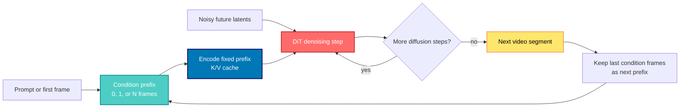
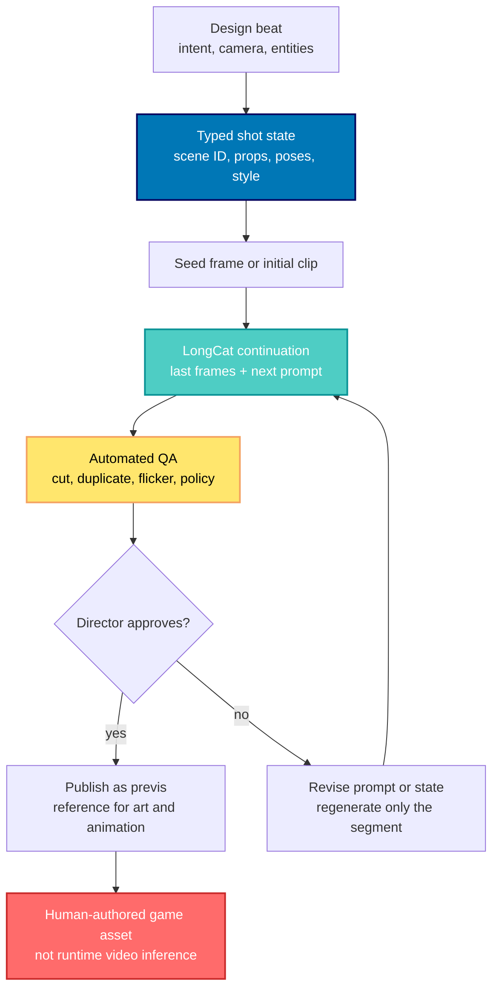

## 🤔 Curiosity: Is a Long Video Really Just a Better Next Frame?

When I build a game sequence, continuity is never an afterthought. A character must still be holding the sword they picked up one shot earlier. A camera move needs to land where the previous move left it. A player expects the world state to survive the cut, not to be repainted from a new prompt every six seconds.

That is why Meituan's [LongCat-Video](https://github.com/meituan-longcat/LongCat-Video) caught my attention. Its headline is a dense **13.6B-parameter** video Diffusion Transformer that can generate text-to-video, image-to-video, and video continuation. The more interesting claim is quieter: those are not three products in its design. They are the **same future-frame prediction problem**, with zero, one, or many frames placed in front of the noisy frames to be generated.

{: .w-100 .shadow .rounded-10 }
_Figure 1. The paper frames text-to-video, image-to-video, and video-continuation as one model family rather than three isolated systems. Source: [LongCat-Video technical report](https://arxiv.org/abs/2510.22200)_

That reframing raises a practical question I care about more than a leaderboard rank:

> **Can a video generator treat the last usable frames as runtime state, carry them forward cheaply, and become a reliable production loop rather than a one-shot prompt machine?**
{: .prompt-info}

I read the [technical report](https://arxiv.org/abs/2510.22200), the [official repository](https://github.com/meituan-longcat/LongCat-Video), the [Hugging Face model card](https://huggingface.co/meituan-longcat/LongCat-Video), the shipped Python pipeline, and a maintainer hardware discussion. The answer is nuanced:

- **Yes**, the condition-prefix design is unusually clean, and its key-value cache is exactly the right systems move for a fixed visual prefix.
- **Yes**, the paper's 480p-to-720p coarse-to-fine path is a serious inference design, not marketing decoration.
- **No**, the paper's fastest H800 benchmark is not what the current demo scripts execute by default.
- **No**, this is not an ordinary desktop-GPU workflow. The published base weights alone occupy about 83.3 GB of Hugging Face storage, and the supported demo path is explicitly CUDA and NCCL based.

The distinction matters. In game development, a gorgeous offline cinematic pipeline and a feature that can run inside a player's frame budget are both valuable, but they are not interchangeable. LongCat-Video belongs firmly in the first category today.

---

## 📚 Retrieve: One Model, One Condition Contract

### The source audit

Before drawing a systems diagram, I wanted to separate paper claims from the public implementation.

| Source | What I checked | Why it matters |
|:--|:--|:--|
| [Technical report](https://arxiv.org/abs/2510.22200) | Architecture, evaluation, sparse attention, and H800 timing table | The primary source for method and benchmark claims |
| [Official repository](https://github.com/meituan-longcat/LongCat-Video) | Installation requirements, demo entry points, MIT license | The runnable surface, not a summary of it |
| [`run_demo_long_video.py`](https://github.com/meituan-longcat/LongCat-Video/blob/main/run_demo_long_video.py) | Segment count, frame accounting, sampling calls | The actual long-video loop |
| [`pipeline_longcat_video.py`](https://github.com/meituan-longcat/LongCat-Video/blob/main/longcat_video/pipeline_longcat_video.py) | Condition-frame selection and KV-cache lifecycle | The implementation behind the paper diagram |
| [Model card](https://huggingface.co/meituan-longcat/LongCat-Video) | Public base weights and storage footprint | The realistic download boundary |
| [Maintainer discussion](https://github.com/meituan-longcat/LongCat-Video/issues/20) | Officially tested 80 GB and qualified 48 GB guidance | The hardware caveat missing from a simple quick-start command |

This is the same source-versus-runtime discipline I used when looking at [FreeToken's edge serving system](/posts/freetoken-edge-native-moe-serving/): a paper can prove a path exists, while a repository tells you which knobs are actually wired into the public release.

### The central move: condition count chooses the task

LongCat-Video's base model is a dense DiT, not an MoE. The report specifies 48 transformer layers with a 4096-wide hidden state, 16,384-wide feed-forward layer, and 32 attention heads. It uses a Wan2.1 VAE and an umT5 text encoder. The VAE downsamples video by 4 x 8 x 8, then patchification adds 1 x 2 x 2, so each transformer token represents a 4 x 16 x 16 region in pixel-time space.

The architectural novelty is not that inventory. It is the input contract:

| Requested task | Condition frames | Noisy frames to denoise | Same underlying question |
|:--|:--|:--|:--|
| Text-to-video | 0 | A complete clip | What should exist next from text alone? |
| Image-to-video | 1 | The rest of a clip | What should happen after this image? |
| Video-continuation | Multiple | The next clip | What should happen after these frames? |

The report writes the network input as a temporal concatenation:

$$
X = [X_{\mathrm{cond}}, X_{\mathrm{noisy}}]
$$

The condition part stays clean, receives timestep zero, and is excluded from the denoising loss. The noisy part receives a sampled diffusion timestep. The model therefore does not need a different transformer trunk for every task. It reads the shape of the prefix and knows which mode it is in.

{: .w-100 .shadow .rounded-10 }
_Figure 2. LongCat-Video concatenates clean condition frames with noisy target frames. A zero-frame prefix produces text-to-video; one frame produces image-to-video; a longer prefix produces continuation. Source: [technical report, Figure 5](https://arxiv.org/html/2510.22200v2)_

For a game developer, the analogy is a level-streaming boundary. The loaded zone is not redrawn every time the player crosses a trigger. It is a stable context that determines what the next streamed-in space is allowed to contain. LongCat's condition frames act like that loaded zone: visible, fixed, and semantically expensive to throw away.

### Fixed prefixes make the cache legitimate

The paper's block attention gives the condition tokens a special role:

$$
X_{\mathrm{cond}} = \operatorname{Attention}(Q_{\mathrm{cond}}, K_{\mathrm{cond}}, V_{\mathrm{cond}})
$$

$$
X_{\mathrm{noisy}} = \operatorname{Attention}(Q_{\mathrm{noisy}}, [K_{\mathrm{cond}}, K_{\mathrm{noisy}}], [V_{\mathrm{cond}}, V_{\mathrm{noisy}}])
$$

The clean prefix does not depend on the noisy target tokens. That makes its keys and values stable over a sampling invocation, so the implementation computes them once and reuses them at every denoising step.



The implementation backs this up. In [`generate_vc`](https://github.com/meituan-longcat/LongCat-Video/blob/main/longcat_video/pipeline_longcat_video.py), the last `num_cond_frames` video frames are VAE-encoded as the condition. With `use_kv_cache=True`, the pipeline prepares their cache before the denoising loop, then reuses it until that clip is finished.

There is an important boundary here: **the cache is reused across the diffusion steps of one continuation call, not magically across every later segment.** Each new segment changes the tail frames, so it needs a fresh condition cache. That is still valuable. It removes repeated prefix work from the most repetitive inner loop without pretending that temporal state is free.

Here is the underlying continuation loop in deliberately simplified form. It is a mental model, not a drop-in version of LongCat's API:

```python
# Conceptual pseudocode, not the repository's public API.
all_frames = generate_first_clip(num_frames=93)
current_clip = all_frames

for prompt in prompt_schedule:
    # The shipped pipeline takes the final 13 frames as the next condition.
    next_clip = continue_video(
        condition=current_clip[-13:],
        prompt=prompt,
        num_frames=93,
        cache_condition_kv=True,
    )
    all_frames.extend(next_clip[13:])  # Do not duplicate the carried prefix.
    current_clip = next_clip
```

The code is simple, but it answers a production question. A prompt schedule is not enough to make a longer sequence. You need a bounded visual state to carry between authoring turns, and you need a clear rule for what part of the resulting clip becomes that next state.

### The frame math exposes two demo realities

The repository's [`run_demo_long_video.py`](https://github.com/meituan-longcat/LongCat-Video/blob/main/run_demo_long_video.py) creates an initial 93-frame clip, then runs 11 continuation segments. Each segment uses 13 condition frames and contributes 80 new frames:

$$
F_{\mathrm{total}} = 93 + 11 \cdot (93 - 13) = 973
$$

At 15 fps, that is about:

$$
T = 973 / 15 \approx 64.9 \quad \text{seconds}
$$

before temporal refinement. That is a real minute-scale workflow, and the code writes an output after each segment so an operator can see progress.

The separate interactive demo deserves a more careful reading. It contains four prompts and sets `num_segments = len(prompt_list) - 1`, which is three continuations. The same accounting gives:

$$
93 + 3 \cdot (93 - 13) = 333 \quad \text{frames} \approx 22.2 \quad \text{seconds at 15 fps}
$$

Its nearby comment says "1 minute video," but the current prompt list and loop do not produce that duration. This is not a model flaw. It is exactly why I prefer to inspect the loop before repeating a repository comment in a production plan.

> **Production lesson:** store a structured shot state beside the condition frames. The pixels provide visual continuity; an explicit scene record provides recoverable intent when a segment needs review, regeneration, or a branching version.
{: .prompt-tip}

### The second move: generate cheaply, then refine selectively

High-resolution, high-frame-rate video makes attention expensive because token count grows across time, height, and width. LongCat-Video responds with a three-part inference stack:

1. **Distill** the 480p base sampling path from 50 steps to 16.
2. **Generate coarse first** at 480p and 15 fps.
3. **Refine** to 720p and 30 fps with a LoRA expert, then use 3D block sparse attention where the token volume is largest.

{: .w-100 .shadow .rounded-10 }
_Figure 3. Coarse-to-fine paths for text-to-video, image-to-video, and continuation. The condition frames must remain coherent through both stages. Source: [technical report, Figure 11](https://arxiv.org/html/2510.22200v2)_

The paper's key timing table was run on **one H800 GPU with FlashAttention 3**. That environment qualifier is part of the result, not fine print.

| Paper configuration, 93 frames unless noted | Sampling steps | Latency on H800 + FA3 | Relative speed |
|:--|:--:|--:|--:|
| Native 720p | 50 | 1429.5 s | 1.0x |
| Distilled native 720p | 16 | 244.6 s | 5.8x |
| 480p to 720p coarse-to-fine | 16 / 5 | 135.3 s | 10.6x |
| Coarse-to-fine plus BSA, 720p x 93 | 16 / 5 | 116.5 s | 12.3x |
| Coarse-to-fine plus BSA, 720p x 189 | 16 / 5 | 142.0 s | 10.1x |

The refinement is not just a resize. The low-resolution output is decoded, upsampled in RGB space, re-encoded, partly noised, and passed through a LoRA-trained refinement expert. The report argues that this yields both a faster route and better high-frequency detail than a direct native 720p path.

> **Do not read 116.5 seconds as the default CLI promise.** The public text-to-video and long-video demos call `generate_refine(num_inference_steps=50)`. The paper's fast row uses a five-step refiner. The benchmark is evidence that the method can be fast under its tested configuration; it is not evidence that every checkout executes the same schedule.
{: .prompt-warning}

That caveat is healthy engineering, not a dismissal. A speedup belongs to a concrete hardware, kernel, model, and sampling configuration. Treating it as a portable property of a model name is how a research prototype becomes a missed milestone.

### Block sparse attention turns redundant space-time into a budget

The third optimization is 3D Block Sparse Attention, or BSA. Rather than score every token against every token, the implementation pools query and key blocks, selects important key blocks, and runs exact attention only for that subset. The report says it retains less than 10% of the dense attention computation while maintaining near-lossless generation quality in its setting.

{: .w-100 .shadow .rounded-10 }
_Figure 4. The sparse-attention pipeline scores coarse 3D blocks, selects a subset, then computes attention only over the chosen blocks. Source: [technical report, Figure 12](https://arxiv.org/html/2510.22200v2)_

The source code is refreshingly direct: [`attention.py`](https://github.com/meituan-longcat/LongCat-Video/blob/main/longcat_video/modules/attention.py) routes the high-resolution path to `flash_attn_bsa_3d`, while [`bsa_interface.py`](https://github.com/meituan-longcat/LongCat-Video/blob/main/longcat_video/block_sparse_attention/bsa_interface.py) defines the 3D block construction and top-k selection. It is not merely a paper-only kernel.

For a game-engine analogy, this resembles a visibility system. The engine still renders selected geometry at full fidelity. It saves work by deciding which regions deserve that full work. BSA applies that idea to attention's space-time block graph.

### Quality: promising, but not a substitute for a world model

The paper's results are encouraging, especially because it reports both internal human evaluation and public VBench 2.0 scores. But the scores need to be read by task, not collapsed into a single "best" label.

| Evaluation slice | LongCat-Video result | What I take from it |
|:--|:--|:--|
| Internal text-to-video MOS | Competitive overall, with Veo 3 ahead | Strong positioning, but the comparison is the authors' internal benchmark |
| Internal image-to-video visual quality | 3.27, the best reported in that comparison | Good frame aesthetics are a real strength |
| Internal image-to-video overall quality | 3.17, below Seedance 1.0's 3.35 | Visual polish does not automatically equal best temporal or image alignment |
| VBench 2.0 total | 62.11 | A credible public benchmark result, behind Veo 3 and Vidu Q1 in the reported table |
| VBench 2.0 commonsense | 70.94, best in the reported table | A useful signal for plausible everyday actions |
| VBench 2.0 physics | 59.92, below Vidu Q1's 71.63 | Do not market continuation as solved physical simulation |

The image-to-video table is particularly instructive. The report says LongCat leads its internal comparison in visual quality, while trailing the best scores in image alignment, motion quality, and overall quality. That is a very familiar production profile: a beautiful asset can still fail if it does not honor the previous shot's state.

{: .w-100 .shadow .rounded-10 }
_Figure 5. Long-video continuation examples, including changing instructions across clips. Source: [technical report, Figure 19](https://arxiv.org/html/2510.22200v2)_

Calling this a step toward world models is fair as research motivation. Calling it a world model would be premature. A convincing minute of generated continuity is evidence of a useful visual prior. It is not proof of durable object identity, causal reasoning, simulation correctness, or controllable game-state transitions.

### The hardware truth: this is an offline pipeline

The README asks for Python 3.10, PyTorch 2.6.0 with CUDA 12.4, FlashAttention 2.7.4.post1, and uses `torchrun` plus NCCL in the public demos. That makes the supported route NVIDIA CUDA-centric. The official start command is concise:

```bash
# Official repository command after model download and CUDA setup.
torchrun run_demo_long_video.py \
  --checkpoint_dir=./weights/LongCat-Video \
  --enable_compile
```

The short command conceals a large operating envelope:

| Constraint | What the official materials support | Planning implication |
|:--|:--|:--|
| Model storage | Hugging Face reports about 83.3 GB for the base model repository | Reserve disk, bandwidth, and cache time before a test day |
| Full functionality | A maintainer says its code was tested with 80 GB VRAM | Treat 80 GB as the supported starting point, not an optional luxury |
| Qualified 48 GB route | Long-video generation plus **spatial-only** refinement, with CPU text-encoder offload and allocator settings | It is not the full 720p, 30 fps temporal-refinement path |
| macOS, AMD, or CPU-only | No supported public demo path | Do not schedule an on-device demo around it |
| Consumer 24 GB card | Not the official baseline | Consider it an experimentation project, not a committed pipeline dependency |

The repository now also contains [LongCat-Video-Avatar-1.5](https://meigen-ai.github.io/LongCat-Video-Avatar-1.5-Page/), an audio-driven human-video branch released later. Its Whisper-Large encoder, eight-step distillation, and optional INT8 path belong to that separate Avatar model. They should not be used to inflate the capabilities or efficiency claims of the base LongCat-Video analyzed here.

---

## 💡 Innovation: What I Would Actually Ship With It

The practical product is not "an AI that makes a whole game video." It is an **offline, stateful previsualization and authoring loop** that gives a team a faster way to explore directed motion, transitions, and shot continuity.

### A production-shaped loop for game teams

I would keep the condition frames, but I would not let them become the only source of truth. Pair them with a small versioned scene record:



The state record can be mundane: character identity, current prop, camera direction, location, mood, action goal, and the exact condition-frame hash. Its value is that a human can inspect it, a tool can validate it, and a regeneration can preserve it even when the pixels change.

| Production use | Why LongCat's design helps | Boundary I would keep |
|:--|:--|:--|
| Cutscene previs | Continuation prefixes make "what happens next" explicit | Final animation remains a human-owned asset pipeline |
| Trailer and pitch exploration | Longer directed runs reduce the number of disconnected six-second samples | Review every segment for identity drift and unsafe content |
| Quest and quest-giver ideation | Prompt changes per continuation segment support beat-by-beat exploration | Do not turn raw generations into canonical lore without review |
| Camera and mood reference | Coarse-to-fine output can deliver a sharper reference than a storyboard alone | Reference quality is not a performance target for the shipped game |

### A small, honest adoption plan

1. **Prove the environment first.** Verify CUDA, FlashAttention, model download, and a short 480p single-clip run before promising a long-video review.
2. **Test a continuity rubric, not just a beauty rubric.** Score prop persistence, character count, left-right direction, camera direction, and action completion at every segment boundary.
3. **Use temporal refinement only when its hardware and output benefits are measured.** Spatial-only refinement is a valid lower-memory compromise, but it is a different output path.
4. **Keep prompts and state metadata under source control.** The valuable artifact is not only the MP4. It is the repeatable recipe that produced a reviewable version.

> The first success metric should be "can a director revise shot 4 without rebuilding shots 1 to 3?" LongCat's prefix design makes that question tractable. It does not answer it by itself.
{: .prompt-tip}

### Honest tradeoffs

| Strength | Cost or risk | Mitigation |
|:--|:--|:--|
| One task contract for T2V, I2V, and continuation | A unified model can still underperform a specialist on a specific metric | Evaluate by task, especially image alignment and motion |
| Fixed-prefix KV caching | Cache only helps while the prefix is unchanged inside a call | Batch meaningful work inside a continuation invocation |
| Coarse-to-fine quality and speed story | Benchmark timing depends on H800, FA3, and a 16/5 schedule | Record hardware, kernels, and sampling settings with every benchmark |
| Minute-scale chained outputs | Error can accumulate at each boundary | Use a shot-state record, boundary QA, and regenerate segments selectively |
| MIT code and public weights | The operational envelope is still large | Treat GPU capacity and disk storage as first-class project requirements |

### New Questions This Raises

1. **Can condition frames be paired with structured scene memory?** A video prefix holds visual evidence, but a typed state graph could carry object identity and gameplay intent across longer branches.
2. **What is the right continuity test for generative previs?** Frame-level image metrics miss the failures that matter to a director: a sword moves hands, a character reverses direction, or a door reappears.
3. **Can sparse attention be exposed as an authoring budget?** It is easy to call BSA a kernel optimization. The interesting product question is whether a tool can spend more attention around combat beats or camera cuts and less on stable background.
4. **Where should regeneration start?** A condition-prefix architecture invites checkpointing. The best checkpoint may be a semantic beat, not every fixed number of frames.
5. **What would make this a real world-model component?** Visual plausibility is a beginning. The next evidence needs controlled state transitions, robust causal interventions, and external evaluation beyond a beautiful continuation sample.

## Key Takeaways

| Takeaway | Why it matters |
|:--|:--|
| LongCat-Video's core idea is a condition-prefix contract | T2V, I2V, and continuation are one future-frame task with different prefix lengths |
| The KV cache is a systems feature, not a buzzword | The clean prefix stays fixed through one sampling loop, so its K/V state can be reused honestly |
| The public long demo is about 64.9 seconds before refinement | It is a real chained workflow: 93 initial frames plus 11 x 80 new frames at 15 fps |
| Paper speed and default scripts differ | The 116.5-second H800 result uses 16/5 steps; current public refiners call 50 steps |
| This is an offline production tool today | CUDA, NCCL, about 83.3 GB of model storage, and an 80 GB tested VRAM baseline put it outside casual laptop workflows |
| Visual continuity is not world-model proof | The public and internal evaluation results are promising, but physics, alignment, and durable state remain open work |

LongCat-Video is most compelling when I stop asking it to be an all-purpose video button. It is a carefully designed continuity machine: a model that lets a team say, "here is what the world looked like; now move it forward." That is a useful primitive for production, and it is exactly the sort of primitive worth hardening with explicit state, review gates, and honest benchmarks.

## References

### Primary research

1. Meituan LongCat Team. [*LongCat-Video: A Unified Video Generation Model for Long Video and Multi-Task Generation*](https://arxiv.org/abs/2510.22200), 2025. See the [HTML technical report](https://arxiv.org/html/2510.22200v2) for the figures and tables quoted above.
2. Meituan LongCat Team. [LongCat-Video project page](https://meituan-longcat.github.io/LongCat-Video/).

### Code, weights, and operational evidence

3. Meituan LongCat Team. [LongCat-Video GitHub repository](https://github.com/meituan-longcat/LongCat-Video), MIT License.
4. Meituan LongCat Team. [`run_demo_long_video.py`](https://github.com/meituan-longcat/LongCat-Video/blob/main/run_demo_long_video.py) and [`run_demo_interactive_video.py`](https://github.com/meituan-longcat/LongCat-Video/blob/main/run_demo_interactive_video.py).
5. Meituan LongCat Team. [`pipeline_longcat_video.py`](https://github.com/meituan-longcat/LongCat-Video/blob/main/longcat_video/pipeline_longcat_video.py) and [3D block sparse-attention implementation](https://github.com/meituan-longcat/LongCat-Video/tree/main/longcat_video/block_sparse_attention).
6. Meituan LongCat Team. [LongCat-Video weights on Hugging Face](https://huggingface.co/meituan-longcat/LongCat-Video).
7. Meituan LongCat Team. [Maintainer guidance on long-video VRAM requirements](https://github.com/meituan-longcat/LongCat-Video/issues/20).

### Related model branch

8. Meituan LongCat Team. [LongCat-Video-Avatar-1.5 project page](https://meigen-ai.github.io/LongCat-Video-Avatar-1.5-Page/). This is a separate audio-driven model branch, cited here only to distinguish it from the base model.
