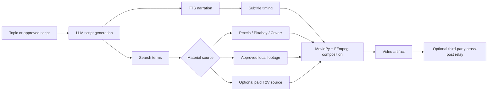
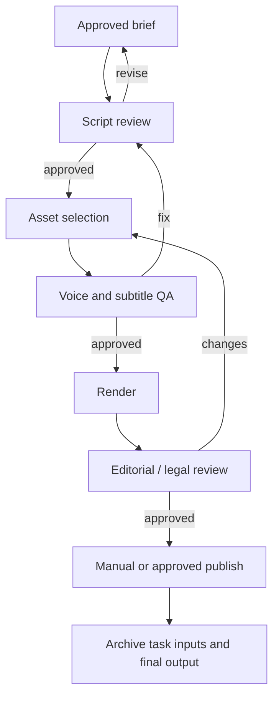

## 🤔 Curiosity: What Does an "AI Video Generator" Actually Generate?

When a game team says, "we need an AI tool for trailers," the useful question is not whether a model can produce a beautiful five-second clip. It is whether the team can repeatedly turn an approved idea into a reviewable video, swap the wrong shot, trace where an asset came from, fix a subtitle, and render another version without rebuilding the whole job by hand.

That is why [MoneyPrinterTurbo](https://github.com/harry0703/MoneyPrinterTurbo) caught my attention. Its name promises a one-click short-video machine. The repository can indeed accept a topic and return a finished vertical, horizontal, or square video with narration, subtitles, music, and footage. But its default path is more interesting than the headline suggests:

> **MoneyPrinterTurbo is primarily a production pipeline. It asks an LLM for a script and search terms, retrieves or accepts footage, creates speech and subtitles, then composes the result with a conventional video renderer.**
{: .prompt-info}

{: .w-100 .shadow .rounded-10 }
_Figure 1. The WebUI exposes a chain of choices rather than a single opaque video-model prompt. Source: [MoneyPrinterTurbo v1.3.5 WebUI image](https://github.com/harry0703/MoneyPrinterTurbo/blob/v1.3.5/docs/webui-en.jpg)_

That distinction changes how I would evaluate it. A text-to-video foundation model is judged by motion, physics, character consistency, and inference cost. A production control plane is judged by **handoffs, inspectability, provenance, failure recovery, and the number of human approvals it can preserve**.

For this dated review, I pinned the source to [release v1.3.5](https://github.com/harry0703/MoneyPrinterTurbo/releases/tag/v1.3.5), published on 2026-08-22 and anchored at commit [`5dde463`](https://github.com/harry0703/MoneyPrinterTurbo/tree/v1.3.5). The default branch is a moving target; a date-specific post should not quietly inherit changes made after its publication date.

| Question | A text-to-video model | MoneyPrinterTurbo's default path |
|:--|:--|:--|
| Where do the visible shots come from? | A generative model synthesizes them | Stock-video search, supplied local clips, or an optional paid generation source |
| What is the central unit of work? | Prompt plus model inference | A task containing script, search terms, audio, subtitles, materials, and render settings |
| Where can a team intervene? | Usually prompt, seed, and selected frames | At each pipeline stage, including local footage and a prepared script |
| What is the main production risk? | Visual quality and compute cost | Incorrect copy, asset rights, service credentials, vendor latency, and silent stage failures |
| Best fit | A novel shot that does not exist | Repeatable explainers, updates, listicles, localization, and asset-backed campaigns |

The practical opportunity is not "replace every editor with one prompt." It is to make the boring, high-frequency assembly work programmable while keeping a human accountable for the creative and legal decisions.

---

## 📚 Retrieve: Read the Pipeline, Not the Landing-Page Promise

### The source audit

I checked the dated release, public implementation, configuration template, command-line surface, and open discussions rather than treating the README description as a complete architecture document.

| Source | What I checked | Why it matters |
|:--|:--|:--|
| [v1.3.5 release notes](https://github.com/harry0703/MoneyPrinterTurbo/releases/tag/v1.3.5) | New providers, paid material sources, security changes, and upgrade notes | The public contract closest to 2026-08-23 |
| [`task.py`](https://github.com/harry0703/MoneyPrinterTurbo/blob/v1.3.5/app/services/task.py) | The shared orchestration path and stage boundaries | It shows what actually happens after a task starts |
| [`config.example.toml`](https://github.com/harry0703/MoneyPrinterTurbo/blob/v1.3.5/config.example.toml) | Defaults, credentials, material sources, limits, and network binding | Configuration reveals the real product surface |
| [`cli.py`](https://github.com/harry0703/MoneyPrinterTurbo/blob/v1.3.5/cli.py) | Local-assets workflow and `--stop-at` checkpoints | The CLI is the clearest interface for repeatable production work |
| [Issue #1183](https://github.com/harry0703/MoneyPrinterTurbo/issues/1183) | Community request to clarify the underlying video-generation mechanism | A useful check against the common assumption that every output is natively generated |
| [Issue #1233](https://github.com/harry0703/MoneyPrinterTurbo/issues/1233) and the release notes | An unauthenticated arbitrary local-file read report involving `custom_audio_file`, plus the subsequent hardening | A reminder that a media tool is also a file and credential service |

The core orchestration function in [`app/services/task.py`](https://github.com/harry0703/MoneyPrinterTurbo/blob/v1.3.5/app/services/task.py#L1213) follows a recognizable production graph. The exact provider can change, but the job shape stays stable:



This is exactly the kind of graph that feels familiar in game production. Replace "script" with a quest brief, "materials" with environment assets, and "render" with a build step. The key insight is that the output is not magic. It is a dependency graph whose edges need policies.

### A task is a bundle of editable evidence

The pipeline has a useful property: it can stop at named stages. The command-line interface documents checkpoints for `script`, `terms`, `audio`, `subtitle`, `materials`, and `video`. That means a team can inspect what the system *plans* to say and show before it spends time rendering a final artifact.

For a studio or brand with an asset library, I would start from local approved footage instead of asking the default stock search to choose the visual language. This is a small but powerful workflow:

```bash
# Stop at a non-publishing checkpoint. Run from the pinned v1.3.5 checkout.
uv run python cli.py \
  --video-subject "Patch 1.4: Frost Citadel preview" \
  --video-source local \
  --video-materials "./approved/fortress.mp4,./approved/boss.mp4" \
  --stop-at materials
```

This stops after the local-material checkpoint. It creates a repeatable place to review the copy and footage before rendering. If the script is not ready, stop earlier. If the visual sequence is wrong, replace the material list. If subtitles do not meet a language or accessibility standard, fix that input before the final render.

The `video` stage is the default final stage, and it also runs configured cross-posting. Only use it after confirming `upload_post_enabled = false` and `upload_post_auto_upload = false`, or after routing publishing through a separately approved release process.

> **A video pipeline becomes production-ready when each intermediate artifact can be reviewed, replaced, and attributed. A one-click final export is the last step, not the first quality gate.**
{: .prompt-tip}

### Where do the pixels come from?

The configuration is unusually candid when read closely. Its default [`video_source = "pexels"`](https://github.com/harry0703/MoneyPrinterTurbo/blob/v1.3.5/config.example.toml#L65-L71), and the task schema also defaults to Pexels. The project supports other stock sources, local footage, and opt-in text-to-video providers, but those are different operating modes with different cost and rights profiles.

| Material mode | What the pipeline does | Surface in v1.3.5 | Cost and approval implication | My production use |
|:--|:--|:--|:--|:--|
| Pexels, Pixabay, Coverr | Searches and downloads stock clips from script terms | CLI, WebUI, API | Provider keys and each provider's license terms still apply | Fast internal prototypes, never a substitute for an asset audit |
| Local | Preprocesses supplied clips instead of searching | CLI, WebUI, API | The team owns the asset selection and must document its rights | Best starting point for games, product launches, and branded work |
| WaveSpeed | Sends terms to a text-to-video provider | WebUI and API, not CLI | Billed requests and external provider credentials | Isolate behind an explicit budget and human review gate |
| LoomLoom | Uses a paid Shengsuan Cloud material source | WebUI only, not CLI or API | Requires separate credentials and an explicit confirmation path in the WebUI | Treat as a distinct vendor workflow, not a default fallback |

The project can also use an optional TwelveLabs integration to rank or check video materials, but that is not the same as proving a shot is accurate, licensed, on-brand, or safe for a specific campaign. Semantic matching can improve retrieval. It cannot replace editorial judgment.

{: .w-100 .shadow .rounded-10 }
_Figure 2. The API surface reflects the task-oriented design: a caller submits work and receives a generated artifact rather than calling a monolithic video model directly. Source: [MoneyPrinterTurbo v1.3.5 API image](https://github.com/harry0703/MoneyPrinterTurbo/blob/v1.3.5/docs/api.jpg)_

### The hardening pass matters, but secure defaults matter more

v1.3.5 is not just a provider release. Its security notes include optional API-key authentication, restrictions on custom audio paths, task-file symlink protections, stricter local upload validation, and request-ID sanitization. That is a meaningful response to a media service that accepts paths, uploads, and credentials.

The timing matters. [Issue #1233](https://github.com/harry0703/MoneyPrinterTurbo/issues/1233) reported an unauthenticated arbitrary local-file read through the `custom_audio_file` path before the v1.3.5 hardening. It is a concrete reason to upgrade rather than assuming that a local media utility needs no security posture.

But there is an operational catch: the supplied template binds the API to `0.0.0.0` and leaves `app.api_key` empty for backward compatibility. The official Docker Compose files bind host ports to loopback, which is safer, but a direct configuration can still expose an unauthenticated service if copied without thought.

My minimum local-first starting configuration would look like this:

```toml
# config.toml
listen_host = "127.0.0.1"
listen_port = 8080

[app]
api_key = "store-a-strong-secret-outside-version-control"
tls_verify = true
video_source = "local"
max_concurrent_tasks = 1
max_queued_tasks = 4
```

Do not copy a real API key into a repository, exported WebUI preset, or tutorial screenshot. The v1.3.5 upgrade notes explicitly warn that preset exports can include provider credentials when key backup is enabled.

> **Do not put MoneyPrinterTurbo's API directly on the public internet. Keep it loopback-only or behind an authenticated reverse proxy, configure `app.api_key`, and use an explicit approval boundary before any paid video generation or cross-posting.**
{: .prompt-warning}

There is another small supply-chain detail worth making explicit. The project uses [`uv`](https://docs.astral.sh/uv/) for the pinned application environment and points Docker users to the official GitHub Container Registry image, `ghcr.io/harry0703/moneyprinterturbo`. A same-named [PyPI project](https://pypi.org/project/moneyprinterturbo/) lists a different author and homepage, yet advertises version 1.4.5, higher than this upstream v1.3.5 release. That version inversion is an easy trap: it is not the repository's official package release. For reproducibility, use the pinned source tag or the official registry image, not a similarly named package discovered by search.

### Honest trade-offs

MoneyPrinterTurbo is a promising production utility, not a turnkey content factory. Its most important limitations are architectural, not cosmetic:

1. **The default product is retrieval plus editing, not end-to-end generative video.** That can be an advantage for control and repeatability, but it means script-to-shot alignment is limited by search terms, the asset catalog, and the selector.
2. **LLM-generated copy still needs a subject-matter editor.** A plausible script can be inaccurate, overclaim, use the wrong tone, or make a localization error before the renderer ever begins.
3. **Subtitles are a production check, not an automatic guarantee.** The pipeline treats subtitle generation as a recoverable stage, so teams should verify that final artifacts actually contain legible, synchronized captions.
4. **Paid integrations create cost paths.** WaveSpeed generation is billed. A confirmation affordance in a WebUI is helpful, but an API integration should have its own budget, user, and logging policy.
5. **Cross-posting is delegation, not ownership.** The template disables the external `upload-post.com` relay by default, but a changed configuration can make the final video stage publish. Keep publishing as a separately approved operation and retain a local copy of every final artifact.
6. **MIT code is not a blanket clearance for every output asset.** The repository license covers the code, while stock clips, external voices, generated material, bundled music, fonts, platform accounts, and campaign claims all retain their own rules. The README's note about bundled music is a useful signal to do an independent asset review.

This is not a reason to dismiss the project. It is the reason to use it for the job it actually performs.

---

## 💡 Innovation: Treat Video Automation Like a Build System

The innovation I see here is not a new diffusion architecture. It is the decision to turn short-form video into a composable job with stable stages. That makes MoneyPrinterTurbo closer to a build system than a camera.



A game team already understands why this pattern works. You do not want a trailer build that hides its source footage, copies unreviewed patch notes into narration, and posts itself before someone has checked the final frame. You want a build that is quick to reproduce because its inputs are explicit.

That leads to a more durable definition of AI video automation:

- **LLMs draft the narrative and queries.**
- **Humans approve claims, tone, and visual intent.**
- **A pipeline assembles known assets and records settings.**
- **A renderer produces the deliverable.**
- **Publishing remains an accountable business action.**

This framing also makes a useful connection to [FreeToken's edge-native MoE serving](/posts/freetoken-edge-native-moe-serving/). In both cases, the valuable systems question is not just "can the model run?" It is "which state, dependencies, and policies must survive long enough for a real workflow to be dependable?" For MoneyPrinterTurbo, the critical state is a task's script, materials, provider settings, credentials, and artifact history.

### A practical adoption ladder

I would introduce the project in four deliberately boring steps:

| Step | Scope | Evidence required before moving on |
|:--|:--|:--|
| 1. Offline proof | Local clips, a prepared script, no cross-posting | A rendered video whose shots and captions were reviewed manually |
| 2. Assisted drafting | LLM scripts and search terms, still using a human asset picker | A copy-review checklist and saved approved inputs |
| 3. Controlled retrieval | One stock provider with documented license workflow | Asset-source records, failed-search behavior, and a cost ceiling |
| 4. Limited automation | Internal API, authentication, logs, queues, and publishing approval | A threat model, credential policy, audit trail, and rollback procedure |

The shortcut is tempting: expose the API, turn on a paid provider, and automate social posting. The better route is to earn each automation step with evidence. Video is public, expensive to correct after distribution, and unusually good at making small mistakes visible at scale.

### Key Takeaways

| Takeaway | Why it matters |
|:--|:--|
| MoneyPrinterTurbo's default video source is Pexels, not a foundation video model | Evaluate it as an orchestration and editing system, not solely as a generative-video model |
| Its strongest capability is the explicit task pipeline | Script, audio, subtitles, materials, and render settings create natural review points |
| Local footage is the highest-control material mode | It gives game teams and brands clearer provenance and visual consistency |
| v1.3.5 materially improves file and API hardening | Upgrade, but also set loopback binding and an API key because secure behavior is not the default everywhere |
| Paid generation and distribution need their own gates | UI confirmation is not a governance system for API or operational use |
| The right mental model is a video build system | Treat every final video as a reproducible artifact with attributable inputs |

### New Questions This Raises

1. Could the task schema store a signed provenance manifest for every clip, voice, provider request, and final render?
2. Should an asset-ranking system score not only semantic relevance but also campaign restrictions, locale, release date, and rights metadata?
3. What does a strong evaluation suite for short-video automation look like: factuality, subtitle readability, brand compliance, shot relevance, or conversion performance?
4. Can a production pipeline preserve human ownership while automatically generating enough variants to make localization and live-ops communication realistic for small teams?
5. What would it take to make publishing an idempotent, auditable final stage rather than a one-way vendor call?

MoneyPrinterTurbo is most compelling when it is allowed to be what it is: an approachable, open-source assembly line for short-form video. Give it a clear brief, owned assets, review gates, and a protected runtime. Then it can turn repetitive production work into a system without pretending that responsible creative judgment has disappeared.

---

## References

### Primary sources

- [MoneyPrinterTurbo repository at v1.3.5](https://github.com/harry0703/MoneyPrinterTurbo/tree/v1.3.5)
- [v1.3.5 release notes](https://github.com/harry0703/MoneyPrinterTurbo/releases/tag/v1.3.5)
- [`app/services/task.py` pipeline implementation](https://github.com/harry0703/MoneyPrinterTurbo/blob/v1.3.5/app/services/task.py)
- [`config.example.toml` defaults and provider configuration](https://github.com/harry0703/MoneyPrinterTurbo/blob/v1.3.5/config.example.toml)
- [`cli.py` command-line task checkpoints](https://github.com/harry0703/MoneyPrinterTurbo/blob/v1.3.5/cli.py)
- [MIT license](https://github.com/harry0703/MoneyPrinterTurbo/blob/v1.3.5/LICENSE)

### Security and operational context

- [Issue #1183: clarify the video-generation mechanism](https://github.com/harry0703/MoneyPrinterTurbo/issues/1183)
- [Issue #1233: unauthenticated local-file read report involving custom audio](https://github.com/harry0703/MoneyPrinterTurbo/issues/1233)
- [Official GitHub Container Registry package](https://github.com/harry0703/MoneyPrinterTurbo/pkgs/container/moneyprinterturbo)
- [PyPI project bearing the same name](https://pypi.org/project/moneyprinterturbo/)
- [upload-post API documentation](https://docs.upload-post.com/)
