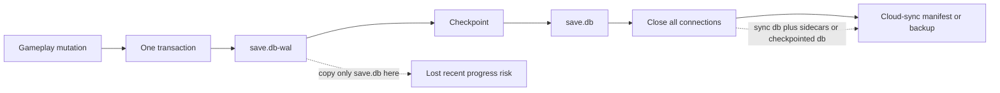
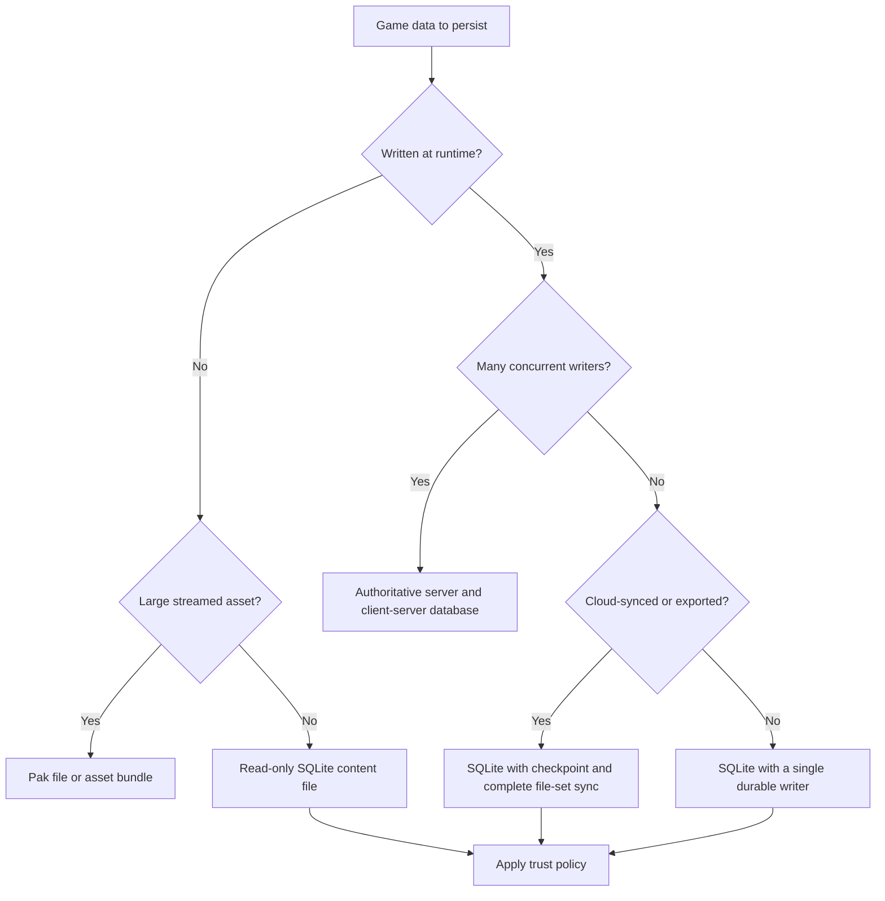

## 🤔 Curiosity: When Is a Save File More Than a File?

A game save is often treated as an implementation detail right up to the moment it destroys a player's evening. Then it becomes a production problem: an autosave races a cloud-sync daemon, a console build cannot see the path it used on desktop, a modded file turns into untrusted input, or the process dies halfway through a checkpoint.

That is why [Joe Wilson's "SQLite for Everything"](https://joecode.com/2026-08-19-sqlite3/) landed with me. Its central observation is powerful: SQLite removes a network round trip because the database is a file opened in-process, not a remote system to operate. I agree with the direction. For a local tool, a small service, or a prototype, that compactness changes the entire architecture.

Games force a sharper question, though:

> **If SQLite's superpower is being a file, what happens in the software domain that constantly virtualizes, stages, synchronizes, locks, and sometimes forbids ordinary files?**
{: .prompt-info}

{: .w-100 .shadow .rounded-10 }
_Figure 1. Original diagram for this article. SQLite is a storage primitive, not a universal replacement: the write pattern and file-lifecycle contract decide the fit._

I did not want to answer that with database fandom. I read the source article, SQLite's application-file, WAL, security, long-term-support, and "when to use" documentation, plus the August 2026 WAL-reset update. The result is more useful than either "SQLite everywhere" or "never put a database in a game": **SQLite is excellent game infrastructure when its file lifecycle is designed as deliberately as its schema.**

| The usual question | The game-production question |
|:--|:--|
| SQLite or PostgreSQL? | Which data class needs a local transactional file? |
| Is WAL faster? | Can cloud sync, backups, and crash recovery preserve every WAL sidecar? |
| Is a save file editable? | Is player editability a feature, a cheat vector, or both? |
| Can we add more writers? | Which system owns the one durable writer at this moment? |

The source article is right to push teams away from needless distributed systems. My addition is that a game runtime has to earn the simplicity of "just a file." That is a design contract, not a pragma.

---

## 📚 Retrieve: The Local Database Contract

### A source audit, not a slogan audit

Joe Code's post is intentionally broad and rhetorical. It is a useful spark, but I wanted primary documentation for the claims that affect saved progress, player trust, and shipping risk.

| Source | What I checked | What it changes for a game team |
|:--|:--|:--|
| [Joe Code: SQLite for Everything](https://joecode.com/2026-08-19-sqlite3/) | The "file and function call" framing, local queues, blobs, and system consolidation | The idea is worth testing, but not copying as a universal recipe |
| [SQLite application-file format](https://sqlite.org/appfileformat.html) | Atomic updates, partial loading, cross-platform bytes, and incremental writes | A save can be queryable and crash-resilient without rewriting a whole JSON document |
| [When to use SQLite](https://sqlite.org/whentouse.html) | One-writer design, client/server boundary, and the `fopen()` comparison | SQLite is a strong local primitive, not an authoritative multiplayer database |
| [WAL documentation](https://sqlite.org/wal.html) | Sidecar files, checkpoints, network-filesystem limits, and the WAL-reset fix | A database file is not necessarily a one-file save while WAL is active |
| [SQLite security guidance](https://sqlite.org/security.html) | Defensive mode, trusted-schema policy, checks, limits, and memory mapping | Player saves and mod databases must be handled as untrusted input |
| [SQLite long-term support](https://sqlite.org/lts.html) | Compatibility promise and test posture | Long-lived save formats are a reasonable goal, not blind faith |

The current release context matters too. As of this post's date, SQLite lists [3.53.4](https://sqlite.org/changes.html) as the current release, published 2026-07-24. That freshness is important because the source article appeared only five days before SQLite's own WAL page linked an independent reproducer for a long-lived concurrency bug.

### Why SQLite is unusually good at local game data

SQLite's own positioning is refreshingly concrete: it competes with `fopen()`, not with a client-server database. That makes sense for several game-shaped workloads:

- **A database file is cross-platform data.** SQLite documents a stable, bit-for-bit file format across 32-bit and 64-bit architectures and big-endian and little-endian machines.
- **Writes are incremental.** Changed pages are written rather than a complete document being reserialized on every small update. That maps naturally to frequent autosaves and compact state changes.
- **Reads are selective.** A title screen can query a few profile rows rather than parse an entire progression document before it knows what to display.
- **Transactions are a real boundary.** A quest completion, inventory mutation, and checkpoint stamp can commit together or not at all.

{: .w-75 .shadow .rounded-10 }
_Figure 2. SQLite's layered architecture, vectorized by Wikimedia Commons user Dimon4ezzz and credited to the SQLite code authors. Source: [Wikimedia Commons](https://commons.wikimedia.org/wiki/File:SQLite_Architecture.svg), [CC0 1.0](https://creativecommons.org/publicdomain/zero/1.0/); redrawn from the SQLite architecture documentation._

That is a compelling alternative to hand-rolled binary serializers. It is also a reason to keep the scope honest. SQLite has unlimited readers but only one writer per database file. The official guidance explicitly points teams toward a client-server database when many writers must share the same data at once. A matchmaking or authoritative combat service is not made local merely because its data fits in a `.db` file.

### WAL solves a concurrency problem and creates a file-lifecycle problem

Write-ahead logging is where the attractive story becomes operational. In WAL mode, writes first land in a `save.db-wal` file and shared state can involve `save.db-shm`. Readers can keep using the main database while a writer appends to the log. That is often ideal for a background autosave thread.

It also means that copying only `save.db` at the wrong moment is not a backup. SQLite warns that separating a WAL database from its `-wal` file can lose committed transactions or corrupt the database. WAL also does not work over a network filesystem.



For a game, the implementation rule is simple even if the code is not:

1. Treat `save.db`, `save.db-wal`, and `save.db-shm` as one runtime unit while WAL is active.
2. Before a cloud-sync, backup, account migration, or support export, close all connections and checkpoint successfully, or copy the complete SQLite set as one unit.
3. Do not put a live WAL database on a network filesystem and assume the locking story will behave like a local disk.

> **WAL improves read/write overlap. It does not restore the single-file distribution property until the application deliberately reaches a safe synchronization point.**
{: .prompt-warning}

### Open player data like untrusted data

A player save is not merely your database. On PC it may be user-modified. In a mod ecosystem it may be intentionally generated elsewhere. In support workflows it may be an attachment. SQLite's security checklist is therefore more relevant to games than the usual "SQLite is embedded, so it is safe" intuition.

```sql
-- FIRST SQL statement after opening an untrusted player-provided database.
PRAGMA quick_check;

-- Continue only when quick_check returns exactly "ok".
PRAGMA trusted_schema = OFF;
PRAGMA cell_size_check = ON;
PRAGMA mmap_size = 0;

-- Connection policy for a valid save, not a substitute for the checks above.
PRAGMA foreign_keys = ON;
PRAGMA busy_timeout = 5000;

-- At a controlled cloud-sync or support-export boundary, after other connections close:
-- Read the first result column. If busy is not 0, do not sync yet.
PRAGMA wal_checkpoint(TRUNCATE);
```

The point is not that these lines make a save cheat-proof. They do not. `quick_check` must run first, and the application must reject or quarantine a result other than `ok`; it is a structural check, not proof that every intended transaction was retained. Defensive database configuration, prepared statements, `SQLITE_DBCONFIG_DEFENSIVE`, `sqlite3_limit()`, and an application-level schema/version check belong in the same review as input validation for network packets.

There is an important tradeoff inside this snippet: disabling memory-mapped I/O is part of SQLite's untrusted-database posture, but it may remove a fast read path. That is exactly the kind of choice a game team should make explicitly. Trusted, shipped, read-only content and player-writable saves do not deserve the same connection policy.

### Reliability includes the version you actually ship

SQLite's reliability culture is real. Its published test documentation describes 100% branch and MC/DC coverage in deployment configuration and a 590-to-1 test-code-to-library-code ratio measured at version 3.42.0. Its maintainers state an intent to support SQLite through 2050 while preserving the C API and on-disk format.

Those facts do not mean versions are interchangeable.

The [WAL-reset bug note](https://sqlite.org/wal.html#walresetbug) documents a rare race involving WAL, concurrent connections, checkpointing, and a reset of the WAL index. It existed from 3.7.0 through 3.51.2 and was fixed in 3.51.3, with backports in 3.50.7 and 3.44.6. SQLite describes a failure mode in which part of a transaction never reaches the database file and corruption results. On 2026-08-24, SQLite updated that page to link [Phil Eaton's independent reproducer](https://theconsensus.dev/p/2026/08/23/another-look-at-sqlite-wal-reset.html), which reports both data loss and occasional corruption detectable by `integrity_check`.

SQLite's own framing is also proportional: this is not an emergency, and its observed occurrence rate appears no higher than the expected rate of SSD malfunctions or cosmic-ray effects. It is still an argument to treat the bundled version as a production dependency, especially when an engine, plugin, or platform SDK supplies it for you.

> **If a game uses WAL, pin and test the SQLite version that ships in the build. Upgrade to a fixed release line, then test interruption, checkpointing, and cloud-sync timing as a single scenario.**
{: .prompt-warning}

---

## 💡 Innovation: The SQLite Game Save Contract

The useful innovation is not "replace every game service with SQLite." It is a small storage contract that teams can review per data class.

| Data class | Typical access pattern | SQLite fit | Production contract |
|:--|:--|:--|:--|
| Player save state | Small, frequent writes; must survive interruption | Strong, with care | Version pin, transaction boundaries, WAL sidecar policy, cloud-sync tests |
| Settings and key bindings | Tiny, rare writes | Weak | A simple text file can be easier to inspect, merge, and support |
| Read-only content tables | Thousands of rows; indexed reads | Strong | Package as immutable data and open read-only where possible |
| Offline telemetry buffer | Append locally, upload in batches | Strong | Batch writes in transactions; apply retention and upload backpressure |
| Localization data | Read-heavy, scoped by locale | Good | Keep one queryable file per locale or attach a selected language file |
| Small blobs | Roughly below 100 KB; many items | Good | Benchmark on target hardware; account for cold-cache behavior |
| Textures, audio banks, video | Large streamed blobs | Weak | Use pak files, asset bundles, or the platform's streaming stack |
| Authoritative multiplayer state | Many concurrent writers | Weak | Use a server-owned client-server data service |

This table turns a binary decision into a design review. The question stops being "Can SQLite do it?" and becomes "What guarantees does this game datum need, and who owns the file at the moment it changes?"



### An honest trade-off ledger

1. **One writer is a feature and a limit.** It simplifies local coordination, but turns a busy multi-writer workload into a queueing and ownership problem.
2. **WAL is not a backup format.** It is excellent for local concurrency, but creates sidecar obligations that ordinary file-copy thinking misses.
3. **`synchronous = OFF` is not a casual performance toggle.** [SQLite's PRAGMA documentation](https://sqlite.org/pragma.html#pragma_synchronous) says an operating-system crash or power loss can corrupt the database itself. A disposable cache may accept that. Player progress should not accept it by default.
4. **Small blobs and large assets belong to different worlds.** SQLite's own file-system comparison calls latency competitive or often faster for small blobs, while filesystem access wins as blobs grow and cold-cache conditions matter.
5. **Readable saves are both humane and mutable.** Easy support, modding, and recovery are valuable. So are application-level integrity markers and a deliberate policy for leaderboards or competitive unlocks.
6. **Engine packaging is real engineering.** A database must reach a real writable filesystem, not merely exist inside an asset archive or virtual path. Budget that work in the platform plan.
7. **A database check is not a gameplay truth check.** `quick_check` can identify structural damage. It cannot tell you whether a valid but unexpected old progress state violates player expectations.

The contract I would ship is short:

- Record the SQLite version in build metadata and upgrade plan.
- Decide whether every save is rollback-journal or WAL, and document the matching cloud-sync rule.
- Keep the full WAL file set together until a successful checkpoint and connection close.
- Treat player-controlled databases as untrusted input.
- Run interruption tests that kill the game during an autosave, checkpoint, and synchronization boundary.
- Batch local writes in a transaction, then measure on target hardware before treating a benchmark as a promise.

This is related to the system-of-record idea behind [DocBank's self-sovereign document model](/posts/docbank-self-sovereign-documents/): durable local state becomes valuable when the application makes ownership, integrity, and version boundaries explicit. SQLite gives games a mature primitive for that job. It does not make those decisions on their behalf.

### Key Takeaways

| Takeaway | Why it matters |
|:--|:--|
| SQLite is a strong local storage primitive, not a default replacement for every game service | One file and one writer are powerful constraints when they match the workload |
| A WAL save is a multi-file runtime unit | Cloud sync and backups must preserve sidecars or reach a controlled checkpoint |
| Player-controlled databases are untrusted input | Security configuration and application validation belong in the save-open path |
| SQLite versioning is part of shipping | The WAL-reset fix shows why engine-bundled dependencies need explicit review |
| Data class is the right decision unit | Saves, content tables, telemetry, settings, assets, and multiplayer state have different contracts |
| Reliability comes from the workflow around the database | Transactions, tests, sync boundaries, and support tooling make a save trustworthy |

### New Questions This Raises

1. Could a cloud-save platform expose a transactional bundle primitive for `save.db`, `save.db-wal`, and `save.db-shm` rather than treating them as unrelated files?
2. Should game engines provide a first-class SQLite save wrapper that records library version, file-set health, schema version, and sync readiness in one API?
3. How should a team balance modder-friendly editable data with integrity rules for competitive progression and shared economies?
4. Can interruption testing become a standard content-pipeline check, just like asset validation and localization linting?
5. If local AI agents begin to own game state, should their memory be a player-readable SQLite file, an append-only event log, or both?

SQLite is not compelling because it replaces every system. It is compelling because it asks us to build fewer systems with clearer boundaries. In games, that starts by respecting the file, the runtime, and the player whose progress depends on both.

---

## References

### Source article and context

- [Joe Code, "SQLite for Everything"](https://joecode.com/2026-08-19-sqlite3/)
- [SQLite release history and current changes](https://sqlite.org/changes.html)
- [SQLite chronology](https://sqlite.org/chronology.html)

### Primary SQLite documentation

- [Application file format](https://sqlite.org/appfileformat.html)
- [When to use SQLite](https://sqlite.org/whentouse.html)
- [Write-ahead logging](https://sqlite.org/wal.html)
- [WAL-reset bug note](https://sqlite.org/wal.html#walresetbug)
- [Security](https://sqlite.org/security.html)
- [Long-term support](https://sqlite.org/lts.html)
- [Testing](https://sqlite.org/testing.html)
- [File-system versus SQLite blob comparison](https://sqlite.org/fasterthanfs.html)

### Incident and reproduction report

- [Phil Eaton, "Another look at SQLite's WAL-Reset bug"](https://theconsensus.dev/p/2026/08/23/another-look-at-sqlite-wal-reset.html)

### Visual source

- [SQLite Architecture SVG, Wikimedia Commons, CC0 1.0](https://commons.wikimedia.org/wiki/File:SQLite_Architecture.svg)
