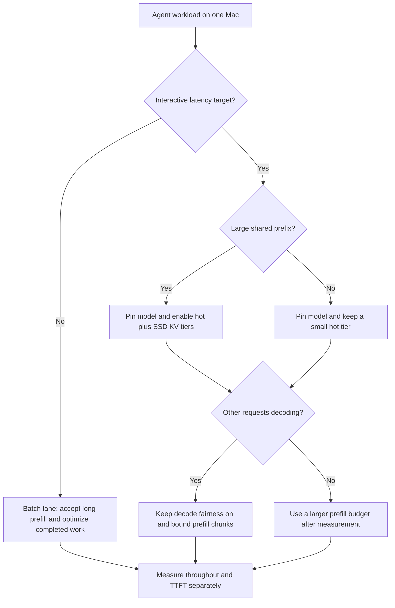

## 🤔 Curiosity: Why Does the Local Agent Freeze?

A Mac Studio can feel like a small private AI cluster. One person is asking a coding agent to read a repository, another is running log triage, and a designer is iterating on dialogue. Then one request arrives with a huge prompt and the useful, interactive work suddenly feels stuck.

The usual response is to ask for a bigger model, a faster quantization, or a higher tokens-per-second number. That is the wrong first question.

[oMLX](https://github.com/jundot/omlx) is an Apple Silicon inference server with OpenAI- and Anthropic-compatible endpoints, continuous batching, a macOS menu-bar app, multi-model management, and a tiered KV cache. At the version frozen for this article, [commit `12a2e2f`](https://github.com/jundot/omlx/commit/12a2e2f50654d3673ffec66e92fe8c02086725a2), its newest release tag was `v0.6.3rc3` from 2026-08-24, while `v0.6.2` was the newest non-RC tag.

The feature list is interesting. The scheduler comment is more interesting. It explains that Metal cannot preempt a running kernel, so the server bounds prefill work into chunks and makes that work repay a decode-time debt before the next chunk runs.

That is a game-engine problem in new vocabulary.

> **For a shared local agent server, the useful question is not "How fast is the model?" It is "Which model, prefix, and request class are allowed to stay resident while another request needs the next GPU time slice?"**
{: .prompt-info}

{: .w-100 .shadow .rounded-10 }
_Figure 1. Original diagram for this article. It is a workload-policy model, not an oMLX benchmark or product interface._

| Surface symptom | The underlying residency question |
|:--|:--|
| A coding agent stalls after a huge design document arrives | How much long prefill can run before decode latency becomes unacceptable? |
| A familiar repository prompt gets slow after a restart | Are matching KV-cache blocks still available from the hot or SSD tier? |
| A new model forces the useful one out of memory | Which models are pinned, which are TTL-loaded, and what gets LRU-evicted? |
| More concurrent requests make everyone feel worse | Are we measuring batch throughput when the real requirement is time to first token? |

Game teams already know the basic moves: page data, pin what the frame needs, evict cold residents, share immutable prefixes, and set budgets before the hardware sets them for you. oMLX makes that analogy concrete enough to use.

---

## 📚 Retrieve: The Source Code Behind the Feature List

### A source audit, not a README paraphrase

The repository moves quickly, so every factual claim below is pinned to the 2026-08-24 commit rather than assuming that `main` will remain the same.

| Source | What I checked | Why it matters |
|:--|:--|:--|
| [oMLX README](https://github.com/jundot/omlx/blob/12a2e2f50654d3673ffec66e92fe8c02086725a2/README.md) | Install requirements, API surface, CLI flags, cache architecture, and project lineage | This is the public contract, but not always the newest implementation truth |
| [Release `v0.6.3rc3`](https://github.com/jundot/omlx/releases/tag/v0.6.3rc3) | Version and release timing | Local serving dependencies should be pinned, especially during fast release cycles |
| [Legacy configuration](https://github.com/jundot/omlx/blob/12a2e2f50654d3673ffec66e92fe8c02086725a2/omlx/config.py) | Legacy cache type, user-facing concurrency, and remote-code policy | A type definition can diverge from the server path that users actually invoke |
| [Runtime settings](https://github.com/jundot/omlx/blob/12a2e2f50654d3673ffec66e92fe8c02086725a2/omlx/settings.py) | Loopback bind, persisted cache defaults, CORS, optional API key, and Claude Code routing mode | A private workstation default is different from a shared-server deployment |
| [CLI wiring](https://github.com/jundot/omlx/blob/12a2e2f50654d3673ffec66e92fe8c02086725a2/omlx/cli.py) | Precedence of `--no-cache`, CLI cache flags, and persisted settings | The active `omlx serve` path is the evidence to trust for actual cache behavior |
| [Scheduler](https://github.com/jundot/omlx/blob/12a2e2f50654d3673ffec66e92fe8c02086725a2/omlx/scheduler.py) | Prefill chunking, decode fairness, and queue boundaries | This is where the latency policy actually lives |
| [Paged SSD cache](https://github.com/jundot/omlx/blob/12a2e2f50654d3673ffec66e92fe8c02086725a2/omlx/cache/paged_ssd_cache.py) | Block serialization, LRU policy, and startup reuse | A cache is also persisted local state with a compatibility contract |
| [Context-scaling regression test](https://github.com/jundot/omlx/blob/12a2e2f50654d3673ffec66e92fe8c02086725a2/tests/test_context_scaling.py) | A removed Claude Code token-scaling shim | Tests can be a more current specification than README prose |
| [Distributed-cluster guide](https://github.com/jundot/omlx/blob/12a2e2f50654d3673ffec66e92fe8c02086725a2/docs/distributed-cluster.md) | Experimental status and physical-hardware validation limit | A multi-Mac diagram is not production proof |

### The game-engine mapping is literal, not decorative

The project calls its cache block-based, prefix-sharing, and copy-on-write. The implementation sets the default block size to 256 tokens, serializes cold blocks with safetensors, manages SSD size with LRU, and scans at startup to reuse valid cache files.

| Game-engine idea | oMLX mechanism | Production reading |
|:--|:--|:--|
| Texture or mesh pages | 256-token KV-cache blocks | Do not think of a prompt as one indivisible object |
| Shared instance data | Prefix sharing and Copy-on-Write | Stable system prompts and repo primers become cacheable assets |
| Streaming pool | Hot RAM tier plus cold SSD tier | Warm context can be retained without keeping every block in RAM |
| Level reload recovery | Startup scan of compatible SSD cache files | Restart reuse is possible, but not across arbitrary model or format changes |
| Asset eviction | LRU cache eviction and LRU model management | Residency policy must name what is allowed to disappear |
| Frame-time budget | Chunked prefill with decode fairness | Interactive decode needs a protected time slice, not only more throughput |
| Job queue capacity | Bounded waiting queue | Admission control is part of perceived responsiveness |

The important implementation detail is the non-preemption constraint. A long prefill cannot be interrupted halfway through a Metal kernel. oMLX therefore turns scheduling into cooperative time slicing: it caps prefill chunks and lets decode work catch up before permitting more prefill. That is similar to splitting expensive asset work across frames so an input or render deadline can still win.

{: .w-100 .shadow .rounded-10 }
_Figure 2. oMLX resource-management screen. Screenshot from the [oMLX repository at commit `12a2e2f`](https://github.com/jundot/omlx/blob/12a2e2f50654d3673ffec66e92fe8c02086725a2/docs/images/omlx_hot_cold_cache.png), unmodified and distributed under [Apache License 2.0](https://github.com/jundot/omlx/blob/12a2e2f50654d3673ffec66e92fe8c02086725a2/LICENSE). A [local license copy](/assets/img/posts/2026-08-25-omlx-metal-residency/LICENSE-Apache-2.0.txt) is included with this article's asset._

### The defaults are part of the architecture

A cache feature is not useful merely because a project advertises it, and the exact server path matters. The legacy `config.py` type says SSD caching is disabled with a 100 GB limit when enabled. The current `omlx serve` path instead resolves persisted `CacheSettings`: SSD caching is enabled by default at `~/.omlx/cache`, its `auto` ceiling is 10% of SSD capacity, and the hot RAM cache starts at `0`.

```bash
# Keep the server local, put the SSD tier in an explicit directory,
# and opt into a deliberate RAM hot-cache budget.
# CLI flags override the persisted settings file.
omlx serve --model-dir ~/models \
  --paged-ssd-cache-dir ~/.omlx/cache \
  --hot-cache-max-size 20% \
  --max-concurrent-requests 8 \
  --api-key "$OMLX_API_KEY"
```

This is not a universal recipe. Twenty percent of a machine's memory can be too large or too small depending on the model, quantization, context length, and what else shares unified memory. The useful habit is to choose it as a budget, then measure cold and warm time to first token separately.

The security defaults deserve the same specificity:

- The supported server path binds to `127.0.0.1` by default.
- The API key is optional and CORS defaults to `[*]`.
- `trust_remote_code` defaults to `false`, with a source comment that Hugging Face repositories can ship executable model code.
- If a team deliberately changes the bind address for a shared network, it should set an API key, restrict network access, and treat the cache directory as persistent prompt-derived data.

> **A disk-backed KV cache is not just a performance feature. On the current `omlx serve` path, the SSD tier is enabled by default, so prompt-derived state begins persisting locally unless a team changes that policy. Put it under the same retention and machine-access rules as other sensitive development data.**
{: .prompt-warning}

### When source and README disagree, prefer the test

The README still describes context scaling for Claude Code as a way to report smaller-model token counts differently. The current regression test says that mechanism is gone. Its explanation is instructive: scaling the reported numerator while a client kept the real denominator caused auto-compaction to happen too early or too late, sometimes letting the true prompt outrun the true context window.

That is more than a documentation mismatch. It is a general systems lesson: a compatibility layer cannot safely lie about resource accounting when another component owns half the ratio.

The related setting that remains is more modest and more trustworthy. oMLX defaults Claude Code routing to `cloud`, so an upgrade does not silently redirect a paid cloud workflow to a local server. Its SSE keep-alive mode remains part of the transport policy for long prefill.

---

## 💡 Innovation: Give Every Local Agent a Residency Class

The useful output is a workload policy, not a leaderboard position. Before tuning a local inference server, classify what work needs responsiveness and what work only needs eventual completion.



| Workload | Latency class | Residency policy | What to measure |
|:--|:--|:--|:--|
| In-editor dialogue assistant | Interactive | Pin its model; keep shared lore or design prefix hot | Time to first token under contention |
| Coding agent reading a stable repository primer | Interactive, large prefix | Pin model; use hot plus SSD cache intentionally | Cold versus repeated-prefix TTFT |
| QA log clustering | Batch | TTL-unload model; accept SSD reuse | Completed reports per hour |
| Overnight asset or localization generation | Throughput | Load on demand; raise concurrency only after observing queueing | Completion time and memory pressure |
| Embedding or rerank service | Mixed | Keep a smaller engine resident if it is regularly called | Tail latency and impact on the LLM lane |
| Player-facing runtime inference | Different architecture | Do not assume a workstation server is the shipping client solution | Device, privacy, offline, and certification constraints |

### A practical studio experiment

1. Choose one stable, long prefix such as a design bible, repository briefing, or test-plan template.
2. Run a cold request and record time to first token, total duration, memory use, and cache-disk growth.
3. Repeat with the identical prefix and a different final question.
4. Add a simultaneous decoding request and compare the interactive lane with decode fairness on and off.
5. Change only one residency variable at a time: model pinning, hot-cache budget, SSD cache, or concurrency.

This experiment is intentionally boring. It turns claims about "fast local inference" into a decision about the work a team actually has.

### Honest trade-offs

1. **SSD persistence is the starting configuration.** The current `omlx serve` settings path enables a disk cache at `~/.omlx/cache` with an automatic 10%-of-SSD ceiling, while hot RAM cache remains `0`. Decide whether to retain, resize, secure, or disable that persistent tier before treating it as a benchmark feature.
2. **Interactive latency and throughput pull in different directions.** Bigger prefill chunks can improve batch completion while making an active collaborator wait longer for a token.
3. **Custom kernels are a packaging cliff.** The project documents that plain editable installation skips affected native kernels and can silently fall back to slower paths. Full Xcode, not only Command Line Tools, is required to build them; the official DMG ships precompiled kernels.
4. **Cache persistence has a privacy cost.** SSD reuse is valuable because it survives a restart, but that is exactly why retention, cleanup, encryption, and access control should be designed rather than assumed.
5. **Fast releases demand version pinning.** `v0.6.3rc3` arrived a day before this article. A studio should record the exact server, MLX, model, and quantization versions behind every benchmark.
6. **Multi-Mac serving is experimental.** The distributed guide explicitly says repository tests do not prove physical RDMA behavior. Capacity across machines is not automatically a speedup.
7. **This is a developer or studio-server pattern, not a player-runtime shortcut.** A shipped game needs a different review of device memory, consent, network behavior, offline support, and platform certification.

### Key Takeaways

| Takeaway | Why it matters |
|:--|:--|
| Local LLM serving has a residency problem | Context, models, and time slices compete for unified memory and GPU access |
| Time to first token deserves its own metric | Throughput can look better while an interactive agent feels worse |
| Prefixes are reusable assets | Stable prompts, repo primers, and lore packs benefit from block-level cache reuse |
| Cache settings are a policy decision | The SSD tier must be sized, retained, secured, or disabled; the RAM hot tier is an explicit budget |
| Tests can outrank README prose | The removed token-scaling mechanism is documented more accurately in its regression test |
| Version pinning is operational work | Fast-moving local inference stacks need reproducible measurements and rollback paths |

### New Questions This Raises

1. Should local agent runtimes expose latency classes per request rather than one global fairness setting?
2. Could a build pipeline warm stable prompt prefixes the way it precompiles shaders or bakes navigation data?
3. When a cluster raises total model capacity but reduces token rate, should an admin dashboard refuse to collapse that into one misleading health number?
4. What should a studio retain from a disk-backed KV cache, and what should be destroyed at the end of a workday?
5. If Metal cannot preempt a running kernel, what is the right UX for explaining a long-prefill delay to a person waiting on an agent?

The most valuable thing oMLX contributes is not another local API endpoint. It is a reminder that local AI service quality is a scheduling and residency discipline. Game development has spent decades learning that discipline. We should reuse it.

---

## References

### Project and release

- [jundot/omlx repository](https://github.com/jundot/omlx)
- [Pinned source commit `12a2e2f`](https://github.com/jundot/omlx/commit/12a2e2f50654d3673ffec66e92fe8c02086725a2)
- [Release `v0.6.3rc3`](https://github.com/jundot/omlx/releases/tag/v0.6.3rc3)
- [oMLX Apache License 2.0](https://github.com/jundot/omlx/blob/12a2e2f50654d3673ffec66e92fe8c02086725a2/LICENSE)

### Implementation evidence

- [README: caching, batching, CLI, and lineage](https://github.com/jundot/omlx/blob/12a2e2f50654d3673ffec66e92fe8c02086725a2/README.md)
- [Configuration defaults](https://github.com/jundot/omlx/blob/12a2e2f50654d3673ffec66e92fe8c02086725a2/omlx/config.py)
- [Runtime settings](https://github.com/jundot/omlx/blob/12a2e2f50654d3673ffec66e92fe8c02086725a2/omlx/settings.py)
- [CLI wiring](https://github.com/jundot/omlx/blob/12a2e2f50654d3673ffec66e92fe8c02086725a2/omlx/cli.py)
- [Scheduler implementation](https://github.com/jundot/omlx/blob/12a2e2f50654d3673ffec66e92fe8c02086725a2/omlx/scheduler.py)
- [Paged SSD cache implementation](https://github.com/jundot/omlx/blob/12a2e2f50654d3673ffec66e92fe8c02086725a2/omlx/cache/paged_ssd_cache.py)
- [Context-scaling regression test](https://github.com/jundot/omlx/blob/12a2e2f50654d3673ffec66e92fe8c02086725a2/tests/test_context_scaling.py)
- [Distributed-cluster guide](https://github.com/jundot/omlx/blob/12a2e2f50654d3673ffec66e92fe8c02086725a2/docs/distributed-cluster.md)

### Upstream lineage

- [Apple MLX](https://github.com/ml-explore/mlx)
- [mlx-lm](https://github.com/ml-explore/mlx-lm)
- [vllm-mlx](https://github.com/waybarrios/vllm-mlx)

### Image credit

- [oMLX hot and cold cache screenshot at pinned commit](https://github.com/jundot/omlx/blob/12a2e2f50654d3673ffec66e92fe8c02086725a2/docs/images/omlx_hot_cold_cache.png), unmodified, Apache License 2.0, Copyright 2025 oMLX contributors
