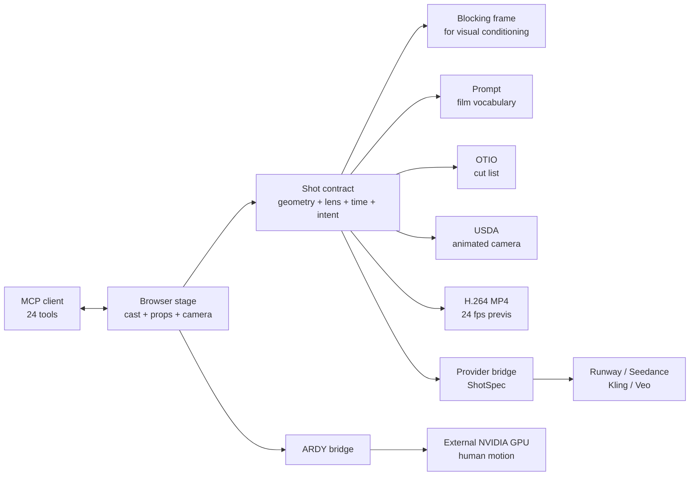

## 🤔 Curiosity: Why Does AI Video Need a Camera Department?

A prompt can ask for "a low wide shot, 35 mm, slow push-in." It cannot guarantee that the next generation will interpret *low*, *wide*, or *slow* the same way.

That is a tolerable failure when I am searching for one lucky image. It becomes a production failure when I need a sequence. The lens changes between cuts. The eyeline moves. A room quietly becomes wider. The second take starts from a camera position that never existed in the first.

Game teams solved this class of problem long ago. We do not describe a camera transform and hope every subsystem imagines the same numbers. We store the transform, lens, timeline, and scene state, then make rendering, replay, tools, and automation consume that shared state.

That is why [CozyClay](https://github.com/NomaDamas/CozyClay) is more interesting than its "browser-based 3D staging studio" label. It is not another video foundation model. It is a lightweight previs editor built with Three.js and React Three Fiber that turns rough geometry into a reusable camera decision.

> **My source-level conclusion:** CozyClay's best abstraction is not the clay viewport or the prompt button. It is a shot contract that can carry geometry, framing, timing, and intent across a human editor, an AI agent, an editorial tool, and an external video model.
{: .prompt-info}

{: .w-100 .shadow .rounded-10 }
_Figure 1. Original diagram for this article. The valuable output is not just a grey frame. It is one authored decision expressed through several delivery formats._

I pinned this review to default-branch commit [`e6bb8c6`](https://github.com/NomaDamas/CozyClay/tree/e6bb8c60641193687384984bd501369ea9bbab88), available on **2026-08-26**, and compared it with the latest tagged release, [v1.6.0](https://github.com/NomaDamas/CozyClay/releases/tag/v1.6.0). GitHub and npm numbers are point-in-time context, not quality scores.

| Snapshot on 2026-08-26 | Observed value |
|:--|:--|
| GitHub stars / forks | 343 / 48 |
| Contributors listed by GitHub | 5 |
| Open issues and pull requests | 6 total, including 4 issues |
| Public release window | v0.1.0 on Aug 14 to v1.6.0 on Aug 25 |
| Runtime floor | Node.js 22+, npm or Bun, Chromium-based browser |
| Main license | AGPL-3.0-or-later, with pre-Aug-21 contributions also available under GPL-3.0-or-later |
| npm artifact | v1.6.0, 188 files, about 12.0 MB unpacked, no runtime dependency tree |

The pace is unusually fast. That creates both the appeal and the risk: this is a compact project shipping real production ideas every few days, not a settled replacement for Blender, Unity, Unreal, or a full virtual-production stack.

---

## 📚 Retrieve: Read the Shot Contract, Not the Demo Reel

### What I audited

I read the editor state, camera math, project envelope, timeline exporters, MCP server, generation bridges, license notices, release notes, CI, open issues, npm artifact, and the live hosted pages. The distinction between those surfaces matters because they do not all expose the same product.

| Source | What it establishes |
|:--|:--|
| [README at the pinned head](https://github.com/NomaDamas/CozyClay/blob/e6bb8c60641193687384984bd501369ea9bbab88/README.md) | One-command editor, ARDY boundary, MCP setup, validation commands, privacy disclosure |
| [`src/project.js`](https://github.com/NomaDamas/CozyClay/blob/e6bb8c60641193687384984bd501369ea9bbab88/src/project.js) | Versioned `.cclayproject` JSON, content-addressed embedded images, File System Access API fallback |
| [`src/shot.js`](https://github.com/NomaDamas/CozyClay/blob/e6bb8c60641193687384984bd501369ea9bbab88/src/shot.js) | Sensor and focal-length math, film vocabulary, model list, prompt assembly |
| [`src/history.js`](https://github.com/NomaDamas/CozyClay/blob/e6bb8c60641193687384984bd501369ea9bbab88/src/history.js) | One bounded undo history and transaction tokens for continuous gestures |
| [`src/otio.js`](https://github.com/NomaDamas/CozyClay/blob/e6bb8c60641193687384984bd501369ea9bbab88/src/otio.js) and [`src/usd-camera.js`](https://github.com/NomaDamas/CozyClay/blob/e6bb8c60641193687384984bd501369ea9bbab88/src/usd-camera.js) | Editorial cut-list export and frame-sampled UsdGeomCamera export |
| [`src/offscreen-export.js`](https://github.com/NomaDamas/CozyClay/blob/e6bb8c60641193687384984bd501369ea9bbab88/src/offscreen-export.js) | Deterministic frame-addressed H.264 MP4 recording through WebCodecs |
| [MCP server](https://github.com/NomaDamas/CozyClay/blob/e6bb8c60641193687384984bd501369ea9bbab88/mcp/server.mjs) | 24 tools sharing the editor's own camera and scene modules |
| [Video-generation bridge](https://github.com/NomaDamas/CozyClay/blob/e6bb8c60641193687384984bd501369ea9bbab88/tools/generation/README.md) | Loopback credential boundary for Runway, Seedance, Kling, and Veo providers |
| [Licensing](https://github.com/NomaDamas/CozyClay/blob/e6bb8c60641193687384984bd501369ea9bbab88/LICENSING.md) and [third-party notices](https://github.com/NomaDamas/CozyClay/blob/e6bb8c60641193687384984bd501369ea9bbab88/THIRD_PARTY_NOTICES.md) | AGPL network obligations and separate model, font, dependency, and rig terms |
| [CI workflow](https://github.com/NomaDamas/CozyClay/blob/e6bb8c60641193687384984bd501369ea9bbab88/.github/workflows/ci.yml) | Strong Node gate, but browser regression checks still run in observation mode |

### The local editor is real

The smallest useful lane is genuinely simple:

```bash
npx cozyclay
```

The published package contains a prebuilt studio and a dependency-free Node launcher. It serves the app only on `127.0.0.1`, opens `/app/`, and does not need a build. The editor, staging primitives, posing, camera work, timeline, seeded demo motion, and project-file workflow operate without an external GPU.

{: .w-100 .shadow .rounded-10 }
_Figure 2. I captured the official hosted studio on 2026-08-26 after adding a second character, a set piece, and a timeline shot. The same editor is served locally by the npm package._

The project format is more thoughtful than localStorage-only prototypes. A `.cclayproject` is versioned JSON containing scenes, shot authoring, workspace layout, custom poses, and referenced images. Imported images are downscaled to a maximum 2,048-pixel edge, content-addressed with a truncated SHA-256 identifier, and embedded only when referenced. The browser uses the File System Access API when available, with download and upload as a fallback.

The undo design also reflects editor experience. [`history.js`](https://github.com/NomaDamas/CozyClay/blob/e6bb8c60641193687384984bd501369ea9bbab88/src/history.js) limits the stack to 50 states and uses explicit transaction tokens. A long gizmo drag updates live, then lands as one undo entry. A stale pointer stream cannot close a newer transaction. That sounds small until a camera rail or character move turns into 200 impossible-to-undo micro-edits.

This is the right production instinct: **authoring state is not a side effect of React components. It is a contract that interactive tools must respect.**

### Geometry becomes film vocabulary

The strongest code is not the renderer. It is the pure math in [`src/shot.js`](https://github.com/NomaDamas/CozyClay/blob/e6bb8c60641193687384984bd501369ea9bbab88/src/shot.js).

CozyClay stores actual sensor presets for Super 16, Super 35, full frame, and 65 mm. It converts vertical field of view to focal length after accounting for the output crop, then rounds the result to a plausible prime-lens set. Character distance, screen occupancy, camera height, subject facing, and camera side become labels such as:

> `MEDIUM-WIDE SHOT · FRONT · KNEE LEVEL · 35MM`

That vocabulary is generated from a scene, not guessed from an adjective. The public source modules let other tools use the same calculation:

```javascript
import {
  VIDEO_MODELS,
  composePrompt,
  deriveShot,
  focalMmToFov,
  slateLine,
} from "cozyclay/src/shot.js";

const model = VIDEO_MODELS.find(({ id }) => id === "seedance_2");
if (!model) throw new Error("Seedance 2.0 adapter is unavailable");

const aspect = 16 / 9;
const shot = deriveShot(
  { x: -2.4, y: 0.75, z: 4.2 },     // camera position in metres
  { x: 0, z: 0, rot: 0 },           // subject position and facing
  focalMmToFov(35, "fullFrame", aspect),
  1.8,
  { sensorId: "fullFrame", aspectRatio: aspect },
);

const prompt = composePrompt({
  mode: "video",
  model,
  shot,
  subject: "a courier in a raincoat",
  environment: "a wet neon alley",
  style: "naturalistic thriller lighting",
  cameraMove: "Push-in (dolly in)",
});

if (!prompt) throw new Error("The shot contract produced no prompt");
console.log(slateLine(shot));
```

I ran that example against the pinned source. It produced the expected 35 mm, medium-wide, front, knee-level slate and a prompt that tells the video model to preserve framing while replacing the grey clay appearance.

{: .w-100 .shadow .rounded-10 }
_Figure 3. Camera authorship is visible state: lens, key mode, playback, recording, and the owning shot all share one editor surface._

### One scene can leave through five doors

The editor's export surface is where the shot-contract idea becomes concrete:



The outputs serve different jobs:

- **Blocking frame:** pins composition for an image or video model.
- **Prompt:** expresses the measured shot in vocabulary a generative model has seen.
- **OTIO:** carries ordered shot ranges, gaps, and CozyClay metadata into an editorial timeline.
- **USDA camera:** samples position, orientation, focal length, and aperture for every frame in a shot.
- **MP4:** records deterministic offscreen WebGL frames into a fast-start, video-only H.264 file through WebCodecs and Mediabunny.

The official demo poster shows why the grey frame matters. The generated side is visually different, but its composition inherits the blocked geometry.

{: .w-100 .shadow .rounded-10 }
_Figure 4. Official CozyClay demo-poster frame. The generated result is on the left and the blocking reference is on the right. Source: [the pinned repository asset](https://github.com/NomaDamas/CozyClay/blob/e6bb8c60641193687384984bd501369ea9bbab88/public/media/cozyclay-demo-poster.jpg)._

This is the same pattern I want in a game cinematic pipeline. A director should be able to change a lens or shot boundary without regenerating the meaning of the whole scene. A render is an artifact of the contract, not the only place where the decision exists.

### MCP turns the editor into an agent-owned tool, not an agent-owned truth

CozyClay ships [24 MCP tools](https://github.com/NomaDamas/CozyClay/blob/e6bb8c60641193687384984bd501369ea9bbab88/mcp/README.md). They cover scene description, framing, characters, props, groups, prompt blocks, motion generation, capture, project files, and camera-move classification.

The implementation choice is more important than the count. The MCP server imports the editor's own `shot.js`, scene, camera, cut, and project modules. It does not keep a second copy of "what 35 mm means." With the editor open, calls operate the visible workspace over a loopback WebSocket. Without the editor, a subset can work in memory and still write a project file.

There is real hardening around that surface:

- the live hub binds to `127.0.0.1` and rejects non-loopback browser origins;
- project paths must be direct children of a configured root;
- project reads use `O_NOFOLLOW` and reject hard-linked files;
- live workspaces and motion-job ownership are isolated by session;
- tool annotations distinguish read-only, destructive, idempotent, and open-world behavior;
- a batch can apply up to 100 object mutations as one visible undo transaction.

That is the safe relationship between an agent and a creative tool. The agent proposes and applies structured mutations. The editor remains the source of truth, the human can watch, and undo is still meaningful.

### The boundaries the headline hides

CozyClay is unusually candid in its repository, but the one-line pitch still compresses several different runtimes. Here is the production reading.

| Boundary | What the source actually does | Production implication |
|:--|:--|:--|
| Local editor | Staging, posing, cameras, cuts, playback, exports, and project files run on loopback | Strong fit for solo previs and inexpensive iteration |
| ARDY motion | Requires a separately installed SSH-accessible NVIDIA machine; first setup downloads about 16.4 GB of text-encoder assets | Motion generation is not part of the lightweight browser footprint |
| Direct video providers | A source checkout's `npm run dev` starts a credential-hiding bridge for Runway, Seedance, Kling, and Veo | These are remote paid APIs, not local models |
| One-command npm launcher | At the pinned head, it starts the editor and optional ARDY sidecar, but it does not start or proxy the `/generation` provider bridge | Direct provider submission is not the same one-command path as the editor |
| Static hosted app | The editor loads, but the GitHub Pages build is documented as generation-free | Treat the hosted app as a studio demonstration, not a public inference service |
| Hosted motion composer | The current `/demo/` page says "Preview" and "This feature is not available yet" | The no-install queued generator should not be counted as a live product today |

{: .w-100 .shadow .rounded-10 }
_Figure 5. I captured the official hosted composer on 2026-08-26. Its interface is public, but submission is explicitly disabled at the pinned default-branch head._

Four additional caveats matter before a studio fork or redistribution.

#### 1. Aspect ratio has more than one source of truth

The editor offers `16:9`, `2.39:1`, `9:16`, `1:1`, and `4:3`. Camera math uses the selected ratio correctly. The generation contract in [`src/generation/shot-spec.js`](https://github.com/NomaDamas/CozyClay/blob/e6bb8c60641193687384984bd501369ea9bbab88/src/generation/shot-spec.js), however, accepts only `16:9` and `9:16`; the other three silently become `16:9`. More sharply, [`composePrompt`](https://github.com/NomaDamas/CozyClay/blob/e6bb8c60641193687384984bd501369ea9bbab88/src/shot.js#L225-L283) always appends `16:9.` to its text.

The provider request still carries its own ratio field, so a supported API can override the prose. A copied prompt for a square or cinematic shot can contradict the viewport. This is exactly the kind of drift a shot contract is supposed to eliminate.

#### 2. A project file is an authoring envelope, not a complete archive

The project format is useful, but generated character clips are intentionally `sessionMotion`. [`App.jsx` strips them before persistence](https://github.com/NomaDamas/CozyClay/blob/e6bb8c60641193687384984bd501369ea9bbab88/src/App.jsx#L3337-L3355) because they are too heavy for the scene envelope. Paths and prompt blocks persist; the generated take does not.

A production workflow therefore needs a companion artifact folder for NPZ/BVH motion, provider MP4 files, prompts, hashes, and approvals. Saving the `.cclayproject` alone is not a reproducibility guarantee.

#### 3. The license is clear, but the current rigs are not redistributable

CozyClay moved to AGPL-3.0-or-later for the combined work. If a modified version is offered over a network, users must be offered its corresponding source. That is a deliberate product constraint, not the same thing as a permissive MIT library.

The sharper issue is acknowledged in the project's own [third-party notice](https://github.com/NomaDamas/CozyClay/blob/e6bb8c60641193687384984bd501369ea9bbab88/THIRD_PARTY_NOTICES.md#L89-L102): the two bundled Mixamo rigs may be used in projects, but Adobe does not permit redistribution of the raw character files. The repository, npm package, and hosted site currently ship those raw FBX files anyway. The maintainer says a CC0 replacement is planned.

> **Until the rigs are replaced, do not treat the repository's AGPL label as a grant to redistribute every file inside it. Audit or replace the character assets before shipping a fork. This is a source-reading warning, not legal advice.**
{: .prompt-warning}

#### 4. The verification story is strong but not finished

The tree contains **108 `verify-*` files** across `test/`, `mcp/`, and `tools/`. The Pages build for the pinned head completed `npm ci`, the MCP install, and `npm test` successfully before deployment. That is better discipline than many young creative tools.

The browser gate is less mature. The CI workflow explicitly says only two browser suites run, they run in observation mode, and failures do not fail the check because SwiftShader currently disagrees with real-GPU occlusion behavior. The workflow also notes that other browser suites fail on a clean headless baseline.

The open issue tracker names concrete remaining risks:

- [Issue #63](https://github.com/NomaDamas/CozyClay/issues/63): a render error, lost WebGL context, or full storage can produce a blank editor without an actionable recovery surface;
- [Issue #61](https://github.com/NomaDamas/CozyClay/issues/61): pose-export quaternion math is not directly verified;
- [Issue #21](https://github.com/NomaDamas/CozyClay/issues/21): depth and normal passes are not exported yet;
- [Issue #15](https://github.com/NomaDamas/CozyClay/issues/15): shared editing and per-actor undo need an operation-log architecture.

There is also concentration risk: the pinned `src/App.jsx` is 9,109 lines and `mcp/server.mjs` is 2,008 lines. The project has extracted many pure modules, but the main orchestration surface is still large enough that error containment and browser integration tests matter.

### Privacy is disclosed, not absent

Version 1.6.0 added anonymous telemetry to the official npm distribution. It stores a random installation identifier in `~/.config/cozyclay/state.json` and records first launch, sessions, and a small editing funnel through PostHog. The project states that prompts, filenames, project content, local paths, and user-entered text are not collected. Source checkouts, forks, CI, and tests do not send the official-package telemetry.

That is transparent and controllable, but it means "local" does not mean "no network events by default." Disable it before a sensitive production evaluation if policy requires that:

```bash
cclay telemetry off
# Or for one launch:
COZYCLAY_TELEMETRY=0 npx cozyclay
```

---

## 💡 Innovation: Build an AI Video Pipeline Around the Shot, Not the Model

CozyClay is early, but its central direction is right. Video-model adapters will change. Seedance, Veo, Kling, Runway, and whatever follows will expose different duration, frame, audio, path, and reference-image contracts. A production team should not let any one provider own the scene decision.

I would promote the shot contract into an explicit studio artifact:

```text
ShotContract/
  scene.cclayproject       # authored stage, cuts, camera, prompt blocks
  blocking/                # first frame, last frame, depth, normal, object IDs
  camera/                  # USDA samples and human-readable slate
  editorial/               # OTIO cut list
  motion/                  # NPZ or BVH takes plus retime decisions
  prompts/                 # exact composed text and model-specific transforms
  generations/             # provider, model, job ID, cost, seed, hashes, MP4
  review/                  # approval state and notes
```

That folder makes a rerun explainable. If a model provider disappears, the scene survives. If a director changes the lens, the change can invalidate only the dependent frames and jobs. If an agent edits the shot, the mutation and its review state can be recorded separately from the generated video.

### A production adoption plan

I would introduce CozyClay through four gates.

#### Gate 1: Use it as local previs only

Run the exact v1.6.0 package or a pinned source commit. Turn off analytics if required. Block a real shot, save the project, export one MP4, one OTIO file, and one USD camera. Do not connect a paid model yet.

The acceptance test is simple: can a director reopen the scene and reproduce the same framing, cut length, and camera motion without reading a prompt history?

#### Gate 2: Make every generated artifact external and attributable

Do not rely on session motion. Save ARDY output and provider video beside the project with a manifest. Record model, endpoint, duration, aspect ratio, request time, job ID, cost, source frames, and content hash.

This is the game-build analogy: the project is source, the generation is a build artifact, and the manifest is the build record.

#### Gate 3: Fix contract drift before scale

Before vertical shorts or multi-format campaigns, make aspect ratio one value that flows into the camera crop, prompt, ShotSpec, provider payload, output dimensions, and filename. Add regression cases for all five UI ratios.

Before redistributing a fork, replace the Mixamo FBX files with licensed assets. Before trusting pose-conditioned ARDY output, add a direct quaternion round-trip test. Before long sessions, add error boundaries, WebGL context recovery, and storage-pressure handling.

#### Gate 4: Let agents operate through reviewable transactions

Use MCP for bounded tasks such as "place two actors, frame a low 35 mm profile, and add three set pieces." Keep `apply_batch` inside one undo transaction. Capture a frame after the operation. Require a human to approve the shot before the provider bridge can spend money.

The agent should accelerate blocking, not erase authorship.

### Who should use it now?

| Team or task | Recommendation |
|:--|:--|
| Solo AI filmmaker planning shots before generation | **Use now.** The local editor and blocking-frame workflow are immediately useful. |
| Game team prototyping a cinematic or camera grammar | **Use as a lightweight lab.** OTIO, USD camera, MP4, and MCP make the experiment portable. |
| Studio building a custom internal fork | **Pilot with fixes.** Pin the source, replace rigs, externalize generated assets, and strengthen browser recovery. |
| Hosted commercial SaaS based on a modified fork | **Review AGPL and asset rights first.** Network source obligations and bundled rigs are launch blockers, not cleanup tasks. |
| Multi-user virtual production team | **Wait or contribute.** Shared state, per-actor undo, and collaboration architecture are not present yet. |
| Pipeline requiring depth, normals, segmentation, or deterministic model conditioning | **Wait or extend.** Current exports are primarily RGB plus camera/editorial metadata. |

### The bigger lesson

The current race in AI video is focused on models: longer clips, better motion, native audio, more references, fewer identity failures. Those improvements matter. They do not remove the need to decide what the camera is doing.

CozyClay makes a useful bet: **the durable layer sits before inference.** It is the place where a director can make spatial decisions cheaply, preserve them as data, hand them to several renderers, and ask an agent to help without surrendering the scene's truth to a chat transcript.

That is familiar to anyone who has shipped a game. We do not want the final frame to be the only surviving description of how it was made. We want the scene, timeline, camera, assets, and build record.

CozyClay is not finished enough to become that universal record today. Its aspect ratio can drift, its generated motion is session-only, its one-command and source-checkout generation surfaces differ, its browser gate is partly observational, and its bundled rigs need replacement.

But the abstraction is worth keeping:

> **Block the shot once. Treat geometry, lens, time, and intent as source. Compile that source into frames, prompts, camera data, edit decisions, and model jobs. Then pay inference to render a decision instead of asking it to invent one.**
{: .prompt-tip}

### New questions this raises

- Can depth, normals, object IDs, and camera samples become one standard conditioning package across video providers?
- Should an AI-video shot contract be versioned like a game scene or hashed like a build graph?
- Can an agent estimate which shot changes invalidate a generation before spending again?
- What is the right operation log when several humans and agents share one virtual set?
- Can the blocking frame remain visually abstract while still carrying enough identity and occlusion information for consistent final video?

Those questions are more durable than today's model leaderboard. They are questions about production memory.

---

## References

**Primary project sources:**

- [NomaDamas/CozyClay repository](https://github.com/NomaDamas/CozyClay)
- [Pinned default-branch snapshot: `e6bb8c6`](https://github.com/NomaDamas/CozyClay/tree/e6bb8c60641193687384984bd501369ea9bbab88)
- [CozyClay v1.6.0 release](https://github.com/NomaDamas/CozyClay/releases/tag/v1.6.0)
- [CozyClay on npm](https://www.npmjs.com/package/cozyclay)
- [Official hosted studio](https://cozyclay.org/app/)
- [Camera control for AI video](https://cozyclay.org/ai-camera-control/)
- [Changelog](https://github.com/NomaDamas/CozyClay/blob/e6bb8c60641193687384984bd501369ea9bbab88/CHANGELOG.md)
- [MCP documentation](https://github.com/NomaDamas/CozyClay/blob/e6bb8c60641193687384984bd501369ea9bbab88/mcp/README.md)
- [Generation-provider implementation notes](https://github.com/NomaDamas/CozyClay/blob/e6bb8c60641193687384984bd501369ea9bbab88/docs/generation/providers-research.md)
- [Licensing details](https://github.com/NomaDamas/CozyClay/blob/e6bb8c60641193687384984bd501369ea9bbab88/LICENSING.md)
- [Third-party notices](https://github.com/NomaDamas/CozyClay/blob/e6bb8c60641193687384984bd501369ea9bbab88/THIRD_PARTY_NOTICES.md)

**Connected systems:**

- [NVIDIA ARDY](https://github.com/nv-tlabs/ardy)
- [OpenTimelineIO](https://opentimelineio.readthedocs.io/)
- [OpenUSD UsdGeomCamera](https://openusd.org/release/api/class_usd_geom_camera.html)
- [Model Context Protocol](https://modelcontextprotocol.io/)

> **Image note:** Figure 1 is an original editorial diagram. Figures 2, 3, and 5 are captures of the official CozyClay website made for this review. Figure 4 is an official repository asset. They are included for source-based editorial discussion; rights remain with their respective creators.
{: .prompt-info}
