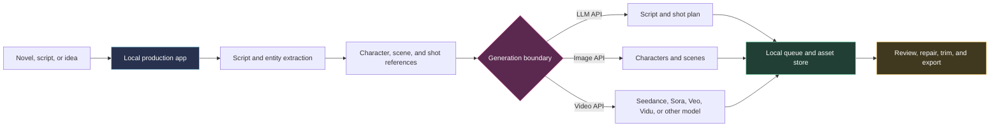

## Curiosity: Did Seedance 2.0 Make the Old Tool Stack Obsolete?

When Seedance 2.0 arrived, my saved list of AI video tools suddenly felt much less useful. A model that can accept several images, video references, audio, and a long prompt changes the job. I no longer need ten disconnected utilities if one production layer can preserve characters, plan shots, submit multimodal jobs, retry failures, and join the results.

That left four repositories in my shortlist:

1. [Huobao Drama](https://github.com/chatfire-AI/huobao-drama)
2. [Toonflow](https://github.com/HBAI-Ltd/Toonflow-app)
3. [waoowaoo](https://github.com/waooAI/waoowaoo)
4. [Moyin Creator](https://github.com/MemeCalculate/moyin-creator)

The popular summary is attractive: all four are open source, free, commercially usable, locally deployable, and able to turn one sentence into a finished drama with almost no intervention.

I checked the repositories, licenses, release pages, Docker paths, provider adapters, agent code, workflow prompts, tests, and the images linked from their READMEs. The shortlist survived. The shared description did not.

> **The useful correction:** none of these four is simultaneously a standard open-source project, free to operate, unrestricted for commercial deployment, and fully local. They are local production control planes around remote generative services.
{: .prompt-info}

{: .w-100 .shadow .rounded-10 }
_Figure 1. My source-level conclusion before comparing features. A self-hosted interface and local asset store do not make the model calls local._

I pinned this review to each default branch head available on **2026-08-26**. Star counts are a point-in-time snapshot, not a quality score.

| Project | Stars | Pinned head | Last default-branch commit | License reality |
|:--|--:|:--|:--|:--|
| Huobao Drama | 14,099 | [`70e7342`](https://github.com/chatfire-AI/huobao-drama/commit/70e73424cbc4c70cbc844851967f868755f7b74f) | 2026-08-18 | No `LICENSE` file; README badge says CC BY-NC-SA 4.0 |
| Toonflow | 14,519 | [`b344a73`](https://github.com/HBAI-Ltd/Toonflow-app/commit/b344a736599203e874984660f080cce9cb884795) | 2026-08-23 | Apache 2.0 text plus a separate commercial rider |
| waoowaoo | 13,810 | [`ce8edeb`](https://github.com/waooAI/waoowaoo/commit/ce8edebf7cd2fe32c37a8d628aa3edc67f544586) | 2026-07-28 | CC BY-NC-SA 4.0, explicitly noncommercial |
| Moyin Creator | 4,401 | [`d3cda92`](https://github.com/MemeCalculate/moyin-creator/commit/d3cda92142e53cbadf05a8d4557b52bd86ece464) | 2026-07-15 | AGPL-3.0, with a separate proprietary license option |

Three distinctions matter before choosing anything:

- **Source available is not automatically open source.** A noncommercial clause is incompatible with the ordinary open-source definition.
- **Commercial output is not the same as commercial software distribution.** Toonflow explicitly allows creators to monetize content, but restricts distributing the product to two or more third parties.
- **Self-hosted orchestration is not local inference.** If a storyboard, face reference, voice clip, or manuscript is uploaded to Seedance, Sora, GPT Image, Gemini, or another provider, that material left the machine.

> This is a technical reading of the repositories, not legal advice. For a paid service or studio deployment, have the actual license and every model provider's terms reviewed for your use case.
{: .prompt-warning}

The product images below are excerpts from official repository READMEs, included for identification and critical commentary. Upstream license and trademark terms remain with their respective owners.

---

## Retrieve: What the Source Actually Says

### The boundary that Seedance 2.0 does not remove

All four projects automate a similar control loop. The differentiators are not just model names. They are how the system preserves identity, decomposes a script, represents shot state, retries work, exposes edits, and proves that a final export can be reproduced.



The left side can run on your hardware. The three branches on the right usually cannot. Even when the app stores files locally, the provider still receives the prompts and references required for generation.

A game studio already knows this distinction. Running the editor locally does not make a cloud build, telemetry endpoint, or remote texture service local. The executable location is only one boundary in the system.

### 1. Huobao Drama: the cleanest Docker path, with the least clear license

[Huobao Drama](https://github.com/chatfire-AI/huobao-drama) has the most convincing "start with Docker" story of the four. At the pinned head, the repository contains a Nuxt 3 frontend, a Hono and Drizzle backend, MySQL, embedded FFmpeg binaries, persistent local media storage, and four Mastra agents:

| Agent | Actual responsibility |
|:--|:--|
| `script_rewriter` | Rewrite a novel or source body into a formatted screenplay |
| `extractor` | Extract and deduplicate characters, scenes, and props |
| `storyboard_breaker` | Split the screenplay into storyboard segments |
| `prompt_generator` | Build image and video prompts for the extracted assets and shots |

The storyboard skill defines the real unit of production: one segment becomes one video task, usually **8 to 15 seconds**, with two to four sub-shots. The final episode is an FFmpeg concat job over many generated clips. This is a practical architecture because one failed shot can be retried without regenerating the whole episode.

It is not literally a one-sentence machine. The script rewriter reads an existing episode body, and the storyboarder estimates duration from source character count. It also does not contain a separate TTS pipeline anymore. A regression test explicitly protects the removal of the voice agent and passes audio generation through the video provider instead.

The phrase "10-minute video" is not in the product documentation. The only ten-minute constant I found is an **image-generation polling timeout**. Video adapters clamp each generated clip to 4 through 15 seconds. A ten-minute episode would be an assembly of many jobs, not one model call completed in ten minutes.

{: .w-75 .shadow .rounded-10 }
_Figure 2. Huobao's only reusable in-repository visual is its flame logo. Source: [logo at pinned commit](https://github.com/chatfire-AI/huobao-drama/blob/70e73424cbc4c70cbc844851967f868755f7b74f/frontend/public/huobao-logo.png). The repository has no product screenshot and no committed license file._

The operational trade-off is external dependency. Text can point at a local OpenAI-compatible endpoint such as Ollama, but image generation uses OpenAI, Gemini, or Volcengine, while video uses Seedance 2.0 or MiniMax H3. The README's prominent quick setup points at the maintainer's paid API relay. The app is self-hosted; the complete generation path is not.

The legal issue is more decisive. GitHub detects no license because there is no license file. The README shows a CC BY-NC-SA 4.0 badge, which includes a noncommercial restriction. Even treating the badge as the intended grant, that is not unrestricted commercial software use.

**My verdict:** excellent for evaluating a Docker-first pipeline and agent-skill architecture. Do not describe it as commercially open source, and do not promise a private local video workflow.

### 2. Toonflow: the best beginner workflow, but not the URL or license people keep quoting

The canonical repository is [HBAI-Ltd/Toonflow-app](https://github.com/HBAI-Ltd/Toonflow-app). The commonly shared `HBAI-Ltd/Toonflow` URL returns 404.

Toonflow earns its place in the shortlist. It packages Windows, macOS, and Linux applications, offers a local Docker build, and presents the production state on an infinite canvas. The source also supports the advertised three-layer agent model:

1. A **decision layer** selects work and delegates it.
2. Several task-specific **execution agents** derive assets, generate them, plan direction, and build storyboard variants.
3. A **supervision layer** reviews independent tasks and feeds corrections back.

Its consistency mechanism is concrete rather than magical. Storyboard prompts bind reference assets with explicit image tags, preserve a per-scene orientation baseline, and carry the previous shot's final pose and facing direction into the next group. Local ONNX embeddings support agent memory, while the chapter event graph helps retrieve long-form story context.

{: .w-100 .shadow .rounded-10 }
_Figure 3. Toonflow's Seedance 2.0 workspace makes the reference budget visible before generation. Source: [official screenshot at pinned commit](https://github.com/HBAI-Ltd/Toonflow-app/blob/b344a736599203e874984660f080cce9cb884795/docs/screenshot/10.png)._

The README's own demo is the best antidote to the zero-touch claim. A roughly two-minute final drama took about **two hours**, used Claude Opus 4.6, GPT Image 2, and Seedance 2.0, and reported about **CNY 130** in model costs. The team cut roughly one minute of unusable footage from three minutes of raw output. That is still impressive leverage, but it is not "one sentence in, finished episode out."

Toonflow is also not plain Apache 2.0. Its `LICENSE` file appends a commercial rider that requires written authorization when the software or a derivative is distributed, sold, or provided as a product to two or more independent third parties. It allows internal use and explicitly allows creators to monetize content made with Toonflow. Those are useful permissions, but they are not the same as unrestricted commercial redistribution.

The maintenance signal needs similar precision. Issue triage continued in August, and the README was updated on August 23. The latest release remained `v1.1.8` from June 8, and the recent default-branch activity was mostly documentation and sponsor work. "Maintained" is fair for the support surface; "shipping product code continuously" is not yet proven by the same evidence.

One practical warning: the documented first login is `admin` / `admin123`. Change it before exposing any instance beyond localhost.

**My verdict:** the easiest first evaluation for a creator who wants a visible desktop workflow and accepts paid model APIs. It is not an offline stack, and a hosted product needs a license conversation.

### 3. waoowaoo: a serious queue and test surface inside a self-described early beta

[waoowaoo](https://github.com/waooAI/waoowaoo) looks simple from the README, but the source is deeper than the landing pitch. It uses Next.js, MySQL, Redis, BullMQ, MinIO, Remotion, and four media queues. I counted **302 test-like files** in the tracked tree, along with dozens of contract checks for provider routing, prompts, task types, and model capabilities.

The "agent" label needs qualification. The repository contains many agent-named prompt templates and 48 worker handlers, but not an autonomous planner runtime. The production engine is a typed task pipeline: analyze the novel, split episodes, convert scripts, generate profiles and images, synthesize voice and video jobs, then move assets through queues with retries. That can be more reliable than a free-running agent, but it should be described honestly.

{: .w-100 .shadow .rounded-10 }
_Figure 4. waoowaoo exposes structured shot data instead of hiding the prompt behind a single button. Source: [official README upload](https://github.com/user-attachments/assets/fa0e9c57-9ea0-4df3-893e-b76c4c9d304b), linked from the [pinned English README](https://github.com/waooAI/waoowaoo/blob/ce8edebf7cd2fe32c37a8d628aa3edc67f544586/README_en.md)._

The repository description calls it an industry-first, professional, Hollywood-standard platform. The README says something very different: it is an **early beta**, developed by one person, with bugs and incomplete areas expected. The default branch has 21 commits, its latest code release is `v0.4.1` from April 3, and the July 28 head change only added a trend badge.

The deployment path has two concrete traps:

- The README and Compose file still reference the old `saturndec/waoowaoo` namespace after the repository moved to `waooAI/waoowaoo`. The published `latest` image under the old namespace dates to April.
- The README says beta database versions are incompatible and instructs users to run `docker compose down -v` during upgrades, which deletes volumes.

Its Compose defaults also contain development passwords and fixed secrets. Those are acceptable for an isolated laptop trial, not a public deployment.

The license settles the commercial question. `LICENSE` says CC BY-NC-SA 4.0 and explicitly prohibits commercial use. It even notes that the license is not a software license in the strict open-source sense. I found no primary evidence for the claim that creators are already taking paid client orders with this repository. That activity would also conflict with the project's noncommercial terms unless separate permission exists.

**My verdict:** technically interesting for its queues, contracts, and structured production data. Treat it as a noncommercial beta research project, not an industrial commercial platform.

### 4. Moyin Creator: the strongest license and batch controls, with release integrity questions

[Moyin Creator](https://github.com/MemeCalculate/moyin-creator) is the only project in this group with a standard open-source license that permits commercial use under its terms. AGPL-3.0 allows use, modification, and distribution, including commercial activity, while requiring corresponding source obligations. A separate commercial license is offered for proprietary integration.

Its production features are also specific in code:

- a six-layer character identity structure with visual marks, hairstyle, color anchors, and negative style constraints
- a character bible containing visual traits, palette, style tokens, and multi-view images
- multi-episode parsing and series-level metadata
- staggered concurrency, multiple API keys, retry, and fault-isolated batch processing
- Seedance 2.0 reference collection and validation for images, videos, audio, total files, and prompt length

{: .w-100 .shadow .rounded-10 }
_Figure 5. Moyin's S-Class workspace groups several storyboard shots into Seedance 2.0 jobs and keeps the reference budget visible. Source: [official README upload](https://github.com/user-attachments/assets/2b5af973-98c9-4708-bf53-02d11321d86d), linked from the [pinned README](https://github.com/MemeCalculate/moyin-creator/blob/d3cda92142e53cbadf05a8d4557b52bd86ece464/README.md)._

The Seedance claim still needs precision. The UI and prompt builder implement 2.0-style multimodal constraints, but the model registry at the pinned head contains explicit IDs only for Seedance 1.0 and 1.5. The app relies on user-configured upstream providers, so the 2.0 support is primarily reference assembly and request plumbing rather than a bundled model.

The release trail raises a more serious question. The `V0.2.9` release notes describe a music studio with Suno logic and a new image-processing workbench. Those modules are absent from the `V0.2.9` tag and from `main`; `package.json` still says `0.2.3`; and the repository has no tracked CI workflow or test file. The latest product-code commit I found was in March, followed by documentation changes.

That does not erase the useful architecture. It does mean I would not promote the downloadable binary into a studio pipeline until the maintainers explain which source corresponds to it and publish a reproducible build.

**My verdict:** the best fit when character anchoring, episodic batching, and a recognized open-source license matter most. Run an explicit source-to-binary audit before production use.

---

## The Five Claims I Would Correct Before Sharing the List

| Popular claim | Source-audit result |
|:--|:--|
| All four are open source | False. Moyin uses AGPL. Huobao has no committed license and an NC badge. waoowaoo is noncommercial. Toonflow adds a commercial rider to Apache text. |
| All four are free | The code may be free to download, but generation requires metered LLM, image, and video services. Toonflow's own demo reports about CNY 130. |
| All four are commercially usable | False as a shared claim. The permissions differ for content creation, internal use, software distribution, SaaS, and proprietary integration. |
| One sentence produces a final drama with no work | Marketing. The repositories expose script import, provider setup, reference preparation, shot review, retries, trimming, and export decisions. |
| Running locally keeps data on the machine | Only the app state and stored assets can stay local. Remote model providers receive the generation inputs they need. |

The last claim matters most for privacy. A local database can protect project history while every character reference is still sent to a video API. Privacy analysis must follow the bytes, not the window title.

### A 20-minute preflight for any new repository

Before installing another "one-click" drama stack, I now run a small source audit first:

```bash
#!/usr/bin/env bash
set -euo pipefail

repo_url="${1:?usage: audit-drama-stack.sh <github-url>}"
workdir="$(mktemp -d)"
trap 'rm -rf "$workdir"' EXIT

git clone --depth 1 "$repo_url" "$workdir/repo"
cd "$workdir/repo"

printf 'commit: '
git rev-parse HEAD

printf '\nlicense files:\n'
find . -maxdepth 2 -type f \
  \( -iname 'license*' -o -iname 'copying*' -o -iname 'notice*' \) \
  -print

printf '\ncommercial and provider terms:\n'
rg -n -i \
  'noncommercial|commercial authorization|agpl|api key|seedance|sora|veo|vidu' \
  README* LICENSE* docs .env.example 2>/dev/null || true

printf '\ndeployment surfaces:\n'
git ls-files | rg \
  '(^|/)(Dockerfile|docker-compose.*|\.github/workflows/.*|package\.json)$' \
  || true
```

This does not replace a legal review or a security test. It does stop the most common mistake: installing first, then discovering that the advertised license, model boundary, or deployment path never existed.

---

## Innovation: Choose a Production Contract, Not a Star Count

### My practical selection map

| Goal | First project I would evaluate | Conditions before continuing |
|:--|:--|:--|
| Lowest-friction desktop trial | Toonflow | Budget external APIs, change default credentials, read the commercial rider |
| Docker-first workflow study | Huobao Drama | Noncommercial evaluation only unless the maintainer grants clear rights |
| Queue and test architecture study | waoowaoo | Isolated beta environment, noncommercial use, replace secrets, protect volumes |
| Character consistency and episodic batching | Moyin Creator | AGPL compliance, source-to-binary verification, provider privacy review |
| Air-gapped or fully private generation | None of the four | Bring local image and video models plus new adapters, or choose another stack |
| Closed-source hosted service for clients | None by default | Obtain written rights or use a license-compatible architecture |

I agree with one part of the original recommendation: beginners should examine Huobao and Toonflow first because their workflows are easier to see. I would put **Toonflow first**, not because it is fully automatic, but because the desktop packages, tutorial, visible canvas, cost example, and explicit reference workflow make failure easier to understand.

For repeated episodes, Moyin's identity anchors and batch controls are the more interesting design. For backend engineers, waoowaoo's queue and contract-test surface contains valuable patterns even if the product claim and license do not fit commercial work.

### The production acceptance gate I would use

A repository does not become production-ready when the first clip renders. I would require six proofs:

1. **Rights proof:** a license path for the application, the generated output, every input asset, every voice, and each external model.
2. **Boundary proof:** a written map of which prompts, manuscripts, faces, voices, and files leave the machine.
3. **Budget proof:** a measured cost per accepted minute, including discarded generations and retries.
4. **Consistency proof:** a fixed character test across at least twenty shots, several costumes, two locations, and both dialogue and action.
5. **Recovery proof:** the ability to resume a failed episode without regenerating accepted assets.
6. **Human approval proof:** explicit gates for screenplay, identity sheets, storyboards, rough cut, subtitles, music, and final export.

> A useful automation pipeline removes repeated glue work. A dangerous one removes the moments when a human should still be accountable.
{: .prompt-tip}

### Honest trade-offs

- **Seedance 2.0 reduces adapter sprawl, but increases reference governance.** More input types mean more opportunities to leak protected material or exceed provider limits.
- **Character consistency is a system property.** Reference sheets, anchor fields, shot continuity, and rejection loops matter as much as the video model.
- **Local storage improves recovery, not necessarily privacy.** It keeps accepted assets inspectable, but it does not prevent provider uploads.
- **Agent labels can hide conventional orchestration.** That is not a weakness. Typed queues and explicit task handlers are often easier to debug than autonomous loops.
- **A high star count does not answer the deployment question.** The license file, commit history, image registry, default credentials, and recovery path do.
- **Publishing is a separate product surface.** None of these repositories proves that generated content satisfies TikTok, RedNote, or Kuaishou rights, disclosure, safety, music, or likeness policies.

### Key Takeaways

| Takeaway | Production implication |
|:--|:--|
| The four repositories are real production orchestrators, not four interchangeable model wrappers | Choose by workflow state, recovery, and review surfaces |
| The shared "open, free, commercial, local" label is false | Audit each license and provider boundary separately |
| Toonflow offers the clearest beginner path | Treat its model costs, rider, and default credentials as part of setup |
| Huobao provides the cleanest Docker-first architecture | Its missing license file blocks a safe commercial recommendation |
| waoowaoo has stronger engineering internals than its small README suggests | Its noncommercial license and early-beta state still govern use |
| Moyin has the strongest standard OSS path and identity controls | Release-source drift must be resolved before trusting binaries |
| None is a fully local Seedance 2.0 stack | Sensitive references still require a provider-level privacy decision |

### New Questions This Raises

1. Should these projects publish a machine-readable manifest that separates local stages from provider-bound stages?
2. Can a drama pipeline calculate cost per accepted second rather than cost per generation request?
3. What is the smallest repeatable benchmark for character identity across episodes, not just within one shot group?
4. Should every generated asset retain a provenance record containing provider, model, prompt hash, reference hashes, and license notes?
5. Can the local control plane enforce approval gates before any new manuscript, face, or voice is uploaded?
6. What would a truly air-gapped version require: local LLM, image model, video model, voice model, and a rights-cleared asset library?

Seedance 2.0 did make much of my old tool collection redundant. It did not make production engineering redundant. The winning layer is still the one that turns an uncertain model call into an inspectable, recoverable, rights-aware workflow.

That is why these four projects remain worth studying, just not for the reason the viral shortlist gives.

---

## References

### Repositories and pinned snapshots

- [Huobao Drama repository](https://github.com/chatfire-AI/huobao-drama) and [pinned source](https://github.com/chatfire-AI/huobao-drama/tree/70e73424cbc4c70cbc844851967f868755f7b74f)
- [Toonflow repository](https://github.com/HBAI-Ltd/Toonflow-app) and [pinned source](https://github.com/HBAI-Ltd/Toonflow-app/tree/b344a736599203e874984660f080cce9cb884795)
- [waoowaoo repository](https://github.com/waooAI/waoowaoo) and [pinned source](https://github.com/waooAI/waoowaoo/tree/ce8edebf7cd2fe32c37a8d628aa3edc67f544586)
- [Moyin Creator repository](https://github.com/MemeCalculate/moyin-creator) and [pinned source](https://github.com/MemeCalculate/moyin-creator/tree/d3cda92142e53cbadf05a8d4557b52bd86ece464)

### License evidence

- [Huobao README license badge, with no committed license file](https://github.com/chatfire-AI/huobao-drama/blob/70e73424cbc4c70cbc844851967f868755f7b74f/README.md)
- [Toonflow license and supplementary commercial agreement](https://github.com/HBAI-Ltd/Toonflow-app/blob/b344a736599203e874984660f080cce9cb884795/LICENSE)
- [waoowaoo CC BY-NC-SA 4.0 license summary](https://github.com/waooAI/waoowaoo/blob/ce8edebf7cd2fe32c37a8d628aa3edc67f544586/LICENSE)
- [Moyin Creator AGPL-3.0 license](https://github.com/MemeCalculate/moyin-creator/blob/d3cda92142e53cbadf05a8d4557b52bd86ece464/LICENSE) and [commercial license option](https://github.com/MemeCalculate/moyin-creator/blob/d3cda92142e53cbadf05a8d4557b52bd86ece464/COMMERCIAL_LICENSE.md)

### Workflow and implementation evidence

- [Huobao agent skills](https://github.com/chatfire-AI/huobao-drama/tree/70e73424cbc4c70cbc844851967f868755f7b74f/backend/workspace/skills), [video adapters](https://github.com/chatfire-AI/huobao-drama/tree/70e73424cbc4c70cbc844851967f868755f7b74f/backend/src/services/adapters), and [FFmpeg assembly](https://github.com/chatfire-AI/huobao-drama/blob/70e73424cbc4c70cbc844851967f868755f7b74f/backend/src/services/ffmpeg-merge.ts)
- [Toonflow English documentation](https://github.com/HBAI-Ltd/Toonflow-app/blob/b344a736599203e874984660f080cce9cb884795/docs/README.en.md), [agent implementation](https://github.com/HBAI-Ltd/Toonflow-app/tree/b344a736599203e874984660f080cce9cb884795/src/agents), and [v1.1.8 release](https://github.com/HBAI-Ltd/Toonflow-app/releases/tag/v1.1.8)
- [waoowaoo English documentation](https://github.com/waooAI/waoowaoo/blob/ce8edebf7cd2fe32c37a8d628aa3edc67f544586/README_en.md), [task queues](https://github.com/waooAI/waoowaoo/blob/ce8edebf7cd2fe32c37a8d628aa3edc67f544586/src/lib/task/queues.ts), [worker handlers](https://github.com/waooAI/waoowaoo/tree/ce8edebf7cd2fe32c37a8d628aa3edc67f544586/src/lib/workers/handlers), and [tests](https://github.com/waooAI/waoowaoo/tree/ce8edebf7cd2fe32c37a8d628aa3edc67f544586/tests)
- [Moyin workflow guide](https://github.com/MemeCalculate/moyin-creator/blob/d3cda92142e53cbadf05a8d4557b52bd86ece464/docs/WORKFLOW_GUIDE.md), [Seedance prompt builder](https://github.com/MemeCalculate/moyin-creator/blob/d3cda92142e53cbadf05a8d4557b52bd86ece464/src/components/panels/sclass/sclass-prompt-builder.ts), [character calibration](https://github.com/MemeCalculate/moyin-creator/blob/d3cda92142e53cbadf05a8d4557b52bd86ece464/src/lib/script/character-calibrator.ts), and [V0.2.9 release](https://github.com/MemeCalculate/moyin-creator/releases/tag/V0.2.9)
