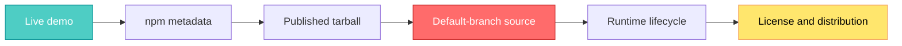
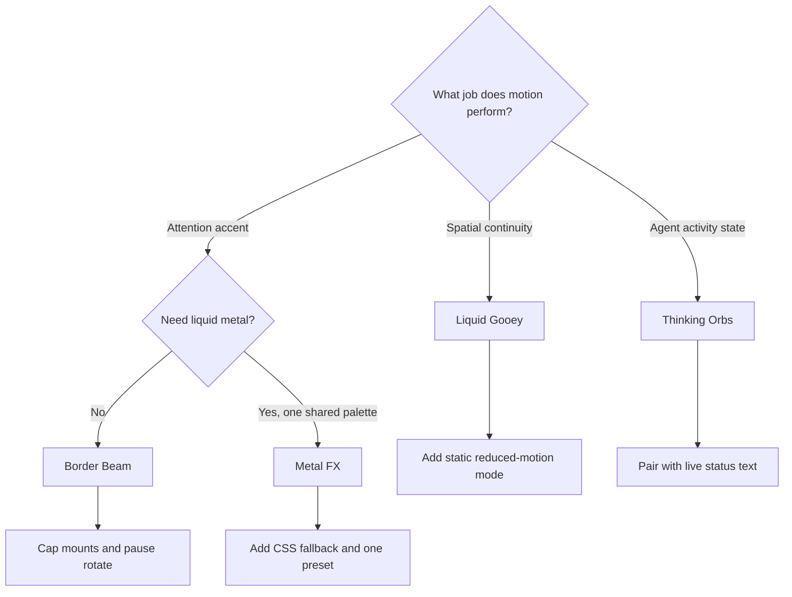

## 🤔 Curiosity: When Does a Beautiful Demo Become a Production Dependency?

A short [X post from Kartikey Singh](https://x.com/askwhykartik/status/2092227759057641685) put four links under one irresistible promise: "Free UI resources that actually slap."

The links were genuinely good:

1. [Liquid Gooey](https://gooey.jakubantalik.com/) for interfaces that merge like liquid.
2. [Border Beam](https://beam.jakubantalik.com/) for a traveling or breathing border highlight.
3. [Metal FX](https://metal.jakubantalik.com/) for an iridescent liquid-metal ring.
4. [Thinking Orbs](https://orbs.jakubantalik.com/) for semantic AI activity states.

By my 2026-08-26 snapshot, X showed roughly **40,800 views** and **1,300 bookmarks**. That is exactly when my production reflex activates. A demo can prove that an effect is desirable. It cannot prove that the npm package matches the demo, that ten instances remain cheap, that reduced motion works, that a native install command resolves, or that the license notice survives my build.

After eight years of shipping game and interactive UI, I treat motion like particles or post-processing. It is a budgeted system, not free decoration. The closer an effect gets to an input, purchase button, or agent status, the more its lifecycle and semantics matter.

> **My source-level conclusion:** these are not four interchangeable decorations. They are four different renderers with four different failure modes. The right question is not "Which one looks best?" It is "Which rendering contract can this screen afford?"
{: .prompt-info}

{: .w-100 .shadow .rounded-10 }
_Figure 1. Original cover for this article. A bookmark is the start of the evaluation path, not the end._

All four projects are primarily by [Jakub Antalik](https://github.com/Jakubantalik). The Thinking Orbs demo also credits [Alex Brinza](https://github.com/alexbrinza). I pinned the audit to these source snapshots:

| Source snapshot on 2026-08-26 | Commit | What it contains |
|:--|:--|:--|
| [Jakubantalik/Libraries](https://github.com/Jakubantalik/Libraries/tree/b47ff34dbb37c6fb801cbfc195ec840c8b1924b2) | `b47ff34` | Liquid Gooey, Border Beam, Thinking Orbs, demo sites, and native ports |
| [Jakubantalik/metal-fx](https://github.com/Jakubantalik/metal-fx/tree/be1bf89c63056521a4e8224f368768314c9006f7) | `be1bf89` | Metal FX 1.0.4 and its demo |
| [Jakubantalik/thinking-orbs](https://github.com/Jakubantalik/thinking-orbs/tree/de85557ca220332586d070d8788c0e1d6e877a0d) | `de85557` | Standalone Thinking Orbs repository referenced by npm |

GitHub, X, and npm counters below are point-in-time context, not quality scores.

## 📚 Retrieve: Follow the Pixel Back to Its Source

### My audit path

I checked five surfaces for each effect:



That order matters. The live site says what the creator intends. The tarball says what a user actually installs. The source says how the effect spends CPU, GPU, DOM, and accessibility budget. The license says what must travel with a copy.

I also measured the ESM files in the published tarballs. The gzip figures are local gzip measurements of the shipped JavaScript, excluding React itself. A real bundler may tree-shake or compress differently.

| Package | npm latest | Rendering core | Shipped ESM, gzip | Weekly downloads at audit time | Automatic reduced motion |
|:--|:--|:--|--:|--:|:--|
| [`liquid-gooey`](https://www.npmjs.com/package/liquid-gooey/v/0.1.0) | 0.1.0 | SVG filters plus live DOM | 19.1 KB | 6,204 | Partial |
| [`border-beam`](https://www.npmjs.com/package/border-beam/v/1.3.0) | 1.3.0 | CSS gradients, masks, shared RAF for pulse | 11.9 KB | 124,572 | Pulse only |
| [`metal-fx`](https://www.npmjs.com/package/metal-fx/v/1.0.4) | 1.0.4 | Shared WebGL plus per-instance 2D canvas | 19.7 KB | 15,086 | No |
| [`thinking-orbs`](https://www.npmjs.com/package/thinking-orbs/v/0.3.1) | 0.3.1 | Pure geometry plus 2D canvas | about 7.7 KB | 311,608 | Yes |

The download numbers are surprisingly large for young packages. They are useful demand signals, but they are not verified active-user counts. Registry mirrors, CI, bots, and repeated installs all contribute.

{: .w-100 .shadow .rounded-10 }
_Figure 2. Original source map. The visible effect is the final stage of a scheduler, renderer, and distribution contract._

### 1. Liquid Gooey: the best abstraction is two layers

{: .w-100 .shadow .rounded-10 }
_Figure 3. Live Liquid Gooey demo captured on 2026-08-26. Site and component by Jakub Antalik._

The usual goo effect blurs the element, increases alpha contrast, and accidentally softens the text, icon, shadow, and focus ring with it. Liquid Gooey takes the more disciplined route.

Its [`GooeyRoot`](https://github.com/Jakubantalik/Libraries/blob/b47ff34dbb37c6fb801cbfc195ec840c8b1924b2/packages/liquid-gooey/src/Gooey.tsx#L127-L213) renders:

- an `aria-hidden` SVG silhouette below the content;
- the goo filter and merged shadow on that silhouette;
- the original interactive DOM above it;
- an optional SVG melt overlay that never receives pointer events.

This is why the demo can look soft and liquid while buttons, images, and labels remain crisp. It is also a reusable systems lesson: **duplicate geometry, not semantics**. The visual proxy can be filtered aggressively because the real control still owns focus, ARIA, and handlers.

The source has more engineering than the one-line install suggests. It parses `box-shadow`, moves large blurred outer shadows to compositor-friendly CSS `drop-shadow()`, measures item geometry, and runs a 1,758-line observation engine that sleeps after the scene settles. The package contains about 3,100 source lines even though its public API stays small.

The boundary is equally important:

- Reduced motion is **partial**. Component-driven `x`, `y`, and scale transitions call [`useReducedMotion`](https://github.com/Jakubantalik/Libraries/blob/b47ff34dbb37c6fb801cbfc195ec840c8b1924b2/packages/liquid-gooey/src/GooeyItem.tsx#L154-L246) and collapse to a snap. Observed `move`, shape evolution, and dissolve use the measurement engine and do not consult that hook.
- The official caveats say dissolve writes `mask-image` onto images, shape morphing writes `filter: blur()` during motion, and rotation is not mirrored in v1.
- Version 0.1.0 is the only npm release in my snapshot. The React package has a typecheck script but no automated test script.

**Adoption verdict:** strong for one meaningful morph, grouped action menu, or spatial transition. I would pilot it behind a feature flag before making it a navigation primitive, and I would supply my own static reduced-motion mode for every observed effect.

### 2. Border Beam: CSS is cheap until every mount writes a stylesheet

{: .w-100 .shadow .rounded-10 }
_Figure 4. Live Border Beam demo captured on 2026-08-26. Site and component by Jakub Antalik._

Border Beam uses a sensible split:

- rotate and line variants use CSS gradients, masks, pseudo-elements, and keyframes;
- pulse variants use one shared, roughly 30 fps [`requestAnimationFrame` driver](https://github.com/Jakubantalik/Libraries/blob/b47ff34dbb37c6fb801cbfc195ec840c8b1924b2/packages/border-beam/src/pulseDriver.ts#L27-L107);
- `IntersectionObserver` pauses an offscreen instance;
- effect layers use `pointer-events: none`.

That is much cheaper than giving each border its own canvas or WebGL context. The tradeoff appears in [`BorderBeam.tsx`](https://github.com/Jakubantalik/Libraries/blob/b47ff34dbb37c6fb801cbfc195ec840c8b1924b2/packages/border-beam/src/BorderBeam.tsx#L210-L316): every mounted component generates ID-scoped CSS and renders its own `<style>` element.

On the live demo I measured **seven beam mounts, seven style blocks, and 72,428 bytes of generated CSS text**. That is not network transfer, and it is not automatically a problem. It does mean this component belongs on one hero input or one premium card, not on every row of a 200-item table.

There are two more boundaries:

1. Pulse variants disable animation under `prefers-reduced-motion`. Rotate and line variants leave that responsibility to the consumer, exactly as the README states.
2. The source package is version **1.4.0**, and a `1.4.0` tag exists, but npm latest was still **1.3.0** during this audit. The repository has moved into the Libraries monorepo, while the 1.3.0 tarball still names the older `Jakubantalik/border-beam` URL, which GitHub redirects.

**Adoption verdict:** the easiest of the four to ship as a restrained accent. Keep the instance count small, turn rotate off for reduced-motion users, and pin the actual npm version rather than reading features only from `main`.

### 3. Metal FX: excellent renderer sharing, one global palette

{: .w-100 .shadow .rounded-10 }
_Figure 5. Live Metal FX demo captured on 2026-08-26. Site and component by Jakub Antalik._

Metal FX solves the expensive version of the problem well. It does not create one WebGL context per button. The 1.0.4 source creates a single 96-pixel offscreen shader canvas, caps its shader DPR at 2, renders at a 66 ms interval, then copies a crop into each instance's 2D canvas. It pauses invisible copies, stops on a hidden tab, handles context loss, and releases the program, buffer, bitmap, and context after the last instance unmounts.

That is a production-minded renderer lifecycle. The package README says one shared shader and one shared loop, and the code delivers that.

The same optimization creates the most important correctness boundary in this audit. Each component runs [`setSharedPreset(preset, resolvedTheme)`](https://github.com/Jakubantalik/metal-fx/blob/be1bf89c63056521a4e8224f368768314c9006f7/src/MetalFx.tsx#L156-L163), while the shared renderer stores only [one `preset`](https://github.com/Jakubantalik/metal-fx/blob/be1bf89c63056521a4e8224f368768314c9006f7/src/engine/renderer/core.ts#L53-L79). The setter overwrites that global value.

```tsx
<MetalFx preset="gold">
  <button>Upgrade</button>
</MetalFx>

<MetalFx preset="silver">
  <button>Send</button>
</MetalFx>
```

In the audited 1.0.4 source, these do not own independent shader palettes. The last preset effect to run becomes the shared palette copied by every instance. Explicitly mixing `dark` and `light` themes has the same collision. The public props look per-component, but the renderer contract is page-global.

Metal FX also has no automatic `prefers-reduced-motion` check. It exposes `paused`, so the application can provide the policy, but the default animation continues. The React package has typecheck and build scripts but no automated test script.

There is no graceful internal fallback when WebGL is disabled or unavailable. [`ensureSharedRenderer()` throws](https://github.com/Jakubantalik/metal-fx/blob/be1bf89c63056521a4e8224f368768314c9006f7/src/engine/renderer/core.ts#L123-L148), and `MetalFx` does not catch that error. A production integration therefore needs feature detection or an error boundary whose fallback lives outside the component.

**Adoption verdict:** excellent for a single chromatic call to action or a small family that intentionally shares one palette. I would not use mixed presets on the same page until the renderer groups instances by preset or moves color uniforms into a per-copy stage. I would always add a non-WebGL border fallback and drive `paused` from the product motion policy.

### 4. Thinking Orbs: the strongest semantic and accessibility baseline

{: .w-100 .shadow .rounded-10 }
_Figure 6. Live Thinking Orbs demo captured on 2026-08-26. Site by Jakub Antalik and Alex Brinza; component licensed by Jakub Antalik._

Thinking Orbs is the most product-specific package here. It maps nine agent verbs, including working, searching, solving, listening, connecting, weaving, composing, breathing, and shaping, to nine tuned dot animations. The 64-pixel and 20-pixel variants are separate designs, not one bitmap scaled down.

The renderer stays simple: pure geometry produces dots, a 2D canvas paints them, and DPR is capped at 2. It avoids WebGL, SVG filters, and canvas filters. The package also exports a React-free [`thinking-orbs/engine`](https://github.com/Jakubantalik/Libraries/blob/b47ff34dbb37c6fb801cbfc195ec840c8b1924b2/packages/thinking-orbs/src/engine/index.ts) entry point for another renderer.

Its default lifecycle is the best of the four:

- `role="img"` and a state-specific `aria-label`;
- a deterministic static frame under reduced motion;
- automatic pause when offscreen or when the tab is hidden;
- live light and dark theme detection.

There is one wording detail worth translating into runtime terms. The README says all instances share one clock. In [`ThinkingOrb.tsx`](https://github.com/Jakubantalik/Libraries/blob/b47ff34dbb37c6fb801cbfc195ec840c8b1924b2/packages/thinking-orbs/src/ThinkingOrb.tsx#L39-L106), they share `performance.now()` as a phase clock, but each visible orb owns its own RAF callback. Ten orbs stay synchronized, yet still schedule ten loops. That is fine for a chat header and inline status, but I would not render hundreds in a scrolling activity log.

An `aria-label` also does not make changing state a live announcement. When the orb communicates progress rather than decoration, wrap it with explicit status text:

```tsx
<div role="status" aria-live="polite" className="agent-status">
  <ThinkingOrb state="searching" size={20} aria-hidden="true" />
  <span className="sr-only">Searching documentation</span>
</div>
```

The provenance is split but verifiable. The live site's GitHub button points to the Libraries monorepo. The npm 0.3.1 metadata points to the standalone `thinking-orbs` repository. I compared the 16 source files at the audited heads and their contents were identical.

**Adoption verdict:** the safest default for a small number of AI status indicators. Keep the visible orb decorative when separate live text owns the announcement, and virtualize long histories instead of mounting one animated canvas per event.

### The platform tabs are not the same as published packages

The four React packages are on npm and all require React 18 or newer. The SwiftUI and React Native tabs on Border Beam and Thinking Orbs need a separate reading.

| Surface advertised by the demos | What the audit found |
|:--|:--|
| Border Beam SwiftUI | Source and snapshot tests exist under `ports/ios/BorderBeamKit`. The site shows `Libraries.git` from `1.4.0`, but that tag has no `Package.swift` at repository root. The manifest is nested, so the displayed root package URL is not currently discoverable by SwiftPM. |
| Thinking Orbs SwiftUI | `ThinkingOrbsKit` exists under the monorepo's package directory. The site points `Libraries.git` to `0.3.1`, but the monorepo has no `0.3.1` tag. The standalone repo has `v0.3.1`, but that tag has no Swift package manifest. |
| Both React Native ports | The sites correctly label them beta and not published. They instruct users to copy the port source and install Skia plus Reanimated peers. |

The problematic Swift strings are not hidden. They are in the live site source for [Border Beam](https://github.com/Jakubantalik/Libraries/blob/b47ff34dbb37c6fb801cbfc195ec840c8b1924b2/sites/beam/src/App.tsx#L314-L345) and [Thinking Orbs](https://github.com/Jakubantalik/Libraries/blob/b47ff34dbb37c6fb801cbfc195ec840c8b1924b2/sites/orbs/lib/platforms.ts#L21-L68). The actual nested manifests are [BorderBeamKit/Package.swift](https://github.com/Jakubantalik/Libraries/blob/b47ff34dbb37c6fb801cbfc195ec840c8b1924b2/packages/border-beam/ports/ios/BorderBeamKit/Package.swift) and [ThinkingOrbsKit/Package.swift](https://github.com/Jakubantalik/Libraries/blob/b47ff34dbb37c6fb801cbfc195ec840c8b1924b2/packages/thinking-orbs/ports/ios/ThinkingOrbsKit/Package.swift).

> **Distribution verdict:** treat React as released, React Native as source-copy beta, and the displayed Swift package commands as blocked until the manifests have resolvable package roots and matching tags.
{: .prompt-warning}

### MIT means permissive, not notice-free

Every audited repository and npm tarball carries the same [MIT license](https://github.com/Jakubantalik/Libraries/blob/b47ff34dbb37c6fb801cbfc195ec840c8b1924b2/LICENSE), with copyright attributed to Jakub Antalik in 2026.

MIT permits use, modification, redistribution, sublicensing, and commercial sale. Its condition is short but real: the copyright notice and permission notice must be included in copies or substantial portions of the software. The software is provided without warranty.

For an application, my practical rule is:

1. Keep the package license in source distributions.
2. Generate a `THIRD_PARTY_NOTICES` file for binary or bundled releases.
3. Do not assume a minifier will preserve a license comment that was never in the distributed JavaScript.
4. Preserve attribution when copying a beta native port directly from the repository.

This is an engineering checklist, not legal advice.

The release workflow deserves one final note. The monorepo's [npm workflow](https://github.com/Jakubantalik/Libraries/blob/b47ff34dbb37c6fb801cbfc195ec840c8b1924b2/.github/workflows/publish.yml#L21-L52) installs dependencies and publishes through each package's build hook. It does not run the available typecheck, spec extraction, browser parity, or native test suites as publish gates. The Swift ports do contain snapshot and golden tests, but those checks are not automatically coupled to an npm release.

## 💡 Innovation: Turn an Effect Into a Motion Capability Contract

The source audit changed how I would integrate these packages. I would not expose four raw components across a product. I would place them behind one motion policy and make the fallback part of the API.

### A production wrapper should own the policy

```tsx
import { useSyncExternalStore } from 'react';
import { BorderBeam } from 'border-beam';
import { MetalFx } from 'metal-fx';
import { Liquid } from 'liquid-gooey';

const MOTION_QUERY = '(prefers-reduced-motion: reduce)';

function subscribeToMotionPreference(onChange: () => void) {
  const query = window.matchMedia(MOTION_QUERY);
  query.addEventListener('change', onChange);
  return () => query.removeEventListener('change', onChange);
}

function usePrefersReducedMotion() {
  return useSyncExternalStore(
    subscribeToMotionPreference,
    () => window.matchMedia(MOTION_QUERY).matches,
    () => true, // The server renders the motion-safe version.
  );
}

export function PremiumAction({ highlighted }: { highlighted: boolean }) {
  const reduced = usePrefersReducedMotion();
  const animate = highlighted && !reduced;

  return (
    <Liquid fill="var(--surface-accent)">
      <Liquid.Item
        effect="morph"
        morph={{ shape: animate }}
        dissolve={animate}
      >
        <BorderBeam active={animate} staticColors={reduced}>
          <MetalFx preset="chromatic" paused={!animate}>
            <button>Upgrade</button>
          </MetalFx>
        </BorderBeam>
      </Liquid.Item>
    </Liquid>
  );
}
```

I would not actually stack all three effects on one production button without profiling. The example shows policy ownership: the application decides when motion is permitted, while each library remains an implementation detail.

A real capability contract should also define:

- **instance budget:** for example, one Metal FX, up to three Border Beams, and up to five visible orbs;
- **fallback:** static gradient border, solid surface, or text status;
- **visibility policy:** pause outside the viewport and when the document is hidden;
- **accessibility owner:** the underlying control or explicit `role="status"`, never the effect alone;
- **version pin:** exact npm version plus the audited source coordinate;
- **notice path:** where third-party licenses ship.

### My selection matrix

| Product job | First choice | Why | Hard boundary |
|:--|:--|:--|:--|
| Spatial merge or grouped action | Liquid Gooey | Preserves real DOM while the silhouette melts | Partial reduced-motion coverage and young 0.1.0 surface |
| Focus attention on one control | Border Beam | Mostly CSS, no canvas or WebGL for rotate | Per-instance style growth; rotate needs consumer motion policy |
| Premium hero call to action | Metal FX | Shared WebGL renderer and strong visual identity | One global preset/theme and no automatic reduced motion |
| AI agent activity status | Thinking Orbs | Semantic states, static reduced frame, portable geometry | One RAF per visible orb; live announcements need separate status text |

The decision flow is small:



### What I would ship today

I would ship Thinking Orbs for one active agent status, Border Beam for one primary interaction, and a static CSS fallback for both. I would pilot Liquid Gooey on a non-critical morph with reduced motion forced to a snap. I would use Metal FX only when every instance intentionally shares one palette and the control remains fully usable before WebGL initializes.

I would not copy either Swift install command yet. I would wait for a root-resolvable package tag or vendor the nested package at an explicitly pinned commit after running its tests myself.

> **The innovation is not a fifth visual effect.** It is the adapter that turns an attractive third-party animation into a bounded product capability with a lifecycle, fallback, semantic owner, version coordinate, and license notice.
{: .prompt-tip}

### New questions this raises

The most interesting next step is not another shader. It is a shared scheduler across UI effects. Could Border Beam pulse, Thinking Orbs, and Metal FX register with one product-level motion clock? Could a page declare a paint budget and let lower-priority effects become static when that budget is exceeded? Could package manifests expose reduced-motion behavior and renderer cost as machine-readable metadata?

Those questions start where the viral list ends. The demos gave us desire. The source gave us constraints. Production design begins when both are true at the same time.

## References

**Original discovery**

- [Kartikey Singh's X post](https://x.com/askwhykartik/status/2092227759057641685)
- [Liquid Gooey live demo](https://gooey.jakubantalik.com/)
- [Border Beam live demo](https://beam.jakubantalik.com/)
- [Metal FX live demo](https://metal.jakubantalik.com/)
- [Thinking Orbs live demo](https://orbs.jakubantalik.com/)

**Source and packages**

- [Libraries monorepo at audited commit](https://github.com/Jakubantalik/Libraries/tree/b47ff34dbb37c6fb801cbfc195ec840c8b1924b2)
- [Metal FX at audited commit](https://github.com/Jakubantalik/metal-fx/tree/be1bf89c63056521a4e8224f368768314c9006f7)
- [Thinking Orbs standalone at audited commit](https://github.com/Jakubantalik/thinking-orbs/tree/de85557ca220332586d070d8788c0e1d6e877a0d)
- [liquid-gooey 0.1.0 on npm](https://www.npmjs.com/package/liquid-gooey/v/0.1.0)
- [border-beam 1.3.0 on npm](https://www.npmjs.com/package/border-beam/v/1.3.0)
- [metal-fx 1.0.4 on npm](https://www.npmjs.com/package/metal-fx/v/1.0.4)
- [thinking-orbs 0.3.1 on npm](https://www.npmjs.com/package/thinking-orbs/v/0.3.1)
