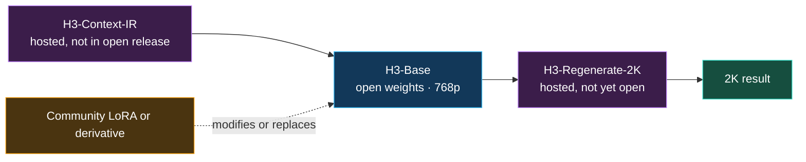

## 🤔 Curiosity: Can 19 `.safetensors` Files Really Share One Folder?

A roundup published on August 28 collected [19 MiniMax H3 “LoRAs and variants”](https://www.stablediffusiontutorials.com/2026/08/minimax-h3-lora-models.html), pointed readers to a separate base-model workflow, then reduced adapter setup to one global instruction: download any LoRA and save it in `ComfyUI/models/loras`.

That instruction is attractive because it turns a 33B Omni-Transformer sitting behind a full Qwen3-VL-32B encoder into something that feels like a style pack. Pick *Wushu*, *Camera Motion*, *Realism*, or *Turbo*. Drop in a file. Generate.

I followed every nested Hugging Face link instead. I read the API metadata and pinned model card for all 19 repositories, then checked the [official H3 repository](https://huggingface.co/MiniMaxAI/MiniMax-H3/tree/42ed227ee7df40d41602854ae760620d6eb651fe), [official API schema](https://platform.minimax.io/docs/api-reference/video-generation-v2-create), and [community license](https://huggingface.co/MiniMaxAI/MiniMax-H3/blob/42ed227ee7df40d41602854ae760620d6eb651fe/LICENSE).

The folder metaphor broke immediately:

- **Four of the 19 downloads are not LoRA adapters to H3's diffusion model.** One is a full merged checkpoint, one adapts Qwen3-VL, one is a standalone 3D-convolution upscaler, and one is a grafted base model.
- **The 15 actual H3 adapters are not interchangeable.** Some target FL2VA, some Ref2VA, some only text-to-video. Several encode a fixed four- or eight-step sampling contract. RAVEN and LineartAnime require their own runtime paths.
- **The license is a gate before the loader.** MiniMax's community grant explicitly excludes the European Union, United Kingdom, Republic of Korea, and United States. Because I am working from South Korea, that is not an abstract footnote.

> The useful unit is not “an H3 LoRA.” It is a compatibility contract: **territory + artifact type + base family + runtime + sampler**.
{: .prompt-tip}

{: .w-100 .shadow .rounded-10 }

I did **not** download the weights or generate videos for this audit. I therefore make no independent quality or speed ranking. What I can verify is what each repository contains, what it targets, how its author says to load it, which constraints the card discloses, and where the license boundary sits.

> **Verification note:** This post occupies the requested August 29 editorial slot; the primary-source snapshot was completed on August 30, 2026 KST. Model cards and metadata can change after that snapshot.
{: .prompt-info}

## 📚 Retrieve: First Define What “Open H3” Contains

MiniMax's announcement describes H3 as a general-purpose multimodal system that accepts text, images, video, and audio, then generates video with stereo sound for up to 15 seconds at up to 2K. The open repository makes the system boundary more precise.

H3 is three modules:



The open release contains **H3-Base**, which produces 768p audio-video. The hosted **H3-Context-IR** prepares complex multimodal instructions, while **H3-Regenerate-2K** feeds the 768p result and original context back through H3 to produce 2K. At revision [`42ed227`](https://huggingface.co/MiniMaxAI/MiniMax-H3/tree/42ed227ee7df40d41602854ae760620d6eb651fe), MiniMax says Context-IR is not included because it depends on a multistage hosted workflow, and Regenerate-2K is “not yet open-sourced.”

That distinction matters. A local LoRA changes the open base path; it does not automatically reproduce the complete hosted 2K product.

The base itself also comes in two checkpoint families:

| Open checkpoint | Input contract | Why an adapter name is not enough |
|---|---|---|
| **FL2VA** | Text, optional first frame, optional last frame | An acceleration or style LoRA trained here does not imply Ref2VA support. |
| **Ref2VA** | Text plus reference images, videos, and/or audio | The adapter must explicitly target the reference-conditioned model path. |

Both released families are BF16, CFG-distilled checkpoints. The naming adds another trap: H3-Base's **H3-Encoder uses the full pretrained weights of Qwen3-VL-32B**, whereas the Prompt Rewriter in this list adapts Qwen3-VL-8B-Instruct as a separate upstream model. A shared Qwen family name does not make them the same target or loader.

MiniMax's documented v2 API exposes `model`, `content`, `resolution`, `duration`, `ratio`, and `callback_url`. It exposes **no LoRA or adapter parameter**. In other words, the visible H3 LoRA ecosystem is community and third-party infrastructure around the open weights, not a personalization feature of MiniMax's official API.

This is similar to the lesson from my [LongCat-Video source audit](/posts/longcat-video-stateful-continuation/): a model name hides several state and runtime contracts. H3 adds another layer because the public product, local base, and community adapters are three different surfaces.

## The Four Downloads That Are Not H3 LoRAs

The roundup correctly labels 10Eros as a base model. However, its page title and global adapter instruction still collapse the collection, and it gives no separate loader guidance for the Qwen prompt adapter, latent upscaler, or full Z-Image checkpoints. Their model cards make those boundaries explicit.

### 1. Z-Image-native is a replacement diffusion checkpoint

[`MiniMax-H3-x-Z-Image-native`](https://huggingface.co/joeygambino/MiniMax-H3-x-Z-Image-native/blob/113de7b82dfb34a9a8958077c94cd3787c9b782e/README.md) is tagged as a **merge**. Its files include pruned FL2VA and Ref2VA H3 builds with the graft baked in. The card tells ComfyUI users to load them with **Load Diffusion Model**, not Load LoRA.

A `.safetensors` suffix describes serialization, not model role.

### 2. Prompt Rewriter 8B is a LoRA for Qwen, not H3

[`MiniMax-H3-Prompt-Rewriter-LoRA-8B`](https://huggingface.co/lightx2v/MiniMax-H3-Prompt-Rewriter-LoRA-8B/blob/a795219bd1677df34259eb4f3a77e2ec282e154f/README.md) is a genuine PEFT LoRA, but its base model is **Qwen/Qwen3-VL-8B-Instruct**. It expands short requests and optional keyframes into production-oriented H3 prompts. The repository contains `adapter_config.json`, `adapter_model.safetensors`, and a Python inference script.

It belongs **upstream** of video generation. Loading it into H3's diffusion-model LoRA slot would target the wrong network.

### 3. Latent Upscaler is a separate 3D-convolution model

[`Minimax_h3_latent_Upscaler`](https://huggingface.co/LBH-123-AI/Minimax_h3_latent_Upscaler/blob/13ccf95d85d120bdbc92c05b1247a6e147bf54bf/README.md) operates on H3's 24-channel VAE latents. Its card describes one 3D-convolution architecture published at several precisions and points to a companion ComfyUI custom node.

This is an adjacent post-processing model. It needs the custom node and its own model location, not H3's LoRA loader.

### 4. 10Eros-Max is a grafted base checkpoint

[`10Eros-Max`](https://huggingface.co/TenStrip/10Eros-Max/blob/4e2929b4bfcc7debfa3d75a2c4c232de97938686/README.md) ships pruned and turbo-hybrid H3 checkpoints. The card describes attention grafts carrying character from LTX 2.3, Wan 2.2, and Krea 2, and Hugging Face flags the repository `not-for-all-audiences`. It is explicitly positioned as NSFW-capable.

That content warning and the extra source-model licenses are material selection facts. Calling it a neutral “custom base model” is incomplete.

## All 19 Releases, Reclassified by Install Contract

The following table is not a recommendation or quality ranking. It is a loader map based on the pinned card for each linked repository.

| # | Linked release | Actual artifact | Runtime or critical contract |
|---:|---|---|---|
| 1 | [Alibaba PAI Acc LoRAs](https://huggingface.co/alibaba-pai/MiniMax-H3-Acc-LoRAs/blob/335001fb9e5455d68a0caa18ec2e319072150328/README.md) | H3 acceleration LoRAs | `videox_fun` scripts, with no ComfyUI recipe in the card; separate FL2VA/Ref2VA files, 8-step, BF16, rank 64, alpha 64. |
| 2 | [STUDIO 1939](https://huggingface.co/lovis93/studio-1939-old-animation-lora-minimax-h3/blob/19214d4c3989de6caca673d534d0d4b16b73b0f7/README.md) | H3 style LoRA | Light and strong variants; card demonstrates a hosted LoRA endpoint rather than a universal local workflow. |
| 3 | [Z-Image-native](https://huggingface.co/joeygambino/MiniMax-H3-x-Z-Image-native/blob/113de7b82dfb34a9a8958077c94cd3787c9b782e/README.md) | **Full H3 merge/checkpoint** | Load Diffusion Model; choose FL2VA/Ref2VA and precision build. |
| 4 | [Turbo-SLA](https://huggingface.co/lightx2v/Minimax-h3-Turbo-SLA/blob/10ade67cd15ff7a135fa35c2a0673ea96c839247/README.md) | H3 acceleration LoRA | FL2V-only, 768p, four steps; native LightX2V and converted ComfyUI files. |
| 5 | [LightX2V Turbo](https://huggingface.co/lightx2v/Minimax-h3-Turbo/blob/05ef678438e84933c406131b59abbf86919b3aac/README.md) | H3 acceleration LoRA set | Multiple 4/8-step, FL2V/Ref2V, native/ComfyUI variants. Filename is part of the contract. |
| 6 | [Looping Sketch Anime](https://huggingface.co/Inner-Reflections/MiniMax-H3-Looping-Sketch-Anime/blob/9c88fbc800ea87d745137f1b637c08aa1a5e3bd6/README.md) | H3 style LoRA | Standard adapter-style use; no license is declared in HF metadata at the audited revision. |
| 7 | [Krea2 H3 Style](https://huggingface.co/TenStrip/Krea2-H3-Style-Lora/blob/6e80e180d04d92c2b092a790110ec6f8b11226b9/README.md) | Experimental H3 style LoRA | T2V-only; author reports partial delta capture, not a general Krea replacement. |
| 8 | [RAVEN Streaming](https://huggingface.co/mvp-lab/MiniMax-H3-RAVEN-Streaming-LoRA/blob/90f30b11639e73ce0e3f2ab6ed70d1a133a66caf/README.md) | H3 streaming LoRA preview | RAVEN trial config or custom ComfyUI nodes; undertrained four-NFE preview. |
| 9 | [Prompt Rewriter 8B](https://huggingface.co/lightx2v/MiniMax-H3-Prompt-Rewriter-LoRA-8B/blob/a795219bd1677df34259eb4f3a77e2ec282e154f/README.md) | **Qwen3-VL PEFT LoRA** | Run as a prompt-rewriting model before H3; not an H3 diffusion adapter. |
| 10 | [Wan2.2 H3 Motion](https://huggingface.co/TenStrip/Wan2.2_H3_Motion_Lora/blob/8177789aec8fea2135ab96b92582c9a8fa89b7e7/README.md) | Experimental H3 motion LoRA | Cross-model attention-graft extraction; card reports incomplete delta capture. |
| 11 | [Wushu Action](https://huggingface.co/Jojocodex/minimax-h3-wushu-action-lora/blob/0a3e530444a153564120f6844526e1f4a63bf487/README.md) | H3 motion LoRA | Comfy-Org H3 base; requires the documented `wushu_action` trigger. |
| 12 | [Camera Motion](https://huggingface.co/Jojocodex/minimax-h3-Camera-Motion-lora/blob/fac88d6196ca84f3cee014ec79c71dc73572ab0a/README.md) | H3 camera-control LoRA | ComfyUI LoRA path; card requires its camera-motion trigger syntax. |
| 13 | [Spatial Physics](https://huggingface.co/Jojocodex/minimax-h3-spatial-physics-lora/blob/476b24df28b9b7cc5481b750469698f5cc4b0558/README.md) | H3 behavior LoRA | Card calls it unstable and under further training; its own strength guidance is inconsistent. |
| 14 | [Latent Upscaler](https://huggingface.co/LBH-123-AI/Minimax_h3_latent_Upscaler/blob/13ccf95d85d120bdbc92c05b1247a6e147bf54bf/README.md) | **Standalone 3D-conv model** | Companion custom node and latent-upscaler model path; not Load LoRA. |
| 15 | [LineartAnime](https://huggingface.co/DiffSynth-Studio/MiniMax-H3-LoRA-LineartAnime/blob/6277f8b672da18581fc73e28cbb77cd34800e1f3/README.md) | H3 conditioning LoRA | Published recipe uses DiffSynth-Studio's H3 pipeline and `load_lora`. |
| 16 | [10Eros-Max](https://huggingface.co/TenStrip/10Eros-Max/blob/4e2929b4bfcc7debfa3d75a2c4c232de97938686/README.md) | **Merged/grafted H3 base model** | Full checkpoint; NSFW-capable; additional source-model license claims. |
| 17 | [Realism People](https://huggingface.co/fal/MiniMax-H3-Realism-People-LoRA/blob/039cc8579d7aa357a882d7f4111b25da4f72dccc/README.md) | H3 style/subject LoRA | Plain LoRA weights; card documents local ComfyUI loading and a trigger token. |
| 18 | [joyfox Turbo](https://huggingface.co/joyfox/MiniMax-H3-Turbo/blob/fc67f405ae0ccb36fefe48243bc76775ee2ba8eb/README.md) | H3 acceleration LoRA | Fixed four-step Euler workflow; card warns of a ComfyUI v0.31.0 audio regression and custom-node workaround. |
| 19 | [Tutu 20→8 NFE](https://huggingface.co/tutututututu/Tutu-MiniMax-H3-AudioVideo-20to8-NFE-LoRA/blob/567c131fb6c44415dde39c016ff9bce458477134/README.md) | H3 FL2VA acceleration LoRA | Eight NFE; separate ComfyUI and Diffusers layouts; step100/200/300 are training checkpoints. |

The table reveals why “download any one” is unsafe even before licensing. A Turbo LoRA is often a **sampling program encoded in weights**. A style LoRA may be T2V-only. A `.safetensors` file may replace the base instead of adapting it. A custom node can be as important as the checkpoint.

Two examples show how a short listicle can invert the evidence:

- The Turbo-SLA card reports 85% attention sparsity and approximately 2.5× inference acceleration on an RTX 5090 in LightX2V. Those are useful **author-reported** measurements, but the same card limits the artifact to a four-step 768p FL2V path and says results vary by environment.
- The RAVEN card calls its H3 artifact an **initial, undertrained preview**, says texture detail remains limited, and states that the adaptation was not one of the models evaluated in the RAVEN paper. “Real-time streaming H3” is therefore a research direction, not a reproduced conclusion from this audit.

## The License Gate Comes Before the Model Gate

The [MiniMax H3 Community License](https://huggingface.co/MiniMaxAI/MiniMax-H3/blob/42ed227ee7df40d41602854ae760620d6eb651fe/LICENSE) is not Apache-2.0 or MIT. It defines the “Applicable Territory” as worldwide **excluding**:

- the European Union,
- the United Kingdom,
- the Republic of Korea,
- and the United States of America.

The grant is stated to apply “solely within the Applicable Territory.” Section V.4 says users may not **use, reproduce, modify, distribute, or display** the H3 Works or their outputs or results outside that territory under this agreement. MiniMax links a dedicated [application form for the USA, EU, UK, and South Korea](https://platform.minimax.io/h3-license) plus an official [license Q&A](https://huggingface.co/MiniMaxAI/MiniMax-H3/blob/42ed227ee7df40d41602854ae760620d6eb651fe/docs/QA-about-License.md).

That Q&A explains why the hosted API can remain globally available while open weights are restricted: MiniMax controls the serving infrastructure and safeguards, whereas independently deployable weights create different compliance challenges. API access in an excluded territory is therefore not the same permission as running the weights locally.

This is not legal advice, and I am not deciding whether any particular derivative complies. I am reporting the primary text. For my own Korea-based workflow, it means **stop before download and obtain the appropriate permission** rather than treating a public Hugging Face button as a license grant.

The derivative definition is also broad. It includes modifications, works based on H3, transferred weight or operational patterns, distillation, intermediate-representation methods, and models trained on H3 synthetic outputs. The same definition explicitly says that **Outputs themselves are not Model Derivatives**. Distribution conditions require the upstream agreement and a NOTICE, while commercial products above the stated annual-revenue threshold require separate written authorization.

The 19 repositories do not express this boundary consistently in Hugging Face metadata:

| HF license metadata at the audited revisions | Repositories |
|---|---:|
| H3 community license via `other` | 9 |
| `apache-2.0` | 6 |
| No declared license | 4 |

Metadata is not a legal judgment. A README may add terms that its front matter omits, and a downstream Apache label cannot tell me whether the upstream agreement still applies. The operational conclusion is narrower: **do not infer permission from the derivative card's badge. Read the base license and every upstream source named by a graft.**

That lesson matches my [Seedance 2.0 stack audit](/posts/seedance-2-ai-drama-stack-audit/): public source, local execution, and commercial permission are three independent axes. “Open weights” only answers one of them.

## 💡 Innovation: Replace the LoRA Folder with a Five-Gate Contract

The most reusable output of this audit is not a better top-19 ranking. It is a manifest I can review before any video-model artifact enters a production graph.

{: .w-100 .shadow .rounded-10 }

### Gate 1: Territory and purpose

Record the exact upstream license revision, operating territory, commercial or research purpose, output restrictions, and any separate authorization. Unknown means stop. This gate precedes bandwidth, VRAM, and visual quality.

### Gate 2: Artifact type

Do not trust the repository title or file extension. Inspect `base_model`, `base_model_relation`, file layout, and loader instructions. Classify the artifact as one of:

- H3 diffusion LoRA,
- adapter to another model,
- replacement H3 checkpoint,
- adjacent VAE/latent tool,
- or custom runtime bundle.

### Gate 3: Base and task family

Pin FL2VA versus Ref2VA, plus T2V/I2V/reference scope. If the author says “T2V-only,” do not discover that limitation after reference conditioning silently degrades.

### Gate 4: Runtime and loader

Pin ComfyUI, LightX2V, DiffSynth-Studio, PEFT, or another framework; record the exact compatible file and custom nodes. “ComfyUI-compatible” is a different artifact from a native LightX2V LoRA even when both live in one repository.

### Gate 5: Sampling and version

Acceleration LoRAs often require a fixed number of steps, sampler, scheduler, flow shifts, and application version. The joyfox audio warning is the clearest example: generation can complete and still produce degraded audio because the runtime's sampling behavior changed.

I would store the contract beside a workflow, not in someone's chat history:

```yaml
source:
  repository: "owner/model"
  revision: "full immutable SHA"
  retrieved_at: "<actual ISO-8601 retrieval time>"

license:
  upstream: "MiniMax H3 Community License"
  operating_territory: "REVIEW_REQUIRED"
  separate_authorization: null

artifact:
  type: "h3-diffusion-lora | full-checkpoint | prompt-adapter | latent-tool"
  target_base: "FL2VA | Ref2VA | Qwen3-VL | other"
  supported_tasks: []

runtime:
  framework: "pin me"
  version: "pin me"
  loader: "pin me"
  custom_nodes: []

sampling:
  steps: null
  sampler: null
  scheduler: null
  model_shifts: {}

verification:
  source_card_read: true
  weights_checksum: null
  local_smoke_test: false
  independent_benchmark: false
```

The unresolved fields are deliberate. They prevent a model card's demo from becoming an accidental production claim.

For a game or virtual-production team, this manifest can travel with the same shot contract I argued for in [CozyClay](/posts/cozyclay-shot-contract/). The shot contract preserves camera intent; the model contract preserves the legal and technical assumptions required to render it. Together they make a generated clip reproducible enough to debug.

## What I Would Test After Permission

This source audit stops before execution, but it sharpens the next experiment. I would not compare 19 subjective demo reels. I would choose one real style LoRA and one acceleration LoRA for a single licensed base family, then freeze:

1. base revision and precision,
2. runtime and custom-node revisions,
3. prompt, input frames, seed, duration, and aspect ratio,
4. sampler, scheduler, NFE, and flow shifts,
5. video and audio outputs plus hashes,
6. wall time, peak VRAM, and failure mode,
7. character identity, camera adherence, temporal stability, and audio synchronization rubrics.

The baseline must use the same workflow without the adapter. That is the only way to separate “the LoRA helped” from “the repository's demo changed five variables.” For Turbo artifacts, quality per second matters more than step count. For style and motion adapters, task coverage matters more than one beautiful seed.

Until that benchmark exists, I can say **what the artifacts are**, not which one is best.

## 🎯 Key Takeaways

- **The supplied 19-item list contains 15 H3 diffusion adapters and four different artifact types.** Z-Image-native and 10Eros-Max are full checkpoints; Prompt Rewriter adapts Qwen3-VL; Latent Upscaler is a separate 3D-convolution model.
- **An H3 LoRA name does not define compatibility.** FL2VA/Ref2VA, T2V/reference scope, runtime format, custom nodes, steps, sampler, shifts, and app version all matter.
- **The official local release is H3-Base at 768p.** The official Context-IR and Regenerate-2K modules were not open at the audited revision, so a local adapter does not recreate the complete hosted 2K workflow.
- **MiniMax's official API has no documented LoRA field.** The adapter ecosystem is community and third-party infrastructure around the open base.
- **The upstream community license excludes the EU, UK, Republic of Korea, and USA.** Public weights are not permission; the license text directs excluded-territory users to MiniMax's separate application path.
- **Performance claims remain card claims here.** I did not generate outputs or reproduce the reported Turbo-SLA or RAVEN results.
- **A manifest beats a folder.** Treat every derivative as a versioned contract that can fail closed when license, loader, base, or sampler data is missing.

## 🤔 New Questions This Raises

1. Can the community publish a machine-readable derivative manifest that Hugging Face and ComfyUI validate before a workflow loads weights?
2. Should a model hub inherit upstream territory and redistribution notices automatically instead of relying on each derivative author's metadata?
3. What is the smallest reproducible H3 adapter benchmark that scores video, stereo audio, reference identity, and wall-clock cost without turning into a cherry-picked demo contest?
4. When H3-Regenerate-2K becomes open, will existing 768p acceleration and style LoRAs preserve their behavior through the second in-context generation pass?
5. Could game production tools bind a shot contract and a model contract into one provenance record, so every generated cinematic remains reproducible months later?

## References

### Audit Target

- [19 Minimax H3 LoRA models for Optimized Video Generation](https://www.stablediffusiontutorials.com/2026/08/minimax-h3-lora-models.html) — secondary roundup audited here, published August 28, 2026

### Official MiniMax Sources

- [MiniMax H3 announcement](https://www.minimax.io/blog/minimax-h3)
- [MiniMax H3 model repository](https://huggingface.co/MiniMaxAI/MiniMax-H3/tree/42ed227ee7df40d41602854ae760620d6eb651fe) — audited at revision `42ed227ee7df40d41602854ae760620d6eb651fe`
- [MiniMax H3 Community License](https://huggingface.co/MiniMaxAI/MiniMax-H3/blob/42ed227ee7df40d41602854ae760620d6eb651fe/LICENSE)
- [H3 license application form for USA/EU/UK/South Korea](https://platform.minimax.io/h3-license)
- [Official H3 license Q&A](https://huggingface.co/MiniMaxAI/MiniMax-H3/blob/42ed227ee7df40d41602854ae760620d6eb651fe/docs/QA-about-License.md)
- [Create Video Generation Task API schema](https://platform.minimax.io/docs/api-reference/video-generation-v2-create)
- [Official H3 prompt-writing guide](https://huggingface.co/MiniMaxAI/MiniMax-H3/blob/42ed227ee7df40d41602854ae760620d6eb651fe/docs/VIDEO_PROMPT_WRITING_GUIDE_base_en.md)

### High-Risk Compatibility Cards

- [Z-Image-native full checkpoint](https://huggingface.co/joeygambino/MiniMax-H3-x-Z-Image-native/blob/113de7b82dfb34a9a8958077c94cd3787c9b782e/README.md)
- [Qwen-based Prompt Rewriter](https://huggingface.co/lightx2v/MiniMax-H3-Prompt-Rewriter-LoRA-8B/blob/a795219bd1677df34259eb4f3a77e2ec282e154f/README.md)
- [H3 Latent Upscaler](https://huggingface.co/LBH-123-AI/Minimax_h3_latent_Upscaler/blob/13ccf95d85d120bdbc92c05b1247a6e147bf54bf/README.md)
- [10Eros-Max merged base](https://huggingface.co/TenStrip/10Eros-Max/blob/4e2929b4bfcc7debfa3d75a2c4c232de97938686/README.md)
- [RAVEN streaming preview](https://huggingface.co/mvp-lab/MiniMax-H3-RAVEN-Streaming-LoRA/blob/90f30b11639e73ce0e3f2ab6ed70d1a133a66caf/README.md)
- [joyfox Turbo sampling contract](https://huggingface.co/joyfox/MiniMax-H3-Turbo/blob/fc67f405ae0ccb36fefe48243bc76775ee2ba8eb/README.md)

### Related Posts

- [LongCat-Video: The Continuation State Is the Product](/posts/longcat-video-stateful-continuation/)
- [After Seedance 2.0, I Re-Audited Four AI Drama Stacks](/posts/seedance-2-ai-drama-stack-audit/)
- [CozyClay: AI Video Needed a Shot Contract, Not Another Prompt Box](/posts/cozyclay-shot-contract/)
