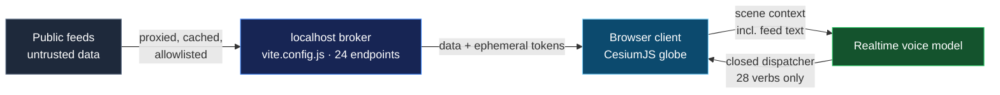

## 🤔 Curiosity: What Does a "Spy Satellite Simulator in Your Browser" Actually Trust?

Last week, on 2026-08-24 (UTC), Bilawal Sidhu open-sourced [God's Eye View](https://github.com/bilawalsidhu/gods-eye-view) — the project behind his viral "spy satellite" video series — with the tagline: *"A spy-satellite simulator in your browser — then you realize the sources are public and the data is real."* By the time I pulled the repository on 2026-08-30 KST, it sat at **12,125 stars**, climbing at roughly 1,870 stars that day on GitHub trending.

The demo GIFs are the obvious story: live aircraft gliding over Google's Photorealistic 3D Tiles, CCTV feeds projected into a 3D city, the ISS tracked from current orbital elements, FLIR-style shaders over the whole planet, and a hands-free voice agent flying the camera.

But I have learned to distrust my own reaction to beautiful demos. When I audited [four viral UI effects](/posts/viral-ui-effects-source-audit/) earlier this week, the gap between demo and dependency was where all the production risk lived. So I asked the same question here, at commit [`314a0e1`](https://github.com/bilawalsidhu/gods-eye-view/tree/314a0e1c2ef668cb110674b737e19a44ff6fc1ef) (2026-08-28):

> If the browser renders live aircraft, ships, satellites, cameras, and a voice AI — **who is holding the keys, who is containing the model, and who actually owns the data?**
{: .prompt-tip}

The answer inverted my mental model of the project. The globe is the demo. The durable engineering — the part I would steal for my own agent and game-tool work — is three deliberate boundaries.

{: .w-100 .shadow .rounded-10 }

## 📚 Retrieve: Reading the Repository Instead of the GIFs

First, the shape of the thing. This is a **framework-free** client: the only runtime dependencies in `package.json` are `cesium` (^1.124), `satellite.js` (^6.0.2) for SGP4 propagation, `mgrs`, `egm96-universal`, `pbf`, and `@mapbox/vector-tile`. No React, no state library. The client bulk lives in monolithic files — `src/ui.js` alone is 10,293 lines — across 143 source JS files totaling roughly 3.8 MB.

That sounds like vibe-coded chaos until you notice the counterweight: **154 colocated `*.test.mjs` files and 39 Puppeteer-driven `qa-*.mjs` scripts** ship in the repo, covering everything from cockpit plates to cable-overlay rendering to voice routing. Whatever process produced this codebase, it left its verification harness behind — which is exactly what I want to see before trusting a fast-moving solo project.

### Boundary 1 — The process boundary: `vite.config.js` is the real backend

The README calls this a browser app. The security model says otherwise, in the repo's own words: *"The dev server is a **key broker**: every server-side key above is spendable by anyone who can send HTTP requests to it."*

The file that matters most is the one nobody screenshots. At the pinned commit, `vite.config.js` is **7,383 lines (322 KB)** and registers **24 distinct `/api/*` server middlewares** — an entire API gateway living inside a build tool's config file:

{: .w-100 .shadow .rounded-10 }

Three design choices stood out when I read the middleware code and `SECURITY.md` together:

1. **Secrets never reach the client.** `OPENAI_API_KEY` stays server-side; the browser fetches a short-lived ephemeral Realtime session token from `/api/realtime/token`. AISStream and OpenSky OAuth credentials follow the same pattern. The Vite `define` block ships exactly two build-time values to the bundle: a Google Maps key and an optional Cesium ion token — both designed to be public and restricted at the provider console, like a Mapbox token.
2. **The proxies refuse to become open relays.** The CCTV frame proxy only fetches server-registered camera URLs (SSRF mitigation). The radio proxy contacts only allowlisted HTTPS hosts, rejects redirects, refuses any hostname that resolves to loopback/private/link-local/metadata addresses, and pins each TLS connection to a validated address. That is more DNS-rebinding discipline than I have seen in most production internal tools.
3. **The rate limits are honest about what they are not.** `GEV_RATELIMIT_OPENAI_PER_MIN` and friends are opt-in, per-IP, process-local, in-memory guards. `SECURITY.md` says it plainly: they *"reset on restart and are not billing caps. Provider-side budgets are the real backstop."*

One drift, for honesty: `SECURITY.md` claims the define block passes *"only these two keys plus two non-secret CCTV feature flags."* At `314a0e1`, the flags are not there — the define block contains only the two keys. The docs describe **more** client exposure than the code performs. That is the safe direction to drift in, but it is still drift, and it is the kind of thing only a source read catches.

### Boundary 2 — The model boundary: 28 verbs between the voice model and the world

The voice layer uses the OpenAI Realtime API, and the README makes a countable claim: *"Twenty-eight tools, four jobs."* I counted. The dispatcher in `src/voice/gevActions.js` has **exactly 28 named tool branches**:

```text
adjust_camera_zoom   analyst_query        annotate_map         clear_annotations
control_cctv         control_cockpit      control_radio        control_scene
fly_route            fly_to_location      frame_overhead       get_current_view_state
get_entity_context   move_camera          next_iss_pass        select_nearest_aircraft
set_context_mode     set_detection        set_hud              set_layer_visibility
set_map_stack        set_panel_open       set_post_processing  set_visual_style
show_data_layers_menu  stop_tracking      track_entity         zoom_to_globe
```

Why does this matter beyond trivia? Because of what flows *into* the model. The agent receives live scene context — place names, aircraft callsigns, station tags — which is **feed-sourced text an attacker could plausibly influence**. A callsign is user-controlled input that happens to fly. The project's stance, from `SECURITY.md`:

> "The voice agent receives feed-sourced text (place names, callsigns) as scene context. It is instructed to act only via a fixed set of app-control tools and not to execute arbitrary instructions found in data, but treat model output as untrusted and keep the tool surface limited."

The instruction part is soft mitigation — prompts can be argued with. The dispatcher is the hard part: there is no `eval` in the action layer, no tool that accepts a raw URL (the only client fetches I found in the dispatcher hit fixed Google endpoints with encoded query strings), and no filesystem verb. The worst a fully hijacked model can do is fly the camera somewhere, toggle layers, annotate the map, or spend bounded geocoding calls. Cost is capped separately: `voiceCost.js` hardcodes `warnUsd: 2` and `capUsd: 5` — a soft visual warning at $2, then the session is closed through the normal stop path at $5.

This is the same architecture conclusion I reached when reading [CozyClay's MCP shot contract](/posts/cozyclay-shot-contract/): when a model touches a rich 3D scene, the tool surface *is* the safety model. Everything else is decoration.

### Boundary 3 — The license boundary: MIT stops at the data

GitHub's license detector reports `NOASSERTION` for this repo, and the reason is the most instructive licensing file I have read this year. The `LICENSE` is standard MIT — followed by an explicit carve-out:

> "THE MIT LICENSE ABOVE COVERS THE SOURCE CODE ONLY. The datasets bundled under src/data/local_data/, and all data fetched from third-party providers at runtime, are owned by their respective sources and are NOT licensed under MIT."

`DATA_SOURCES.md` then does something rare: it enumerates every feed with its actual terms. A sample of what the MIT badge does *not* cover:

| Source | Role in the app | Actual terms |
|---|---|---|
| TeleGeography cable map (bundled) | Undersea-cable layer | CC BY-NC-SA 3.0 — **non-commercial**; delete or license for commercial use |
| OpenSky Network | Primary live-flight feed | Non-commercial research/education; operational REST use may need written agreement |
| Google News RSS | Cockpit regional headlines | Personal, **non-commercial** use per Google's News ToS |
| OSM / Overpass extracts | Roads, installations, datacenters | ODbL 1.0 — attribution + share-alike on the data |
| Google Map Tiles | The photorealistic planet | Proprietary; may not be cached, stored, or rehosted at all |

So the honest reading is: **the code is open source; a commercial deployment of the default experience is not**. Anyone who forks this expecting an MIT green light for a paid OSINT product has misread where the license boundary sits — and to the project's credit, it tells you exactly that, rather than hiding the incompatible data or silently omitting it.

The same discipline shows up in the rendering claims. The README labels what is modeled versus live: keyless traffic is *"labeled as a simulation"*, camera poses are *"estimated until calibrated"*, launch ascent playback is marked *"RECONSTRUCTED ESTIMATE"*. For a project whose entire aesthetic is a fictional spy console, the provenance honesty is unusually strict.



## 💡 Innovation: What I Am Taking Into My Own Agent and Game-Tool Work

I did not run the app for this audit — no Google Maps key was spent; this is a static read of the pinned tree plus repository metadata. That limitation matters, and it also sharpens the point: everything above was learnable from the source, which is exactly what the viral coverage skips.

**First: the "local-first agent tool" and the MCP server are converging on the same shape.** A localhost process that holds real credentials, brokers untrusted external data to a model-adjacent client, and must assume anything reaching it can spend money — that describes God's Eye View's dev server *and* every MCP server operators deploy today. The hardening list here (registered-URL-only fetching, redirect rejection, private-IP resolution refusal, ephemeral token minting, per-IP throttles that admit they are not billing caps) maps one-to-one onto the gaps the [MCP roadmap's security work](/posts/mcp-roadmap-agentic-infrastructure/) is trying to standardize. If you operate MCP servers, this repo is a free, readable case study in doing the boring parts.

**Second: count your agent's verbs, and make the count auditable.** The README says 28 tools; the dispatcher has 28 branches; I could verify the match in one grep. In my own game-production experiments with agent control surfaces, the failure mode I fear most is a tool surface that accretes verbs nobody remembers granting. GEV's pattern — one dispatcher file, one enumerable list, README number matching code — is a governance artifact, not just style. When the model consumes attacker-influenceable text (and a callsign qualifies), the enumerable dispatcher is the control that survives prompt failure.

**Third: license your boundaries as explicitly as you engineer them.** The MIT-plus-carve-out structure resolves a tension most data-heavy open-source projects fumble: how to ship a working out-of-the-box experience when the best datasets are non-commercial. Bundling the data *with* a labeled carve-out and a per-source deletion guide is a better trade than either shipping a broken empty app or laundering incompatible data under the repo license. Game teams shipping tools with third-party assets — fonts, sample models, middleware SDK stubs — should copy this file structure verbatim.

**Fourth: docs drift even in disciplined repos — audit the seam, not the summary.** The CCTV-flag discrepancy is tiny and safe-direction, but it proves the general rule: security documents describe intent at writing time. The `define` block is ground truth. I found the drift only because I diffed the claim against the code, which is the entire reason this audit format exists.

## 🎯 Key Takeaways

- **God's Eye View's real architecture is a trust pipeline**: untrusted public feeds → hardened localhost key broker (7,383-line `vite.config.js`, 24 endpoints) → browser display → voice model contained by a closed 28-tool dispatcher.
- **The browser never holds a long-lived secret.** Two deliberately public, provider-restricted keys ship in the bundle; everything else is brokered server-side with ephemeral tokens.
- **"Open source" here means the code, not the deployment.** CC BY-NC-SA and non-commercial feed terms make the default experience non-commercial; the LICENSE says so explicitly instead of hiding it.
- **Verification shipped with the vibe.** 154 test files and 39 Puppeteer QA scripts accompany the monolithic client — the harness is as much a part of the release as the globe.
- **For agent builders**: enumerable tool dispatchers and honest rate-limit documentation are cheap, and this repo demonstrates both under real viral load.

## 🤔 New Questions This Raises

1. The prompt-injection defense for feed text is currently *instruction plus closed dispatcher*. Could a hostile callsign or place name still socially engineer the agent into legitimate-but-harmful verb sequences — say, `annotate_map` spam or camera misdirection — and what would a rate limit on tool sequences look like?
2. The key broker lives in a Vite **dev server**. What is the minimal hardened extraction — the same 24 middlewares as a standalone process behind real auth — and does the community produce it before someone deploys `HOST=0.0.0.0` on an untrusted network despite the warnings?
3. Could the 39-script Puppeteer QA harness generalize into a reusable visual-QA pattern for Cesium/Three.js scenes? The screenshot-driven checks here look adjacent to game-QA snapshot testing, and I want to try the approach on a Unity WebGL build.

## References

### Primary Sources

- [God's Eye View repository](https://github.com/bilawalsidhu/gods-eye-view) — audited at commit [`314a0e1`](https://github.com/bilawalsidhu/gods-eye-view/tree/314a0e1c2ef668cb110674b737e19a44ff6fc1ef) (2026-08-28)
- [`LICENSE`](https://github.com/bilawalsidhu/gods-eye-view/blob/314a0e1c2ef668cb110674b737e19a44ff6fc1ef/LICENSE) — MIT with third-party data carve-out
- [`SECURITY.md`](https://github.com/bilawalsidhu/gods-eye-view/blob/314a0e1c2ef668cb110674b737e19a44ff6fc1ef/SECURITY.md) — key-broker threat model
- [`DATA_SOURCES.md`](https://github.com/bilawalsidhu/gods-eye-view/blob/314a0e1c2ef668cb110674b737e19a44ff6fc1ef/DATA_SOURCES.md) — per-source license and attribution table
- [`vite.config.js`](https://github.com/bilawalsidhu/gods-eye-view/blob/314a0e1c2ef668cb110674b737e19a44ff6fc1ef/vite.config.js) — 24 `/api/*` middlewares, define block
- [`src/voice/gevActions.js`](https://github.com/bilawalsidhu/gods-eye-view/blob/314a0e1c2ef668cb110674b737e19a44ff6fc1ef/src/voice/gevActions.js) — 28-tool dispatcher

### Tools & Libraries

- [CesiumJS](https://cesium.com/platform/cesiumjs/) — 3D globe engine
- [satellite.js](https://github.com/shashwatak/satellite-js) — SGP4/TLE propagation
- [OpenAI Realtime API](https://platform.openai.com/docs/guides/realtime) — voice agent transport

### Related Posts

- [Four Viral UI Effects, Audited: What the Demos Do Not Tell You](/posts/viral-ui-effects-source-audit/)
- [CozyClay: AI Video Needed a Shot Contract, Not Another Prompt Box](/posts/cozyclay-shot-contract/)
- [The New MCP Roadmap — Reading the Protocol's Five Bets on Agentic Infrastructure](/posts/mcp-roadmap-agentic-infrastructure/)
