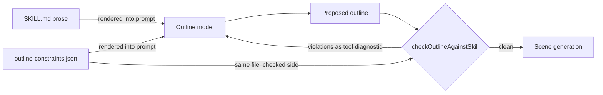

## 🤔 Curiosity: Can you code-review a teaching style?

[OpenMAIC](https://github.com/THU-MAIC/OpenMAIC) is THU-MAIC's open-source multi-agent classroom: type a topic, and AI teachers and AI classmates build a lesson with slides, quizzes, interactive simulations, and voices, then actually hold the class with you. **v1.0.0 — "Build courses with an agent" — shipped on August 27, 2026**, adding a chat-first Pro workbench where an agent plans, builds, and revises whole courses. Four days later it sat on GitHub's daily trending list at **2,819 stars gained in a day**; the REST API showed **26,104 stars** when I read it on August 31 at 23:47 KST.

The pitch — one prompt in, a whole course out — is the part every trending roundup repeats. The question that made me clone the repository was different: when an agent invents a lesson, **what stops it from teaching badly?** "Good teaching" sounds like the least machine-checkable property imaginable. You cannot grep for Socratic method.

The answer in the pinned source is more honest than I expected: OpenMAIC does not pretend to check pedagogy. It splits every teaching style into a **prose half the model reads and a structural half the runtime checks**, and it writes down — inside its own config files — exactly which half is which.

> **Editorial method:** This Source Audit was researched and drafted with AI assistance inside an evidence-gated editorial harness; every material claim maps to primary sources pinned to commit f6cf8fd4.

## 📚 Retrieve: What the pinned tree actually ships

I audited the working tree at commit `f6cf8fd4` — 2,827 tracked files — statically: skills, constraint sidecars, the eval suites, and the input-handling code. I did not execute the audited code, and every repository claim below is pinned to that commit unless marked otherwise. The project is MIT-licensed; the changelog records a deliberate **relicense from AGPL-3.0 to MIT in v0.3.0** (June 2026), which is worth knowing if you evaluated an early version and walked away over copyleft.

<figure class="source-image">
  
  <figcaption>OpenMAIC's generated classroom on desktop. Source: <a href="https://github.com/THU-MAIC/OpenMAIC/blob/f6cf8fd4b74ac83ea969e88b6dc2c974931b4d65/assets/interactive_mode/desktop_interactive.png">https://github.com/THU-MAIC/OpenMAIC/blob/f6cf8fd4b74ac83ea969e88b6dc2c974931b4d65/assets/interactive_mode/desktop_interactive.png</a> · License: <a href="https://github.com/THU-MAIC/OpenMAIC/blob/f6cf8fd4b74ac83ea969e88b6dc2c974931b4d65/LICENSE">https://github.com/THU-MAIC/OpenMAIC/blob/f6cf8fd4b74ac83ea969e88b6dc2c974931b4d65/LICENSE</a> · THU-MAIC (OpenMAIC project) · Screenshot from the OpenMAIC repository (THU-MAIC), MIT license, commit f6cf8fd4</figcaption>
</figure>

### Finding 1 — Teaching styles are skills with a checked sidecar

The README markets "Course tools + **20 built-in skills**." The `skills/` subtree at `f6cf8fd4` ships **24 `SKILL.md` files** — 23 under `skills/agent-runtime/` (lecture-style, workshop-style, Feynman learning, spiral curriculum, PBL-flavored stage design, a curriculum planner for multi-lesson series, a fact-check skill, and more) plus one operator skill. Part of the gap is plausibly internal plumbing skills like `stage-dsl` and `slide-dsl` that the marketing count excludes; I report the discrepancy without judging it.

The interesting file is not the SKILL.md. It is the sidecar next to it. `lecture-style/outline-constraints.json` looks like this:

```json
{
  "allowedTypes": ["slide", "quiz", "interactive"],
  "firstSceneType": "slide",
  "typeMix": [
    { "type": "slide", "minRatio": 0.65 },
    { "type": "quiz", "min": 1, "max": 3 },
    { "type": "interactive", "max": 2 }
  ]
}
```

A lecture must open on a slide, stay at least 65% slides, include one to three checkpoint quizzes, and spend at most two scenes on interactives. That is a **falsifiable, machine-checkable definition of "this is a lecture"** — not of good lecturing, and the file's own `$comment` says so out loud:

> "Narration length and register — the loudest part of this style — are not structural and cannot be checked here."

I have not seen many agent products annotate their own guardrails with what the guardrail *cannot* see. This is the same contract-engineering instinct I audited in the [Archify distrust stack](/posts/archify-distrust-stack-audit/), pointed at a different counterparty: Archify's SKILL.md distrusts the executing agent; OpenMAIC's sidecars distrust the lesson plan.

### Finding 2 — Violations come back as diagnostics, never rewrites

Enforcement lives in `lib/server/agent-runtime/skills.ts`. The constraints are **rendered into the outline prompt and then re-checked against the model's output**; `checkOutlineAgainstSkill` returns human-readable violations that name the scene type, the observed count or ratio, and the required one. The design comment above it is unusually candid for shipped code:

> "Deliberately NOT a rewrite: a plan is a coherent whole, and mechanically flipping a scene's type to satisfy a ratio produces a course that reads like it was assembled by a linter. The agent gets the diagnostic and decides."

This is a pattern worth stealing for any agent harness: the runtime **refuses to auto-repair semantic artifacts**. It returns the violation as a tool-result diagnostic and makes the planning agent re-plan. Auto-repair would be cheaper per call and worse per course — the same reasoning that made [DeepSeek's harness treat everything as a plugin](/posts/deepseek-harness-everything-is-a-plugin/) instead of patching outputs downstream.



### Finding 3 — A real classroom failure is frozen as a regression eval

The `eval/` tree (39 files) contains an orchestration suite whose scenario file, `premature-end.json`, opens with a case named `tiananmen_3d_objection`, described as a **"Direct reproduction of #511"**. Issue #511 — "Multi-agent dialogue: off-topic replies, role confusion, premature discussion end," opened 2026-04-30, now closed — was a live failure where the director agent ended class while a student's objection was still on the table. The eval replays the exact multi-turn transcript (a student conceding that butterflies are symmetric but challenging whether a 3D building can be "foldable") and asserts the director routes to the teacher instead of choosing END.

The judge for this suite is deliberately not a model:

> "No LLM-as-judge here — END/not-END is binary and reading parseDirectorDecision is sufficient."

And its `endRate` **excludes errored samples so provider failures don't masquerade as deterministic END behavior**. Other suites in the same tree do use model judges where the property is fuzzy (answer content quality); this one refuses the fashionable tool because a parser suffices. Freezing production failures into replayable evals is a pattern I keep arguing for in game QA pipelines; this repository gives a concrete shipped example.

<figure class="source-image">
  
  <figcaption>The interactive classroom in tablet format. Source: <a href="https://github.com/THU-MAIC/OpenMAIC/blob/f6cf8fd4b74ac83ea969e88b6dc2c974931b4d65/assets/interactive_mode/ipad_interactive.png">https://github.com/THU-MAIC/OpenMAIC/blob/f6cf8fd4b74ac83ea969e88b6dc2c974931b4d65/assets/interactive_mode/ipad_interactive.png</a> · License: <a href="https://github.com/THU-MAIC/OpenMAIC/blob/f6cf8fd4b74ac83ea969e88b6dc2c974931b4d65/LICENSE">https://github.com/THU-MAIC/OpenMAIC/blob/f6cf8fd4b74ac83ea969e88b6dc2c974931b4d65/LICENSE</a> · THU-MAIC (OpenMAIC project) · Screenshot from the OpenMAIC repository (THU-MAIC), MIT license, commit f6cf8fd4</figcaption>
</figure>

<figure class="source-image">
  
  <figcaption>Phone-format classroom layout. Source: <a href="https://github.com/THU-MAIC/OpenMAIC/blob/f6cf8fd4b74ac83ea969e88b6dc2c974931b4d65/assets/interactive_mode/phone_interactive.png">https://github.com/THU-MAIC/OpenMAIC/blob/f6cf8fd4b74ac83ea969e88b6dc2c974931b4d65/assets/interactive_mode/phone_interactive.png</a> · License: <a href="https://github.com/THU-MAIC/OpenMAIC/blob/f6cf8fd4b74ac83ea969e88b6dc2c974931b4d65/LICENSE">https://github.com/THU-MAIC/OpenMAIC/blob/f6cf8fd4b74ac83ea969e88b6dc2c974931b4d65/LICENSE</a> · THU-MAIC (OpenMAIC project) · Screenshot from the OpenMAIC repository (THU-MAIC), MIT license, commit f6cf8fd4</figcaption>
</figure>

### Finding 4 — Classroom inputs are treated as attack surface

v1.0.0's session materials let users upload documents the agent builds from. The `.pptx` import path shows what that means in code: **8 MiB byte cap, 80-slide cap, a 90-second parse deadline, and parsing in a worker thread "so DOM shims never land on the request process."** The import byte cap and parse timeout were tightened on August 28 in PR #1269. Session text itself is capped at **100,000 characters**, with the comment spelling out why: "The upstream runtime has no credit gate and no per-identity quota," so an anonymous identity could otherwise drive unbounded database bloat and LLM spend. And a small `mutation-fence.ts` carries each tool call's abort signal into its persistence transaction via `AsyncLocalStorage`, so a cancelled tool call cannot half-write classroom state.

None of this appears in the README's v1.0.0 pitch. All of it is the difference between a demo and something a school can host.

| Bound | Value | Where | Why the code says so |
|---|---|---|---|
| `.pptx` upload size | 8 MiB | `import-pptx.ts:42` | parse cost is attacker-controlled |
| `.pptx` slide count | 80 slides | `import-pptx.ts:41` | bounds downstream scene generation |
| `.pptx` parse time | 90 s, worker thread | `import-pptx.ts:43,257` | "DOM shims never land on the request process" |
| Session text | 100,000 chars | `limits.ts` | "no credit gate and no per-identity quota" upstream |
| Aborted tool calls | fenced at persistence | `mutation-fence.ts` | no half-written classroom state |


<figure class="source-image">
  
  <figcaption>Provider-neutral wiring: connecting a local VoxCPM TTS server. Source: <a href="https://github.com/THU-MAIC/OpenMAIC/blob/f6cf8fd4b74ac83ea969e88b6dc2c974931b4d65/assets/voxcpm/voxcpm-connection.png">https://github.com/THU-MAIC/OpenMAIC/blob/f6cf8fd4b74ac83ea969e88b6dc2c974931b4d65/assets/voxcpm/voxcpm-connection.png</a> · License: <a href="https://github.com/THU-MAIC/OpenMAIC/blob/f6cf8fd4b74ac83ea969e88b6dc2c974931b4d65/LICENSE">https://github.com/THU-MAIC/OpenMAIC/blob/f6cf8fd4b74ac83ea969e88b6dc2c974931b4d65/LICENSE</a> · THU-MAIC (OpenMAIC project) · Screenshot from the OpenMAIC repository (THU-MAIC), MIT license, commit f6cf8fd4</figcaption>
</figure>

<figure class="source-image">
  
  <figcaption>The VoxCPM voice manager for classroom voices. Source: <a href="https://github.com/THU-MAIC/OpenMAIC/blob/f6cf8fd4b74ac83ea969e88b6dc2c974931b4d65/assets/voxcpm/voxcpm-voice-manager.png">https://github.com/THU-MAIC/OpenMAIC/blob/f6cf8fd4b74ac83ea969e88b6dc2c974931b4d65/assets/voxcpm/voxcpm-voice-manager.png</a> · License: <a href="https://github.com/THU-MAIC/OpenMAIC/blob/f6cf8fd4b74ac83ea969e88b6dc2c974931b4d65/LICENSE">https://github.com/THU-MAIC/OpenMAIC/blob/f6cf8fd4b74ac83ea969e88b6dc2c974931b4d65/LICENSE</a> · THU-MAIC (OpenMAIC project) · Screenshot from the OpenMAIC repository (THU-MAIC), MIT license, commit f6cf8fd4</figcaption>
</figure>

### Finding 5 — The fact-check skill knows its own epistemics

A `fact-check` skill merged on **August 28 (PR #1274)** — days before the trending spike. It does not audit every sentence. It shortlists high-signal risks (exact numbers, absolutes, attributed quotes, cross-page contradictions), reads user-supplied materials first, and carries one epistemically careful rule: user sources may support a claim, but **"the course being checked cannot prove itself."** A generated artifact is never evidence of its own correctness — the same rule any evidence-gated pipeline should enforce, including the one that produced this article.

## 💡 Innovation: What I would steal for game and agent pipelines

Reading this tree through a game-production lens, three patterns transfer directly:

1. **Split every "style" contract into a prose half and a checked half — and document the seam.** Quest design guidelines, boss-fight pacing rules, and tutorial structure all have a `typeMix`-shaped core (open on action, at most two cutscenes, at least one checkpoint per act) hiding inside prose nobody enforces. Write the checkable fraction as data, validate the artifact against it, and admit in the file what remains unchecked, the way `outline-constraints.json` does.
2. **Return violations as diagnostics; make the planner re-plan.** Auto-repairing a generated level or lesson to satisfy a ratio produces linter-shaped content. OpenMAIC's refusal to rewrite is the correct default for any semantic artifact.
3. **Freeze production failures into deterministic evals before reaching for LLM judges.** Issue #511 became `premature-end.json` with a binary parser judge that excludes provider errors from the metric. A tempting inversion is fuzzy judge first, regression scenario never; this case shows why I would start with the reproducible failure and deterministic property when one exists.

The honest limitation of this audit: I read the code and did not run the classroom, so I cannot say how often the outline model violates constraints in practice, how the re-plan loop behaves under repeated violations (the diagnostic path bounds neither retries nor cost in the code I read — an inference from absence, labelled as such), or whether the premature-END fix generalizes beyond the frozen transcripts. Those require instrumented runs. The relicense to MIT also means earlier AGPL-era conclusions about deployment constraints no longer apply; evaluations older than June 2026 are stale.

If you want the mirror image of this design — the same SKILL.md surface engineered against a counterparty that might cheat rather than a lesson that might drift — read my [Archify distrust stack audit](/posts/archify-distrust-stack-audit/) next.

## 🎯 Key Takeaways

- **"20 built-in skills" is really pedagogy-as-code**: 24 SKILL.md files under `skills/` at the pinned commit, the teaching styles carrying machine-checkable `outline-constraints.json` sidecars that state their own blind spots.
- **Constraint violations are re-plan diagnostics, never auto-rewrites** — the runtime refuses to produce "a course that reads like it was assembled by a linter."
- **A real April failure (issue #511) ships as a deterministic regression eval**, with a parser judge and error-excluding metrics, not an LLM judge.
- **Classroom inputs are bounded like attack surface**: 8 MiB / 80 slides / 90 s worker-isolated pptx parsing, 100k-char session caps, and abort-fenced persistence.
- v1.0.0's real story is not course generation; it is **the enforcement seam between what a prompt promises and what a runtime can verify**.

## 🤔 New Questions

- How often does the outline model violate `typeMix` in production, and does the re-plan loop converge — or does it need the retry/cost bound the code currently leaves implicit?
- Can the constraint-sidecar pattern express *sequencing* pedagogy (spaced repetition, spiral revisits across a series) or only per-lesson scene mixes?
- The deterministic judge works because END is parseable. What is the equivalent frozen-failure eval for role confusion — the other half of issue #511 that has no binary signal?
- Would a game-tutorial generator accept the same split — prose style guide for writers, structural sidecar for the runtime — and what would its `firstSceneType` be?

## References

**Primary sources (pinned at `f6cf8fd4` unless noted)**

- [THU-MAIC/OpenMAIC repository](https://github.com/THU-MAIC/OpenMAIC) — working tree, 2,827 files
- [lecture-style/outline-constraints.json](https://github.com/THU-MAIC/OpenMAIC/blob/f6cf8fd4b74ac83ea969e88b6dc2c974931b4d65/skills/agent-runtime/lecture-style/outline-constraints.json) — constraint sidecar with self-documenting `$comment`
- [lib/server/agent-runtime/skills.ts](https://github.com/THU-MAIC/OpenMAIC/blob/f6cf8fd4b74ac83ea969e88b6dc2c974931b4d65/lib/server/agent-runtime/skills.ts) — `checkOutlineAgainstSkill` and the no-rewrite design comment
- [eval/orchestration/scenarios/premature-end.json](https://github.com/THU-MAIC/OpenMAIC/blob/f6cf8fd4b74ac83ea969e88b6dc2c974931b4d65/eval/orchestration/scenarios/premature-end.json) and [judge.ts](https://github.com/THU-MAIC/OpenMAIC/blob/f6cf8fd4b74ac83ea969e88b6dc2c974931b4d65/eval/orchestration/judge.ts) — frozen reproduction of issue #511
- [lib/server/agent-runtime/import-pptx.ts](https://github.com/THU-MAIC/OpenMAIC/blob/f6cf8fd4b74ac83ea969e88b6dc2c974931b4d65/lib/server/agent-runtime/import-pptx.ts), [limits.ts](https://github.com/THU-MAIC/OpenMAIC/blob/f6cf8fd4b74ac83ea969e88b6dc2c974931b4d65/lib/server/agent-runtime/limits.ts), [mutation-fence.ts](https://github.com/THU-MAIC/OpenMAIC/blob/f6cf8fd4b74ac83ea969e88b6dc2c974931b4d65/lib/server/agent-runtime/mutation-fence.ts) — input bounds
- [skills/agent-runtime/fact-check/SKILL.md](https://github.com/THU-MAIC/OpenMAIC/blob/f6cf8fd4b74ac83ea969e88b6dc2c974931b4d65/skills/agent-runtime/fact-check/SKILL.md) — merged 2026-08-28 via PR #1274
- [LICENSE](https://github.com/THU-MAIC/OpenMAIC/blob/f6cf8fd4b74ac83ea969e88b6dc2c974931b4d65/LICENSE) and [CHANGELOG.md](https://github.com/THU-MAIC/OpenMAIC/blob/f6cf8fd4b74ac83ea969e88b6dc2c974931b4d65/CHANGELOG.md) — MIT, relicensed from AGPL-3.0 in v0.3.0
- [GitHub issue #511](https://github.com/THU-MAIC/OpenMAIC/issues/511) — the production failure behind the eval
- [Releases API](https://api.github.com/repos/THU-MAIC/OpenMAIC/releases) — v1.0.0 published 2026-08-27T13:13:53Z

**Secondary context**

- [GitHub trending](https://github.com/trending) — 2,819 stars/day observation, 2026-08-31 KST
- [JCST 2026 MAIC paper (linked from README)](https://jcst.ict.ac.cn/en/article/doi/10.1007/s11390-025-6000-0) — not read in this run; linked for provenance

**Related on this blog**

- [Archify Source Audit: The Viral Diagram Skill Is Really a Distrust Stack](/posts/archify-distrust-stack-audit/)
- [DeepSeek Harness: Everything Is a Plugin](/posts/deepseek-harness-everything-is-a-plugin/)
