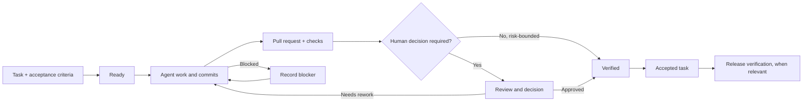

**Source Audit:** A measured read of HoYeon Lee's Software Factory post.

## Curiosity: What does a 300-commit day measure?

A 300-commit day is a vivid activity signal. It is not automatically a throughput result. HoYeon Lee's LinkedIn post says a Software Factory produced 300 commits per day during the Chuseok holiday. I have not independently verified the count. The post is a first-person report, not an activity export or external audit.

A commit answers one question: did Git record a change? It does not answer what user-visible task was finished, whether the change met its acceptance criteria, or whether it remained correct after integration. One task can involve many commits. One commit can be only a slice of a task. Neither fact makes commits useless; it makes them a poor proxy for accepted product work.

The better question is not “How many commits did the factory make?” It is “How much accepted work cleared the system, with what review cost and what evidence?”

## Retrieve: The post already names the hard part

Lee does not present the factory as a commit-count contest. The post describes a multi-agent platform refactored from Swift to Electron over the holiday. A PRD became tasks; task dependencies were analyzed; pull requests were opened automatically; and Lee kept human review for key tasks.

The post also calls CI and verification a bottleneck. It recommends removing tests that are truly unnecessary, revisiting the harness's validation loop, and avoiding a full verification cycle for every tiny change when the cost is disproportionate. The word “unnecessary” matters: deleting tests without replacing their risk coverage would simply hide the bill.

Lee's proposed boundary is human-centered. Tasks should carry intent and a verification method. Agents can work through implementation and validation, while an Observer agent gives the person one place to follow direction and discuss decisions that need escalation. Lee reports that this reduced drift and made mid-course intervention more flexible.

Those are meaningful design details, and the qualitative result should be attributed accurately. The post does not give a baseline or a measured drift rate. It also does not report how many tasks were accepted, how many pull requests merged, first-pass CI results, escaped regressions, rollbacks, rework, or time spent waiting for human review. The public post therefore supports a workflow description and a self-reported commit rate, not an independently measured productivity conclusion.

## Innovation: Build an acceptance ledger, not a counter

A factory needs a queue with explicit units, state changes, and evidence. A commit is a trace in that queue, not its finish line.

Start with a task that has an observable outcome and a verification method. Give it a stable ID, acceptance criteria, risk level, owner, and links to its pull requests and checks. Then distinguish states such as `ready`, `in progress`, `blocked`, `in review`, `verified`, `accepted`, and `released`. Keep `rejected`, `needs rework`, and `rolled back` visible rather than folding them into “done.”

The flow below is a proposed measurement model, not a diagram of Lee's implementation.

A merged pull request is not always an accepted product outcome. A task can require more than one pull request, and a passing check can establish only the property that check actually tests.

A pull request makes a change reviewable. GitHub Docs presents review as a distinct surface around the diff, comments, suggestions, and a formal review action. The counts visible in these documentation examples belong to the examples, not Lee's Software Factory.

<figure class="source-image"><figcaption>GitHub Docs example: the Files changed tab exposes a diff for review. The example's counts are not measurements from Lee's project. Source page: <a href="https://docs.github.com/en/pull-requests/how-tos/review-pull-requests/reviewing-proposed-changes-in-a-pull-request">GitHub Docs, Reviewing proposed changes</a>. Repository scope: <a href="https://github.com/github/docs/blob/0b8c768bf0d5a13560ec82fd3daa414137e2e436/README.md#license">the pinned repository README includes content in the assets folder under CC BY 4.0</a>. Publisher/creator: GitHub Docs. Reproduced unchanged from GitHub Docs under CC BY 4.0. License: <a href="https://creativecommons.org/licenses/by/4.0/">CC BY 4.0</a>. Original asset: <a href="https://raw.githubusercontent.com/github/docs/0b8c768bf0d5a13560ec82fd3daa414137e2e436/assets/images/help/pull_requests/pull-request-tabs-changed-files.png">pinned PNG</a>.</figcaption></figure>

A line comment is useful evidence of a review conversation, but a comment by itself is not approval. A suggested change is a concrete patch proposal, but it still needs the right checks and decision. The distinction matters when an agent can generate commits and open pull requests faster than a person can review them.

<figure class="source-image"><figcaption>GitHub Docs example: a reviewer can start a line-level comment beside a changed line. Source page: <a href="https://docs.github.com/en/pull-requests/how-tos/review-pull-requests/reviewing-proposed-changes-in-a-pull-request">GitHub Docs, Reviewing proposed changes</a>. Repository scope: <a href="https://github.com/github/docs/blob/0b8c768bf0d5a13560ec82fd3daa414137e2e436/README.md#license">the pinned repository README includes content in the assets folder under CC BY 4.0</a>. Publisher/creator: GitHub Docs. Reproduced unchanged from GitHub Docs under CC BY 4.0. License: <a href="https://creativecommons.org/licenses/by/4.0/">CC BY 4.0</a>. Original asset: <a href="https://raw.githubusercontent.com/github/docs/0b8c768bf0d5a13560ec82fd3daa414137e2e436/assets/images/help/commits/hover-comment-icon.png">pinned PNG</a>.</figcaption></figure>

<figure class="source-image"><figcaption>GitHub Docs example: a reviewer can propose a code suggestion in a comment. A suggestion is a review artifact, not a count of accepted tasks. Source page: <a href="https://docs.github.com/en/pull-requests/how-tos/review-pull-requests/reviewing-proposed-changes-in-a-pull-request">GitHub Docs, Reviewing proposed changes</a>. Repository scope: <a href="https://github.com/github/docs/blob/0b8c768bf0d5a13560ec82fd3daa414137e2e436/README.md#license">the pinned repository README includes content in the assets folder under CC BY 4.0</a>. Publisher/creator: GitHub Docs. Reproduced unchanged from GitHub Docs under CC BY 4.0. License: <a href="https://creativecommons.org/licenses/by/4.0/">CC BY 4.0</a>. Original asset: <a href="https://raw.githubusercontent.com/github/docs/0b8c768bf0d5a13560ec82fd3daa414137e2e436/assets/images/help/pull_requests/suggestion-block.png">pinned PNG</a>.</figcaption></figure>

<figure class="source-image"><figcaption>GitHub Docs example: Review changes is a distinct review action. The displayed counts belong to the documentation example, not Lee's factory. Source page: <a href="https://docs.github.com/en/pull-requests/how-tos/review-pull-requests/reviewing-proposed-changes-in-a-pull-request">GitHub Docs, Reviewing proposed changes</a>. Repository scope: <a href="https://github.com/github/docs/blob/0b8c768bf0d5a13560ec82fd3daa414137e2e436/README.md#license">the pinned repository README includes content in the assets folder under CC BY 4.0</a>. Publisher/creator: GitHub Docs. Reproduced unchanged from GitHub Docs under CC BY 4.0. License: <a href="https://creativecommons.org/licenses/by/4.0/">CC BY 4.0</a>. Original asset: <a href="https://raw.githubusercontent.com/github/docs/0b8c768bf0d5a13560ec82fd3daa414137e2e436/assets/images/help/pull_requests/review-changes-button.png">pinned PNG</a>.</figcaption></figure>

Protected-branch rules can require pull-request reviews and status checks before merging. That is a useful gate, not a complete definition of product acceptance. A green check proves that a particular check passed; a review decision proves that a reviewer made that decision. The task ledger should still connect both to the acceptance criteria and, when relevant, a post-release verification.

A dashboard can then answer questions the commit counter cannot:

| Signal | What it helps answer | What it cannot prove alone |
|---|---|---|
| Accepted tasks per period | How much work met its stated acceptance criteria | Whether the change remains healthy over time |
| Lead time and blocked time | Where work waits between ready and accepted | Whether the task was valuable or correct |
| First-pass CI and rework | How often changes need another implementation or check cycle | Whether the product behavior is right |
| Escaped defects and rollbacks | What integration or release failures cost after acceptance | Every user impact or long-term outcome |
| Human review queue age | How much decision work is waiting on people | The quality of each review decision |

Do not set targets for these signals before measuring a baseline. A rate can be gamed just as easily as a count if the denominator is vague. First define what “accepted” means, then record a stable baseline and change one bottleneck at a time.

The Observer role can make this ledger easier to use. It can surface stale tasks, missing verification, blocked dependencies, and decisions waiting for a person. But an Observer that says “complete” is still reporting a status. The acceptance evidence should remain attached to the task, not inferred from the agent's confidence or the number of commits it emitted.

Human review should also be risk-aware. Reversible, well-tested changes may be safe to automate within a narrow boundary. Ambiguous product decisions, security-sensitive changes, destructive data operations, and changes with a large user impact deserve an explicit escalation point. The boundary is not “human versus agent” in the abstract; it is “which decision can be delegated, with what evidence and recovery path?”

For a narrower example of how an agent action crosses a review boundary, read the [Cloudflare OS MCP approval source audit](/posts/cloudflare-os-mcp-approvals-still-wait/).

For a reminder to separate published proxy numbers from inspected requests, see [the Headroom evaluation audit](/posts/headroom-gsm8k-prompts-saved-zero-tokens/). These audits concern approval and measurement boundaries; they do not validate Lee’s factory.

> **Editorial method:** This draft uses AI-assisted source research and drafting; factual claims are linked to checked sources, and no first-hand experience is claimed.

## Key Takeaways

- Lee reports 300 commits per day, but the public post does not provide a measured accepted-work or quality rate.
- The post does discuss verification bottlenecks, task intent, human escalation, and an Observer. Its qualitative drift improvement remains the author's unquantified report.
- Count tasks only when their acceptance criteria are evidenced. Keep commits, pull requests, CI, review decisions, and release checks as separate signals.
- Use humans for explicit, risk-sensitive decisions. Do not treat an agent status or a green check as a complete product verdict.

## New Questions

- What is the smallest stable unit of accepted work for a multi-agent project: a task, a user-visible slice, or a release outcome?
- Which classes of changes need a human decision, and can the system show the evidence that triggered escalation?
- How much of the apparent throughput is spent in review, rework, blocked time, or post-merge repair?
- What baseline would let the team optimize verification cost without silently increasing escaped defects?

## References

### Primary source

1. HoYeon Lee, [LinkedIn post on the Software Factory](https://www.linkedin.com/posts/hoyeonleekr_%EC%9D%B4%EB%B2%88-%EC%B6%94%EC%84%9D-%EC%97%B0%ED%9C%B4%EC%97%90-software-factory%EB%A5%BC-%EA%B5%AC%EC%84%B1%ED%95%B4%EC%84%9C-%EB%A7%A4%EC%9D%BC-300%EA%B0%9C%EC%9D%98-activity-7510140754036596736-9DDM), accessed 2026-10-02. The commit count and the reported reduction in drift are attributed to the author and are not independently verified here.

### Platform documentation

2. GitHub Docs, [Reviewing proposed changes in a pull request](https://docs.github.com/en/pull-requests/how-tos/review-pull-requests/reviewing-proposed-changes-in-a-pull-request), accessed 2026-10-02.
3. GitHub Docs, [Managing a branch protection rule](https://docs.github.com/en/repositories/configuring-branches-and-merges-in-your-repository/managing-protected-branches/managing-a-branch-protection-rule), accessed 2026-10-02.

### Image rights and provenance

4. GitHub Docs repository, [README license scope at pinned commit](https://github.com/github/docs/blob/0b8c768bf0d5a13560ec82fd3daa414137e2e436/README.md#license) and [CC BY 4.0 license text](https://github.com/github/docs/blob/0b8c768bf0d5a13560ec82fd3daa414137e2e436/LICENSE). The four source PNGs are committed under `assets/images/help/` at that same revision. The README places documentation and content in the `assets` folder within CC BY 4.0's scope.
