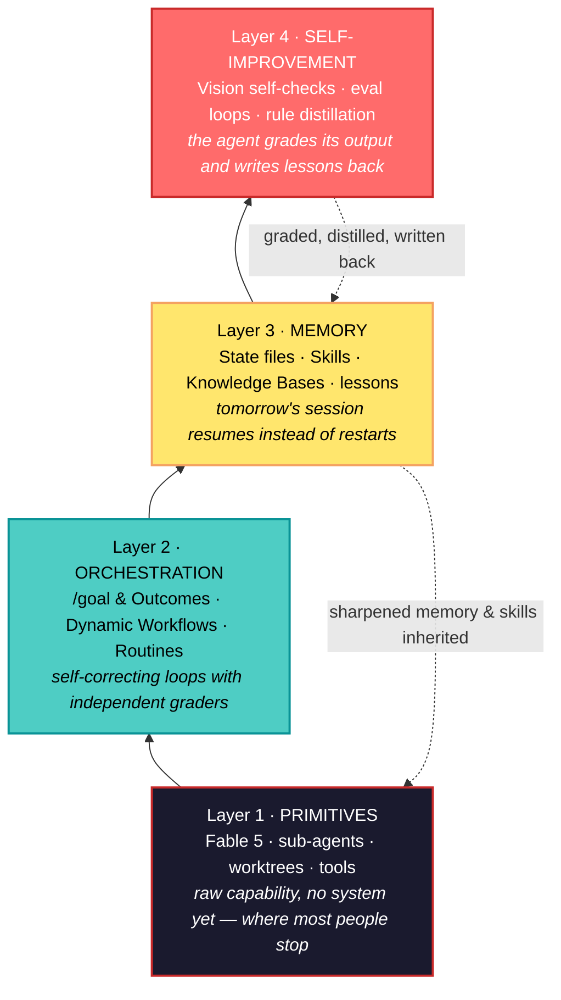
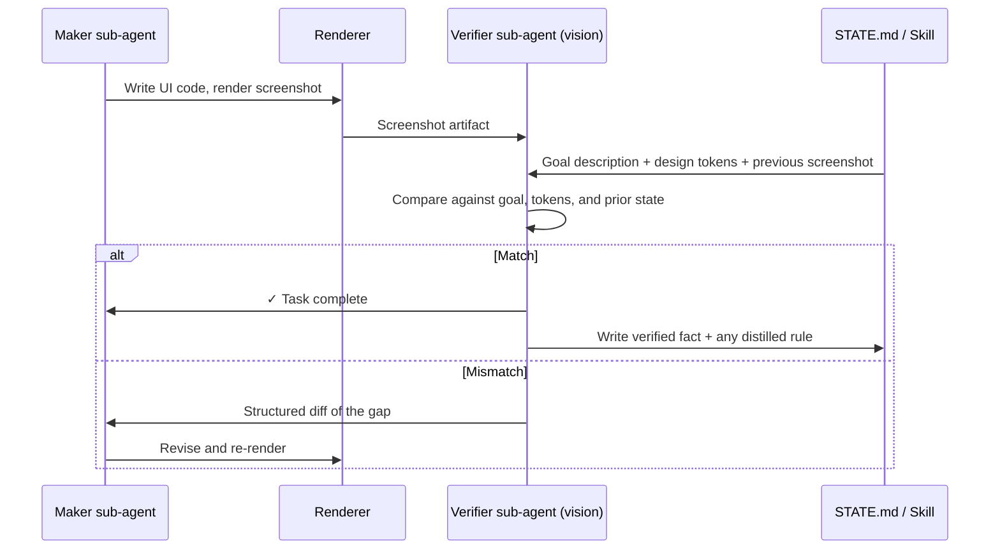

## 🤔 Curiosity: Why Do We Use Days-Long Models in 5-Minute Sessions?

Here's a pattern I keep seeing, and I've been guilty of it myself: a genuinely new class of model ships, and we use it exactly like the old one. Prompt it. It works for 5 minutes. Close the tab.

[Codez (@0xCodez)](https://x.com/0xCodez/status/2065089060104720776) published an X article in June that puts a number on this: **9 out of 10 users have never run an agent system that compounds** — where every run leaves the next run smarter, every state file accumulates, every skill sharpens. His framing stuck with me:

> "Most people are using Claude Fable 5 like Sonnet 4.6 with a bigger context window. [...] Fable 5 was built to run for days. You're using it for minutes."

I spent 8 years shipping AI systems into production games at NC SOFT and COM2US, and this is the same mistake I watched teams make with every new capability tier: we bought the expensive thing and ran it inside the old workflow. A stronger model inside a throwaway session is like putting a better engine in a car with no wheels — the capability is real, but nothing connects it to the road.

> **Curiosity:** If the model is stateless by design, where does improvement actually live? What's the minimal *system* around Fable 5 that makes run N+1 measurably better than run N?
{: .prompt-tip }

This post walks through the 14-step roadmap from the original article — verified against Anthropic's launch documentation as of June 2026 — and translates each step into what I'd actually do with it in a game-production pipeline. All figures below are from the original article.

---

## 📚 Retrieve: What Fable 5 Actually Is (and Isn't)

### The first publicly available Mythos-class model

{: .shadow .rounded-10 }
_Fable 5 launched June 9, 2026 — the first publicly available Mythos-class model, one tier above Opus. Image: Anthropic via @0xCodez_

Claude Fable 5 launched **June 9, 2026** as the first publicly available **Mythos-class** model — the tier Anthropic introduced one rung above Opus. The lineage matters for understanding what you're actually buying:

- **Mythos Preview** shipped in April 2026 through *Project Glasswing* to a handful of critical-infrastructure partners.
- **Fable 5** is the version Anthropic considered safe for general release, with built-in safety classifiers that decline requests in high-risk areas (cybersecurity, bio, chem, model distillation).
- **Mythos 5** (without those classifiers) remains Glasswing-only.

{: .shadow .rounded-10 }
_Launch benchmarks: 80.3% SWE-Bench Pro, 88.0% Terminal-Bench 2.1, with starred benchmarks showing classifier-fallback effects. Image: Anthropic via @0xCodez_

What Fable 5 sustains that previous Claude models couldn't, per the launch documentation:

| Capability | What it means in practice |
|:---|:---|
| **Days-long autonomous sessions** | Inside a harness (Claude Code, Claude Managed Agents), it plans across stages, delegates to sub-agents, checks its own work |
| **Self-verification built in** | Writes its own tests, uses vision to check outputs against goals, distills lessons into general rules |
| **Most ambitious code work** | Large migrations, multi-day autonomous coding; the headline use case is "hand off large projects and review completed deliverables" |
| **Multi-stage knowledge work** | Deep research → analysis → deliverables ready for review, with minimal oversight |

The pricing matches the tier: **$10 / 1M input tokens, $50 / 1M output tokens** (90% input discount with prompt caching), on Claude API, AWS Bedrock, Vertex AI, Microsoft Foundry, and the consumption-based Enterprise plan. Roughly **5× Opus 4.8 per token**. Heavy use earns its own bill — which is exactly why the routing discipline later in this post matters.

{: .shadow .rounded-10 }
_FrontierCode (Diamond): Fable 5's accuracy keeps scaling with reasoning budget while Opus 4.8 and GPT-5.5 plateau. Image via @0xCodez_

### "Self-improving" — the real version vs the hype version

The phrase "self-improving agent system" gets thrown around carelessly. The gap between the real version and the hype version is worth understanding before you build anything:

- **Self-learning** — the agent updates its own weights based on what it learns. **Fable 5 does not do this.** No publicly available model does this in production. Recursive self-improvement (RSI) is the long-term direction Anthropic itself warned about in May 2026, not a shipping capability.
- **Self-improving** — the *system around the agent* compounds. Each session writes lessons to memory. Skills sharpen as edge cases get added. State files accumulate verified facts. Eval loops refine prompts and rubrics. **The model stays the same; the environment it runs in gets sharper.**

Anthropic's engineering team puts it directly:

> "Rather than directly prompting and steering Fable 5, it's often better to design loops that let the model self-correct in response to environment feedback (e.g., /goal or Outcomes) and manage its own context (e.g., via memory)."

This distinction is the entire post. Every step below is about building the second thing.

### The compound stack — read it bottom-up

{: .shadow .rounded-10 }
_The four-layer architecture. Each layer below provides primitives; each layer above turns them into compounding behavior. Image via @0xCodez_

The architecture reads bottom-up — that's the order the system gets built, and the order the leverage compounds:



The reason this compounds: every output from layer 1 flows up through layer 4, where it gets graded, distilled, and written back to layer 3. Tomorrow's run at layer 1 inherits the sharpened memory and refined Skills from yesterday. **The model is stateless; the system around it isn't.**

### Route by task complexity, not by default

Fable 5 costs ~5× Opus 4.8 per token, and not every step in a self-improving system needs the top tier. The teams running this in production route like this:

| Model | Role in the system | Example tasks |
|:---|:---|:---|
| **Fable 5** | Heavy-lift orchestrator | Planning across days, delegating to sub-agents, vision checks, rule distillation |
| **Opus 4.8** | Hard-but-bounded subtasks + classifier fallback | Architecture decisions, complex debugging, deep code reviews; any request Fable 5's classifiers block |
| **Sonnet 4.6** | High-volume workers | Lint passes, simple refactors, test scaffolding, doc updates — the bulk of fan-out work |
| **Haiku 4.5** | Grader sub-agents, cheap classifiers | The verifier role Anthropic explicitly recommends — independent context, low cost |

In game-production terms: this is the same discipline as LOD (level-of-detail) budgeting. You don't render every asset at maximum polycount; you spend the budget where the camera is. Fable 5 is your hero asset. Sonnet is your background crowd.

---

## 📚 Retrieve: The Three Primitives That Make It Compound

### Primitive 1 — Goal-driven loops: `/goal` and Outcomes

{: .shadow .rounded-10 }
_Two near-identical primitives, one per harness. Same shape: independent grader, not-met verdict restarts, exit on pass. Image via @0xCodez_

The Claude Code team publishes two near-identical primitives for goal-driven loops — one in each harness. They share the same shape: **an independent grader checks the work, a not-met verdict starts the next iteration, the loop exits when the grader passes.** The decision rule between them is short:

- **Use `/goal` in Claude Code** when the work happens at your machine and you want a quick, in-session loop with a measurable end state. Plain-text goal, model grader, in-terminal feedback. Best for hands-on coding, debugging flaky tests, refining a single file.
- **Use Outcomes in CMA** (Claude Managed Agents) when the work needs to run for hours or days on Anthropic-hosted infrastructure with a sandbox, GPUs, or a controlled environment. File-based rubric with gradable criteria, sub-agent grader, hard `max_iterations` bound. Best for ML training, long-running migrations, multi-day research.

Both share the structural move that makes them work — and it's the single most transferable idea in this whole article:

> **The agent that wrote the code is not the agent that grades it.**
{: .prompt-info }

### Primitive 2 — The independent verifier (and why self-critique fails)

Anthropic engineer Prithvi Rajasekaran wrote on the engineering blog that models have a hard time self-critiquing their own outputs. The Claude Code team confirmed it empirically with Fable 5:

> "We've found that a verifier sub-agent tends to outperform self-critique with Fable 5."

The mechanism is structural, not about "trying harder." A model evaluating its own output *sees its own reasoning trail* and prefers conclusions consistent with what it already wrote. A separate model evaluating the same output sees only **the artifact and the rubric**. The verifier has no skin in the maker's game.

I ran into exactly this in game QA automation years before LLMs: the engineer who wrote the collision system was reliably the worst person to design its edge-case tests. Not because of skill — because of anchoring. We fixed it organizationally (separate QA owns the test matrix). The verifier sub-agent is the same fix, applied per-task, in milliseconds.

**Parameter Golf** is the experiment that makes the difference visible — Fable 5 vs Opus 4.7, 20 experiments each, optimizing a training config where lower `val_bpb` is better:

{: .shadow .rounded-10 }
_Fable 5 (blue, best 1.1604) vs Opus 4.7 (red, best 1.2178). Fable 5 explores structural changes and pushes through regressions; Opus repeats a safe template. Image via @0xCodez_

What the chart shows beyond the headline numbers:

- **Fable 5 made larger structural changes** — `TRAIN_SEQ_LEN=2048` train+eval (−0.0179), overlapped sliding-window eval (−0.0207), int6 QAT + int6 expo (−0.0163). Each is an architecture-level move, not a constant tweak.
- **Fable 5 pushed through a quantization regression to its biggest win** — instead of reverting after a failed experiment, it continued investigating.
- **Opus 4.7's first experiment** (`QK_GAIN_INIT=5.0`) produced a small win, and nearly everything after used the same template: adjust a scalar, measure, keep if positive. Safer shape, worse outcome.

The system-design takeaway: **Fable 5 with an independent verifier explores larger hypothesis spaces and recovers from negative intermediate results.** Without the verifier, the same model has nothing forcing it past the first "good enough." That's ~6× more improvement landed from the same model weights, purely from the system around it.

### Primitive 3 — Dynamic Workflows

{: .shadow .rounded-10 }
_Left: agent teams (peer collaboration). Right: Dynamic Workflows — an orchestrator fans out N tasks, each with implementer → verifiers → fixer, and synthesizes on return. Image via @0xCodez_

Dynamic Workflows shipped in Claude Code on **May 28, 2026**. The idea: Claude writes its own JavaScript harness on the fly — a file with `agent()`, `parallel()`, and `pipeline()` primitives, plus standard JS to process the data flowing between them. The harness is custom-built for the task, not generic.

Of the six documented patterns, three earn their place in self-improving systems:

| Pattern | Shape | When to use |
|:---|:---|:---|
| **Fan-out-and-synthesize** | Split into N independent pieces, run agents in parallel, synthesize | Each piece benefits from its own clean context window — e.g., evaluating each rule in a Skill against historical examples |
| **Adversarial verification** | Per maker agent, spawn an independent verifier with no exposure to the maker's reasoning | The structural fix for self-preferential bias, applied per task |
| **Loop until done** | Spawn agents until a stop condition holds | "No new findings," "no more errors in the logs" — pair with `/goal` for a hard completion requirement |

The other three (classify-and-act, tournament, and generic pipelines) matter less here — though classify-and-act is exactly the model-routing table above, automated.

### Worktrees: the isolation layer nobody thinks about until agents collide

{: .shadow .rounded-10 }
_One repo, three isolated checkouts. One agent's edits literally cannot touch another's. Image via @0xCodez_

The moment a self-improving system spawns more than one agent, files start colliding. Two agents writing the same file is the same problem as two engineers committing to the same lines without talking first. A **git worktree** fixes it — a separate working directory on its own branch sharing the same repo history.

For Fable 5 systems, worktrees are non-optional in three places:

1. **Maker writes in worktree A, verifier reads in worktree B** — no risk the verifier's exploration touches the maker's state.
2. **Parallel structural experiments** — if Fable 5 explores multiple architecture changes (like Parameter Golf), each runs in its own worktree; the orchestrator collects results and merges the best.
3. **Days-long runs with checkpoints** — each major phase gets a worktree, so a failed phase doesn't poison the rest.

Claude Code exposes this three ways: `git worktree` directly, a `--worktree` flag for sessions, and `isolation: worktree` on subagents so each helper gets a fresh checkout that cleans itself up.

### Routines: the trigger layer that earns the "days-long" capability

{: .shadow .rounded-10 }
_A pr-triage-bot routine with GitHub event triggers and API webhook endpoints. Your laptop can be off; the run still happens. Image via @0xCodez_

Routines launched **April 14, 2026** in research preview: saved Claude Code configurations — prompt, repositories, connectors, permissions — that run on Anthropic-managed cloud infrastructure on a trigger. Anthropic measures Fable 5's "days at a time" on Claude Managed Agents, a hosted sandbox; the Parameter Golf experiment ran up to 8 hours on 8×H100s. That class of run doesn't happen on your laptop.

The three trigger types, mapped to self-improvement patterns:

- **Schedule triggers** — the *morning briefing* pattern. Daily at 7am: re-run yesterday's eval suite, distill new failure modes into Skills, post the digest. The agent gets sharper while you sleep.
- **API triggers** — the *fire on event* pattern. CI fails → investigate. Sentry alert → triage. The system reacts to your real environment.
- **GitHub event triggers** — the *learn from real work* pattern. On PR open, evaluate against the latest Skills. On merge, write new patterns back to the Skill. Repo state and Skill state stay in sync.

Here's the routine from the article that ties all three primitives together — a nightly compounding loop:

```text
> /schedule daily at 7am, use Fable 5 in CMA
  Goal: Re-run yesterday's eval suite against the latest skills.
  Any test that newly passes → distill the pattern into the skill.
  Any test that newly fails → investigate, document in STATE.md.
  Post the digest to #engineering. /goal don't stop until digest is
  posted and STATE.md is updated.

▲ Claude
  Creating routine: nightly-eval-compounding
  - model: claude-fable-5
  - harness: claude managed agent (sandbox)
  - trigger: schedule (0 7 * * *)
  - grader: independent Haiku sub-agent (Outcomes)
✓ Active. First run tomorrow 07:00 local. Skill set will compound.
```

---

## 📚 Retrieve: The Self-Improvement Layer

### The 5-stage memory progression

The single most useful framing for "agent memory" comes from Anthropic's **Continual Learning Bench 1.0** experiment. Effective memory use is a progression of five stages, and each model exits at a different point:

1. **Fail** — the agent gets something wrong and documents the failure with enough detail to be useful later.
2. **Investigate** — before moving on, it figures out *why* the failure happened.
3. **Verify** — it turns the diagnosis into a *checked fact*, not a guess.
4. **Distill** — it turns the verification into a *general rule* that applies beyond the specific case.
5. **Consult** — on the next task, it *reads the rule* instead of re-deriving the fact from scratch.

{: .shadow .rounded-10 }
_Database exploration task, each model with memory provided. Fable 5 reaches 0.839 mean reward with memory; the accumulation curves show memory compounding over question position. Image via @0xCodez_

The measured difference on a SQL exploration task, each model *with memory provided*:

| Model | Exits at stage | Memory behavior | Verification coverage |
|:---|:---:|:---|:---:|
| **Sonnet 4.6** | 1 (Fail) | List of failure notes and open guesses ("maybe `prc` instead of `prc_usd`?"); rarely consults prior notes | — |
| **Opus 4.7** | 3 (Verify) | Schema reference with uncertainty flagged ("possibly `prc` in cents? Verify.") | 7–33%, median ~17% |
| **Fable 5** | 5 (Consult) | Completes the progression; distills learnings into general rules that transfer to future tasks | up to **73%** (22 of 30) |

This is the table I'd print out and tape to the monitor. Memory *existing* is not the same as memory *compounding*. Sonnet-class behavior — notes that nobody reads — shows up even in Fable 5 if the system doesn't force the read-at-start / write-at-end discipline.

### The state file: where each stage writes its output

The 5-stage progression is the mental model; the **state file** is where the model writes each stage's output. In CMA, memory is a mounted filesystem that survives between sessions; in Claude Code locally, a markdown file does the same job. The structure that actually supports the progression:

```markdown
# Project memory · trading-platform

## Verified facts              # stage 3 — stop guessing about these
- prc is in dollars, not cents. Verified via SELECT MIN(prc), MAX(prc) FROM trades.
- user_id matches auth_users.uid via JOIN, not auth_users.id. Confirmed 2026-06-09.

## General rules               # stage 4 — consult before re-deriving
- When querying time-bucketed metrics, always include timezone (default UTC mismatches).
- Auth middleware order matters: rate_limit -> jwt -> rbac. Reversing causes 401s.
- For migrations, never use ALTER on tables >1M rows without batching.

## Open failures               # stage 1 → 2, investigate next session
- 2026-06-09: tests/e2e/checkout flakes ~1 in 50 runs. Hypothesis: webhook race.
  Reproduction steps in debug/checkout-flake.md.

## Lessons learned             # stage 4 distillations
- PowerShell hits TLS 1.2 issue on Windows CI runners. Always shell out to bash.

## Last session                # stage 5 — resume, don't restart
2026-06-10 03:30 UTC · 7 failures classified, 3 fixes drafted, 4 escalated.
Next: verify the auth middleware fix against production load.
```

Two operational rules decide whether this file compounds or just grows:

> **Write before walking away.** Every session ends by updating STATE.md — what was tried, what passed, what failed, what new rules survived. No final write → the next session restarts from zero.
>
> **Read at session start.** Every new session begins by reading STATE.md and the most relevant Skills. Without this, Sonnet-class memory behavior shows up even in Fable 5.
{: .prompt-warning }

### Skills: procedural memory that travels

{: .shadow .rounded-10 }
_A Skill directory: YAML metadata plus freeform markdown. The compounding pattern adds failure modes and anti-patterns over time. Image: Anthropic via @0xCodez_

STATE.md is *project* memory and dies with the project. **Skills are *procedural* memory** — "how to do this kind of thing" — living in `~/.claude/skills/` and traveling with you. The compounding contract: **after any non-trivial failure, write the lesson into the Skill itself.**

A Skill that's been compounding for two weeks looks structurally different from a fresh one — new sections appear that only real production contact can produce:

```yaml
---
name: ci-triage
description: Classify CI failures, draft fixes for easy ones, escalate the rest.
  Trigger on workflow_run.failure or on the morning triage routine.
---

# CI triage skill

## Classification rules
- env: missing secret, wrong env var.        # escalate to human, never auto-fix
- flake: passes on retry without code change. # retry once, then file
- bug: deterministic failure tied to recent commit. # draft fix
- dependency: tied to version bump.           # draft rollback
- infra: timeout, OOM, runner issue.          # escalate

## Known failure modes         # added by the loop over 14 days
- webhook-race: e2e checkout flakes when Stripe webhook arrives mid-test.
  Fix: add 2s settle delay in tests/utils/webhook.ts.
- tls-handshake: Windows runners fail TLS 1.2 in PowerShell. Use bash.

## Anti-patterns (do NOT do)   # added after real incidents
- Never disable a failing test to make CI green. File it instead.
- Never modify .github/workflows/ without human approval.
- Never touch src/payments/ without security review.

## Eval suite                  # the loop verifies the skill itself
Run against eval/ci-triage-cases.jsonl weekly. Any newly-failing case →
add to known failure modes after Outcomes verifier confirms.
```

Note the last section: the Skill has an **eval suite for itself**. The loop doesn't just use the Skill — it verifies and refines it. Two weeks of disciplined writing produces a Skill that materially outperforms whatever Fable 5 would derive from scratch on a fresh project.

Anthropic is also productizing the "distill sessions into memory" step directly — the memory tooling ships with a session-review flow that reads recent transcripts and reorganizes them into a memory store:

{: .shadow .rounded-10 }
_"Dreaming" reviews recent agent transcripts to organize existing memory and surface new learnings into a memory store — stages 2–4 of the progression, as a product feature. Image via @0xCodez_

### Vision self-check: the loop closes without a human eyeballing screenshots

One headline capability — "uses vision to check outputs against goals" — sounds abstract until you see what it replaces: **the human eyeballing a screenshot to confirm the UI looks right.** The production pattern:



This is what Anthropic measured in Parameter Golf under the same harness: Fable 5 looked at training charts (a visual artifact) and decided whether the curve matched the criterion. **No human in the loop reading the chart.**

### The safety boundary: architect for the fallback

The step most easily skipped on day one and most expensive to learn the hard way. Fable 5 ships with built-in safety classifiers that decline to respond in specific high-risk domains — cybersecurity vulnerability research, biology, chemistry, and model distillation. In those domains, **Anthropic falls Fable 5 back to Claude Opus 4.8 automatically.** This is documented; it's not a bug.

What this means for an autonomous system:

- If your system touches security tooling (SAST scans, exploit research, even some classes of crypto code review), **expect classifier blocks** — route those tasks to Opus 4.8 explicitly, or surface to a human.
- **Design Skills to surface the fallback gracefully.** A loop that silently fails on a classifier block looks identical to a loop that fails on a real error — until you debug it at 2am.
- **Audit the system card.** Fable 5's 319-page system card documents the classifier's scope; the launch generated controversy in mid-June 2026 because some downgrade behaviors were discovered buried in the document. Read it before production.

> Treat the safety boundary as a **known fallback**, not a failure mode. A system that ships with explicit boundary handling stays robust as the classifier evolves; one that ignores it produces silent regressions when the policy updates.
{: .prompt-danger }

---

## 💡 Innovation: What This Looks Like in a Game Studio

Reading the roadmap, I kept mapping each primitive onto pipelines I've actually shipped. Here's the translation — the system I would build *this quarter* on a live game team.

### A nightly live-ops triage loop

Live games generate the perfect substrate for a compounding loop: every night produces crash clusters, balance outliers, and community-report noise that a human triages every morning. Structured as a Fable 5 system:

```text
Routine (schedule, 04:00 KST, CMA sandbox):
  1. Pull overnight telemetry: crash clusters, win-rate deltas per
     character, economy sinks/sources, report keywords.
  2. Fan-out (Dynamic Workflow): one Sonnet worker per anomaly
     cluster, each in its own worktree.
  3. Adversarial verification: a Haiku verifier per finding — is the
     query correct? is the effect size real or noise?
  4. Fable 5 orchestrator synthesizes: verified anomalies → draft
     fixes or tuning PRs; unverified → open failures in STATE.md.
  5. Vision check: verifier reads the regenerated balance dashboards
     and confirms charts match the claimed deltas.
  6. Distill: any new failure signature → written into the
     `live-ops-triage` Skill's known-failure-modes section.
  /goal: digest posted to #balance-war-room, STATE.md updated,
  every claim tagged verified/unverified. Grader: independent Haiku.
```

The compounding claim is concrete here: in week one, the system flags 30 anomalies and half are noise. Every false positive that gets investigated becomes a *distilled rule* ("event-week win rates always spike for event characters — compare against event baseline, not season baseline"). By week four, the Skill carries the tribal knowledge a senior live-ops analyst carries — except it's written down, versioned, and consulted at 4am without waking anyone.

That last point is personal. In production I watched us re-learn *the same telemetry gotchas* every time an analyst rotated teams. The knowledge lived in people. Stage-4 distillation is the first mechanism I've seen that makes "write it down so the next run knows" a *structural property of the pipeline* instead of a wiki page nobody reads.

### Why the verifier pattern matters even more for game content

Adversarial verification isn't just for code. PCG pipelines have the same self-preference failure: a generator model asked "is this level fun and fair?" says yes — it made the level. The Parameter Golf structure maps directly:

| Parameter Golf role | PCG equivalent |
|:---|:---|
| Maker explores config changes | Generator produces level/quest/encounter candidates |
| Independent verifier grades `val_bpb` | Simulation agents play the candidate; a verifier grades completion rate, TTK spread, resource curves against rubric |
| Push through regressions | Keep exploring a novel mechanic past its first bad playtest, instead of reverting to the safe template |
| ~6× more improvement landed | Larger design-space moves that a template-following generator never attempts |

The Opus 4.7 pattern in that chart — first small win, then endless safe scalar tweaks — is *exactly* what template-based level generators do. The escape isn't a better generator; it's a verifier that makes exploration safe.

### The cost model, honestly

At $10/$50 per million tokens, an always-on Fable 5 loop is a real line item. The routing table is what makes it sane — the same discipline as server-cost budgeting for an MMO:

- Fable 5 **only** as the orchestrator (plan, synthesize, distill): minutes of tokens per night, not hours.
- Sonnet 4.6 workers do the fan-out reads: 90% of token volume at a fraction of the price.
- Haiku 4.5 verifiers are nearly free and run on *everything*.
- Prompt caching (90% input discount) makes the repeated STATE.md + Skill reads cheap.

The anti-pattern to fear isn't the bill — it's paying Mythos-tier pricing for 5-minute prompt-and-close sessions with **no compound effect**. That's the worst of both worlds.

### The 10 anti-patterns, as a checklist

The article closes with the failure modes. I've reordered them by how expensive they've looked from where I sit:

| # | Anti-pattern | Why it kills compounding |
|:--:|:---|:---|
| 1 | No STATE.md | Every session restarts from zero — the article notes this is where 70%+ of Fable 5's memory advantage disappears |
| 2 | Self-critique instead of an independent verifier | The maker grades its own homework; Anthropic measured the gap |
| 3 | Skills that never get written to | Static scaffolding; the lessons evaporate |
| 4 | Using Fable 5 like Sonnet with more context | Mythos pricing, zero compound effect |
| 5 | Fable 5 on tasks Sonnet handles | Route by complexity; reserve the orchestrator role |
| 6 | Running long sessions on a laptop | Days-long capability needs CMA/Routines; a closed lid kills the run |
| 7 | Ignoring the Mythos safety boundary | Classifier blocks on cyber/bio/chem produce silent regressions |
| 8 | No vision-verify on visual tasks | Text-only verifiers miss the failure mode that matters for UI/dashboards |
| 9 | Skipping `/goal` or Outcomes | Loops stop at "handled enough" instead of *done* |
| 10 | No retention policy review | Sensitive data through routines without checking the 30-day / 2-year terms |

### Key takeaways

| Insight | Implication | What I'd do first |
|:---|:---|:---|
| Self-improvement is a property of the **system**, not the model | Stop shopping for models; start designing the loop, memory, and verifier around the one you have | Add a verifier sub-agent to one existing workflow this week |
| Maker ≠ grader is structural, not motivational | Self-critique fails for the same reason author-owned QA fails | Split every "generate then check" task into two agents with separate contexts |
| Memory compounds only with write-at-end / read-at-start discipline | A state file nobody reads is Sonnet-class behavior at Mythos-class prices | Make STATE.md updates a hard exit criterion (`/goal`) of every session |
| The 5-stage progression (fail → investigate → verify → distill → consult) is measurable | You can audit *your own* pipeline's verification coverage the way Anthropic audits models | Count what % of your system's "facts" are stage-3 verified vs stage-1 guesses |

---

## 🤔 New Questions This Raises

1. **Can the 5-stage progression be enforced structurally** — a state-file linter that rejects session ends whose new entries lack verification evidence — rather than hoping the model completes it?
2. **What's the equivalent of Continual Learning Bench for game balance?** A fixed corpus of historical balance incidents where we measure whether the system's distilled rules actually transfer to novel patches?
3. **Where's the ceiling on Skill compounding?** After six months of accumulated failure modes, does a Skill become so long it degrades retrieval — and does it need its own summarization loop (memory for the memory)?
4. **Vision-verify for *feel*:** charts and UI layouts have objective rubrics. Can a vision verifier grade game-feel artifacts — hit-stop timing, screen-shake curves — or is that where human taste stays load-bearing?

**Next experiment for me:** wire a `/goal`-bounded triage loop with a Haiku verifier onto one of my Unity project's CI pipelines, run it for two weeks, and diff the Skill file at day 1 vs day 14. If the known-failure-modes section isn't visibly smarter, the compounding claim failed *my* bench.

---

## References

**Original Article & Announcements:**
- [Build self-improving agent system with Fable 5 in 14 steps — @0xCodez on X](https://x.com/0xCodez/status/2065089060104720776)
- [Anthropic — Claude models overview](https://www.anthropic.com/claude)
- [Anthropic Engineering Blog](https://www.anthropic.com/engineering)

**Harness & Primitives:**
- [Claude Code documentation](https://docs.anthropic.com/en/docs/claude-code)
- [Claude Code sub-agents](https://docs.anthropic.com/en/docs/claude-code/sub-agents)
- [Git worktree documentation](https://git-scm.com/docs/git-worktree)
- [Anthropic — Building effective agents](https://www.anthropic.com/research/building-effective-agents)

**Memory & Skills:**
- [Anthropic — Agent Skills](https://www.anthropic.com/news/skills)
- [Claude prompt caching](https://docs.anthropic.com/en/docs/build-with-claude/prompt-caching)

**Related Posts on This Blog:**
- [Loop Engineering: What AI Engineers Need to Know](/posts/loop-engineering-what-ai-engineers-need-to-know/)
- [The jeo Ecosystem: State Over History](/posts/jeo-ecosystem-context-engineering/)
- [Harness Engineering: Reliable Agent Systems](/posts/harness-reliable-agent-systems/)
