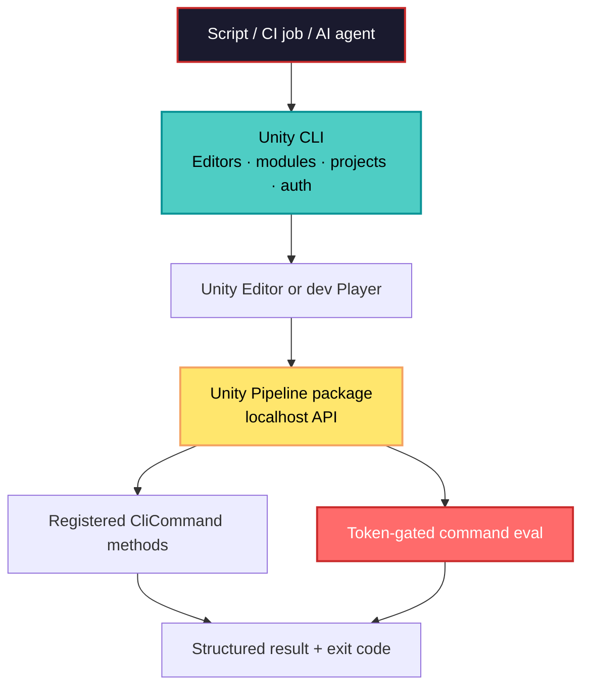

## 🤔 Curiosity: What if the Unity Editor were a dependable production surface?

The most expensive part of an automated game workflow is often not the build itself. It is the human handoff around it: *Which Editor version is installed? Which platform modules are present? Did the test actually run in the intended project? What did the running game observe?*

After years of shipping game features, I have learned to be suspicious of a pipeline that requires somebody to open a UI merely to make a repeatable action happen. A build machine should be describable; a test should return evidence; and an AI assistant should be able to verify a change rather than ask a developer to copy another Console line.

Unity's July 20, 2026 announcement introduces a useful execution stack for that question:

1. **Unity CLI** is a standalone `unity` binary for managing Editors, modules, projects, and authentication from a terminal.
2. **The Unity Pipeline package** (`com.unity.pipeline`, experimental) gives the CLI a localhost-only route into a running Editor or development Player.
3. **`unity command eval`** can evaluate C# against that live instance, subject to a security token.

{: .shadow .rounded-10 }
_Unity CLI artwork downloaded from Unity's [official announcement](https://unity.com/kr/blog/meet-the-unity-cli). Image © Unity Technologies._

The CLI and Pipeline package were announced as available, but the official CLI reference still labels the CLI **experimental**. That is not a reason to ignore it; it is a reason to introduce it with explicit version pinning, small scopes, and a rollback path rather than making it an unreviewed production dependency.

---

## 📚 Retrieve: The three layers—and the boundary between them



The important design choice is that these are **separate layers**. Installing an Editor is not the same operation as controlling a running Editor, and controlling a development build is not permission to expose a debug endpoint in a player-facing release.

| Layer | What it owns | Production-minded rule |
|---|---|---|
| Unity CLI | Editor versions, platform modules, projects, authentication | Pin versions and make command output machine-readable. |
| Unity Pipeline package | A local API to a running Editor or dev Player | Install only in projects/workflows that need it; treat it as experimental. |
| Registered commands and `eval` | Project-specific actions and live inspection | Prefer narrow, typed commands; reserve `eval` for trusted development and QA diagnostics. |

### Setup 1: Install the CLI, then make the environment observable

Unity's announcement provides the following beta-channel installer commands. Check `unity --help` after installation because the installed binary is the authoritative source for the flags it supports.

```bash
# macOS or Linux — Unity's announced beta installer
curl -fsSL https://public-cdn.cloud.unity3d.com/hub/prod/cli/install.sh \
  | UNITY_CLI_CHANNEL=beta bash

# Confirm the binary is on PATH and inspect the installed command set.
unity --help
unity doctor
```

```powershell
# Windows PowerShell — Unity's announced beta installer
$env:UNITY_CLI_CHANNEL = 'beta'
irm https://public-cdn.cloud.unity3d.com/hub/prod/cli/install.ps1 | iex

unity --help
unity doctor
```

For a clean workstation or ephemeral runner, install the exact Editor and only the platform modules the job needs:

```bash
# Inspect module identifiers before committing a build image definition.
unity modules list 6000.2.10f1

# Example: a mobile/WebGL-ready Editor install.
unity install 6000.2.10f1 -m android ios webgl --accept-eula --yes

# Let Unity resolve the project's configured Editor version when opening it.
unity open ./MyGame
```

The `--accept-eula --yes` flags are appropriate only after the organization has reviewed and accepted the applicable terms. In CI, authenticate through a service account and inject its Unity credentials as protected environment variables; do not place credentials in a project file, shell history, or build log.

### Major addition #1: Treat CLI output as an automation contract, not terminal decoration

This is the first capability worth adding beyond a convenient installer. The CLI can emit JSON or TSV, separates results (`stdout`) from errors (`stderr`), and documents three useful exit codes: `0` for success, `1` for an error, and `130` when the user cancels. That contract is what makes a Unity setup step safely composable with a CI runner, a release script, or a small internal tool.

```bash
#!/usr/bin/env bash
# ci/check-unity-editor.sh
set -euo pipefail

required_editor="6000.2.10f1"
installed_editors="$(unity editors --installed --format json)"

# Fail with a useful message when jq is unavailable or the Editor is missing.
if ! command -v jq >/dev/null 2>&1; then
  echo "jq is required to inspect Unity CLI JSON output" >&2
  exit 2
fi

if ! jq -e --arg version "$required_editor" \
  '.[] | select(.version == $version)' <<<"$installed_editors" >/dev/null; then
  echo "Required Unity Editor $required_editor is not installed" >&2
  exit 1
fi

echo "Unity Editor $required_editor is installed."
```

There are two details here that save real debugging time:

- Ask for `--format json` explicitly instead of parsing animated progress or aligned columns.
- Make the Editor version a reviewed variable in source control, not an accidental default on an individual machine.

For a build fleet, I would start by running this check before the build, archive the JSON as a CI artifact, and call `unity doctor` on a failed setup job. That turns “Unity was weird on the runner” into evidence about the installed Editor, credentials, and configuration.

### Setup 2: Add the Pipeline package to a controlled project

The Pipeline package is the second major addition. Unity documents it as a local HTTP API for remote control of an Editor, suitable for CI/CD, tests, development workflows, and custom commands. Its prerequisites are Unity Editor 6.0 or later and the Unity CLI.

Open the target project in the Editor, open a fresh terminal, then run:

```bash
# Browser-based sign-in for a developer workstation.
unity auth login

# Adds com.unity.pipeline and its dependencies to the current/open project.
unity pipeline install

# The Editor recompiles; then verify the package state.
unity pipeline list

# Discover commands exposed by the connected project.
unity command

# If more than one Editor is open, remove ambiguity.
unity command --project-path="$(pwd)"
```

The documented default target is the current directory or running Editor instance. In team tooling, make that target explicit whenever automation can execute from a different working directory. “The currently open project” is a fine developer convenience and a poor CI invariant.

---

## 📚 Retrieve: Make the Editor expose small, testable tools

### Major addition #2: Build an agent-ready command surface before reaching for live eval

A registered `CliCommand` is the safer bridge between intent and a running project. It gives a script—or a function-calling AI agent—a named operation with typed arguments, a predictable return value, and a scope the game team can review.

Here is a deliberately small example for a development build. It validates the input, handles the common “object was not found” case, and returns a result a caller can act on:

```csharp
// Assets/Editor/ProjectCliCommands.cs
using System;
using Unity.Pipeline.Commands;
using UnityEngine;

public static class ProjectCliCommands
{
    [CliCommand("set-active", "Set a named scene object active or inactive.")]
    public static string SetActive(
        [CliArg("object-name", "Exact GameObject name.", Required = true)] string objectName,
        [CliArg("active", "true to enable; false to disable.", Required = true)] bool active)
    {
        if (string.IsNullOrWhiteSpace(objectName))
        {
            throw new ArgumentException("object-name must not be empty.");
        }

        var target = GameObject.Find(objectName);
        if (target == null)
        {
            throw new InvalidOperationException($"No GameObject named '{objectName}' exists in the active scene.");
        }

        target.SetActive(active);
        Debug.Log($"CLI set '{target.name}' active={active}.");
        return $"updated:{target.name}:active={target.activeSelf}";
    }
}
```

After Unity recompiles, the command can be discovered and invoked from a terminal:

```bash
unity command
unity command set-active --object-name "TutorialOverlay" --active false
```

This is where the *Curiosity → Retrieve → Innovation* loop becomes practical:

1. **Curiosity:** “Does the tutorial overlay block the first gameplay interaction?”
2. **Retrieve:** Query the active scene or invoke a narrow diagnostic command on a development instance.
3. **Innovation:** Make a reviewable change, run the relevant test or Play-mode check, and retain the command output with the build artifact.

Avoid designing one giant command called `fix-everything`. A small command surface is easier to authorize, test, document, and expose to an agent. It also fails more honestly: a missing object is a named error, not an ambiguous sequence of UI clicks.

### When `unity command eval` is the right tool—and when it is not

`unity command eval` fills a different gap: questions that you did not anticipate when you designed your command surface. Unity says it compiles with Roslyn, runs on the Editor main thread, can target a live Player with `--runtime`, and requires a security token.

```bash
# Fast read-only diagnostics against a trusted, running development Editor.
unity command eval "return Application.version;"
unity command eval "return UnityEditor.EditorApplication.isPlaying;"

# Request structured output when another program will consume the result.
unity command eval "return Application.dataPath;" --json
```

Use it as a development and QA microscope, not as a release feature:

- The announcement says Player control is localhost-only and off by default; keep it that way and never ship the runtime component in a production player.
- Keep the token out of source control and restrict access to trusted developer or QA machines.
- Prefer a reviewed `CliCommand` once a diagnostic becomes repeatable. A one-off REPL expression is valuable during investigation; a production workflow needs an explicit capability boundary.
- Record the question, command, result, and Unity version when an agent changes project state. Observability is what distinguishes verified automation from a persuasive demo.

---

## 💡 Innovation: A rollout plan that improves feedback without expanding risk

I would not begin by connecting a broad AI agent to every Unity API. I would earn that capability in stages:

| Stage | Ship this first | Evidence of success | Guardrail |
|---|---|---|---|
| 1. Reproducible setup | Pinned `unity install` and `unity editors --format json` checks | Every runner reports the intended Editor/modules | No parsing human-oriented terminal output |
| 2. Pipeline connection | `unity pipeline install`, then a command inventory | A project-specific command is callable from a known path | Unity 6.0+, experimental package, explicit project path |
| 3. Narrow tools | Typed `CliCommand` methods for tests and diagnostics | Command result and log are archived in CI | Input validation and least-privilege command design |
| 4. Live investigation | Token-gated `eval` on dev/QA instances | A hypothesis is checked without a rebuild | Localhost only; never production Player |
| 5. Assisted iteration | An agent proposes, invokes allowed tools, then verifies | A human can reproduce the full evidence trail | Approval boundary for state-changing actions |

The innovation is not “an agent can click the Editor faster.” It is a shorter and more trustworthy feedback loop: **observe → make one bounded change → run a check → retain the result**. That is the same discipline game teams use when making a balance change or diagnosing a rare runtime bug; the CLI simply makes the loop scriptable.

### New questions this raises

Once a project has a well-designed command surface, the interesting question is no longer whether an AI agent can call Unity. It is: **which game-development operations are safe and valuable enough to become tools?**

Start with read-only state queries, test triggers, and build diagnostics. Then measure whether every action can be reproduced and reviewed. The teams that benefit most will not be the ones with the widest automation surface; they will be the ones with the clearest contracts around it.

---

## References

- [Unity: Meet the Unity CLI](https://unity.com/en/blog/meet-the-unity-cli) — original July 20, 2026 announcement; installation commands, automation behavior, Pipeline, `CliCommand`, and `eval` details.
- [Unity CLI documentation: Use the Unity CLI](https://docs.unity.com/en-us/unity-cli/use-unity-cli) — common installation, Editor, module, project, and authentication tasks.
- [Unity CLI reference](https://docs.unity.com/en-us/unity-cli/unity-cli-reference) — command inventory, output formats, exit codes, and experimental-status note.
- [Unity Pipeline package documentation](https://docs.unity.com/en-us/unity-production-pipeline/local-tools-cli/unity-pipeline-package) — Unity 6.0+ prerequisite, package installation, verification, and project targeting.
- [Korean Unity announcement](https://unity.com/kr/blog/meet-the-unity-cli) — source page for the downloaded article artwork.
