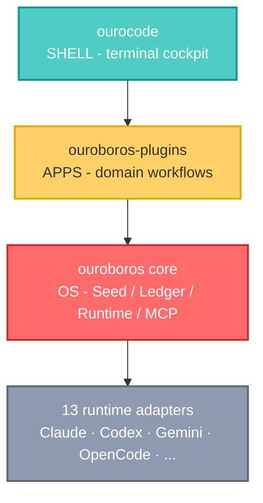
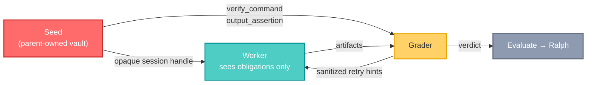

## 🤔 Curiosity: What Happens When You Show a Model Its Own Answer Key?

Eight years of shipping AI systems at NC SOFT and COM2US taught me to distrust a passing test I did not write carefully. Not because the model cheats maliciously - because **optimization is not malice**. If a system can see the check, the cheapest path to "pass" runs straight through the check rather than through the problem.

Every AI coding agent I have used hands the model everything at once: the task, the test command, and the expected output. Then we act surprised when the diff is a hardcoded return value that satisfies `pytest -k test_foo` and nothing else. We call it hallucination. It is closer to **specification gaming** - and we built the incentive ourselves.

So when I found [Q00/ouroboros](https://github.com/Q00/ouroboros) describing itself with this line, I stopped scrolling:

> *"The grading command and expected result never make it into the success contract we hand it."*

That is not a prompt-engineering trick. That is a **confidentiality boundary between the worker and the grader** - the same separation we take for granted in exam proctoring, in held-out test sets, in blind code review. And nobody had put it in the agent loop.

> **Curiosity:** If you hide the verification command from the worker that must satisfy it, does the agent get better - or just slower?
{: .prompt-tip}

{: .w-75 .shadow .rounded-10 }
_The serpent devouring its own tail. In Ouroboros this is not decoration - it is the control flow._

---

## 📚 Retrieve: What Ouroboros Actually Is

Ouroboros calls itself an **Agent OS**: a local-first runtime layer that turns non-deterministic agent work into a replayable, policy-bound execution contract. Strip the framing away and the claim is concrete - it replaces ad-hoc prompting with five enforced stages.

```
Interview -> Seed -> Execute -> Evaluate -> Evolve
    ^                                         |
    +--------- feed the next generation ------+
```

The numbers, verified against the GitHub and PyPI APIs on 2026-08-21:

| Signal | Value |
| :--- | :--- |
| Stars / forks | 5,603 / 560 |
| Contributors | 75 |
| Created | 2026-01-14 (7 months old) |
| Latest release | `v0.51.14`, published 2026-08-21 |
| PyPI releases | 680 versions of `ouroboros-ai` |
| Language / license | Python (>= 3.12) / MIT |
| Supported runtimes | 13 - Claude Code, Codex CLI, Gemini CLI, OpenCode, Copilot CLI, Kiro, Hermes, Pi, Zcode, Goose, GJC, Antigravity, Grok Build |

680 releases in seven months is roughly three per day. That is either thrash or extremely tight iteration - and the release notes read like the latter.

### The Three-Layer Stack

The project splits along OS lines, which is more than a metaphor - each layer has a different repo and a different contract.



The kernel owns the contract: every action becomes a Seed-bound, ledger-recorded, replayable event **regardless of which LLM executes it**. That last clause is the interesting part - swap Claude for Codex and the workflow spec does not change, only the execution engine does.

### One Engine, Thirteen Hosts

This is the part I did not expect to work. The same interview runs as a terminal CLI, as a ChatGPT integration, as a Discord bot, inside Kiro - because the loop lives in an MCP server, not in a host's prompt template.

{: .w-100 .shadow .rounded-10 }
_`ouroboros init start` conducting a Socratic interview about a task CLI, then reporting an ambiguity score._

{: .w-100 .shadow .rounded-10 }
_Claude Code running six interview advisory lanes in parallel before the interview submits._

{: .w-100 .shadow .rounded-10 }
_The same interview as a Discord bot, landing at `Final ambiguity: 0.15`._

{: .w-100 .shadow .rounded-10 }
_Called as an integration from the ChatGPT app on a video-publishing harness - the interview, its advisory lanes, and the ambiguity ledger._

{: .w-100 .shadow .rounded-10 }
_DeepSeek Harness driving `mcp__ouroboros__ouroboros_interview` turn by turn, with fan-out results submitted between rounds._

{: .w-100 .shadow .rounded-10 }
_Kiro CLI running the same flow, turning a vague request into a structured, testable Seed._

{: .w-100 .shadow .rounded-10 }
_`ouroboros setup refresh` installing into each host in the shape that host expects: rules and skills for Codex, a plugin and `AGENTS.md` for OpenCode, bridges for Pi and GJC._

---

## 🔬 The Two Mathematical Gates

Most "spec-first" tooling stops at *"write a spec first."* Ouroboros compiles that advice into two numbers that can block execution. This is what makes it worth studying rather than just installing.

### Gate 1: Ambiguity ≤ 0.2

The interview does not end when you feel ready. It ends when the arithmetic says you are.

$$
\text{Ambiguity} = 1 - \sum_{i} \text{clarity}_i \times \text{weight}_i
$$

An LLM scores each dimension 0.0-1.0 at temperature 0.1 for reproducibility, then the weights apply:

| Dimension | Greenfield | Brownfield |
| :--- | :---: | :---: |
| Goal clarity - *is the goal specific?* | 40% | 35% |
| Constraint clarity - *are limits defined?* | 30% | 25% |
| Success criteria - *are outcomes measurable?* | 30% | 25% |
| Context clarity - *is the existing code understood?* | — | 15% |

Brownfield work redistributes weight to make room for a fourth dimension. The implication is sharp: **an unexamined codebase is itself a form of unclarity.** Identical goal, constraint, and success scores produce a *worse* ambiguity result on an existing repo than on a greenfield one - which matches every legacy migration I have ever estimated badly.

Reading `src/ouroboros/bigbang/ambiguity.py` turned up something the README does not mention - **per-dimension floors**:

```python
GOAL_CLARITY_FLOOR = 0.75
CONSTRAINT_CLARITY_FLOOR = 0.65
SUCCESS_CRITERIA_CLARITY_FLOOR = 0.70
BROWNFIELD_CONTEXT_CLARITY_FLOOR = 0.60
```

Without floors, a weighted average is trivially gameable: nail two dimensions, stay blind on the third, and the total still clears the bar. The floors close that hole. I verified the exact case below - it passes the threshold at 0.135 and is still correctly blocked.

### Gate 2: Similarity ≥ 0.95

The evolution loop terminates when consecutive generations produce ontologically identical schemas:

$$
\text{Similarity} = 0.5 \cdot \text{name} + 0.3 \cdot \text{type} + 0.2 \cdot \text{exact}
$$

The subtlety is in the denominator. Every component divides by the **union** of field names across both generations, from `OntologyDelta.compute` in `src/ouroboros/core/lineage.py`:

```python
all_names = old_names | new_names
name_score  = len(common_names) / len(all_names)
type_score  = type_matches     / len(all_names)
exact_score = exact_matches    / len(all_names)
similarity  = 0.5 * name_score + 0.3 * type_score + 0.2 * exact_score
```

Because of that union, **adding one field to a three-field schema drops similarity to 0.75** - nothing was renamed, nothing was retyped, the schema simply grew. The gate reacts to discovery, not just to churn. That is the correct behavior for a convergence signal: if the system is still finding new fields, it does not yet know what it is building.

### Verifying the Gates

Assertions are cheap; I would rather run the arithmetic. I reproduced both gates in pure stdlib Python and made the file self-checking:

- 📎 [`gates.py` - both gates, 35 executable checks](/assets/code/posts/2026-08-20-ouroboros/gates.py)

```python
# Gate 1 - the README's worked example
readme = score_ambiguity({"goal": 0.9, "constraint": 0.8, "success": 0.7})
#   clarity = 0.9*0.40 + 0.8*0.30 + 0.7*0.30 = 0.81
#   ambiguity = 1 - 0.81 = 0.19  -> READY

# The floor case: total passes, one dimension is still blind
lopsided = score_ambiguity({"goal": 1.0, "constraint": 1.0, "success": 0.55})
#   ambiguity = 0.135  (well under 0.2)
#   ready     = False  -> blocked by the success floor

# Brownfield costs a dimension
score_ambiguity({"goal": 0.9, "constraint": 0.9, "success": 0.9})                    # READY
score_ambiguity({"goal": 0.9, "constraint": 0.9, "success": 0.9,
                 "context": 0.2}, brownfield=True)                                   # BLOCKED
```

Running it:

```console
$ python3 assets/code/posts/2026-08-20-ouroboros/gates.py
Gate 1 - ambiguity <= 0.2
  ok  README example clarity = 0.81
  ok  README example ambiguity = 0.19
  ok  0.8 across the board = exactly 0.2
  ok  lopsided total = 0.135, under threshold
  ok  but the success floor still blocks it
  ok  same scores + unknown codebase is not
Gate 2 - similarity >= 0.95
  ok  identical schema = 1.00
  ok  one added field = 0.75
  ok  reworded description = 0.9333
  ok  retyped = 0.8333
Loop termination
  ok  30 generations is a hard cap
Stagnation detection
  ok  3 identical outputs = spinning
  ok  A-B-A-B = oscillation
OK
```

Two results I got wrong on my first pass, which is exactly why I ran it:

| Change to the schema | My guess | Actual | Why |
| :--- | :---: | :---: | :--- |
| Reword one description | 0.867 | **0.9333** | Name and type both carry fully; only `exact` loses 1/3 |
| Retype one field | 0.867 | **0.8333** | Type *and* exact both lose it - a retype costs more than a reword |

That ordering is a deliberate design property, not an accident. A retype is a semantic change and should cost more than a rewrite of prose. And note where the reword lands: **0.9333 is below the 0.95 gate.** Rewording a single field description is enough to hold the loop open for another generation. Strict - arguably too strict - but it fails in the direction of asking one more question.

---

## 🔒 Innovation: The Hidden Checklist

Here is the mechanism that made me write this post. It shipped in `v0.51.12` under a title that reads like a design principle carved into a wall: **"Verification Must Never Rewrite Reality."**

### The Boundary

From `docs/hidden-checklist-convergence/requirements.md`:

> *"Hide every harness-owned `verify_command` and `output_assertion` from every Ouroboros-transported worker prompt, context, event, artifact, and retry surface **without a configuration escape hatch**."*

Read that last clause again. Not a default. Not a recommended setting. **No knob at all.** The architecture doc states the reasoning in one line:

> *"No answer-key configuration knob - hidden grading is a correctness boundary, not a tuning option."*

I have written that sentence in design reviews and lost the argument to "but users will want to configure it." Here somebody won it.



The worker gets an **opaque, session-bound handle** to the Seed rather than the Seed itself. When it fails, the retry hint is built from missing artifacts, *sanitized* verifier output, and read-only trace evidence - improving the next attempt without leaking the answer.

The honesty of the threat model is what sells it. Three admissions, straight from the docs:

1. **"Confidentiality is a transport boundary."** Prompts, contexts, events, artifacts, and retries are sanitized. If a raw Seed file sits on a disk the worker can read, that is an operator sandbox problem - the project does not claim otherwise.
2. **"Raw Seed handoff is process-local."** A server restart invalidates the handle and evaluation **fails closed** rather than exposing the Seed.
3. Persisting hidden verifier material in worker-queryable events would defeat the boundary - so it is not persisted.

A security boundary that names its own limits is worth more than one that claims completeness.

### Monotonic Verification

`v0.51.12` closed the other half. The rule:

> *"Machine verification may add evidence. It may reject a genuinely failed check. It may never erase a worker failure, manufacture a success, or retry completed work merely because the verifier itself is unavailable."*

This is a failure mode I have personally shipped. Your verifier times out, the harness treats "could not verify" as "failed," and it retries work that already succeeded - or worse, the inverse: the verifier is unreachable, the retry passes, and the pipeline reports green. Ouroboros adds `VerifierStatus.UNAVAILABLE` **with no retry or redispatch authority**, so unverified is a reportable third state instead of a coin flip between pass and fail.

The hardening around it is unusually paranoid, and correctly so - verification runs only through a resolved, absolute, real Bash implementation. Never `cmd.exe`, never a WSL launcher, never shell emulation. Bash startup hooks, exported functions, preload hooks, and pytest/Python/Node environment controls are all stripped, because **any of them can bend a verdict**. If your verifier honors `PYTHONSTARTUP`, your verifier is an attack surface.

The same release also *removed* machinery: a shell-free Bash interpreter, constant-verdict proof scaffolding, verdict tiers. The stated reason is my favorite line in the repo:

> *"Leave sandboxed discrimination research outside the critical `ooo run` path rather than pretending an unsandboxed verifier can prove more than it observed."*

Deleting your own clever code because it overclaims is the rarest thing on this list.

### Safe-but-Wrong: Naming the Failure Nobody Logs

`docs/guides/safe-but-wrong-output.md` names a failure mode I have watched consume entire sprints, and it applies to far more than agents:

> *"A run can be safe, non-destructive, and even useful, while still being wrong for the user's stated goal."*

The examples land hard because I have shipped several of them:

- You asked for an executable tool; the run produced handoff docs.
- You asked for a reusable workflow; the run produced a one-off checklist.
- You asked for a batch surface; the run produced a single-case summary.
- Missing input data was rendered as `OK` or `0` instead of `insufficient data`.

Every safety check passes. No files deleted, no external system mutated, tests green, output readable. **The artifact contract drifted and the tests could not see it.** As the doc puts it: *"That is worse than a clear blocker because it creates false confidence."*

The prescribed status language is the part I am stealing outright:

```text
Good: Generated supporting handoff docs, but the requested CLI/web artifact
      was not built. Status: partial/supporting-output, not complete.

Bad:  Done. Created the handoff package.
```

Related and equally sharp - `docs/guides/execution-vs-evaluation.md` refuses to conflate two states most harnesses smear together:

> *"Execution is not evaluation. Completion is not approval. Task failure is not semantic drift."*

A completed task proves execution finished. It does not prove the acceptance criterion passed. So the data model keeps `TaskResult` and `ACResult` separate, and an AC with no formal verdict stays `not_evaluated` - never silently promoted to pass. Partial verifier coverage **cannot** approve a run.

---

## 🌀 The Loop That Does Not Stop

`ooo ralph` runs the evolutionary loop across session boundaries. Each step is stateless - the EventStore reconstructs the full lineage - so a machine restart does not lose the thread.

```
Ralph Cycle 1: evolve_step(lineage, seed) -> Gen 1 -> CONTINUE
Ralph Cycle 2: evolve_step(lineage)       -> Gen 2 -> CONTINUE
Ralph Cycle 3: evolve_step(lineage)       -> Gen 3 -> CONVERGED
```

Two engines drive each generation, and the split is philosophically deliberate:

| Engine | Question | Role |
| :--- | :--- | :--- |
| **Wonder** | *"What do we still not know?"* | Identifies what the system is **assuming** rather than knowing |
| **Reflect** | *"How should the spec evolve?"* | Turns those gaps into concrete ACs and ontology mutations |

Generation 1 uses the seed from the human interview. **Generation 2 onward is fully autonomous** - Wonder and Reflect replace human input entirely. Four termination signals guard it: ontology stability (≥ 0.95), stagnation (stable across 3 generations), oscillation (gen N ≈ gen N-2), and a hard cap at 30 generations.

{: .w-100 .shadow .rounded-10 }
_The Textual TUI: phase progress, drift meter, and cost in one pane._

### When the Loop Gets Stuck

An autonomous loop needs an escape hatch, and this is the design I would copy first. Four stagnation patterns, each mapped to a **persona** rather than a fix:

| Pattern | Detection | Default | Persona |
| :--- | :--- | :---: | :--- |
| `SPINNING` | Identical output hash repeated | 3 reps | **Hacker** - find another way in |
| `OSCILLATION` | A→B→A→B alternating | 2 cycles | **Architect** - the structure is wrong |
| `NO_DRIFT` | Drift unchanging (ε < 0.01) | 3 iters | **Researcher** - evidence is missing |
| `DIMINISHING_RETURNS` | Improvement rate < 0.01 | 3 iters | **Simplifier** - reduce the surface |

The personas emit **thinking prompts, not solutions**. When an agent is stuck, "try harder" is the useless instruction and "try differently" is the useful one - and *which* differently should depend on *how* it is stuck. Spinning against the same wall needs an unconventional path; flip-flopping between two designs means neither is right and the structure needs rework. That mapping is the single most transferable idea in the repo, and it applies to human debugging just as well.

Ouroboros calls its nine specialists the **Nine Minds**, each loaded on demand, never preloaded - Socratic Interviewer, Ontologist, Seed Architect, Evaluator, Contrarian, Hacker, Simplifier, Researcher, Architect.

### Three-Stage Evaluation

Cost discipline as architecture - cheap checks gate expensive ones:

| Stage | Cost | What Runs |
| :--- | :---: | :--- |
| **Mechanical** | $0 | Lint, build, test, static analysis, coverage (≥ 70%). Auto-detects Python/Rust/Go/Zig/Node from marker files |
| **Semantic** | $$ | AC compliance, goal alignment, drift, uncertainty. Score ≥ 0.8 with no trigger → approved |
| **Consensus** | $$$ | Multi-model voting, only on 1 of 6 triggers |

The six consensus triggers are a good list to steal for any review policy: Seed modification, ontology evolution, goal reinterpretation, drift > 0.3, Stage-2 uncertainty > 0.3, or lateral-thinking adoption. Note that the first is *any* change to an immutable seed - the spec cannot be edited quietly.

---

## ⚖️ Where I Push Back

An honest read requires naming what does not hold up. Three things.

**1. The architecture doc has drifted from the source.** `docs/architecture.md` documents a `routing/` module with a PAL Router - `complexity.py`, `tiers.py`, `escalation.py` - and a complexity formula weighted 30% tokens / 30% tools / 40% AC depth. I went to read it. **It is not in the tree.** No `src/ouroboros/routing/`, no `complexity.py`, no `tiers.py`. There *is* a `src/ouroboros/router/`, but it holds `command_parser.py` and `dispatch.py` - a command router, not a cost router. Model-tier logic now lives in `orchestrator/model_routing.py` and `orchestrator/effort_routing.py`.

To its credit the same doc *does* flag one removal in a note - the old `double_diamond.py` executor was deleted once it was found to have no live caller. But the PAL Router section reads as current and is not. At 680 releases in seven months, docs lose the race. **Read the source before believing the diagram** - and take the "1x / 10x / 30x tier" numbers in the README as historical rather than verified.

**2. The convergence gate is strict to the point of expense.** A reworded description scores 0.9333 and buys another generation. Since generations 2+ are autonomous LLM calls, prose churn costs real money. Sound as a default, but I would want `convergence_threshold` tuned per project before running Ralph unattended on a billed key.

**3. Verbose by construction, and it should be.** The docs carry sentences like *"detached auto work is non-terminal tracked background work."* That is not padding - it is a distinction that prevents a scheduler from reading a running job as a completed one. But the surface area is real: 13 runtimes, 14 skills, 9 agents, ~1,755 files. This is not a weekend tool.

---

## 💡 What I Am Taking Into My Own Harness

| Insight | Why it matters | What I am doing with it |
| :--- | :--- | :--- |
| **Hide the grader from the worker** | A visible check becomes the target instead of the goal | Split my eval harness so the verify command never enters the worker prompt |
| **Verification is monotonic** | "Cannot verify" ≠ "failed"; a missing verifier must not manufacture either verdict | Add an explicit `unverified` state instead of defaulting to pass or fail |
| **Gate on a number, not a vibe** | "Write a spec first" is unenforceable; ambiguity ≤ 0.2 is | Score goal / constraint / success clarity before starting non-trivial work |
| **Floors beat averages** | A weighted total hides one blind dimension | Per-dimension minimums on any composite quality score I ship |
| **Name safe-but-wrong** | Docs instead of a tool passes every safety check and fails the user | Report artifact-class drift as `partial/supporting-output`, never `done` |
| **Match the persona to the stall** | "Try harder" is useless; *how* you are stuck picks *how* to change | Route spinning → hacker, oscillation → architect, flat drift → researcher |
| **Brownfield costs a dimension** | Unexamined existing code is unclarity, and estimates ignore it | Weight context clarity explicitly on legacy work |

### Try It

```bash
# One command, runtimes auto-detected
curl -fsSL https://raw.githubusercontent.com/Q00/ouroboros/main/scripts/install.sh | bash

# Then inside your agent session
ooo setup
ooo interview "I want to build a task management CLI"
```

Or from a plain terminal, no agent host required:

```bash
pipx install 'ouroboros-ai[mcp]'
ouroboros init start --orchestrator "Build a task management CLI"
```

`pip`, `uv`, `pipx`, Homebrew (`brew tap q00/tap`), and per-host plugin installs for Claude Code and Codex all work. One packaging trap worth knowing: never install `[mcp]` alongside `[claude]` in the same interpreter - the MCP 2 server and the Claude Agent SDK have conflicting dependency graphs, and the docs call this out explicitly.

### New Questions This Raises

Studying this left me with better questions than I started with:

1. **Does hidden grading measurably reduce specification gaming?** The mechanism is sound and the reasoning is honest, but the repo ships no A/B numbers on hidden-vs-visible checklists. That experiment is worth running.
2. **Is 0.2 the right ambiguity threshold, or the right *shape*?** The justification - at 80% weighted clarity the remaining unknowns are code-level decisions - is plausible and unvalidated. I suspect the correct threshold is domain-dependent.
3. **Can ontology convergence detect the wrong kind of stability?** Similarity ≥ 0.95 proves the schema stopped changing. It cannot prove the schema is *right*. A confidently wrong ontology converges just as fast as a correct one - possibly faster.
4. **What is the cost curve of autonomous generations?** Gen 2+ runs without human input up to 30 generations. Nobody publishes what that costs when the ontology refuses to settle.
5. **Does the game industry need this more than anyone?** Game features are ambiguous by nature - "make the boss feel fair" has no verify command. Applying an ambiguity gate to *design* intent, not just code intent, is the experiment I actually want to run.

The framing that will stay with me is not the ambiguity score or the hidden checklist. It is this, from `docs/architecture.md`:

> *"Wonder → 'How should I live?' → 'What IS live?' → Ontology"*

Not *"how do I do this?"* but *"what IS this, really?"* When you answer *"what IS a task?"* - deletable or archivable, solo or team - you delete an entire class of rework before writing a line. **The ontological question is the most practical question.** That is true of agent harnesses, and it was true of every game system I ever shipped.

---

## 📚 References

**Source & Package**
- [Q00/ouroboros - GitHub](https://github.com/Q00/ouroboros) (MIT, 5.6k+ stars)
- [`ouroboros-ai` on PyPI](https://pypi.org/project/ouroboros-ai/) (`v0.51.14`)
- [Official guide - ouroboros.page](https://ouroboros.page/learn/en/)

**Documentation Read for This Post**
- [Architecture](https://github.com/Q00/ouroboros/blob/main/docs/architecture.md) - six phases, event sourcing, runtime abstraction
- [Hidden-Checklist Convergence](https://github.com/Q00/ouroboros/tree/main/docs/hidden-checklist-convergence) - requirements, architecture, implementation
- [Safe-but-Wrong Output](https://github.com/Q00/ouroboros/blob/main/docs/guides/safe-but-wrong-output.md)
- [Execution vs. Evaluation Contract](https://github.com/Q00/ouroboros/blob/main/docs/guides/execution-vs-evaluation.md)
- [The Evolutionary Loop](https://github.com/Q00/ouroboros/blob/main/docs/guides/evolution-loop.md)
- [Seed Authoring Guide](https://github.com/Q00/ouroboros/blob/main/docs/guides/seed-authoring.md)
- [CLI Reference](https://github.com/Q00/ouroboros/blob/main/docs/cli-reference.md)
- [`v0.51.12` release - "Verification Must Never Rewrite Reality"](https://github.com/Q00/ouroboros/releases/tag/v0.51.12)

**Source Files Referenced**
- `src/ouroboros/bigbang/ambiguity.py` - weights, threshold, per-dimension floors
- `src/ouroboros/core/lineage.py` - `OntologyDelta.compute` similarity
- `src/ouroboros/resilience/stagnation.py` - four patterns and thresholds
- `src/ouroboros/verification/models.py` - verification tiers and outcomes

**Companion Code**
- [`gates.py`](/assets/code/posts/2026-08-20-ouroboros/gates.py) - both gates and stagnation detection, 35 executable checks, stdlib only

**Ecosystem**
- [Ouro-labs/ourocode](https://github.com/Ouro-labs/ourocode) - terminal shell
- [Ouro-labs/ouroboros-plugins](https://github.com/Ouro-labs/ouroboros-plugins) - UserLevel plugin contract
- [Discussions](https://github.com/Q00/ouroboros/discussions) · [Issues](https://github.com/Q00/ouroboros/issues)

> **Note:** Repository statistics were read from the GitHub and PyPI APIs on 2026-08-21 and will have moved since. The project is unaffiliated with any cryptocurrency or token using the name, and distinct from the unrelated `razzant/ouroboros` self-modifying agent.
{: .prompt-info}
