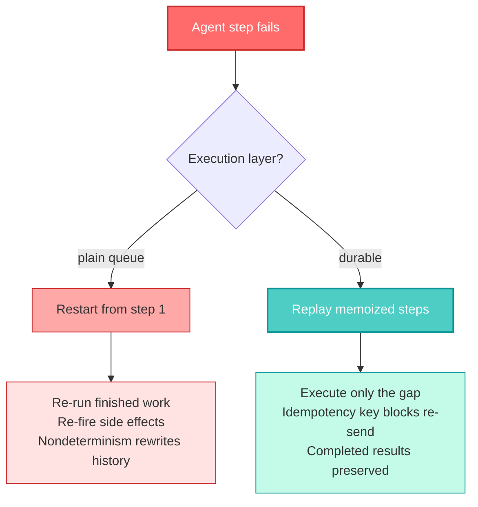

## 🤔 Curiosity: Which of the Twelve Is Load-Bearing?

A LinkedIn post crossed my feed with a promise I have learned to distrust: *"If you want to become god-level with AI agents, then learn these 12 concepts."* Twelve links, one per concept, from [Neo Kim](https://newsletter.systemdesign.one/) — an explainer with a 245K-engineer newsletter behind him.

Curated lists like this usually fail one of two ways. Either every item is the same idea wearing a different hat, or the list is genuinely broad and the *ordering* is arbitrary — twelve equal-weight boxes when three of them carry the load.

So I did the boring thing. I resolved all twelve shortlinks, read every article that was not behind the paywall, verified the mechanical claims against primary sources, and asked one question the list itself does not answer:

> **Curiosity:** Of twelve concepts pitched as equally essential, which one actually decides whether an agent survives production — and is it even on the list?
{: .prompt-tip}

The answer surprised me, and it is the reason this post exists. The most consequential layer in the whole set is the subject of exactly one of the twelve articles — the one published the same day I read it — and it is **not named as one of the 30 concepts** in the list's own summary article.

---

## 📚 Retrieve: What the Twelve Actually Cover

All twelve `lnkd.in` links resolve to `newsletter.systemdesign.one`. Here is the real map, with publication dates:

| # | Concept | Article | Date | Access |
| :-: | :--- | :--- | :--- | :--- |
| 1 | How AI agents work | `ai-agents-explained` | 2026-01-05 | paid |
| 2 | Agents that don't start over on failure | `durable-ai-agents` | **2026-08-20** | free |
| 3 | Build your first agent | `how-do-ai-agents-work` | 2026-03-18 | free |
| 4 | Multi-agent architectures | `multi-agent-system` | 2026-04-30 | paid |
| 5 | Nine agentic patterns | `agentic-design-patterns` | 2026-04-22 | paid |
| 6 | State, memory, consistency | `ai-agent-memory` | 2026-05-17 | free |
| 7 | Software workflow with agents | `agentic-ai-use-cases` | 2026-05-28 | free |
| 8 | 30 core agentic concepts | `agentic-engineering` | 2026-06-17 | free |
| 9 | Agent-to-agent collaboration | `agent-to-agent-protocol` | 2026-06-26 | paid |
| 10 | Build a research agent | `...research-agent-with-mcp` | 2026-08-10 | paid |
| 11 | How OpenClaw works | `openclaw-architecture` | 2026-06-08 | paid |
| 12 | Graph-shaped memory | `graph-based-agent-memory` | 2026-07-07 | free |

**Six of twelve are paid.** I did not bypass the paywall — that is the author's livelihood, and a post built on circumvented content would be worth less than nothing. Six full articles plus six substantial free introductions is more than enough to map the terrain, and I will flag where a claim comes from an intro rather than a full read.

One thing the list gets right immediately: it is not twelve hats on one idea. The span is real.

{: .w-100 .shadow .rounded-10 }
_The loop is the whole distinction. A chatbot answers once; an agent picks a next step, reads the result, updates its running context, and goes again. Diagram: [Neo Kim, systemdesign.one](https://newsletter.systemdesign.one/p/agentic-ai-use-cases)._

### The Definition That Holds Up

Across all six free articles, one definition stays stable:

> *"An agent is a large language model that runs in a loop, has access to tools, and decides what to do next."*

Three clauses, each load-bearing. Drop the loop and you have a chatbot. Drop the tools and you have a monologue. Drop *decides what to do next* and you have a workflow with an LLM inside it — which is often the better engineering choice, and the articles are refreshingly willing to say so:

> *"Skip the agent when a single prompt or a plain script will do. Loops are not free."*

{: .w-100 .shadow .rounded-10 }
_One shot, fixed sequence, or iterate until satisfied. The third column is the only one that can recover from its own mistakes — and the only one whose cost you cannot predict up front. Diagram: [Neo Kim, systemdesign.one](https://newsletter.systemdesign.one/p/agentic-engineering)._

The three-way split lands even better as a physical metaphor:

{: .w-100 .shadow .rounded-10 }
_A workflow follows the assembly steps. An LLM answers questions about them. An agent reacts to the unexpected — including the part where the wood splits. Diagram: [Neo Kim, systemdesign.one](https://newsletter.systemdesign.one/p/how-do-ai-agents-work)._

And the autonomy ladder is the framing I would put in front of a team debating whether they need an agent at all:

{: .w-100 .shadow .rounded-10 }
_Autocomplete finishes your line. A chatbot answers and you copy it back. An agent reads files, runs tests, and edits code until done — while you watch. Diagram: [Neo Kim, systemdesign.one](https://newsletter.systemdesign.one/p/agentic-ai-use-cases)._

The build guide turns that ladder into a ten-step progression, and the ordering is the useful part: memory arrives at step 5, state management at step 9, and multi-agent last. Reach for the top of the staircase first and you get a distributed system you cannot debug.

{: .w-100 .shadow .rounded-10 }
_Manual → Prompt → MCP → Skills → Memory → SOP → Define agent → Periodic execution → State management → Multi-agent. Diagram: [Neo Kim, systemdesign.one](https://newsletter.systemdesign.one/p/how-do-ai-agents-work)._

The execution model is [ReAct](https://arxiv.org/abs/2210.03629) — think, act, observe — which I verified is Yao et al., October 2022 (arXiv:2210.03629). The articles are honest that the name churns while the loop does not: *"One calls it a skill, the next calls it a rule; it's the same job underneath."*

That line is the actual thesis of the whole set, and it is worth more than any individual concept.

### The 30-Concept Map, and a Numbering Gap

The eighth article compresses the field into 30 concepts across six layers. This is the single most useful artifact in the twelve:

{: .w-100 .shadow .rounded-10 }
_Foundations → Configuration → Capability → Orchestration → Guardrails → Observability. Highlighted chips are the suggested entry points. Diagram: [Neo Kim & Paul Hoekstra, systemdesign.one](https://newsletter.systemdesign.one/p/agentic-engineering)._

I parsed the article's own headings to check the count and found **29 numbered headings, not 30**. Concept 26 exists as prose — a full section on CI as the second layer of automated checks, complete with a sharp practical note about adding a `concurrency` block so agents don't burn CI minutes on obsolete runs — but its heading lost its number. The map image above resolves it: **26 is CI**. A trivial defect, but it is the kind of thing you only find by counting instead of nodding.

The guardrails section contains the best single paragraph in the set, on why agents tolerate strict gates better than humans do:

> *"Rules that can feel rigid for humans are often exactly right for agents. The agent does not get annoyed, ignore the rule, or promise to tidy things up later. It hits the gate, fails, reads the error, and tries again."*

Eight years of shipping AI systems at NC SOFT and COM2US taught me the human half of that sentence the hard way. The agent half is genuinely new, and it inverts a long-standing tradeoff: tooling strictness used to cost you developer goodwill. Against an agent, strictness is free and *teaches*.

### State and Memory, Correctly Separated

The memory article draws a line most discussions blur — **state is workflow progress, memory is carried knowledge**. They fail differently and need different machinery.

{: .w-100 .shadow .rounded-10 }
_Book flight 1, then flight 2. The stateless agent offers a 2:45 PM connection against a 3:00 PM arrival. Nothing hallucinated — it simply had no state. Diagram: [Neo Kim, systemdesign.one](https://newsletter.systemdesign.one/p/ai-agent-memory)._

And the detail that earns the article its length — long-running workflows need **schema migration**, because a state written yesterday must stay readable tomorrow:

{: .w-100 .shadow .rounded-10 }
_Migrate old state forward, block incompatible paths, and let in-progress v1 runs finish on v1 while new runs start on v2. Diagram: [Neo Kim, systemdesign.one](https://newsletter.systemdesign.one/p/ai-agent-memory)._

If your agent workflow can outlive a deployment — and any workflow with a human approval step can — then you own a schema migration problem whether you planned for one or not. I have watched this exact bug eat a week: a paused workflow resumed after a deploy, read a field that had been renamed, and cheerfully continued with a null.

### Graph Memory: Written for One Writer, Now Serving Many

The twelfth article makes an argument I had not seen framed this cleanly. Existing memory designs assume **one careful writer**:

{: .w-100 .shadow .rounded-10 }
_What memory was built for, versus what shows up now: many agents, some of them wrong. Diagram: [Neo Kim, systemdesign.one](https://newsletter.systemdesign.one/p/graph-based-agent-memory)._

The per-agent default makes the problem concrete — every agent hoarding its own store, with humans ferrying context between them:

{: .w-100 .shadow .rounded-10 }
_Every agent, its own memory. The courier in the middle is you. Diagram: [Neo Kim, systemdesign.one](https://newsletter.systemdesign.one/p/graph-based-agent-memory)._

And the two default answers both lose the relationships:

{: .w-100 .shadow .rounded-10 }
_"Nothing to follow." A folder gives you no traversal; a vector store gives you neighbours without edges. Diagram: [Neo Kim, systemdesign.one](https://newsletter.systemdesign.one/p/graph-based-agent-memory)._

The article's case study is a lakehouse graph with git-style branching on object storage. The screenshot in the article points at a real repository, and I verified it: [`ModernRelay/omnigraph`](https://github.com/ModernRelay/omnigraph), 1,076 stars, Rust, MIT — *"Lakehouse native graph engine with git-style workflows."*

{: .w-75 .shadow .rounded-10 }
_Declared as code, parallel isolated branches per agent, reviewed merges, S3-compatible storage. Screenshot: [Neo Kim, systemdesign.one](https://newsletter.systemdesign.one/p/graph-based-agent-memory)._

I covered adjacent ground in [my GraphRAG-to-context-layer post](/posts/ontology-graphrag-agent-memory/) and again in [the Hindsight memory bridge post](/posts/omnigent-hindsight-universal-memory/). The addition here is the concurrency framing: not *how do I store knowledge*, but *how do a hundred agents write to shared knowledge without corrupting it*. Git-style branch-and-merge is a genuinely good answer to a question the vector-database era never had to ask.

---

## 💡 Innovation: The Layer That Decides Everything

Now the thing I actually came away with.

Of the 30 concepts in the summary article, **durable execution is not one of them.** Sandboxing is. Tracing is. Prompt caching is. But the layer that decides what happens when step 6 of 10 fails — after the agent has already sent an email — appears nowhere in the numbered list. It gets its own article, published 2026-08-20, and that article is the most operationally important of the twelve.

Here is the failure it addresses:

{: .w-100 .shadow .rounded-10 }
_Steps 1 and 2 succeeded. Step 3 failed. A plain job queue sends you back to step 1. Diagram: [Neo Kim, systemdesign.one](https://newsletter.systemdesign.one/p/durable-ai-agents)._

And the fix:

{: .w-100 .shadow .rounded-10 }
_Retrieval and extraction are saved results. Only drafting re-runs. Diagram: [Neo Kim, systemdesign.one](https://newsletter.systemdesign.one/p/durable-ai-agents)._

The distinction the article draws is the sentence I will be quoting in design reviews:

> *"A retry reruns a failed task, while a checkpoint remembers completed tasks."*

Four reasons this matters more for agents than for ordinary jobs, all of which I have hit in production:

1. **Steps are slow and expensive.** Re-running five completed LLM calls to reach the sixth is not a rounding error.
2. **Outputs are nondeterministic.** Re-running a *completed* step can change the workflow's outcome. This one is genuinely nasty — it means naive retry is not just wasteful, it is **incorrect**.
3. **Steps have side effects.** *"A duplicate charge is NOT a retry problem, but a correctness problem."*
4. **Steps wait on people.** Holding a worker open for a two-day approval does not scale.

### Verifying It Instead of Nodding at It

Diagrams are easy to agree with. I wanted the properties to be mechanically true, so I implemented durable execution in ~200 lines of stdlib Python — a step store, a memoizing runner, idempotency keys, and suspend/resume — and made the file self-checking.

- 📎 [`durable.py` — durable execution, 26 executable checks, stdlib only](/assets/code/posts/2026-08-20-agent-concepts/durable.py)

The core is nine lines. A completed step is a *fact*, not an instruction to recompute:

```python
def step(self, step_id: str, fn: Callable[[], Any]) -> Any:
    hit, value = self.store.get(self.run_id, step_id)
    if hit:
        self.ledger.replayed.append(step_id)   # replay: free
        return value
    self.ledger.executed.append(step_id)       # execute: costs tokens
    value = fn()
    self.store.put(self.run_id, step_id, value)
    return value
```

Running the same 4-step research workflow — retrieval → extraction → drafting → deliver, with an email side effect after extraction, failing on `drafting`:

```console
$ python3 assets/code/posts/2026-08-20-agent-concepts/durable.py
1. Naive retry: the failure erases finished work
  ok  attempt 1 runs 3 steps, dies on drafting
  ok  the email went out before the failure
  ok  attempt 2 re-runs everything
  ok  7 step executions for a 4-step workflow
  ok  and the customer got the email TWICE
2. Durable execution: only the gap re-runs
  ok  attempt 2 replays the completed steps
  ok  and executes only what was missing
  ok  the email is NOT sent again
  ok  5 step executions instead of 7
3. Replay is not re-execution (why nondeterminism matters)
  ok  the memoized draft is unchanged despite a new nonce
  ok  it kept generation 1's output, not generation 999's
4. Suspend and resume across processes
  ok  a fresh process replays the saved steps
  ok  the email is still not re-sent, across a process boundary
5. Idempotency is the property, not the retry count
  ok  50 attempts, 1 delivery
OK
```

Three results worth pulling out:

| Property | Naive retry | Durable |
| :--- | :---: | :---: |
| Step executions for one 4-step run with one failure | **7** | **5** |
| Emails delivered | **2** 🔴 | **1** |
| Draft survives replay with changed inputs | no | **yes** |

The duplicate email is the one that should worry you. It is not a performance regression — it is a **correctness bug that no amount of retry tuning fixes**, and on a real workflow it is a duplicate charge.

Check 3 is the subtle one and it took me a moment to design an honest test for it. I replay a run with a deliberately changed nonce, which would produce different output if the step re-executed. The memoized value is unchanged — generation 1's draft, not generation 999's. On a toy that reads as an implementation detail. On a real LLM call, **re-running a completed step silently rewrites the workflow's history.** That is why "just retry it" is not a durability strategy.

Check 5 makes the idempotency claim falsifiable rather than aspirational: 50 delivery attempts across 10 fresh runner objects, 1 delivery, 1 checkpoint write. And crucially, the dedupe key is checkpointed like any other step — an in-memory set would evaporate on exactly the restart you are defending against.

### Flow Control: The Failure Mode of a Good Recovery

The detail I would have missed on a skim. Once recovery works correctly, correct recovery becomes the new problem:

{: .w-100 .shadow .rounded-10 }
_Concurrency, throttling, rate limiting, per-tenant isolation. Diagram: [Neo Kim, systemdesign.one](https://newsletter.systemdesign.one/p/durable-ai-agents)._

> *"A single customer could trigger thousands of agent runs, consuming shared capacity & hitting an LLM provider's limits. The resulting failures can then create even more retries."*

Retry storms are an old lesson from game backends — a login spike that fails, retries in lockstep, and self-amplifies. What is new is that each retry now costs tokens, so the feedback loop bills you on the way down.

### Verified Against the Vendor's Own Docs

The article uses [Inngest](https://www.inngest.com/) as its case study and is transparent about the partnership. Sponsored content is exactly where I stop trusting prose and go read the reference, so I did:

| Article claim | Inngest docs |
| :--- | :--- |
| `step.run()` memoizes completed steps | ✅ *"wraps any logic in a **memoized**, retriable, observable step"* |
| Completed steps are skipped on later executions | ✅ Docs section: *"Secondary executions — Memoization of steps"* |
| Checkpointing is a distinct mechanism | ✅ Ships as its own docs section, marked `new` |
| Temporal is the heavier, workflow-first alternative | ✅ Docs carry a section titled *"How Inngest's execution model compares to Temporal"* |

The vendor's own framing corroborates the article's positioning: *"Most systems that offer durable execution require you to manage separate worker infrastructure, learn custom runtimes, or rewrite your application code to fit a specific programming model."*

The BullMQ / Temporal / Inngest comparison in the article is fair — control versus complexity versus application-code-first — and it resists the obvious temptation to declare the sponsor the winner: *"There is NO one right choice."* I will still note the structural bias: a post sponsored by a durable-execution vendor is naturally going to conclude that you need durable execution. In this case I think the conclusion is right, which is precisely why I verified it independently.



---

## ⚖️ Where I Push Back

Three honest criticisms, because a list this widely shared deserves scrutiny rather than applause.

**1. The list is a reading order, not a dependency graph.** Twelve numbered links imply sequence, but concept 2 (durable execution) is infrastructure you need before concept 10 (build a research agent) is safe to run in anger. Meanwhile concept 8 (30 concepts) is a superset of several others. The genuine dependency spine is narrow: *loop → state → guardrails → execution layer → observability*. Everything else is breadth. I would hand a new engineer articles 3, 8, and 2 in that order and skip the rest until they had shipped something.

**2. "God-level" is doing a lot of work.** Half the set is conceptual explainers. Reading twelve articles produces vocabulary, not judgment — and judgment is the actual scarce resource. The list's own best insight admits this: *"You learn the ideas behind the tools, and let the tools come and go."* Vocabulary is table stakes; knowing when **not** to reach for an agent is the skill, and only one article really presses on it.

**3. The count is off by one, and the omission is bigger than the miscount.** 29 numbered headings under a "30 concepts" title is cosmetic. Durable execution being absent from those 30 while carrying its own article is not. If I were reordering the set, checkpointed execution would be concept 4 — right after state — because it is the difference between an agent demo and an agent you can bill for.

And the demo/production gap is a point the articles themselves make better than I could:

{: .w-100 .shadow .rounded-10 }
_Seconds versus months. Read the diff versus no test for it. Just revert versus data already corrupted. Diagram: [Neo Kim, systemdesign.one](https://newsletter.systemdesign.one/p/agentic-ai-use-cases)._

> *"A demo wins on all four. Your work usually doesn't."*

---

## 🎯 What I Am Taking Into My Own Harness

| Insight | Why it matters | What I am doing with it |
| :--- | :--- | :--- |
| **Checkpoint ≠ retry** | Retry reruns failure; checkpoint remembers success | Wrap every expensive agent step in a memoized boundary with a stable ID |
| **Re-running a completed step is a correctness bug** | Nondeterministic output silently rewrites workflow history | Never recompute a step that already has a recorded result |
| **Idempotency keys must be checkpointed** | An in-memory dedupe set dies in the restart it defends against | Persist the key alongside step results, not in process memory |
| **Waits must release compute** | Human approval takes days; workers cost money | Suspend to durable state; resume from the event |
| **Recovery needs flow control** | Correct retries in bulk become a self-amplifying retry storm | Concurrency + per-tenant isolation before scaling agent runs |
| **State needs schema migration** | Any workflow that outlives a deploy has a versioning problem | Version the state envelope from day one |
| **Strictness is free against agents** | Gates that annoy humans just teach agents | Tighten pre-commit and CI when agents have commit access |
| **Agents assume one careful writer** | Shared memory with many writers corrupts quietly | Branch-per-agent with reviewed merges for shared knowledge |

### New Questions This Raises

1. **What does durable execution cost in latency?** Checkpointing every step adds a round trip. Inngest ships checkpointing as an optimization for exactly this reason, but I have seen no published numbers on step-boundary overhead versus tokens saved. That is a measurable experiment nobody seems to have run in public.
2. **Can memoization be too aggressive?** If a completed step's *inputs* are later invalidated, the memoized result is confidently stale. My check 3 celebrates memo stability — but the same mechanism is a bug when upstream truth has moved. Where is the invalidation boundary?
3. **Does the ontology of "step" survive real agents?** Durable execution assumes you can name a step and give it a stable ID. An agent that *decides its own next action* generates steps dynamically. What is the step ID of a tool call the model invented at runtime?
4. **Where does this land for game backends?** A live-ops agent that adjusts drop rates and reaches for a payment API is exactly the workflow where a duplicate side effect is a headline, not a bug report. The 2:45 PM connecting flight in that stateless-agent diagram is funny; the same class of error against a player's wallet is not.

The framing I am keeping is the one that made the whole list worth reading:

> *"One calls it a skill, the next calls it a rule; it's the same job underneath. Learn the idea, and it stops mattering which tool you pick."*

Twelve links, six paywalls, one 200-line reimplementation later, that holds up. The tools in this list will churn within a year. Checkpoint-versus-retry will not — it is the same lesson distributed systems learned decades ago, arriving in a field that is currently rediscovering it at LLM prices.

---

## 📚 References

**The Source Post**
- [Neo Kim's LinkedIn post — 12 concepts for AI agents](https://www.linkedin.com/feed/update/urn:li:activity:7496731558175780864/) (384 reactions, 67 reposts at time of reading)
- [systemdesign.one newsletter](https://newsletter.systemdesign.one/)

**Articles Read in Full (free)**
- [How to Build AI Agents That Don't Start Over When They Fail](https://newsletter.systemdesign.one/p/durable-ai-agents) — #170, 2026-08-20
- [Step-by-step guide to building your first AI agent](https://newsletter.systemdesign.one/p/how-do-ai-agents-work) — #131
- [AI Agents: State, Memory, Consistency](https://newsletter.systemdesign.one/p/ai-agent-memory) — #147
- [How to get ahead of 99% of software engineers with AI agents](https://newsletter.systemdesign.one/p/agentic-ai-use-cases) — #149
- [30 Core Agentic Engineering Concepts](https://newsletter.systemdesign.one/p/agentic-engineering) — #154, with [Paul Hoekstra](https://paulspipeline.substack.com/)
- [Graph-shaped memory for AI agents](https://newsletter.systemdesign.one/p/graph-based-agent-memory) — #160

**Articles Read as Public Introductions Only (paid)**
- [What Makes an AI Agent Different From ChatGPT?](https://newsletter.systemdesign.one/p/ai-agents-explained) · [Multi-Agent Architectures](https://newsletter.systemdesign.one/p/multi-agent-system) · [9 Agentic Patterns](https://newsletter.systemdesign.one/p/agentic-design-patterns) · [A2A Protocol](https://newsletter.systemdesign.one/p/agent-to-agent-protocol) · [Build an AI Research Agent](https://newsletter.systemdesign.one/p/how-to-build-an-ai-research-agent-with-mcp) · [The Anatomy of OpenClaw](https://newsletter.systemdesign.one/p/openclaw-architecture)

**Primary Sources Used for Verification**
- [ReAct: Synergizing Reasoning and Acting in Language Models](https://arxiv.org/abs/2210.03629) — Yao et al., arXiv:2210.03629, 2022-10-06
- [Inngest: How functions are executed — Durable Execution](https://www.inngest.com/docs/learn/how-functions-are-executed)
- [Inngest: `step.run()` reference](https://www.inngest.com/docs/reference/functions/step-run)
- [ModernRelay/omnigraph](https://github.com/ModernRelay/omnigraph) — 1,076 stars, Rust, MIT
- [Temporal](https://temporal.io/) · [BullMQ](https://docs.bullmq.io/) — the compared alternatives

**Companion Code**
- [`durable.py`](/assets/code/posts/2026-08-20-agent-concepts/durable.py) — checkpointing, memoized replay, idempotency keys, suspend/resume across processes. 26 executable checks, stdlib only.

**Related Posts**
- [From RAG to Context Layer: Ontology, LLM Wiki, HyGRAG](/posts/ontology-graphrag-agent-memory/)
- [One Memory Setup, Every Harness: Omnigent's Hindsight Bridge](/posts/omnigent-hindsight-universal-memory/)
- [Ouroboros: The Agent OS That Hides the Answer Key](/posts/ouroboros-agent-os-spec-first-loop/)

> **Note:** All diagrams are the work of Neo Kim (and Paul Hoekstra for the 30-concepts article), reproduced here with attribution and links for commentary. Sponsor graphics and profile screenshots from the source articles were deliberately excluded. Six of the twelve articles are paid; their paywalls were respected, and claims drawn from them are labelled as introduction-only. Article dates and metrics were read on 2026-08-21.
{: .prompt-info}
