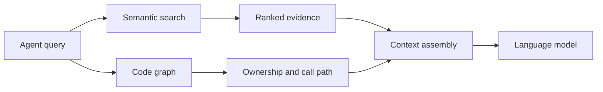
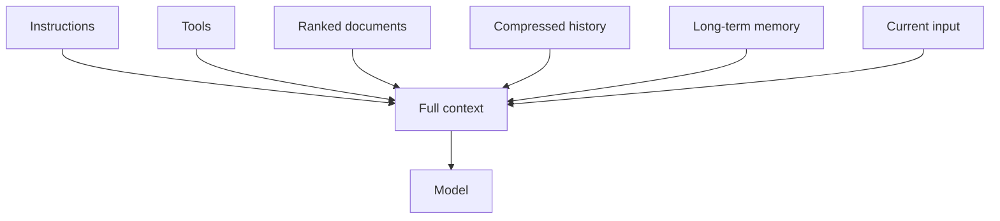

> This post draws on Sourcegraph's [Context Engineering: A Practical Guide for AI Agents](https://sourcegraph.com/blog/context-engineering) and mem0's complementary guide to agent memory. The cited definitions and architecture claims come from those sources. Everything else is my read as someone who has shipped AI systems into production games for eight years at NC SOFT and COM2US.
{: .prompt-info}

{: .light .w-75 .shadow .rounded-10 }
_The mental shift is simple: instead of searching for the perfect prompt, design what the agent is allowed to know, when it receives it, and how that information is ranked. (Source: [Unsplash](https://unsplash.com/), public image source)_

## 🤔 Curiosity: Why Do Smart Agents Make Dumb Mistakes?

I have seen this failure in live-ops work.

A capable agent had access to patch notes, telemetry exports, and a vector search over the team's decision history. On paper, the setup looked complete. In practice, it kept recommending balance changes that had already been reverted two patches earlier, complete with confident explanations.

The agent was not stupid. Its reasoning was coherent. The problem was that the relevant fact was not in context when the agent needed it.

This is the problem that **context engineering** names. Prompt engineering tells a model what to do. Context engineering designs the information that makes reliable action possible in the first place.

Sourcegraph defines context engineering as the systematic practice of designing, selecting, and structuring the information an AI agent receives so it can reason, plan, and act reliably across sessions. The phrase "across sessions" matters. A single-session agent is a calculator. An agent that can carry decisions, constraints, and failures forward becomes infrastructure.

> **The question:** if the system prompt tells the model what to do, what tells it what to know?
{: .prompt-tip}

## 📚 Retrieve: The Four Pillars

A useful context-engineering system has four related layers: retrieval, memory, context assembly, and reasoning scaffolds. I will map each one to a game-production problem.

### 1. Retrieval: find the right evidence, not every match

An agent cannot know the whole repository, telemetry history, and design archive at once. It needs a retrieval layer that finds the smallest useful set of evidence at decision time.

For game code, vector search alone is often insufficient. Text search can find ten mentions of `cooldown`, but it does not necessarily tell you which component owns the value, which configuration reaches the live build, or which telemetry event measures the outcome.

Structured code intelligence adds the missing relationships: call graphs, symbol ownership, type information, and cross-repository references. The practical question is not only "where does this word appear?" It is "which path changes the player-visible result?"



In a balance review, the useful retrieval result might combine the ability definition, the owning system, the last three related decisions, and the telemetry window for the affected cohort. A pile of loosely related snippets is not context. It is noise with citations.

### 2. Memory: separate the session from the history

Memory has at least two species.

**Short-term memory** is the current conversation, tool results, and task state. It lives in the context window and normally dies with the session.

**Long-term memory** persists across sessions: user preferences, project conventions, prior decisions, post-mortems, and constraints. This is the layer teams often underinvest in because it has no immediate demo effect.

{: .w-75 .shadow .rounded-10 }
_The memory stack has different update speeds. Session context changes every turn. Project memory changes when decisions change. Episodic records change when the team learns from an outcome. (Source: [Unsplash](https://unsplash.com/), public image source)_

Raw conversation history is a poor long-term memory format. It grows too quickly and forces every future run to re-read the same irrelevant turns. A better design extracts durable facts: what was decided, why, which evidence supported it, what happened afterward, and when the fact should be rechecked.

For a live-service team, the durable record is not "the agent said this in turn 47." It is "the cooldown reduction shipped in patch 7.2, raised pick rate, reduced D7 retention in the affected cohort, and was reverted in 7.5." That is the unit an agent can use later.

### 3. Context assembly: relevance beats recency

Good retrieval can still produce bad decisions if the pieces are assembled in the wrong order.

A practical assembly usually contains:

- system instructions and tool definitions
- ranked source documents
- relevant conversation history
- long-term memory snippets
- current user input
- explicit uncertainty or freshness markers

The common failure mode is recency bias. The agent sees the last twenty turns but misses the constraint established three weeks ago. The context window is full, yet the important signal is absent.



Context assembly should therefore be an explicit design decision. Even heuristic relevance scores are better than an implicit order nobody can inspect. A prior rollback may deserve more weight than a newly indexed design note. A current telemetry window may outrank a six-month-old assumption. The system should make that judgement visible.

### 4. Reasoning scaffolds: use the context before acting

The final layer is how the agent uses the context. A reasoning scaffold can require the agent to check prior decisions, state uncertainty, compare current evidence with historical evidence, or run a verification tool before proposing a change.

This is where prompt engineering belongs, but notice the order. The scaffold comes after retrieval, memory, and assembly. Most teams start by rewriting the system prompt while the agent still has no reliable way to find the facts that prompt asks it to use.

## 💡 Innovation: A Balance-Review Guardrail

Here is the smallest useful context-engineering slice I would build for a game team: a pre-change guardrail for balance proposals.

```python
from dataclasses import dataclass

@dataclass
class BalanceContext:
    related_decisions: list[dict]
    code_ownership: dict
    telemetry_window: dict
    prior_reverts: list[dict]
    constraints: list[str]


def assemble_context(proposal, decisions, graph, metrics):
    system = extract_system(proposal)
    lever = extract_lever(proposal)

    return BalanceContext(
        related_decisions=decisions.search(f"{system} {lever}", top_k=5),
        code_ownership=graph.trace_ownership(system),
        telemetry_window=metrics.last_30_days(system),
        prior_reverts=decisions.filter(system=system, status="reverted"),
        constraints=decisions.get_constraints(scope="global"),
    )
```

The exact code is not the point. The shape is the point. The agent receives a deliberately assembled object rather than an accidental transcript dump.

Before proposing a change, the guardrail can ask:

1. Have we tried this lever before?
2. Was the previous attempt shipped, reverted, or left unmeasured?
3. Which code path owns the behavior?
4. What did the affected cohort do in the latest comparable window?
5. Which constraints are still valid for this patch?

The result should not blindly block the designer. It should surface the evidence and make the decision legible. "This was reverted before" is a useful challenge. It is not automatically a veto because the product, cohort, and patch may have changed.

{: .w-75 .shadow .rounded-10 }
_Retrieval is not just search. It is ranking, filtering, and assembly with a declared purpose. (Source: [Unsplash](https://unsplash.com/), public image source)_

### MCP as a retrieval bus

The Model Context Protocol is useful here because production context is heterogeneous. A game team may have a Git repository, a telemetry warehouse, a design wiki, a ticket tracker, and a balance database. Each source can expose a tool surface instead of forcing every agent pipeline to contain bespoke retrieval code.

{: .w-75 .shadow .rounded-10 }
_MCP does not solve relevance by itself. It gives different sources a consistent way to participate in context assembly. The ranking and freshness policy still belong to the product team. (Source: [Unsplash](https://unsplash.com/), public image source)_

### Honest tradeoffs

Context engineering has costs that should be measured rather than hidden:

- **Latency:** every retrieval hop adds time, and an interactive agent can become frustratingly slow.
- **Token cost:** more context means more tokens, so compression and ranking are also budget controls.
- **Staleness:** a constraint that was correct in patch 7.2 may be wrong in 7.5. Facts need TTLs, event-based invalidation, or explicit revalidation.
- **Complexity:** each layer can fail independently. Start with one high-value workflow instead of building an abstract memory platform first.
- **Evaluation:** retrieval metrics do not fully measure whether the assembled context led to a good decision. The final guardrail needs outcome-based tests.

### Key Takeaways

| Insight | Implication | Next step |
|:--|:--|:--|
| Prompt engineering is not context engineering | What the agent knows is a separate system from what it is told to do | Audit the agent's information sources before rewriting the system prompt |
| Memory has different lifetimes | Session context dies quickly, while decisions and constraints need durable storage | Pick one cross-session fact and store it with a source and freshness rule |
| Code retrieval needs structure | Vector search can lose ownership and call-graph information | Add one structured code-intelligence source beside the vector index |
| Assembly order matters | Recency is not the same as relevance | Make ranking and uncertainty visible in the assembled context |
| Small guardrails beat abstract platforms | A real workflow reveals the missing evidence faster than a generic memory layer | Start with one pre-change review and measure repeated mistakes |

## New Questions This Raises

- What freshness policy should a live-service game use when the ground truth changes every patch?
- If multiple specialized agents share a memory store, who resolves conflicting writes?
- How do we evaluate the quality of assembled context without running the entire agent loop?

The tools are maturing quickly. The engineering responsibility remains the same: make the evidence that shapes an agent's decision visible, current, and testable.
