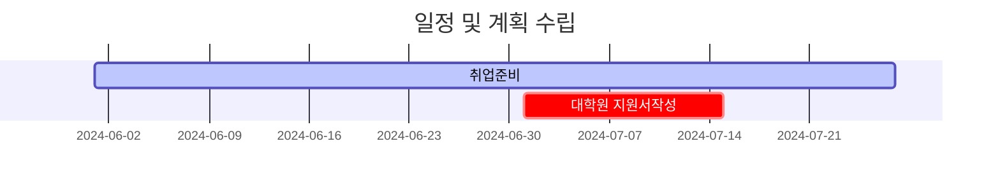

---
# the default layout is 'page'
icon: fas fa-info-circle
order: 4
mermaid: true
---

## Let me introduce myself !

~~~
Hello, my master's degree studies are on user behavior analysis in gaming-specific cameras, emotions and keyboards.
 And for emotions, we used MLP-based emotional computing. ( Called "Emotion Tracer" )

I have experience creating an MCTS-based play agent for a match-3 puzzle game to predict level balancing.
(Previously, I trained reinforcement learning-based play agents in a Dungeon Delivery game environment.)
Next, we had the experience of creating a leveled map generator for a match-3 puzzle game with Playing Agent.

Recently, I have been trying to create face model from 4D scans to deep learning models. 

Because we want to reduce the cost of creating facial animations for too many characters. ( Called "AVATAR" )

I want to learn more powerful technologies such as machine learning/deep learning/generative AI for games.
As soon as possible, i want to create a game with infinite content using generative AI.

I am growing as a programming engineer in the game industry.

If you have the same idea, always please contact me :D
~~~

* * *

### Previous Work
- Lip Sync Model based on Wav2Mesh to improve performance ( Model by based LLM )
- Faceform, 4D Scan/HMC data post-processing to low-poly 
- 3-Match puzzle game level generator ( Model by Cellular Automata )
- 3-Match puzzle game playing agent to estimate level ( Model by Monte Carlo Tree Search  )
- Dunjeon Delivery Reinforcement learning based agent ( Model by Double- DQN )
- Emotional User Behavior Analysis Tool ( Model by Multi-Layer Perceptron )

* * *

### Current Work 👉 [Resume](/assets/pdf/resume.pdf)
- Ready to Prepare Interesting things

* * * 

> #### Look at Interesting Things+
- Graphics Programming 
  - proto typing 
- Game Programming
  - Unreal Engine Game proto typing
- Coding Contest Winner
- Kaggle Ranker
  - Category is Vision, Graphics, Game
- AI based Service
  - Development Game
  - Development Others
{: .prompt-info }

* * *

### Schedule & Planning
> #업무정리, #일정, #단위설정, #테스트코드 , #블로그

| Title| Subject| Category | Detail | Part | Time |
| :--- | :--- | :--- | :--- | :--- | :--- |
| 대학원준비 | 일정준비 | | **7월 지원**  | | |
| | 게임제작| 기획 | | | |
| | | 계획 및 일정| | | |
| | | 프로그래밍 환경 구축 | 언리얼 (1순위), 유니티 (2순위), Flutter (3순위)| | |
| 운동 건강 관리 | 무산소운동 | 무분할운동 | 체력운동| | |
| | | 분할운동| 상체분할 | 어께/등/이두, 가슴/허리/삼두 | |
| | | | 하체 | | |
| | 유산소운동 | | | | |
| 스케쥴 정리 | 일과정리 | 시간별 업무 할당 ( 역산필요 ) | | | |
| | 달성목표 ( 주간 / 월간 / 분기 / 연간 ) | 주간목표수립 | | | |
| | | 월간목표수립 | | | |
| | | 분기별목표수립| | | | 
| | | 연간목표수립 | | | |

* * *

### Projects on going

| Title| Subject| Category | Detail | Link | 
| :--- | :--- | :--- | :--- | :--- |
| Prepared Categories | Concept Summary | Blog | | <https://akillness.gihub.io> |
| | Project History & Resume | Github | | <https://github.com/akillness> |
| | To Do List | Planning | | <https://app.todoist.com/app/today> |
| | Schedule Planning | Scheduler | | <https://bear.app/> |
| | Idea Sketch | Brain Storming | | <https://gitmind.com> |
| Coding Test | Baekjoon | Problem Solving | | <https://www.acmicpc.net/step> |
| | Algorithm & Data Structure | Concept Study | | <https://github.com/akillness/Algorithm_Honglab> |
| ML/DL & AI Tech Trend | Research & Implementation | | | `To be blogging..` |
| | Pytorch | Practice | memory, pylightning | <https://github.com/akillness/SPTTC> |
| English Speacking | Practice | Study | Goal : free talking | |

* * *

### Study

> `ML for Games Course` : <https://huggingface.co/learn/ml-games-course/unit0/introduction>
{: .prompt-warning }

> `알고리듬 강의` : <https://honglab.co.kr/courses/take/algorithms>
- Github : <https://github.com/HongLabInc/HongLabAlgorithmsPart1>
{: .prompt-danger }

* * *

### Reference About Generative AI

| Title|Subject| Detail|Link|
| :--- | --- | ---  | --- |
| Study | Cosera | Deep Learning For Certifiaction | <https://www.coursera.org/> |
| | DeeplearningAI | Deep Learning For Certifiaction | <https://www.deeplearning.ai/> |
| | LLM | Visualization Concept by simulation | <https://bbycroft.net/llm> |
| Sketch | GameSketch | | <https://gitmind.com/app/docs/msddgwqm> |
| Dart Pad | | | <https://dartpad.dev/> |
| Generative AI (Text) | Gemini | | <https://gemini.google.com/> |
| | Claude3 | | <https://claude.ai/chats> |
| | ChatGPT | | <https://chat.openai.com/> |
| Generative AI (Image) | Stable Diffusion (Web) | | <https://stablediffusionweb.com/> |
| | Midjourney | | <https://www.imagine.art/> |
  

<!-- ## Prompts

> An example showing the `tip` type prompt.
{: .prompt-tip }

> An example showing the `info` type prompt.
{: .prompt-info } -->
