---
# the default layout is 'page'
icon: fas fa-info-circle
order: 4
mermaid: true
---



## AI × Games | Developer-Storyteller Turning Technology into Stories

```
Ph.D. Candidate in Game Engineering @ Hongik University
8 Years Shipping AI-Powered Games @ NC SOFT & COM2US
```

{: .light .shadow .rounded-10 }

---

### Curiosity → Retrieve → Innovation

I don't just research AI—I ship it. But more importantly, I'm driven by questions that haven't been asked yet.

My playground sits at the intersection of games, AI/ML/CV/NLP, and interactive systems. I've spent eight years asking "what if?" and then digging deep to retrieve the answers—whether they're buried in research papers, hidden in production data, or waiting to be discovered through experimentation. From reinforcement learning agents (DQN, MCTS) to automated QA systems using computer vision, I build fast, iterate faster, and deliver results that move products forward.

**The cycle I live by:**  
Curiosity sparks the question → Retrieve knowledge from research, data, and experiments → Innovation emerges from connecting the dots.

---

### What I Do

**→ Retrieve insights from the intersection of research and production**  
I dig into papers, experiment with cutting-edge techniques, and extract what actually works at scale. Building game AI agents, PCG tools, and digital human pipelines that ship to millions of players isn't just about implementation—it's about retrieving the right knowledge at the right time.

**→ Convert curiosity into innovation**  
Every "I wonder if..." becomes a hypothesis. Every experiment becomes a story. Every prototype becomes a product. I'm constantly asking: _What can we learn from this? How can we push this further?_

**→ Patent-backed innovations in game difficulty and emotional computing**  
Research that matters. Technology that scales. Innovation that starts with a curious question and ends with something that didn't exist before.

---

### How I Work

**→ Curiosity-driven exploration**  
I start with questions, not assumptions. "What if we tried this?" "Why does this work?" "How can we make this better?" The best innovations come from being genuinely curious about the problem space.

**→ Retrieve knowledge systematically**  
I don't just read papers—I extract patterns. I don't just run experiments—I retrieve insights. I don't just build prototypes—I uncover what's possible. Knowledge retrieval is an active process of synthesis and application.

**→ Fast execution with iterative innovation**  
The best way to validate curiosity is to build it, test it, and learn from real results. But innovation doesn't stop at the first prototype—it's about retrieving feedback, asking new questions, and pushing boundaries further.

**→ Clear communication of complex discoveries**  
Complex systems deserve clear explanations. I turn technical depth into actionable insights, making sure the innovations we retrieve can be understood and built upon.

---

### Tech Stack

**Languages & Frameworks**  
Python | C/C++ | C# | PyTorch | TensorFlow | OpenCV

**Game Engines**  
Unity3D | Unreal Engine

---

### Previous Work

_Each project started with curiosity, required retrieving insights from multiple domains, and resulted in innovation._

**AI & Machine Learning**

- **MCTS-based Play Agent** for match-3 puzzle games to predict level balancing

  - _Curiosity:_ Can AI agents help us understand game balance before players do?
  - _Retrieve:_ MCTS algorithms, game theory, player behavior patterns
  - _Innovation:_ Automated level difficulty prediction system

- **Reinforcement Learning Agent** (Double-DQN) for Dungeon Delivery game environment

  - _Curiosity:_ How can RL agents learn complex game strategies?
  - _Retrieve:_ Deep Q-Networks, game state representations, reward engineering
  - _Innovation:_ Production-ready RL agent for game testing and balancing

- **Emotional User Behavior Analysis Tool** (MLP-based) - "Emotion Tracer"
  - _Curiosity:_ Can we measure player emotions in real-time?
  - _Retrieve:_ Facial expression recognition, MLP architectures, game analytics
  - _Innovation:_ Real-time emotional computing system for game play analysis
  - Paper: [Facial Expression Scale Recognition System for Game Play Analysis](https://www.dbpia.co.kr/journal/articleDetail?nodeId=NODE06645430)

**Procedural Content Generation**

- **Leveled Map Generator** for match-3 puzzle games with Playing Agent - "MAFIA"

  - _Curiosity:_ Can we generate infinite, balanced game levels automatically?
  - _Retrieve:_ PCG techniques, difficulty curves, player agent feedback
  - _Innovation:_ AI-assisted level generation pipeline

- **3-Match Puzzle Game Level Generator** (Cellular Automata-based)
  - _Curiosity:_ How can simple rules create complex, playable game content?
  - _Retrieve:_ Cellular automata theory, game design patterns, constraint satisfaction
  - _Innovation:_ Rule-based procedural generation system

**Digital Humans & Animation**

- **Face Model Pipeline** from 4D scans to deep learning models - "AVATAR"

  - _Curiosity:_ How can we reduce the cost of creating photorealistic digital humans?
  - _Retrieve:_ 4D scanning, deep learning architectures, facial animation pipelines
  - _Innovation:_ Cost-effective digital double creation workflow
  - Reducing cost of creating high-quality facial animations like digital doubles

- **Lip Sync Model** based on Wav2Mesh to improve performance (LLM-based)

  - _Curiosity:_ Can we make lip sync faster and more accurate?
  - _Retrieve:_ Audio-visual models, LLM architectures, real-time rendering
  - _Innovation:_ High-performance lip sync system

- **Faceform**: 4D Scan/HMC data post-processing to low-poly
  - _Curiosity:_ How can we preserve quality while reducing complexity?
  - _Retrieve:_ Mesh optimization, topology reduction, visual quality metrics
  - _Innovation:_ Efficient data processing pipeline

---

### Current Work

**Research Focus**  
I'm curious about the future of infinite game content creation. What happens when generative AI meets game design? How can we retrieve meaningful patterns from player behavior to create truly adaptive experiences? I'm building the bridge between cutting-edge AI research and production-ready game systems—one curious question at a time.

**Active Projects**

- Ph.D. research in Game Engineering @ Hongik University
  - _Curiosity:_ How can we make game AI systems more adaptive and intelligent?
  - _Retrieve:_ Extracting insights from game data, player behavior, and AI research
  - _Innovation:_ Novel approaches to game difficulty, emotional computing, and procedural generation
- Prototyping AI-powered game systems
  - Experimenting with the latest techniques, retrieving what works, innovating on what doesn't
- Exploring LLM-based quest generation and narrative systems
  - _Question:_ Can we generate infinite, meaningful game content that feels handcrafted?
  - _Retrieve:_ Learning from narrative design, player psychology, and language models
  - _Innovate:_ Building systems that create stories, not just content

👉 **[Resume](/resume_eng)**

---

### Let's Connect

If you're curious about the intersection of AI and games, if you're retrieving insights from unexpected places, or if you're innovating on what's possible—let's talk. I'm always interested in connecting with fellow explorers who ask "what if?" and then go find the answer.

👉 <https://www.linkedin.com/in/akillness38/>

---

### Interesting Things+

```
- Game Programming
  - Unreal Engine Game prototyping
- Coding Contest Winner
- Kaggle Ranker
  - Category: Vision, Graphics, Game
- AI-based Services
  - Game Development
  - Application Development
```

---

### Schedule & Planning

> #업무정리, #일정, #단위설정, #테스트코드, #블로그

```mermaid
 gantt
  title 일정 및 계획 수립
  대학원 :active, a, 2024-09-01, 144w

```



### Reference Projects on going

| Title                 | Subject                    | Category        | Detail              | Link                                             |
| :-------------------- | :------------------------- | :-------------- | :------------------ | :----------------------------------------------- |
| Prepared Categories   | Concept Summary            | Blog            |                     | <https://akillness.gihub.io>                     |
|                       | Project History & Resume   | Github          |                     | <https://github.com/akillness>                   |
|                       | To Do List                 | Planning        |                     | <https://app.todoist.com/app/today>              |
|                       | Schedule Planning          | Scheduler       |                     | <https://bear.app/>                              |
|                       | Idea Sketch                | Brain Storming  |                     | <https://gitmind.com>                            |
| Coding Test           | Baekjoon                   | Problem Solving |                     | <https://www.acmicpc.net/step>                   |
|                       | Algorithm & Data Structure | Concept Study   |                     | <https://github.com/akillness/Algorithm_Honglab> |
| ML/DL & AI Tech Trend | Research & Implementation  |                 |                     | `To be blogging..`                               |
|                       | Pytorch                    | Practice        | memory, pylightning | <https://github.com/akillness/SPTTC>             |
| English Speaking      | Practice                   | Study           | Goal : free talking |                                                  |

---
