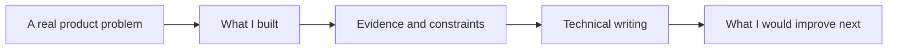

The [visual portfolio](/portfolio/) and this blog answer different questions. The visual portfolio shows the career arc and finished work. This page explains the bridge between those projects and the technical writing on this site: what problem each project addressed, what I personally built, what evidence is public, and what remains private.

- Open the [full visual portfolio](/portfolio/) for bilingual project cards and the complete timeline.
- Read [About](/about/) for my background across Supercent, NCSOFT, Com2uS, and Hongik University.
- Use [Start Here](/start-here/) to enter the technical archive by topic and format.
- See [Work with Me](/work-with-me/) if your team needs a scoped technical review.

{: .w-100 .shadow .rounded-10 }
_The visual portfolio is the gallery. This page is the evidence map._

> I separate three kinds of evidence: shipped internal systems, public repositories, and published technical analysis. They do not prove the same thing, so I do not present them as if they do.
{: .prompt-info }

## From a project to a useful article

A project card can show an outcome, but it rarely shows the decisions behind it. The writing on this site starts where a portfolio card ends.

That loop is the site's operating model. I begin with a problem I have encountered, retrieve evidence from source code, papers, experiments, or production constraints, and then publish the part that another engineer can inspect or reuse.

| Project thread | Production problem | What I owned | Public trail |
| :--- | :--- | :--- | :--- |
| **AI products and RAG** | Make private studio knowledge searchable, grounded, and operable | Retrieval pipelines, agent workflows, product surfaces, and operational controls | [RAG writing](/categories/rag-search/) and the [visual portfolio](/portfolio/) |
| **Agent harness engineering** | Make tool-using agents finish bounded work without hiding failure | Execution loops, edit integrity, critic gates, skills, and verification contracts | Public repositories plus [agent writing](/categories/agent-orchestration/) |
| **Multimodal QA** | Turn screenshots and gameplay video into useful QA signals | CV pipelines, OCR, detection, VLM interpretation, and report design | Research record, [vision writing](/categories/multimodal-computer-vision/), and portfolio evidence |
| **Game AI and build automation** | Evaluate game state and make production workflows reproducible | Simulation agents, procedural systems, Unity tooling, and coding-agent-driven builds | Playable work and [Unity production articles](/posts/unity-cli-production-workflows/) |

## Production AI products: retrieval has to become operations

{: .w-100 .shadow .rounded-10 }
_SAGA connects retrieval quality to a product surface that a game studio can actually operate._

At Supercent, I built AI products where retrieval was only the middle of the system. **SAGA** indexes 594 game-design documents and 1,563 vectors across 15 games, combining RAG-Fusion, CRAG, hybrid search, cross-encoder reranking, and a grounding-oriented generation pattern. **Millie** extends that direction into per-user knowledge operations and a Slack-driven local-agent system. **Brain** focuses on citation-first knowledge operations with incremental ingestion and connected editing workflows.

The portfolio shows these as shipped products. The related writing explains the reusable engineering questions:

- [From RAG to Context Layer](/posts/ontology-graphrag-agent-memory/) asks what changes when retrieval becomes shared agent memory.
- [Signal-Decision Architecture](/posts/signal-decision-architecture/) separates routing signals from the actions they authorize.
- [The Production Generative AI Stack](/posts/production-generative-ai-stack-architecture-components/) maps the components that surround a model in a real service.

The practical lesson is that retrieval quality, permissions, observability, and user experience cannot be reviewed independently. A good answer is not enough if nobody can trace its source, correct the knowledge, or understand why the system chose a tool.

## Agent tooling: the harness is part of the product

{: .w-100 .shadow .rounded-10 }
_jeo-code is one part of a public tool family built around bounded execution and verification._

My open-source agent work is public enough to inspect directly:

- [jeo-code](https://github.com/akillness/jeo-code) is a Bun-based coding-agent harness with a multi-provider tool loop, anchored-edit integrity, and a verify-before-done contract.
- [jeopi](https://github.com/akillness/jeopi) explores a critic-gated plan, execute, and verify spine.
- [jeo-skills](https://github.com/akillness/jeo-skills) packages reusable workflows across agent runtimes.
- [oh-my-jeo](https://github.com/akillness/oh-my-jeo) provides a spec-first workflow layer around chat agents.
- [jeo-claw](https://github.com/akillness/jeo-claw) connects Discord commands to bounded repository work.

The associated articles are not release announcements. They document design pressure and failure boundaries:

- [jeo-code: The Harness Engine That Makes You a 10x AI Builder](/posts/jeo-code-ai-builder-harness/)
- [DeepSeek Harness: What If the Agent Loop Itself Were Just Another Plugin?](/posts/deepseek-harness-everything-is-a-plugin/)
- [The New MCP Roadmap](/posts/mcp-roadmap-agentic-infrastructure/)

I treat agent orchestration as earned complexity. One capable agent with clear tools and a visible completion contract is usually better than a large cast of agents with vague authority.

## Multimodal QA: a screen is evidence, not a verdict

{: .w-100 .shadow .rounded-10 }
_AutoQA work combines classical vision, learned detectors, and language-based reporting rather than assuming one model can own the whole verdict._

My graduate research and personal tooling connect image-based QA, OCR, multi-scale template matching, fine-tuned detection models, video context, and VLM-assisted bug reporting. The interesting problem is not whether a model can describe a frame. It is whether a team can turn visual observations into a reproducible QA workflow with known false negatives and reviewable evidence.

This thread includes an IEEE RAAI 2024 poster on image-based game QA automation and a 2025 publication on automated QA reporting from natural-language captions. The [multimodal and vision archive](/categories/multimodal-computer-vision/) provides the wider technical context behind that work.

Internal data and unpublished research artifacts are not public evidence. Where I cannot share a dataset, customer document, or source repository, I state the boundary instead of replacing it with a stronger claim.
{: .prompt-warning }

## Game AI and automation: where the production instinct started

{: .w-100 .shadow .rounded-10 }
_Castle War is a playable project, but the main experiment was the coding-agent-driven production workflow behind it._

At NCSOFT and Com2uS, I worked on simulation-based difficulty evaluation, cellular-automata and GAN-based generation, reinforcement-learning prototypes, Unity-to-Python systems, and internal production tools. That experience shaped a simple bias: an AI feature is unfinished until the surrounding workflow is measurable and reproducible.

Recent public work carries that idea into build automation and agent-driven game production:

- [Unity CLI: From Editor Installs to Verifiable Game-Production Workflows](/posts/unity-cli-production-workflows/)
- [Atomic Agent + Unity CLI](/posts/unity-cli-atomic-agent/)
- [Castle War, playable build](https://jellyggumi.github.io/games/castle-war/)
- [Abyssal Lantern, playable build](https://akillness.github.io/hongT/)

The games matter, but so does the method: explicit build contracts, generated assets with review boundaries, repeatable verification, and honest reporting when the environment cannot complete a native build.

## How I make the writing inspectable

Search rankings, GitHub stars, and a polished screenshot are weak substitutes for evidence. My editorial contract is more specific:

1. **Who:** Every article is published under my name and links back to [About](/about/), where my production and research background is explicit.
2. **How:** Repository articles start from primary sources. When I claim code runs, I execute it or label the limitation. Version-sensitive findings are dated.
3. **Why:** The goal is to help engineers make a decision, reproduce a result, or avoid a failure mode. It is not to summarize every trending repository.
4. **Corrections:** Readers can report a mistake through [Contact](/contact/). I verify concrete corrections and update the article rather than silently preserving a stronger claim.

This does not make every post equally useful to every reader. It does make the origin, method, and boundary of the work visible.

## Choose the view you need

| If you want to see... | Start here |
| :--- | :--- |
| The visual career and project gallery | [Full visual portfolio](/portfolio/) |
| The person and career path behind the work | [About](/about/) |
| The strongest technical articles by topic and format | [Start Here](/start-here/) |
| Public source repositories | [GitHub](https://github.com/akillness) |
| A concise career document | [Resume](/resume_eng/) |
| A scoped review of your own system | [Work with Me](/work-with-me/) |
| Corrections, questions, or collaboration | [Contact](/contact/) |

The portfolio is the record of what I built. The blog is where I expose the reasoning, evidence, and unresolved questions behind it.
