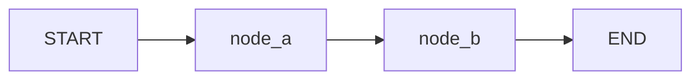

# NNNN. 문제 제목 (LangGraph)

- **출처**:
- **유형**: LangGraph 그래프 설계
- **작성일**:
- **검증 환경**: `langgraph 1.2.11` / `langchain-core 1.5.4` / Python 3.14.6

---

## 1. 문제

> 문제 요약을 한두 문장으로.

**입력**

-

**출력**

-

**제약조건 / 요구사항**

- 반복 상한:
- 실패 처리:
- 외부 호출:

---

## 2. 왜 LangGraph인가

`framework-selection` 판단 결과를 적는다. 레이어를 잘못 고르면 나머지가 다 틀어진다.

| 질문 | 답 | 근거 |
| :--- | :--- | :--- |
| 계획 수립·파일 관리·세션 간 메모리가 필요한가? | | → 예면 Deep Agents |
| 루프/분기/병렬/HITL/커스텀 상태가 필요한가? | | → 예면 **LangGraph** |
| 고정 툴셋의 단일 목적 에이전트인가? | | → 예면 LangChain `create_agent` |

결론:

---

## 3. 그래프 설계

**상태 스키마**

| 필드 | 타입 | 리듀서 | 이유 |
| :--- | :--- | :--- | :--- |
|  |  | 없음(덮어쓰기) |  |
|  |  | `operator.add` | 누적이 필요해서 |

**노드**

| 노드 | 역할 | 종류 |
| :--- | :--- | :--- |
|  |  | data / LLM / action |

**엣지**



---

## 4. 복잡도 / 비용

- 노드 실행 횟수: 최악 `?`회
- 루프 상한과 그 근거:
- LLM 호출 횟수 (있다면):

---

## 5. 검증

| 케이스 | 목적 |
| :--- | :--- |
| 정상 경로 | 기본 흐름이 END까지 도달 |
| 분기 경로 | 각 조건 분기가 최소 1회 실행 |
| 루프 상한 | 무한 루프 방지 가드 동작 |
| 리듀서 | 누적 필드가 덮어써지지 않음 |

실행:

```bash
problem-solving/.venv/bin/python problem-solving/problems/NNNN-slug/solution.py
```

---

## 6. 함정 & 배운 점

-
