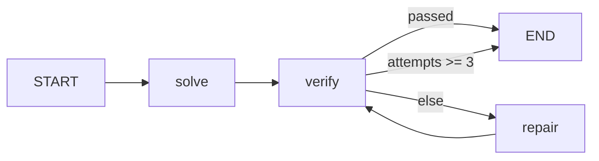

# 0002. solve → verify → repair 루프 (LangGraph)

- **출처**: 자체 설계 (코딩테스트 풀이 자동 검증 루프)
- **유형**: LangGraph 그래프 설계 — 조건 분기 + 루프 + 리듀서 + 체크포인터
- **작성일**: 2026-08-14
- **검증 환경**: `langgraph 1.2.11` / `langchain-core 1.5.4` / Python 3.14.6

---

## 1. 문제

> 문제와 테스트 케이스를 받아 후보 풀이를 만들고, **실제로 실행해서** 검증하고,
> 실패하면 실패 사유를 들고 다시 고친다. 통과하거나 시도 상한에 걸리면 종료한다.

**입력**

- `problem`: 문제 설명 (문자열)
- `cases`: `[(입력, 기대출력), ...]`
- `candidates`: 후보 풀이 source 목록 (LLM 자리를 대체하는 결정적 입력)

**출력**

- 최종 상태: `passed`, `attempts`, `code`, `failure`, `log`

**제약조건 / 요구사항**

- 반복 상한: `MAX_ATTEMPTS = 3` — 넘으면 실패로 종료
- 실패 처리: 문법 오류 / 실행 예외 / 함수 미정의 / 오답을 모두 사유로 환원
- 외부 호출: **없음.** 검증은 오프라인·결정적이어야 한다

---

## 2. 왜 LangGraph인가

`framework-selection` 판단:

| 질문 | 답 | 근거 |
| :--- | :--- | :--- |
| 계획 수립·파일 관리·세션 간 메모리가 필요한가? | 아니오 | 문제 하나를 푸는 단일 루프. 할 일 목록이나 파일 관리 필요 없음 |
| 루프/분기/병렬/HITL/커스텀 상태가 필요한가? | **예** | 검증 실패 시 되돌아가는 루프 + 상한 가드 + 시도 이력 누적 상태 |
| 고정 툴셋의 단일 목적 에이전트인가? | 해당 없음 | 위에서 확정 |

**결론: LangGraph.** 핵심이 "실패하면 되돌아간다"는 제어 흐름 자체다.
LangChain `create_agent`는 툴 루프가 고정이라 "몇 번까지 재시도하고 무엇을 상태로 남길지"를
내가 소유할 수 없다. Deep Agents는 계획·파일·서브에이전트가 다 딸려오는데 여기선 전부 불필요.

---

## 3. 그래프 설계

**상태 스키마**

| 필드 | 타입 | 리듀서 | 이유 |
| :--- | :--- | :--- | :--- |
| `problem` | `str` | 없음(덮어쓰기) | 불변 입력 |
| `cases` | `list[tuple]` | 없음 | 불변 입력 |
| `code` | `str` | 없음 | 매 시도마다 **최신 후보만** 의미 있음 |
| `attempts` | `int` | `operator.add` | 노드마다 `1`을 반환해 **합산**. 상한 판정의 근거 |
| `log` | `list[str]` | `operator.add` | 실행 이력 **누적**. 리듀서 없으면 마지막 노드 것만 남는다 |
| `failure` | `str` | 없음 | 마지막 실패 사유 (`""` = 통과) |
| `passed` | `bool` | 없음 | 최종 판정 |

**노드**

| 노드 | 역할 | 종류 |
| :--- | :--- | :--- |
| `solve` | 첫 후보 생성 | LLM 자리 (여기선 `FakeSolver`) |
| `verify` | 후보를 **실제 실행**해 통과 여부 판정 | action |
| `repair` | 실패 사유를 받아 후보 재생성 | LLM 자리 |

**엣지**



`verify → repair → verify` 가 루프. 탈출구는 두 개(통과 / 상한)뿐이다.

**주입 설계**: `make_graph(solver)`가 생성기를 인자로 받는다. 실제 LLM으로 바꿀 때
`FakeSolver`만 교체하면 그래프 구조는 그대로다. 그래서 검증이 오프라인으로 가능하다.

---

## 4. 복잡도 / 비용

- 노드 실행 횟수: 최악 `1(solve) + 3(verify) + 2(repair) = 6`회
- **루프 상한 근거**: `attempts >= MAX_ATTEMPTS`를 `route`에서 직접 검사한다.
  LangGraph 내장 `recursion_limit`은 기본값이 **10007**이라 실질 가드가 못 된다
  (아래 6번 참고). 상한은 반드시 도메인 조건으로 명시해야 한다.
- LLM 호출 횟수: 최악 `MAX_ATTEMPTS`회 (= 3). 비용이 시도 상한에 선형 비례.

---

## 5. 검증

| 케이스 | 목적 |
| :--- | :--- |
| 첫 후보가 정답 | 정상 경로 1회 종료, 로그 `["solve","verify:pass"]` |
| 첫 후보 오답 → 두번째 정답 | 루프 1회 순회, `attempts == 2`, repair에 실패 사유 전달 확인 |
| 계속 오답 | **루프 상한** 발동, `attempts == 3`, `passed == False` |
| 문법 오류 후보 | `컴파일 실패` 사유로 환원되고 복구 |
| 예외 발생 후보 | `ValueError` 사유로 환원되고 복구 |
| `solve` 미정의 후보 | `solve 함수가 정의되지 않음` 사유로 환원 |
| 3회 누적 | `log` 길이 6 이상 — **리듀서 누락 시 실패** |
| 체크포인터 | 최종 상태 저장 + `get_state_history` 4개 이상 |
| 다른 `thread_id` | 상태 격리 (`values == {}`) |

실행:

```bash
problem-solving/.venv/bin/python problem-solving/problems/0002-langgraph-solve-verify-loop/solution.py
# → OK
```

### 변이 테스트로 검증의 유효성을 확인함

검증 케이스가 **실제로 무언가를 지키는지** 확인하려고 구현을 일부러 깨뜨려봤다:

| 변이 | 결과 |
| :--- | :--- |
| `log`의 `Annotated[..., operator.add]` 제거 | `[정상 경로 로그] expected=['solve','verify:pass'] actual=['verify:pass']` — **잡힘** |
| `attempts` 리듀서 제거 | `[시도 2회 누적] expected=2 actual=1` — **잡힘** |
| `route`의 상한 가드 제거 | `GraphRecursionError: Recursion limit of 10007 reached` — **잡힘** |

통과하는 테스트가 아니라 **깨지면 실패하는 테스트**임을 확인한 것.

---

## 6. 함정 & 배운 점

- **리듀서 없는 리스트 필드는 조용히 덮어써진다.** 여러 노드가 `log`에 쓰는데
  `Annotated[list, operator.add]`가 없으면 마지막 노드 것만 남는다. 에러가 안 나서 더 위험하다.
  → 여러 노드가 같은 필드에 쓰면 무조건 리듀서를 먼저 확인한다.
- **`recursion_limit`은 안전망이 아니다.** 기본값 10007. 루프 상한은 도메인 조건으로
  (`attempts >= MAX_ATTEMPTS`) 직접 걸어야 한다. 안 걸면 10007번 돌고 나서야 터진다.
- **노드는 전체 state가 아니라 바뀐 부분만 담은 dict를 반환한다.** state를 직접 수정해서
  반환하면 리듀서가 이상하게 동작한다.
- **`add_conditional_edges`의 라우터 반환값은 실존 노드 이름이어야 한다.** 종료는 `END`
  (`"__end__"`)를 반환. 타입 힌트 `Literal["repair", "__end__"]`로 명시해두면 의도가 드러난다.
- **생성기를 주입하면 오프라인 검증이 가능해진다.** LLM을 노드 안에 하드코딩하면 API 키 없이
  테스트할 수 없고, 응답이 매번 달라서 결정적 검증이 불가능하다. `make_graph(solver)`로
  받으면 Fake를 넣어 루프 로직만 정확히 검증할 수 있다.
- `exec`로 후보를 실행하는 건 **하드코딩된 후보 전용**이다. 외부 입력을 넣으면 임의 코드 실행이 된다.
