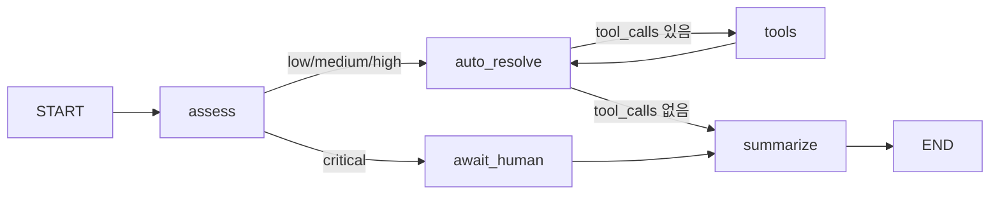

# 0004. FactoryMonitorAgent — 스마트 공장 텔레메트리 에이전트 (LangGraph)

- **출처**: 요구사항 명세 (실시간 텔레메트리 → 평가 → 조치 → 보고)
- **유형**: LangGraph — 조건 분기 + tool-calling 루프 + HITL interrupt + 체크포인터
- **작성일**: 2026-08-14
- **검증 환경**: `langgraph 1.2.11` / `langchain-core 1.5.4` / Python 3.14.6

---

## 1. 문제

> 기계 텔레메트리(온도, 부품 재고, 진동)를 받아 상황을 평가하고,
> 자동 또는 인간 개입으로 유지보수 조치를 결정하고, 최종 보고서를 생성한다.

**입력**

- `machine_id`: 기계 식별자
- `telemetry`: `dict` — 온도/진동/부품 재고 등. **JSON 직렬화 가능해야 한다** (interrupt 페이로드에 실림)
- `thread_id`: 중단/재개를 식별하는 키 (생략 시 `machine_id`)

**출력**

- 최종 상태 `dict`. `critical` 이면 중단 상태 + `__interrupt__` 반환

**요구사항**

- `severity`: LLM 이 `low`/`medium`/`high`/`critical` 중 하나로 평가
- `critical` → `interrupt()` 로 중단, 인간 결정 대기
- 그 외 → LLM tool-calling, `ToolNode` 로 실제 도구 실행
- `MemorySaver` 체크포인터로 중단/재개 지원

---

## 2. 왜 LangGraph인가

`framework-selection` 판단:

| 질문 | 답 | 근거 |
| :--- | :--- | :--- |
| 계획 수립·파일 관리·세션 간 메모리가 필요한가? | 아니오 | 텔레메트리 1건을 처리하는 단일 워크플로. 할 일 목록·파일 관리 불필요 |
| 루프/분기/병렬/**HITL**/커스텀 상태가 필요한가? | **예** | severity 분기 + 도구 루프 + `interrupt()` 인간 개입 + 7개 커스텀 상태 필드 |
| 고정 툴셋의 단일 목적 에이전트인가? | 해당 없음 | 위에서 확정 |

**결론: LangGraph.** 요구사항 자체가 제어 흐름이다.
LangChain `create_agent`는 툴 루프가 고정이라 "critical 이면 도구를 건너뛰고 인간에게 넘긴다"를
표현할 수 없다. Deep Agents 는 계획·파일·서브에이전트가 딸려오는데 전부 불필요.

---

## 3. 그래프 설계

**상태 스키마** (`FactoryState`)

| 필드 | 타입 | 리듀서 | 이유 |
| :--- | :--- | :--- | :--- |
| `machine_id` | `str` | 없음 | 불변 입력 |
| `telemetry` | `dict` | 없음 | 불변 입력 |
| `severity` | `str` | 없음 | 최신 평가값만 의미 있음 |
| `actions_taken` | `list[str]` | **`operator.add`** | 여러 노드가 append. 없으면 덮어써진다 |
| `pending_human_review` | `bool` | 없음 | 현재 상태 플래그 |
| `human_decision` | `Any` | 없음 | 문자열/dict 모두 허용 |
| `report` | `str` | 없음 | 최종 산출물 |
| `messages` | `list[AnyMessage]` | **`add_messages`** | tool-calling 루프. `ToolNode` 가 `ToolMessage` 를 붙인다 |

**노드**

| 노드 | 역할 | 종류 |
| :--- | :--- | :--- |
| `assess` | LLM 으로 severity 평가, `actions_taken` 에 `assessed` 기록 | LLM |
| `auto_resolve` | `bind_tools().invoke()` 로 tool-calling 생성 + 직전 도구 결과 기록 | LLM |
| `tools` | `ToolNode` — 실제 도구 실행 | action |
| `await_human` | `interrupt()` 로 중단, 인간 결정 수신 | HITL |
| `summarize` | `actions_taken` + `human_decision` 기반 LLM 보고서 | LLM |

**엣지**



**도구**

| 도구 | 인자 |
| :--- | :--- |
| `schedule_maintenance` | `machine_id`, `urgency` |
| `reorder_parts` | `part_name`, `quantity` |
| `log_incident` | `machine_id`, `description` |

**입출력**

```python
agent = build_agent(model)                       # model: BaseChatModel

# 텔레메트리 처리
state = agent.process_telemetry("M-01", {"temp": 78.0, "vibration": 4.2})

# critical 이면 중단 상태로 반환됨
paused = agent.process_telemetry("M-02", {"temp": 250.0}, thread_id="t-02")
paused["pending_human_review"]      # True
paused["report"]                    # "" (아직 없음)
paused["__interrupt__"][0].value    # {machine_id, telemetry, severity, actions_taken, question}

# 인간 결정 받아 재개
final = agent.resume_after_human("t-02", {"approved": True, "note": "shutdown line 3"})
final["report"]                     # 생성됨
```

---

## 4. 복잡도 / 비용

- 노드 실행 횟수: `low` 경로 3회 (`assess`→`auto_resolve`→`summarize`),
  도구 `k`회 사용 시 `3 + 2k`회, `critical` 경로 3회
- **루프 상한 근거**: `MAX_TOOL_ROUNDS = 5` 를 `_route_after_auto_resolve` 에서 직접 검사.
  LangGraph 내장 `recursion_limit` 은 기본 **10007** 이라 실질 가드가 못 된다
  (가드를 빼면 120초 넘게 안 끝난다 — 실측).
- LLM 호출 횟수: `assess` 1 + `auto_resolve` (`k+1`) + `summarize` 1.
  `critical` 은 `auto_resolve` 를 건너뛰므로 **2회**.

---

## 5. 검증

`ScriptedChatModel` — **실제 `BaseChatModel` 을 상속**한 결정적 모델로 오프라인 검증한다.
프롬프트의 stage 태그(`[stage:assess]` 등)를 보고 응답을 고른다. API 키 불필요.

| # | 케이스 | 목적 |
| :--- | :--- | :--- |
| 1 | `low` | 도구 없이 `assess→auto_resolve→summarize`, 모델 호출 순서 |
| 2 | `medium` | 도구 1회 실행, `ToolMessage` 1개, 도구 결과가 `actions_taken` 에 기록 |
| 3 | `high` | **도구 2회 연속** — 루프가 실제로 도는지 + 리듀서 누적 |
| 4 | `critical` | `interrupt()` 중단 → 페이로드 검증 → 재개 → 보고서. `auto_resolve` 미실행 확인 |
| 5 | severity 파싱 | `"  HIGH  "`, `"Severity: medium"`, `"banana"` 등 6종 |
| 6 | 무한 도구 호출 | `MAX_TOOL_ROUNDS` 에서 멈추고 보고서까지 도달 |
| 7 | 스레드 격리 | `tA` 재개해도 `tB` 는 여전히 대기 |
| 8 | 체크포인트 이력 | `await_human`/`summarize` 체크포인트 존재, 종료 상태 확인 |
| 9 | JSON 직렬화 | 중첩 telemetry 가 interrupt 페이로드에서 보존 |
| 10 | 잘못된 도구명 | `ToolNode` 가 에러를 `ToolMessage` 로 돌려주고 복구 |
| 11 | **`checkpointer` 계약** | 기본값 생성 / 주입 반영 / falsy 거부 / `_build_graph` 시그니처 / 속성 순서 무관 |

실행:

```bash
problem-solving/.venv/bin/python problem-solving/problems/0004-factory-monitor-agent/solution.py
# → OK  (0.95초)
```

### 변이 테스트 — 검증이 실제로 지키는지 확인

| 변이 | 결과 |
| :--- | :--- |
| `actions_taken` 리듀서 제거 | `[medium actions_taken] expected=[...2개] actual=[...1개]` — 잡힘 |
| `messages` 리듀서(`add_messages`) 제거 | `[ToolMessage 1개] expected=1 actual=0` — 잡힘 |
| `critical` 라우팅 제거 (항상 `auto_resolve`) | `[중단 중에는 report 없음] expected='' actual='CRIT REPORT'` — 잡힘 |
| `MAX_TOOL_ROUNDS` 가드 제거 | **TIMEOUT (120초 초과)** — 잡힘 |
| `pending_human_review` 를 `assess` 에서 set 안 함 | `expected=True actual=False` — 잡힘 |
| 도구 결과를 `actions_taken` 에 기록 안 함 | `[medium actions_taken]` 불일치 — 잡힘 |
| severity 파싱 폴백을 `low` 로 | `[severity 파싱 'banana'] expected='high' actual='low'` — 잡힘 |
| `interrupt()` 앞에 부작용 추가 | `[critical actions_taken]` 불일치 — 잡힘 |
| `await_human → summarize` 를 `END` 로 | `[재개 후 report 생성] expected='CRIT REPORT' actual=''` — 잡힘 |
| `_build_graph` 가 `self.checkpointer` 를 읽게 되돌림 | `AttributeError: 'ReorderedAgent' object has no attribute 'checkpointer'` — 잡힘 |
| falsy `checkpointer` 거부 제거 | `[checkpointer=False] 거부되지 않았다` — 잡힘 |
| `checkpointer` 를 `or` 로 판정 | `[checkpointer=False] 거부되지 않았다` — 잡힘 |
| `self.checkpointer` 대입 제거 | `AttributeError: ... has no attribute 'checkpointer'` — 잡힘 |
| `compile()` 에 `checkpointer` 안 넘김 | `RuntimeError: Cannot use Command(resume=...) without checkpointer` — 잡힘 |

14종 전부 잡힌다.

---

## 6. 함정 & 배운 점

- **`_build_graph()` 가 `self.checkpointer` 를 읽으면 속성 대입 순서에 의존한다.**
  실제로 보고된 버그: `AttributeError: '...' object has no attribute 'checkpointer'`.
  `__init__` 에서 `self.graph = self._build_graph()` 를 `self.checkpointer = ...` 보다
  먼저 두면 즉시 터진다. 서브클래스가 순서를 바꾸거나 리팩터링 한 줄로 재발한다.
  → **숨은 의존성을 인자로 만든다**: `_build_graph(checkpointer)`.
  검증에 `inspect.signature` 단정 + 순서를 뒤바꾼 서브클래스 테스트를 넣어 회귀를 막았다.
- **falsy `checkpointer` 는 늦게 실패한다.** `checkpointer=False` 로 만들면
  `process_telemetry` 는 `__interrupt__` 까지 정상 반환하고,
  `resume_after_human` 에서야 `RuntimeError: Cannot use Command(resume=...) without checkpointer`.
  **인간이 기다리는 시점에 실패한다.** → 생성 시점에 `ValueError` 로 거부한다.
- **`checkpointer or MemorySaver()` 는 틀렸다.** `False` 는 LangGraph 에서
  '체크포인트 없음'을 뜻하는 **유효한 값**이다. `or` 로 판정하면 사용자가 명시한 `False` 를
  조용히 `MemorySaver` 로 바꿔치기한다. `is None` 검사와 falsy 거부를 분리해야 한다.
- **`MemorySaver` 는 `InMemorySaver` 의 별칭이다** (`langgraph.checkpoint.memory`).
  둘 다 같은 클래스를 가리킨다 (실측). 단 `langgraph.checkpoint.MemorySaver` 는 없다 —
  `AttributeError: module 'langgraph.checkpoint' has no attribute 'MemorySaver'`.
- **`BaseChatModel.bind_tools` 는 추상 메서드다.** 서브클래스에서 오버라이드하지 않으면
  `NotImplementedError` 가 난다 (실측). 검증용 Fake 모델을 만들 때 `_generate` 만
  구현하면 부족하다.
- **`pending_human_review` 를 `await_human` 안에서 set 하면 안 된다.**
  노드의 상태 갱신은 **반환 시점**에 적용되는데, `interrupt()` 는 반환 전에 멈춘다.
  중단된 동안 그 값이 상태에 안 보인다. → 앞 노드(`assess`)에서 미리 정한다.
- **`interrupt()` 앞에는 부작용을 두지 않는다.** 재개하면 노드가 **처음부터 재실행**된다.
  `actions_taken.append(...)` 를 앞에 두면 재개마다 중복 기록된다.
  검증에 "`assessed` 기록은 1개" 단정을 넣어 이걸 잡는다.
- **`ToolNode` 는 `messages` 만 갱신한다.** 커스텀 상태 필드(`actions_taken`)는 건드리지 않으므로,
  도구 실행 결과를 기록하는 일은 다음 `auto_resolve` 호출이 맡아야 한다
  (직전 메시지가 `ToolMessage` 인지 확인).
- **`ToolNode` 단독 `invoke` 는 실패한다.** `ValueError: Missing required config key`.
  그래프 안에서 실행해야 런타임 컨텍스트가 붙는다 (실측).
- **`tools_condition` 은 `"tools"`/`"__end__"` 만 반환한다.** 요구사항이
  "도구 없으면 `summarize`" 이므로 커스텀 라우터가 필요하다.
- **`recursion_limit`(기본 10007)은 안전망이 아니다.** 모델이 계속 도구를 호출하면
  가드 없이는 120초 넘게 돈다. 도메인 상한을 직접 걸어야 한다.
- **LLM 자유 텍스트 파싱은 취약하다.** `_parse_severity` 는 부분 문자열 검색이라
  `"not critical, just high"` 를 `critical` 로 오판한다. 위험한 쪽으로 치우치는 편향이라
  남겨뒀지만, 실전에서는 `with_structured_output` 을 써야 한다. **알려진 한계로 문서화**.
- **모델을 주입하면 오프라인 검증이 가능해진다.** `ScriptedChatModel` 이 실제
  `BaseChatModel` 계약을 만족하므로 `ChatAnthropic`/`ChatOpenAI` 로 그대로 교체된다.
  노드 안에 모델을 하드코딩하면 API 키 없이 테스트할 수 없고 응답이 매번 달라진다.
- **변이 테스트 중 파일이 오염될 수 있다.** 타임아웃으로 셀이 중단되면 변이 상태가
  파일에 남는다. 다음 실행이 그걸 원본으로 읽어 잘못된 복원을 한다.
  → `try/finally` 로 복원하고, 복원 후 반드시 재실행해 `OK` 를 확인한다.
